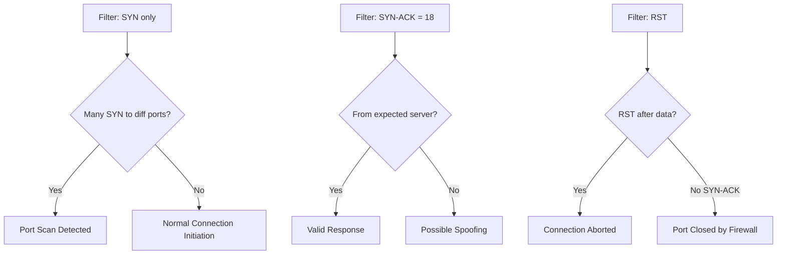

# Capturing Specific Flag Combinations (e.g., SYN, SYN-ACK)

## TCM Exam Objectives

Before taking the PSAA exam, you must be able to:

- Apply Berkeley Packet Filter (BPF) syntax to isolate network traffic by host, port, and protocol
- Capture packets to PCAP files using tcpdump with appropriate flags and filters
- Filter traffic by TCP flag combinations (SYN, SYN-ACK, RST, FIN) for attack detection
- Read and interpret tcpdump output including flags, sequence numbers, and options
- Identify anomalous traffic patterns including port scans, DNS tunneling, and beaconing
- Follow TCP streams to reconstruct application-layer conversations
- Analyze specific flag combinations to detect reconnaissance and scanning activity
- Document network forensic findings in a professional incident report

Capturing packets with specific TCP flag combinations is a core competency for SOC analysts. TCP flags reveal scanning activity, SYN flood attacks, lateral movement, and data exfiltration. The ability to filter on specific flags allows analysts to isolate connection initiation packets, identify the source of suspicious traffic, and reconstruct attack chains. Every TCP connection is built on the three-way handshake: SYN, SYN-ACK, ACK.?turn0search0??turn0search1?

- Why flag-based capture matters
- TCP flags reference
- Capturing specific flag combinations with tcpdump
- Capturing and filtering flags with Wireshark
- Practical exercise


## TCP Flags Reference

A single byte (the 13th byte of the TCP header) holds all six control flags:

| Flag | Decimal | Hex | Description |
|------|---------|-----|-------------|
| FIN | 1 | 0x01 | Finish - graceful connection close |
| SYN | 2 | 0x02 | Synchronize - initiate a connection |
| RST | 4 | 0x04 | Reset - abrupt connection abort |
| PSH | 8 | 0x08 | Push - send data immediately |
| ACK | 16 | 0x10 | Acknowledgment - data received |
| URG | 32 | 0x20 | Urgent - priority data |

Multiple flags can be set simultaneously:
- **SYN-ACK** = SYN(2) + ACK(16) = 18 (0x12)
- **FIN-ACK** = FIN(1) + ACK(16) = 17 (0x11)
- **RST-ACK** = RST(4) + ACK(16) = 20 (0x14)
---

```mermaid
flowchart LR
    CLIENT[Client] -->|SYN - Flags [S]| SERVER[Server]
    SERVER -->|SYN-ACK - Flags [S.]| CLIENT
    CLIENT -->|ACK - Flags [.]| SERVER
    CLIENT -->|PSH+ACK - Flags [P.] - Data| SERVER
    CLIENT -->|FIN - Flags [F.]| SERVER
    SERVER -->|ACK - Flags [.]| CLIENT
    ATTACKER[Attacker] -->|SYN Scan Many Ports| TARGET[Target]
    TARGET -->|RST - Port Closed| ATTACKER
    TARGET -->|SYN-ACK - Port Open| ATTACKER
```

## Capturing Specific Flag Combinations with tcpdump

Two filter syntaxes are available � numeric offset and named constants. Both examine the 13th byte of the TCP header.

### Individual Flags

```bash
tcpdump -i eth0 -w syn-only.pcap 'tcp[tcpflags] & (tcp-syn) != 0'

tcpdump -i eth0 -w ack-only.pcap 'tcp[13] & 16 != 0'

tcpdump -i eth0 -w reset.pcap 'tcp[13] & 4 != 0'

tcpdump -i eth0 -w fin.pcap 'tcp[13] & 1 != 0'

tcpdump -i eth0 -w push.pcap 'tcp[13] & 8 != 0'

tcpdump -i eth0 -w urg.pcap 'tcp[13] & 32 != 0'
```

### Specific Flag Combinations

```bash
tcpdump -i eth0 -w synack.pcap 'tcp[13] = 18'

tcpdump -i eth0 -w finack.pcap 'tcp[13] = 17'

tcpdump -i eth0 -w rstack.pcap 'tcp[13] = 20'

tcpdump -i eth0 "tcp[tcpflags] & (tcp-syn) != 0 and tcp[tcpflags] & (tcp-ack) = 0"
```

The last filter is critical: a bare `tcp[tcpflags] & (tcp-syn) != 0` matches SYN-ACK packets too because the SYN bit is set in both. The additional `and tcp[tcpflags] & (tcp-ack) = 0` ensures only the initial SYN.

### Combining with Host, Port, and Protocol

```bash
tcpdump -i eth0 -w suspect-syn.pcap \
  'tcp[tcpflags] & (tcp-syn) != 0 and tcp[tcpflags] & (tcp-ack) = 0 and src host 192.168.1.100 and dst port 443'

tcpdump -i eth0 -w altport-flags.pcap \
  'tcp[tcpflags] & (tcp-syn) != 0 and port 8080'
```

### Analyzing Flag Captures

```bash
tcpdump -r capture.pcap -n 'tcp[tcpflags] & (tcp-syn) != 0 and tcp[tcpflags] & (tcp-ack) = 0' \
  | awk '{print $3}' | cut -d. -f1-4 | sort | uniq -c | sort -nr
```

---

?? **Exam Tip:** Master the difference between capture filters and display filters. Capture filters (BPF) discard at kernel level; display filters only hide packets. Use capture filters for large PCAPs to reduce file size before analysis.


## Wireshark Display Filters

### Capture Filters (BPF Syntax)

Wireshark uses the same BPF syntax for capture filters (applied before capture):

- `tcp[tcpflags] & (tcp-syn) != 0 and tcp[tcpflags] & (tcp-ack) = 0`
- `tcp[13] = 18` (SYN-ACK only)
- `tcp[13] & 4 != 0` (RST only)

### Display Filters (Post-Capture)

```bash
tcp.flags.syn == 1 && tcp.flags.ack == 0

tcp.flags.syn == 1 && tcp.flags.ack == 1

tcp.flags.reset == 1

tcp.flags.fin == 1
```

---

## What Flag Patterns Reveal

| Observed Pattern | Probable Meaning | Follow-Up Action |
|------------------|------------------|------------------|
| Many SYN, few SYN-ACK | SYN flood or port scan | Check for single source IP sending to many ports |
| SYN, then immediate RST | Port closed or firewall reject | Verify firewall rules |
| SYN-ACK without prior SYN | Asymmetric routing or spoofing | Check network topology |
| Abnormal combination (SYN-FIN) | Evasion attempt | Extract payload for analysis |
| Repeated RST to port 22 or 3389 | Brute-force prevention | Correlate with authentication logs |


---

## Practical Exercise

**Scenario**: Host `192.168.1.50` suspected of scanning the internal network.

```bash
tcpdump -i eth0 -w exercise.pcap -c 2000 \
  'tcp[tcpflags] & (tcp-syn) != 0 and tcp[tcpflags] & (tcp-ack) = 0 and src host 192.168.1.50'

tcpdump -r exercise.pcap -n | awk '{print $5}' | cut -d. -f5 | sort | uniq -c | sort -nr | head -5
```

Open `exercise.pcap` in Wireshark, apply display filter `tcp.flags.syn == 1 && tcp.flags.ack == 0 && ip.src == 192.168.1.50`, go to Statistics > Conversations to examine the TCP tab.

Document findings: Did the host send SYNs to an unusually large number of ports? Were any SYN-ACK responses received?

---

## Recap

