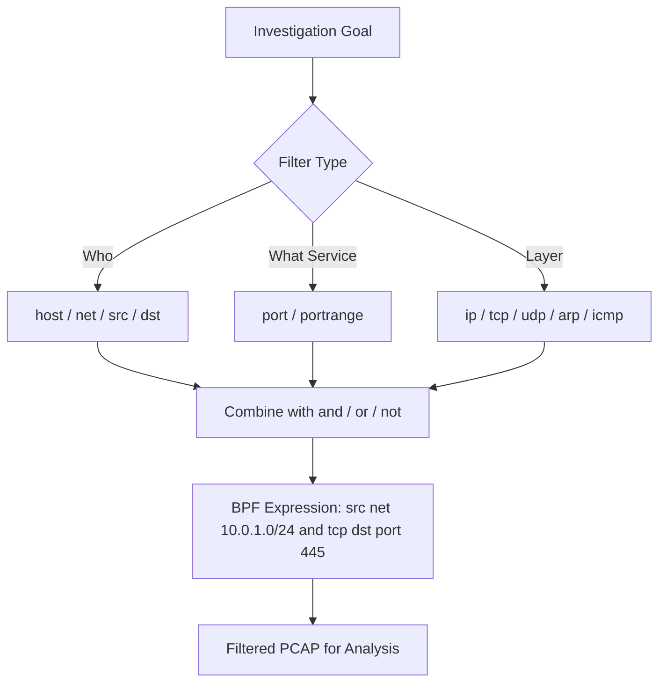

# Filtering by Host, Port, and Protocol

## TCM Exam Objectives

Before taking the PSAA exam, you must be able to:

- Apply Berkeley Packet Filter (BPF) syntax to isolate network traffic by host, port, and protocol
- Capture packets to PCAP files using tcpdump with appropriate flags and filters
- Filter traffic by TCP flag combinations (SYN, SYN-ACK, RST, FIN) for attack detection
- Read and interpret tcpdump output including flags, sequence numbers, and options
- Identify anomalous traffic patterns including port scans, DNS tunneling, and beaconing
- Follow TCP streams to reconstruct application-layer conversations
- Analyze specific flag combinations to detect reconnaissance and scanning activity
- Document network forensic findings in a professional incident report

Host, port, and protocol are the three most powerful BPF qualifiers used daily by SOC analysts. A BPF primitive is built from a value plus qualifiers: type (host, net, port, portrange), direction (src, dst), and protocol (ether, ip, tcp, udp, arp, icmp). Combining these with logical operators creates high-precision filters that surgically extract exactly the traffic needed for an investigation.?turn0search0??turn0search1?

- The three pillars: host, port, protocol
- Filtering by host
- Filtering by port
- Filtering by protocol
- Combining all three for security scenarios


## Filtering by Host

| Goal | BPF Expression | Explanation |
|------|----------------|-------------|
| All traffic to/from a host | `host 10.0.0.5` | Both source and destination IP match |
| Only traffic from a host | `src host 192.168.1.100` | IP is in the source field |
| Only traffic to a host | `dst host 192.168.1.100` | IP is in the destination field |
| Traffic between two hosts | `host 10.0.0.5 and host 10.0.0.10` | Requires both hosts to appear |
| Entire subnet | `net 192.168.1.0/24` | Any IP in that range |
| Source from a subnet | `src net 10.10.0.0/16` | Source IP belongs to the subnet |
| Specific MAC address | `ether host aa:bb:cc:dd:ee:ff` | Layer 2 filtering |
| Exclude a noisy host | `not host 10.10.10.1` | Ignores that host entirely |

**SOC Use Cases**: Investigating a potentially compromised endpoint with `host 192.168.1.107`, searching for lateral movement with `src net 10.1.100.0/24`, ignoring management IP with `not host 10.0.0.99`.

---

## Filtering by Port

| Goal | BPF Expression | Notes |
|------|----------------|-------|
| A single port (TCP or UDP) | `port 443` | Matches both TCP and UDP on that port |
| TCP port only | `tcp port 443` | Matches only TCP segments |
| UDP port only | `udp port 53` | Matches only UDP datagrams |
| Source port | `src port 12345` | Traffic originating from that port |
| Destination port | `dst port 22` | Traffic destined for that port |
| Port range | `portrange 1-1024` | All ports from 1 to 1024 |
| Multiple specific ports | `port 80 or port 443 or port 8080` | Separate primitives with OR |
| Exclude a port | `not port 22` | Everything except SSH |

**Critical Tip**: Use `tcp port 80` instead of `port 80` to avoid matching both TCP and UDP. DNS (port 53) uses both TCP and UDP for different purposes.

**SOC Use Cases**: Isolate SMB traffic (`tcp port 445`), detect DNS tunneling (`udp port 53`), hunt for RDP brute-forcing (`tcp dst port 3389`), identify unusual outbound connections (`tcp src portrange 49152-65535 and not dst port 80 and not dst port 443`).

---

## Filtering by Protocol

| Protocol | BPF Keyword | What It Filters |
|----------|-------------|-----------------|
| Ethernet | `ether` | All Ethernet frames |
| IPv4 | `ip` or `ip4` | All IPv4 packets |
| IPv6 | `ip6` | All IPv6 packets |
| ARP | `arp` | All ARP requests and replies |
| TCP | `tcp` | All TCP segments |
| UDP | `udp` | All UDP datagrams |
| ICMP | `icmp` | All ICMP packets (ping, etc.) |

**Examples**: `arp` (detect ARP spoofing), `icmp` (investigate ICMP tunneling), `tcp and host 10.0.0.5` (all TCP traffic from a host).
**Important**: BPF works at layers 2-4. `http`, `dns`, `smb` are not valid protocol qualifiers. Filter by their well-known ports instead.

?? **Exam Tip:** Master the difference between capture filters and display filters. Capture filters (BPF) discard at kernel level; display filters only hide packets. Use capture filters for large PCAPs to reduce file size before analysis.


## Combining Host, Port, and Protocol


Use logical operators (`and`, `or`, `not`) with parentheses to control evaluation order. In shells, parentheses must be escaped: `\(` and `\)`.

### General Pattern

```
[protocol] [src|dst] [host|net|port|portrange] VALUE [operator ...]
```

### Security Scenarios

| Investigation Goal | BPF Expression |
|-------------------|----------------|
| HTTP traffic from a specific server | `src host 10.0.0.1 and tcp port 80` |
| DNS requests from internal subnet | `src net 192.168.0.0/16 and dst port 53` |
| All TCP except SSH and RDP | `tcp and not (port 22 or port 3389)` |
| UDP traffic from suspect IP | `udp and src host 203.0.113.5` |
| Traffic between two hosts on port 445 | `host 10.0.0.15 and host 10.0.0.20 and tcp port 445` |
| Exclude HTTPS and DNS | `not (tcp port 443 or port 53)` |
| ICMP from a specific subnet | `icmp and src net 10.10.0.0/16` |
| Suspicious outbound to non-web ports | `src net 10.0.1.0/24 and not (dst port 80 or dst port 443)` |

**Parentheses save you**: `not host 10.0.0.1 and host 10.0.0.2` means `(not host 10.0.0.1) and host 10.0.0.2` - very different from `not (host 10.0.0.1 and host 10.0.0.2)`. Always use explicit parentheses.

---

## Practical Security Scenarios

### Scenario 1: Data Exfiltration via DNS

Internal host `10.0.10.55` sending large TXT queries to external DNS server `8.8.8.8`.

```bash
tcpdump -r incident.pcap -w dns_suspect.pcap \
  'udp port 53 and src host 10.0.10.55 and dst host 8.8.8.8'
```

### Scenario 2: Lateral Movement from Compromised Web Server

Web server `10.0.0.3` should never talk SMB to internal desktops.

```bash
tcpdump -r full_capture.pcap 'src host 10.0.0.3 and tcp dst port 445'
```

### Scenario 3: RDP Brute-Force on Critical Server

Brute-force attempt on domain controller `10.0.0.2`.

```bash
tcpdump -r capture.pcap 'dst host 10.0.0.2 and tcp port 3389'
```

### Scenario 4: Remove Noisy Backup Traffic

Backup server `10.1.1.100` constantly sends data on custom port 9999.

```bash
tcpdump -r capture.pcap 'not (host 10.1.1.100 and port 9999)'
```

---

## Tool-Specific Implementation

```bash
tcpdump -r file.pcap host 192.168.1.100
tcpdump -i eth0 'tcp port 443'

tshark -r huge.pcap -f "udp port 53" -w dns_only.pcap

tcp port 80 or tcp port 443 or udp port 53
```

---

## Best Practices

- **Be explicit**: Use `tcp port 22` instead of `port 22` to avoid catching UDP/22.
- **Use parentheses**: Always group ORs when combining with ANDs.
- **Test filters**: Use `tcpdump -d "<filter>"` to check compiled BPF output.
- **Direction matters**: `src port 80` is the source port � usually ephemeral, not the web server. For web server responses, use `src host server_ip and src port 80`.
- **VLAN awareness**: Use the `vlan` keyword for 802.1Q tagged traffic: `vlan and host 10.0.0.5`.
- **Performance**: BPF filtering is extremely efficient. Use it aggressively to reduce capture sizes.

---

## Recap

Host filters (host, net, src, dst) answer who is involved. Port filters (port, portrange) answer what service. Protocol filters (ip, tcp, udp, arp, icmp) restrict at layers 2-4. Combining them with logical operators (and, or, not) creates high-precision filters for specific attack patterns like `src net 10.0.1.0/24 and tcp dst port 445`. Parentheses are mandatory for correct evaluation order. Always pre-filter large PCAPs with BPF before deep-packet inspection to reduce file sizes and processing time.?turn0search2??turn0search3?

