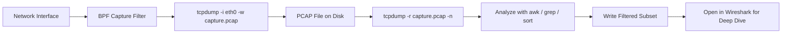
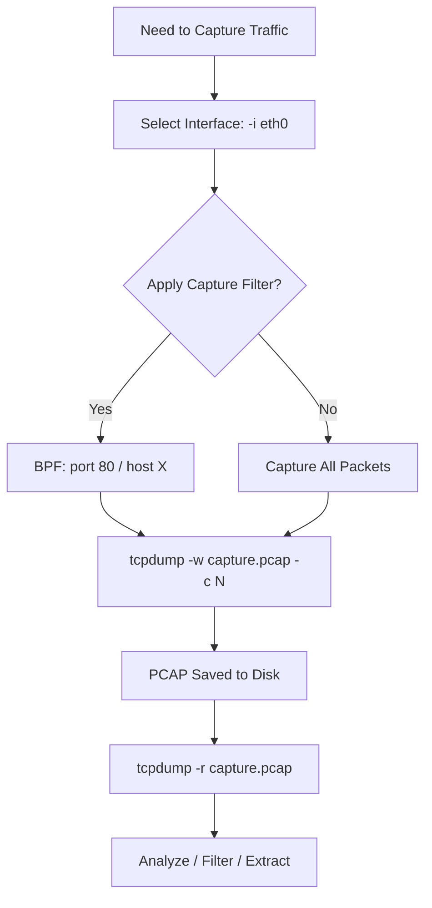

# Capturing Packets to a File

## TCM Exam Objectives

Before taking the PSAA exam, you must be able to:

- Apply Berkeley Packet Filter (BPF) syntax to isolate network traffic by host, port, and protocol
- Capture packets to PCAP files using tcpdump with appropriate flags and filters
- Filter traffic by TCP flag combinations (SYN, SYN-ACK, RST, FIN) for attack detection
- Read and interpret tcpdump output including flags, sequence numbers, and options
- Identify anomalous traffic patterns including port scans, DNS tunneling, and beaconing
- Follow TCP streams to reconstruct application-layer conversations
- Analyze specific flag combinations to detect reconnaissance and scanning activity
- Document network forensic findings in a professional incident report

Packet capture (PCAP) files record raw network traffic between systems and serve as primary evidence sources for SOC investigations. They can reconstruct an attacker's actions, reveal malicious domains and IP addresses, and provide the factual basis for an incident report. The PSAA exam is a practical, hands-on assessment that requires triaging security alerts, analyzing network artifacts, and documenting findings in a professional report � making packet capture a core tested competency.?turn0search0??turn0search1?

- Why packet capture matters for the PSAA
- Capturing packets with tcpdump
- Capturing packets with Wireshark
- Understanding PCAP files
- Practical exercise


## Capturing Packets with tcpdump

### Basic Capture to a File

```bash
tcpdump -i eth0 -w capture.pcap
```

**Key options**:
- `-i` : specify network interface (e.g., eth0, wlan0)
- `-w` : write raw packets to a file (no on-screen output)
- `-c <count>` : capture only a fixed number of packets
- `-s <snaplen>` : limit data captured per packet (use -s 0 for full packet)
- `-v`, `-vv`, `-vvv` : increase verbosity

### Filtering During Capture

Apply BPF expressions to avoid capturing everything:

```bash
tcpdump -i eth0 -w webtraffic.pcap port 80
tcpdump -i eth0 -w host10.pcap host 10.0.0.5
tcpdump -i eth0 -w not-myhost.pcap not host 192.168.1.100
```

### Reading a PCAP File

```bash
tcpdump -r capture.pcap
```

Add `-n` to skip DNS resolution (faster), `-tttt` for human-readable timestamps, and `-X` for hex/ASCII output.

**PSAA-style analysis pipeline**:

```bash
tcpdump -r capture.pcap -n | awk '{print $3}' | sort | uniq -c | sort -nr | head -10
```
---



## Capturing Packets with Wireshark

1. Launch Wireshark and select the correct interface.
2. Click Start Capturing Packets.
3. Once enough traffic is captured, click Stop.
4. Go to File > Save As and choose a location.

### Capture Filters vs. Display Filters

- **Capture filters** (set before starting) use BPF syntax to limit what is recorded.
- **Display filters** (applied after capture) hide or show specific traffic without altering the saved file.

Example display filter: `http.request.method == "POST"`

Wireshark's Statistics menu (Conversations, Protocol Hierarchy) is invaluable for quickly characterizing a capture.

---

?? **Exam Tip:** Master the difference between capture filters and display filters. Capture filters (BPF) discard at kernel level; display filters only hide packets. Use capture filters for large PCAPs to reduce file size before analysis.


## Understanding PCAP Files

### File Format

PCAP files store packets in a structured binary format. Each packet includes:
- A **timestamp** (when the packet was captured)
- The **original length** and captured length
- The **raw packet data** (link-layer header, IP header, transport header, payload)

### File Types

| Format | Description | Default In |
|--------|-------------|------------|
| **.pcap** | Classic libpcap format | Older tools |
| **.pcapng** | Next generation format with multi-interface support | Wireshark |

Both tcpdump and Wireshark can read either format. Specify `.pcap` extension to force the classic format if needed.

### File Management Tips

- PCAP files can grow extremely large. Always use capture filters to narrow traffic.
- Store captures in a secure, write-protected location (they may contain sensitive data).
- When sharing, consider anonymizing IP addresses.

---

## How This Ties to the PSAA Exam

### Exam Scenario

In the PSAA, you will be dropped into a simulated SOC environment with security alerts. Investigation involves:
- Opening provided PCAP files or capturing traffic from a live lab
- Using tcpdump/Wireshark to locate IOCs
- Extracting artifacts such as malicious IPs, domains, or file transfers
- Documenting findings in the required incident report

### Skills Assessed

- **Triage**: Quickly determine whether a PCAP contains malicious activity
- **Filter**: Efficiently zero in on relevant traffic using display/capture filters
- **Correlate**: Link network evidence with other data (endpoint logs, SIEM alerts)
- **Report**: Clearly explain what you found, how you found it, and what it means

### Practice Recommendations

- Capture live traffic on a test interface
- Analyze pre-built PCAP files from sites like Malware-Traffic-Analysis.net
- Build tcpdump pipelines that answer specific investigative questions
- Practice the complete workflow: capture, filter, analyze, report

---

## Practical Exercise

```bash
tcpdump -i eth0 -w psaa-practice.pcap -c 500

tcpdump -r psaa-practice.pcap -n | awk '{print $5}' | sort | uniq -c | sort -nr | head -5


```


---

## Recap

