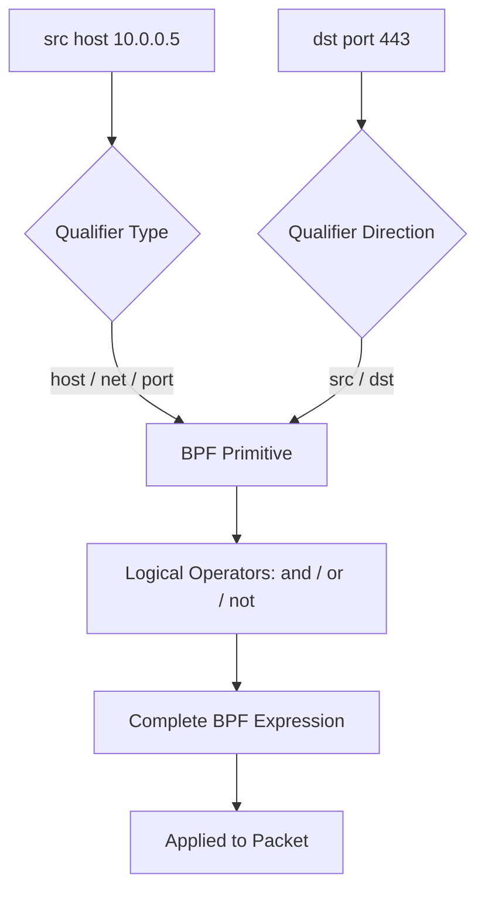
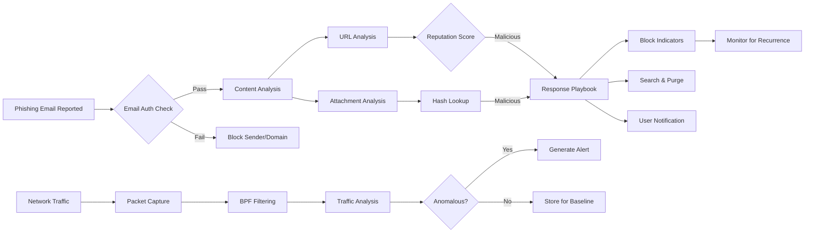
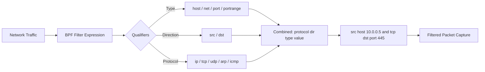

# Filtering with the Berkeley Packet Filter (BPF) Syntax

## TCM Exam Objectives

Before taking the PSAA exam, you must be able to:

- Apply Berkeley Packet Filter (BPF) syntax to isolate network traffic by host, port, and protocol
- Capture packets to PCAP files using tcpdump with appropriate flags and filters
- Filter traffic by TCP flag combinations (SYN, SYN-ACK, RST, FIN) for attack detection
- Read and interpret tcpdump output including flags, sequence numbers, and options
- Identify anomalous traffic patterns including port scans, DNS tunneling, and beaconing
- Follow TCP streams to reconstruct application-layer conversations
- Analyze specific flag combinations to detect reconnaissance and scanning activity
- Document network forensic findings in a professional incident report

Berkeley Packet Filter (BPF) syntax is a raw and powerful interface to a network's data link layer that allows analysts to reduce massive packet captures down to a specific subset of packets relevant to an investigation. Its universal support across tcpdump, Wireshark, TShark, Zeek, and Suricata makes it a fundamental, non-negotiable skill for SOC analysts. BPF operates at layers 2-4 and cannot filter on application-layer protocols directly.?turn0search0??turn0search1?

- Anatomy of a BPF filter expression
- Primitives, qualifiers, and logical operators
- Practical security cheat sheet
- Tools and implementation
- Best practices and limitations


## Anatomy of a BPF Filter Expression

A BPF filter is an expression built from one or more **primitives** combined with **logical operators**.

### Primitives: The Building Blocks

A primitive is a single filtering condition composed of qualifiers followed by a value.

**Type Qualifiers**: Specify what kind of entity the ID refers to.
- `host` � a specific IP address or hostname
- `net` � a subnet (CIDR notation)
- `port` � a TCP or UDP port number
- `portrange` � a range of ports

**Direction Qualifiers**: Specify traffic flow direction.
- `src` � source address/port
- `dst` � destination address/port
- `src or dst` (default) � either direction

**Protocol Qualifiers**: Restrict to a specific protocol.
- `ether`, `ip`, `ip6`, `arp`, `tcp`, `udp`, `icmp`, `icmp6`

### Examples of Primitives

- `src host 192.168.1.10` � uses direction (src) and type (host)
- `tcp port 80` � uses protocol (tcp) and type (port)
- `dst net 10.0.0.0/24` � uses direction (dst), type (net), CIDR notation

### Logical Operators

| Operator | Symbol | Description |
| :--- | :--- | :--- |
| **AND** | `&&` or `and` | Both conditions must be true |
| **OR** | `||` or `or` | At least one condition must be true |
| **NOT** | `!` or `not` | The condition must be false |

**Critical Rule of Precedence**: Negation (`!`) has the highest precedence. `and` and `or` have equal precedence and are evaluated left-to-right. **Always use parentheses `( )` to explicitly group primitives**.

```bash
not host 10.0.0.1 and host 10.0.0.2

not (host 10.0.0.1 and host 10.0.0.2)
```

In shells, parentheses must be escaped with backslash: `\(` and `\)` or enclosed in quotes.
---



## Practical Security Cheat Sheet

### Host and Network Filtering

| Task | BPF Syntax |
| :--- | :--- |
| All traffic to/from a host | `host 192.168.1.100` |
| Traffic only from a source host | `src host 192.168.1.100` |
| Traffic on a subnet, except one host | `net 192.168.1.0/24 and not host 192.168.1.1` |

### Protocol and Port Filtering

| Task | BPF Syntax |
| :--- | :--- |
| All web traffic (HTTP and HTTPS) | `port 80 or port 443` |
| All DNS traffic | `port 53` |
| SMB traffic from a specific host | `src host 10.0.0.5 and port 445` |

### Exclusion Filtering

| Task | BPF Syntax |
| :--- | :--- |
| Exclude SSH and HTTPS | `not (port 22 or port 443)` |
| Exclude a noisy subnet | `not net 10.1.3.0/24` |

### Header and Bit-Level Analysis

| Task | BPF Syntax |
| :--- | :--- |
| SYN packets (no ACK) | `tcp[13] & 2 != 0 and tcp[13] & 16 == 0` |
| SYN-ACK packets | `tcp[13] == 18` |
| Non-standard IP options | `ip[0] & 0xf != 5` |
| HTTP GET requests | `port 80 and tcp[((tcp[12:1] & 0xf0) >> 2):4] = 0x47455420` |

---


?? **Exam Tip:** Correlate across multiple data sources. A suspicious IP address in network traffic is stronger evidence when confirmed by Windows Event Log ID 4625 (failed logon) or EDR process telemetry.

?? **Exam Tip:** When triaging alerts, prioritize by severity and potential business impact. A single true positive C2 alert is more critical than 1,000 false positive scan alerts.


## Tools and Implementation

| Tool | How BPF Is Used | Example |
| :--- | :--- | :--- |
| **tcpdump** | Filter at end of command | `tcpdump -i eth0 'src host 192.168.1.100 and port 80'` |
| **Wireshark** | Capture Filter dialog (before capture) | Enter BPF expression in Capture Options |
| **TShark** | `-f` flag | `tshark -i eth0 -f "udp port 53"` |

Verify filter logic with:
```bash
tcpdump -d "<filter>"
```
This shows the compiled BPF bytecode and helps catch logic errors.

### VLAN Awareness

VLAN tags (802.1Q) create a 4-byte offset in the packet header. Standard BPF filters may fail on VLAN-tagged traffic. Use the `vlan` keyword:

```bash
vlan 100 and host 172.16.3.35
```

---

## Best Practices

- **Start wide, then narrow**: Begin with host or protocol filter, then apply more granular filters as the investigation focuses.
- **Master PCAP pre-filtering**: Never load multi-gigabyte PCAPs directly into Wireshark. Use TShark with BPF to extract relevant packets first:
  ```bash
  tshark -r huge_capture.pcap -Y "http.request" -w http_requests.pcap
  ```
- **Test your filters**: Use `tcpdump -d` to verify BPF logic before running on large captures.
- **Account for VLAN tags**: Use the `vlan` keyword when traffic is 802.1Q tagged.

---

## Limitations

- **Layer 2-4 only**: BPF cannot filter on payload data (URL paths, User-Agent strings, email subjects). Use Wireshark display filters for application-layer inspection.
- **No state tracking**: BPF filters each packet individually. It cannot understand TCP connection state.
- **No application protocol awareness**: BPF cannot distinguish HTTP from HTTPS on port 443, nor can it match on DNS query names.

---

## Recap

