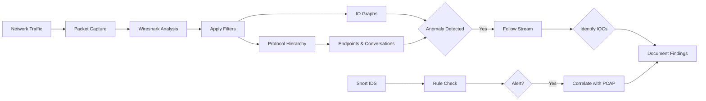
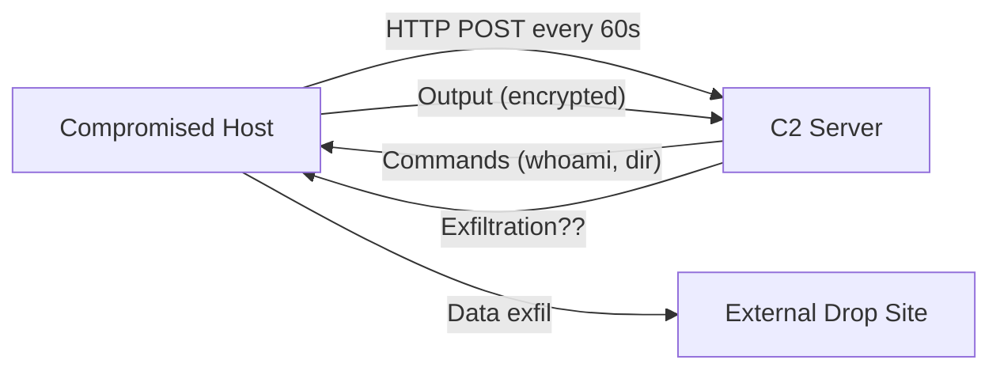

# Analyzing Malware Beaconing Activity

## TCM Exam Objectives

Before taking the PSAA exam, you must be able to:

- Apply Wireshark capture filters (BPF) and display filters to isolate relevant traffic
- Navigate the Wireshark UI including Packet List, Packet Details, and Packet Bytes panes
- Use Statistics features (Endpoints, Conversations, Protocol Hierarchy, I/O Graph) for triage
- Follow HTTP, DNS, and TCP streams to extract payload evidence
- Detect and analyze malware beaconing activity using I/O Graphs
- Identify command and control (C2) traffic through protocol and behavioral analysis
- Detect data exfiltration patterns including DNS tunneling and volumetric transfers
- Analyze suspicious DNS queries for DGA, tunneling, and domain fronting indicators

Malware beaconing is when a compromised host periodically calls out to an attacker's C2 server to request further instructions. This communication is the attacker's lifeline, enabling persistence, command execution, and data exfiltration. Beaconing detection is a core PSAA skill, directly testing your ability to identify a compromised host through its network behavior.

- What defines a C2 beacon (regularity, low jitter, consistent packet size, suspicious destination)
- The PSAA beacon-hunting workflow using Wireshark
- Extracting forensic evidence from beacon payloads
- Identifying the victim host and C2 server

## What Is Malware Beaconing?

From a network analysis perspective, a C2 beacon has four defining characteristics:

| Characteristic | Description | Malicious Example | Legitimate Look-Alike |
|---------------|-------------|-------------------|-----------------------|
| Regularity (Interval) | Consistent, predictable time between beacons | NetSupport RAT calls out every 3 seconds | NTP or software update checks |
| Low Jitter | Minimal randomness in interval | Cobalt Strike 60s interval with 0% jitter | Human browsing has high, erratic jitter |
| Consistent Packet Size | Uniform request/response sizes | Koadic C2 with identical sizes every 10 min | Streaming video has variable sizes |
| Suspicious Destination | IP/domain with poor reputation | Finance workstation beaconing to VPS in high-risk country | Traffic to reputable cloud services |

## The PSAA Beacon Analysis Toolkit

| Tool/Feature | Purpose in Beacon Analysis |
|-------------|---------------------------|
| I/O Graph (Statistics > I/O Graphs) | Visualize traffic volume over time; repeating spike pattern = beacon |
| Display Filters | Isolate suspect host or protocol (`ip.addr`, `http.request.method`, `dns`) |
| Follow TCP Stream | Reassemble full conversation; extract URI, User-Agent, payload |
| Statistics > Conversations | Identify top talkers; find internal host generating traffic to external IP |
| Kerberos Filter (`kerberos.CNameString`) | Resolve IP to Active Directory username |

?? **Exam Tip:** When writing incident reports, use the STAR method: Situation (what was alerted), Task (what you needed to find), Action (tools and filters used), Result (IOCs confirmed and remediation steps).

?? **Exam Tip:** On the PSAA exam, always document your analysis methodology step-by-step in the incident report. Include timestamps, source/destination IPs, and the specific evidence that supports your conclusion.

## The PSAA Beacon Hunting Workflow

### Phase 1: High-Level Triage with I/O Graph

1. Open PCAP, go to **Statistics > I/O Graphs**
2. Set Y-axis to **"Packets/Tick"** and interval to **1 second**
3. Look for a **repeating, periodic pattern of spikes** � the visual signature of a beacon
4. Hover over a spike to note the time, click to jump to those packets

### Phase 2: Isolate the Suspect Host and C2 Server

1. Go to **Statistics > Conversations**, click the TCP tab
2. Sort by **"Packets"** or **"Bytes"** to find top talkers
3. Identify internal IP (victim) and external IP (C2 server)
4. Apply display filter: `ip.addr == 10.2.28.88 && ip.addr == 45.131.214.85`

### Phase 3: Profile the Victim Host

**Find the Username:**
```
ip.addr == 10.2.28.88 && kerberos.CNameString
```
Reveals Active Directory username (e.g., `brolf`).

**Find the Hostname:** Look for DHCP Request packets or filter for `llmnr` or `nbns`.

**Find the MAC Address:** Expand **Ethernet II** section in packet details pane.

### Phase 4: Analyze the Beacon Protocol and Payload

**HTTP/HTTPS Beacons:**
```
http.request.method == "POST"
```
Right-click on a POST request and select **Follow > HTTP Stream**. Extract:
- **URI:** e.g., `/fakeurl.htm`, `/submit.php`
- **User-Agent:** e.g., `NetSupportManager/1.3` � often a direct malware family fingerprint
- **Payload:** Look for base64-encoded data, encrypted blobs, or plaintext commands

**DNS Tunneling Beacons:** Filter `dns`. Look for high volume of TXT, MX, or CNAME queries with long, randomly generated subdomains.

**TLS/HTTPS Beacons (without decryption):** Extract **Server Name Indication (SNI)** from TLS Client Hello. Select Client Hello, expand `Transport Layer Security > Handshake Protocol > Extension: server_name`.

### Phase 5: Confirm the Beacon Interval and Document

1. Re-open I/O Graph with a display filter: `ip.src == 10.2.28.88 && http.request.method == "POST"`
2. Graph should show clear, repeating spike pattern
3. Calculate interval: hover over consecutive spikes, note timestamps, compute difference

**Document your finding:**
> **Finding:** Internal host 10.2.28.88 (`brolf`, DESKTOP-TEYQ2NR) is beaconing to C2 server 45.131.214.85 over TCP port 443. The beacon uses HTTP POST requests to `/fakeurl.htm` at a regular interval of approximately 3 seconds. User-Agent `NetSupportManager/1.3` identifies this as a NetSupport Manager RAT infection. **Severity:** Critical.

<details>
<summary>?? Key Beaconing Filters Cheat Sheet</summary>

| Objective | Filter |
|-----------|--------|
| Isolate traffic to/from suspect host | `ip.addr == 10.2.28.88` |
| Show SYN packets from a host | `ip.src == 10.2.28.88 && tcp.flags.syn == 1 && tcp.flags.ack == 0` |
| Show HTTP POST requests | `http.request.method == "POST"` |
| Show HTTP POSTs from specific host | `ip.src == 10.2.28.88 && http.request.method == "POST"` |
| DNS traffic for a domain | `dns.qry.name contains "malicious.com"` |
| Identify username | `ip.addr == 10.2.28.88 && kerberos.CNameString` |
| Search for User-Agent | `http.user_agent contains "NetSupportManager"` |
| Filter out DNS noise | `!dns` |
</details>

## Common Pitfalls and Exam Tips

- **Don't confuse a heartbeat for malicious C2:** Legitimate applications (Teams, Slack, AV updates) use periodic heartbeats. The key differentiator is **destination reputation**.
- **Encryption is not a dead end:** Even with TLS, extract **SNI** and **JA3 hash** from Client Hello, analyze timing patterns in I/O Graph, document connection metadata.
- **Jitter can hide the signal:** Sophisticated malware adds jitter. Look for the *range* of intervals rather than exact numbers. If a host contacts the same IP every 55-65 seconds, that is still high-confidence beaconing with 10% jitter.
- **Profile the victim early:** Use Kerberos filter (`kerberos.CNameString`) as soon as you identify the victim IP.

## Recap

- Profile the victim completely: use Kerberos, DHCP, and LLMNR filters to find username, hostname, and MAC address
- Extract the forensic payload: follow HTTP or TCP stream to capture URI, User-Agent, and data exchanged
- Your incident report listing IOCs, analysis steps, and conclusions is what proves competency on the PSAA


