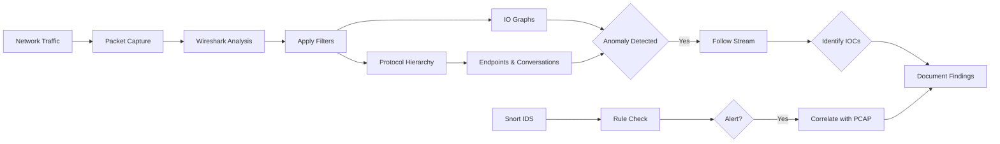
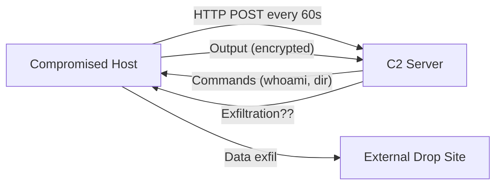

# Detecting Data Exfiltration Patterns

## TCM Exam Objectives

Before taking the PSAA exam, you must be able to:

- Apply Wireshark capture filters (BPF) and display filters to isolate relevant traffic
- Navigate the Wireshark UI including Packet List, Packet Details, and Packet Bytes panes
- Use Statistics features (Endpoints, Conversations, Protocol Hierarchy, I/O Graph) for triage
- Follow HTTP, DNS, and TCP streams to extract payload evidence
- Detect and analyze malware beaconing activity using I/O Graphs
- Identify command and control (C2) traffic through protocol and behavioral analysis
- Detect data exfiltration patterns including DNS tunneling and volumetric transfers
- Analyze suspicious DNS queries for DGA, tunneling, and domain fronting indicators

Data exfiltration is the deliberate, unauthorized transfer of sensitive data. Unlike beaconing (which *receives* commands), exfiltration is about *sending data out*. It can be a massive firehose of data or a slow, carefully disguised trickle.

- Exfiltration patterns and how each appears in Wireshark
- Identifying suspicious file transfers, custom protocols, and volumetric attacks
- Detecting high-volume traffic on non-standard ports and persistent connections
- Using Statistics tools and Follow Stream for forensic evidence

## Common Exfiltration Methods

| Method | Wireshark Signature | Stealth Level |
|--------|--------------------|---------------|
| **HTTP/HTTPS POST** | Large POST requests to non-standard URIs, base64/hex payloads, large `Content-Length`, unusual `Content-Type` | Medium |
| **DNS Tunneling** | High volume of TXT/MX/CNAME queries, long subdomains (base64), high DNSSEC/EDNS0 payload size | High |
| **ICMP Tunneling** | ICMP echo packets with oversized data fields, non-standard sequence numbers, anomalous echo/reply ratios | Medium |
| **Email (SMTP)** | Clear-text base64 attachments to suspicious external addresses, large `DATA` commands | Low |
| **FTP / TFTP** | Login to suspicious server, file upload with `STOR`, large file transfer on unusual ports | Low |
| **SMB to External IP** | SMB traffic from internal host to external server (almost always malicious) | Low |

## Volumetric Exfiltration (The Firehose)

This is the loudest and easiest to catch � a massive amount of data leaving over a short period. Detection methods:

**Statistics > Protocol Hierarchy:** If a protocol shows a huge discrepancy between % Packets and % Bytes, you have found a volumetric anomaly.

**Statistics > Conversations > TCP:** Sort by **Bytes**. The top conversation shows which internal host sent data to which external IP.

**I/O Graph:** Set Y-axis to **Bytes/Tick**. Filter suspect's traffic (`ip.src == X`). A massive spike sustained over minutes confirms volumetric exfil.

**Wireshark Analysis Tip:** Select a packet in the high-volume conversation and **Follow TCP Stream**. The stream will contain the raw data being transferred � often a file encoded as base64 text or binary.

## Per-Packet Exfiltration (Slow Drips)

Stealth attackers chop a large file into many packets sent over hours or days. Detection approach:

| Wireshark Feature | Role in Detection |
|-------------------|-------------------|
| I/O Graph | Zoom out to hours; apply SMA to reveal long-term trend |
| Statistics > Endpoints | Sort by packets; look for high packet count with low byte count |
| Follow UDP Stream | Many small DNS/ICMP packets can be reassembled into a coherent message |
| Custom Display Filter | `tcp.len > 0 && tcp.len < 100` shows small data packets |

## DNS Tunneling

DNS tunneling encodes data in DNS queries and responses � extremely effective because DNS is almost never blocked.

**Wireshark Detection:**
1. **Protocol Hierarchy:** If DNS is >5-10% of traffic, investigate
2. **Look for TXT, MX, CNAME records with long subdomains:**
   - Filter: `dns.qry.name and !dns.flags.response` (only queries)
   - Sort by `dns.qry.name.length`
   - Legitimate subdomains: `<32 characters`
   - Suspicious: subdomains 32-255 characters with random base64 characters
3. **Check for encoded binary in TXT records**
4. **Check DNS query volume:** `dns.flags.response == 0` � if a host makes hundreds of queries to a single domain in a minute, it's DNS tunneling

**TShark:**
```bash
tshark -r capture.pcap -Y "dns.qry.name and !dns.flags.response" -T fields -e dns.qry.name | Sort-Object | Get-Unique
```

?? **Exam Tip:** Master the difference between capture filters and display filters. Capture filters (BPF) discard at kernel level; display filters only hide packets. Use capture filters for large PCAPs to reduce file size before analysis.

?? **Exam Tip:** When triaging alerts, prioritize by severity and potential business impact. A single true positive C2 alert is more critical than 1,000 false positive scan alerts.

## ICMP Tunneling

ICMP packets that should be small (<64 bytes payload) but contain large data payloads.

**Wireshark Detection:**
1. Filter: `icmp and data.len > 64`
2. Check for consistent pattern: all ICMP packets are same size and only from one direction
3. **Follow ICMP Stream** (Tools > Follow > ICMP Stream) � reassembles all ICMP data into one view

<details>
<summary>?? Identifying the Exfiltrated File Type</summary>

After extracting the stream, save raw bytes. First bytes reveal file type:

| First Bytes (Hex) | File Type |
|-------------------|-----------|
| `25 50 44 46` | PDF |
| `89 50 4E 47` | PNG |
| `47 49 46 38` | GIF |
| `FF D8 FF` | JPEG |
| `50 4B 03 04` | ZIP/DOCX/XLSX |
| `42 5A 68` | BZIP2 |
| `1F 8B` | GZIP |
| `7B 22` | JSON (best guess) |
</details>

## SMB Exfiltration

Filter for SMB to external IPs:
```
smb and ip.dst != 192.168.0.0/16 and ip.dst != 10.0.0.0/8
```

Check for large file writes: filter `smb.file_write` and `smb2.cmd == 10` (SMBv2 Write). Extract file and check metadata.

## FTP Exfiltration

Filter: `ftp.request.command == "STOR"` then `ftp.request.arg` reveals filename. Follow TCP stream for FTP data channel. Look for `ftp-data` protocol for exfiltrated file content.

## Wireshark Forensic Collection Workflow

1. **I/O Graph** � confirm time-based activity and volume
2. **Protocol Hierarchy** � identify which protocol has disproportionate bytes
3. **Endpoints** � identify internal source IP and external destination IP
4. **Conversations** � identify specific TCP/UDP conversation with highest data transfer
5. **Follow Stream** � capture the payload by following TCP/UDP/ICMP stream
6. **Export Objects** � for HTTP/SMB/ICMP protocols, extract transferred files directly

## Recap

- Use Protocol Hierarchy, Conversations, and I/O Graph to identify the channel
- Use Follow Stream to extract payloads and check magic bytes for file type
- Even with encryption, connection metadata and timing patterns reveal exfiltration behavior


