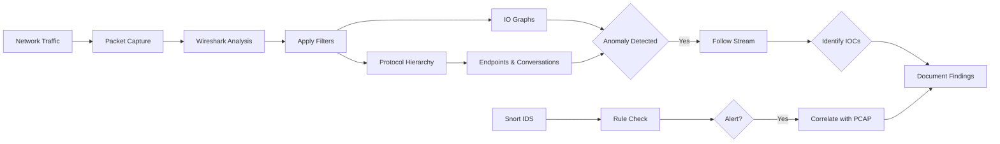
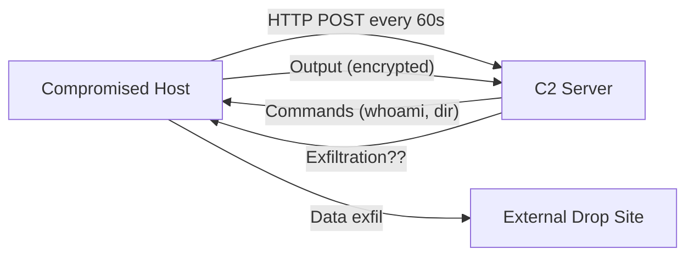

# Identifying Command and Control (C2) Traffic

## TCM Exam Objectives

Before taking the PSAA exam, you must be able to:

- Apply Wireshark capture filters (BPF) and display filters to isolate relevant traffic
- Navigate the Wireshark UI including Packet List, Packet Details, and Packet Bytes panes
- Use Statistics features (Endpoints, Conversations, Protocol Hierarchy, I/O Graph) for triage
- Follow HTTP, DNS, and TCP streams to extract payload evidence
- Detect and analyze malware beaconing activity using I/O Graphs
- Identify command and control (C2) traffic through protocol and behavioral analysis
- Detect data exfiltration patterns including DNS tunneling and volumetric transfers
- Analyze suspicious DNS queries for DGA, tunneling, and domain fronting indicators

Command and Control (C2) traffic is how an attacker maintains a persistent, interactive communication channel with compromised systems. Unlike beaconing (automated, periodic polls) or exfiltration (one-way data transfer), C2 implies an active, often bidirectional conversation where the attacker issues commands in real time.

- Characteristics of C2 protocols
- C2 detection workflow using Wireshark
- Protocol-specific analysis: HTTP/S, DNS, IRC, custom
- TShark-based IOC extraction

## C2 vs. Beaconing vs. Exfiltration

| Characteristic | Beaconing | C2 | Exfiltration |
|---------------|-----------|-----|--------------|
| Direction | Bidirectional (poll/response) | Bidirectional (interactive) | Unidirectional (data out) |
| Timing | Regular, consistent intervals | Variable, human-driven | Burst or sustained |
| Payload | Small, repeated commands | Variable, complex commands | Large (file) |
| Purpose | Check-in, receive commands | Execute commands, pivot | Steal data |

## The C2 Detection Workflow

### Phase 1: Find the C2 Signature

Use existing tools:
- **Statistics > Protocol Hierarchy** � look for IRC, Telnet, TFTP, or custom protocols
- **Statistics > Conversations** � sort by Bytes; look for internal host with large bidirectional traffic
- **Endpoints** � look for internal host with many connections to one external IP

### Phase 2: Apply Display Filters

| Filter | What It Finds |
|--------|---------------|
| `ip.addr == <internal> && ip.addr == <external>` | All traffic between suspect pair |
| `tcp.dstport == 443 && tls.handshake.type == 1` | TLS Client Hellos to C2 server |
| `http.request or http.response` | HTTP C2 traffic (commands in headers/body) |
| `dns.qry.name` | DNS queries (tunneling or domain fronting) |
| `tcp.port == 6667 || tcp.port == 6697` | IRC traffic |

### Phase 3: Analyze Interactive Sequences

**HTTP C2:** After filtering for the suspect pair, apply `http.request`. Look for:
- POST requests with unusual `Content-Type` (e.g., `application/octet-stream`, `text/plain`)
- Response bodies longer than requests (server sending commands back)
- Multiple GET requests to the same URI with different parameters

**TLS/HTTPS C2:**
- Apply `tls.handshake.type == 1` (Client Hello) to extract JA3 hash and SNI
- JA3 is a fingerprint of the TLS client � C2 frameworks have unique JA3 signatures
- Cobalt Strike JA3: `72a589da586a6d62be86e66c1be5b1d6`
- Metasploit JA3: `e1a7a511df73b53731edfaf4e9cfccc8`

**Custom TCP C2:**
- Follow TCP Stream � raw data may contain readable commands or unique signatures
- Look for command-like patterns: `shell`, `exec`, `download`, `upload`, `screenshot`
- Check if port corresponds to known malware (e.g., port 4444 = Metasploit default)

### Phase 4: TLS-Based C2 Analysis

Wireshark extracts:
- **SNI (Server Name Indication):** Domain in TLS handshake. Often a legitimate-looking domain registered by attacker.

- **Certificate Details:** Issuer, subject, validity dates � self-signed or Let's Encrypt on a corporate server is suspicious.
- **JA3/JA3S Fingerprinting:** Hash of TLS handshake parameters (supported ciphers, curves, extensions). Cobalt Strike, Metasploit, and Empire have unique fingerprints.

### Phase 5: Recover Forensic Evidence

**HTTP Stream:**
```
POST /api/login HTTP/1.1
Host: 203.0.113.45:8443
User-Agent: Mozilla/5.0 (Windows NT 6.1; rv:60.0) Gecko/20100101 Firefox/60.0
Content-Type: application/x-www-form-urlencoded
Content-Length: 84

AES_ENCRYPTED_PAYLOAD_BASE64==
```
Extract: C2 IP, URI, User-Agent, encrypted payload, HTTP headers.

**TLS Stream:** Even without decryption, extract:
- C2 IP and port
- SNI domain
- JA3 hash
- Certificate fingerprint

?? **Exam Tip:** Master the difference between capture filters and display filters. Capture filters (BPF) discard at kernel level; display filters only hide packets. Use capture filters for large PCAPs to reduce file size before analysis.

?? **Exam Tip:** Correlate across multiple data sources. A suspicious IP address in network traffic is stronger evidence when confirmed by Windows Event Log ID 4625 (failed logon) or EDR process telemetry.

## C2 Communication Patterns in Wireshark

| Pattern | Wireshark Finding | Likely Framework |
|---------|-------------------|------------------|
| Regular HTTP POST to `/forum.php` or `/includes/` | Cobalt Strike | Cobalt Strike |
| Single GET to `/` followed by POST to `/submit.php` | Metasploit Meterpreter | Metasploit |
| IRC traffic with PRIVMSG and user commands | IRC-based botnet | Agobot, SDBot |
| DNS TXT queries with base64 subdomains | DNS tunneling C2 | DNScat2, Iodine |
| Long-lived HTTPS connection with small keepalives | Interactive C2 channel | Empire, PoshC2 |

### Cobalt Strike � The Most Common PSAA C2 Framework

Cobalt Strike HTTP C2 traffic has distinctive patterns:
- **GET requests** to static URIs for metadata/image files
- **POST requests** with large, seemingly random base64 payloads
- **User-Agent:** Often mimics legitimate browsers (`Mozilla/5.0`, `Safari/537.36`)
- **Sleep/jitter:** Configurable � often 60s with 0-30% jitter
- **JA3:** Cobalt Strike client has a unique JA3 signature

## Advanced C2 Artifacts

- **Domain Generation Algorithms (DGAs):** Malware generates many domains, most NXDOMAIN, one registered by attacker. Filter `dns.flags.rcode == 3` (NXDOMAIN responses) � high rate indicates DGA.
- **HTTP Cookies:** C2 frameworks encode data in cookies: `Cookie: session=QWxhZGRpbjpPcGVuU2VzYW1l`
- **User-Agent Anomalies:** Windows workstation making requests with `curl/7.68.0` or `Python-urllib/3.9`
- **Non-Standard Ports with TLS:** TLS on port 9999, 8443, 8080 when server is not a known service

## Recap

- For HTTPS C2, extract SNI and JA3 hash from the TLS Client Hello
- Cobalt Strike is the most common C2 framework seen on PSAA exams � recognize its HTTP POST behavior
- Even encrypted C2 reveals itself through timing, connection metadata, and behavioral patterns


