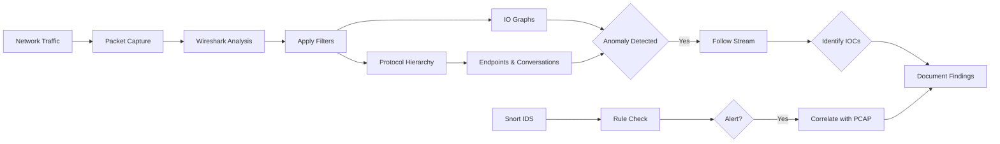
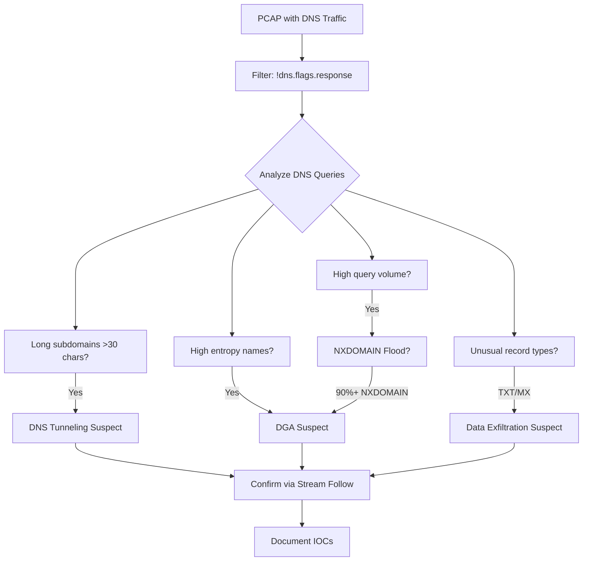

# Identifying Suspicious DNS Queries

## TCM Exam Objectives

Before taking the PSAA exam, you must be able to:

- Apply Wireshark capture filters (BPF) and display filters to isolate relevant traffic
- Navigate the Wireshark UI including Packet List, Packet Details, and Packet Bytes panes
- Use Statistics features (Endpoints, Conversations, Protocol Hierarchy, I/O Graph) for triage
- Follow HTTP, DNS, and TCP streams to extract payload evidence
- Detect and analyze malware beaconing activity using I/O Graphs
- Identify command and control (C2) traffic through protocol and behavioral analysis
- Detect data exfiltration patterns including DNS tunneling and volumetric transfers
- Analyze suspicious DNS queries for DGA, tunneling, and domain fronting indicators

DNS is one of the most trusted and least inspected protocols. Attackers exploit this trust to exfiltrate data, establish C2 channels, and use algorithmically generated domains to evade blocklists. DNS analysis in Wireshark is required for identifying these high-priority threats.

- DNS protocol fundamentals: query types, response codes, fields
- DNS tunneling detection methodologies
- DGA detection techniques
- Detection of unusual query patterns (NXDOMAIN floods, high query rates)

## DNS Protocol Basics for Security Analysis

### Essential DNS Record Types

| Type | Description | Use in Attacks |
|------|-------------|----------------|
| A (1) | Hostname to IPv4 | Standard C2 resolution |
| AAAA (28) | Hostname to IPv6 | IPv6 C2, often unmonitored |
| CNAME (5) | Hostname alias | Redirection C2 chains |
| MX (15) | Mail exchange | DNS tunneling via MX |
| TXT (16) | Arbitrary text | DNS tunneling payload delivery |
| NS (2) | Authoritative server | DNS zone reconnaissance |
| SOA (6) | Zone zone authority | Zone transfer detection |

### Essential Display Filters

| Filter | Purpose |
|--------|---------|
| `dns` | All DNS traffic |
| `!dns.flags.response` | All DNS queries (not responses) |
| `dns.flags.response == 1` | All DNS responses |
| `dns.qry.name` | Packets containing a query name |
| `dns.flags.rcode == 3` | NXDOMAIN responses (name doesn't exist) |
| `dns.qry.type == 16` | TXT queries only |
| `dns.qry.name matches "^[a-z0-9]{20,}"` | Random-looking subdomains |

## DNS Tunneling

Encodes non-DNS data inside DNS queries and responses. Typical setup: client encodes data in query subdomains, server decodes and places commands in TXT responses.

### Wireshark Detection Checklist

| Indicator | What to Look For | Filter |
|-----------|-----------------|--------|
| Query Length | Subdomains > 30 characters | `!dns.flags.response && dns.qry.name && frame.len > 100` |
| Query Volume | One host making 1000+ queries/min to one domain | `dns.count` statistics |
| Record Types | High TXT or MX ratio | `dns.qry.type == 16` |
| Entropy | Subdomains using 37+ character base32/base64 | Manual inspection |
| Response Size | TXT responses > 255 bytes (split across multiple strings) | `dns.resp.len > 255` |
| Unusual TLDs | .top, .tk, .ml, .ga, .cf | Filter by suffix |
| Data Encoding | Base64/base32/base16 characters only | Manual decode |

### Step-by-Step DNS Tunneling Detection

1. **Protocol Hierarchy** (Statistics > Protocol Hierarchy). If DNS > 5-10% of packets, investigate.
2. **Filter queries:** `!dns.flags.response`
3. **Extract unique domains:**
   ```
   tshark -r capture.pcap -Y "!dns.flags.response" -T fields -e dns.qry.name | Sort-Object -Unique
   ```
4. **Inspect query name lengths.** DNS subdomain labels are max 63 bytes. Legitimate subdomains are typically short words (`mail`, `www`, `api`). Tunneling subdomains are base64 strings.
5. **Count queries per domain.** Sorting `dns.qry.name` in Statistics > DNS shows which domain gets the most queries.
6. **Analyze response type.** Filter for tunnel-friendly records: `dns.qry.type == 16 && !dns.flags.response` (TXT queries). If a workstation queries TXT records for a domain dozens of times per minute � DNS tunneling.

## DGA Detection

DGA malware generates thousands of pseudo-random domains. Most lookups fail (NXDOMAIN) until the registered one is found.

### Identifying DGA in Wireshark

1. **NXDOMAIN flood filter:** `dns.flags.rcode == 3` � if NXDOMAINs are 90%+ of DNS responses, likely DGA
2. **Count failed queries:** `!dns.flags.response && dns.flags.rcode == 3`
3. **Extract unique NXDOMAIN queries:** High volume of unique domains that look like `xkdjfh3829hfjdhs.top`
4. **Check when NXDOMAINs stop and a successful resolution occurs:** That exact time is when the DGA registered domain was reached

### DGA vs. Human Registration (Expected Domain)

| Feature | DGA Domain | Human-Registered Domain |
|---------|------------|------------------------|
| Length | 8-30 characters | Short, readable |
| Character distribution | Uniform (high entropy) | Contains recognizable words |
| Vowel-to-consonant ratio | Low | Normal |
| Contains TLD | Likely suspicious TLD (.top, .tk, .ml, .ga, .cf, .loan) | Standard TLD (.com, .org, .net) |
| Resolves initially | No (NXDOMAIN) first, then yes | Typically resolves immediately |

?? **Exam Tip:** When triaging alerts, prioritize by severity and potential business impact. A single true positive C2 alert is more critical than 1,000 false positive scan alerts.

?? **Exam Tip:** Correlate across multiple data sources. A suspicious IP address in network traffic is stronger evidence when confirmed by Windows Event Log ID 4625 (failed logon) or EDR process telemetry.

## DNS Rebinding

Attacker controls a DNS server that returns different IPs for short-TTL DNS responses. First resolution returns legitimate IP, subsequent responses redirect to internal IPs (e.g., 127.0.0.1, 192.168.1.1).

**Detection in Wireshark:**
1. Filter for a domain with multiple A record responses changing IPs
2. Check for very short TTLs (< 60 seconds) on A records
3. Look for A record responses containing RFC 1918 addresses

## Domain Fronting

Hides the true C2 destination behind a legitimate CDN. TLS SNI contains the CDN domain, but HTTP Host header contains the C2 domain.

**Detection in Wireshark (without decryption):**
1. Compare SNI in TLS Client Hello with HTTP Host header
2. Filter: `tls.handshake.extensions_server_name` � if SNI doesn't match Host, investigate
3. Example: SNI = `cloudflare.com`, Host = `evil-c2.attacker.com` = domain fronting

## DNS Filtering and Blacklist Lookups

**DNS Response Codes:** Code 3 (NXDOMAIN) means domain doesn't exist; code 2 (SERVFAIL) means server failure; code 5 (REFUSED) means server refused.

**Apply display filter for suspicious domains:**
```
dns.qry.name contains "tor2web" or dns.qry.name contains "torsocks"
```

**Apply display filter for high-entropy domains (DGA indicator):**
```
dns.qry.name matches "[a-z0-9]{20,}\.[a-z]{2,}$"
```

## Suspicious DNS Investigation Process

1. **Check Protocol Hierarchy** � is DNS percentage unusually high?
2. **Filter queries only:** `!dns.flags.response`
3. **Look for NXDOMAINs:** `dns.flags.rcode == 3` � high volume = DGA
4. **Inspect long subdomains:** Expand DNS section � check `dns.qry.name` length
5. **TXT queries:** `dns.qry.type == 16` � filtering or tunneling indicator
6. **Export unique domain names:** Extract unique DNS queries per host using TShark
7. **Highlight suspicious responses:** `dns.flags.rcode == 0 && dns.flags.response == 1` (successful responses to suspicious queries)
8. **Check responses for malicious IPs:** Filter A record responses pointing to known-bad IPs



<details>
<summary>?? TShark Automation for DNS Analysis</summary>

```bash
tshark -r capture.pcap -Y "!dns.flags.response" -T fields -e dns.qry.name | Sort-Object -Unique

tshark -r capture.pcap -Y "!dns.flags.response" -T fields -e dns.qry.name | Sort-Object | Sort-Object -Unique

tshark -r capture.pcap -Y "dns.flags.response == 1 && dns.flags.rcode == 3" -T fields -e dns.qry.name

tshark -r capture.pcap -Y "!dns.flags.response && dns.qry.type == 16" -T fields -e dns.qry.name

tshark -r capture.pcap -Y "dns.qry.name matches '^[a-zA-Z0-9+/=]{30,}\\.'" -T fields -e dns.qry.name
```
</details>

## Recap

- DNS is the most reliable protocol for attackers � they trust it, and you should analyze it closely
- Suspicious DNS patterns fall into three categories: tunneling (data encoding), DGA (algorithmic domain generation), and data exfiltration (hidden channels)
- Key diagnostic feature: legitimate DNS queries use short, low-entropy subdomains; malicious DNS uses long, random-looking subdomains
