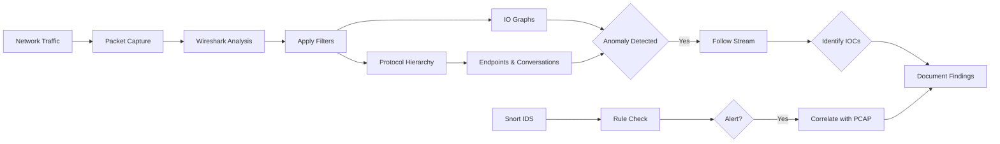
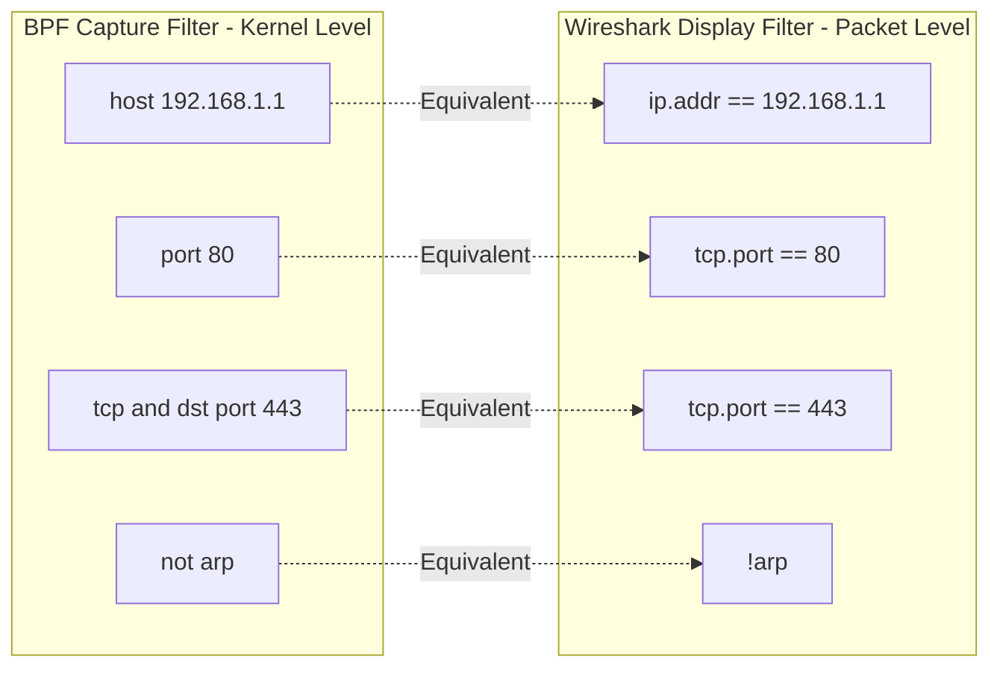

# Capture and Display Filters

## TCM Exam Objectives

Before taking the PSAA exam, you must be able to:

- Apply Wireshark capture filters (BPF) and display filters to isolate relevant traffic
- Navigate the Wireshark UI including Packet List, Packet Details, and Packet Bytes panes
- Use Statistics features (Endpoints, Conversations, Protocol Hierarchy, I/O Graph) for triage
- Follow HTTP, DNS, and TCP streams to extract payload evidence
- Detect and analyze malware beaconing activity using I/O Graphs
- Identify command and control (C2) traffic through protocol and behavioral analysis
- Detect data exfiltration patterns including DNS tunneling and volumetric transfers
- Analyze suspicious DNS queries for DGA, tunneling, and domain fronting indicators

Capture filters (BPF) and display filters are the two filtering engines in Wireshark that every SOC analyst must master. Capture filters discard traffic at the kernel level before it reaches Wireshark; display filters operate on already-captured packets and can inspect any protocol field. The TCM Security PSAA exam tests both in practical PCAP analysis scenarios.

- BPF syntax for capture filters (`tcpdump`, Wireshark capture options)
- Display filter syntax (protocol.field operator value)
- Essential filters for C2 detection, data exfiltration, and scanning
- Filtering workflow for exam investigations

## Capture Filters (BPF Syntax)

Capture filters use the Berkeley Packet Filter (BPF) syntax and are applied **before** capture begins. They work across tcpdump, Wireshark, and tshark.

**Usage in tcpdump:**
```bash
tcpdump -i eth0 -w webtraffic.pcap port 80
```

**Usage in Wireshark:** Enter in the Capture Options dialog before starting capture.

### BPF Primitives

| Primitive | Description | Example |
|-----------|-------------|---------|
| `host` | Traffic to/from a specific IP | `host 192.168.1.100` |
| `src host` | Traffic from a source IP | `src host 10.0.0.5` |
| `dst host` | Traffic to a destination IP | `dst host 8.8.8.8` |
| `net` | Traffic to/from a subnet | `net 192.168.1.0/24` |
| `port` | Traffic on a specific port | `port 443` |
| `tcp`, `udp`, `icmp` | Protocol-specific traffic | `tcp` |

### Combining BPF Primitives

| Operator | Symbol | Function | Example |
|----------|--------|----------|---------|
| and | `&&` | Both conditions must match | `host 10.0.0.5 and port 80` |
| or | `\|\|` | Either condition can match | `port 80 or port 443` |
| not | `!` | Negates a condition | `not port 22` |

<details>
<summary>?? PSAA-Essential Capture Filters</summary>

```bash
tcpdump -i eth0 -w suspect.pcap host 192.168.1.105 and not port 22

tcpdump -i eth0 -w syn_scan.pcap 'tcp[tcpflags] & (tcp-syn) != 0 and tcp[tcpflags] & (tcp-ack) = 0 and src host 192.168.1.50'

tcpdump -i eth0 -w dns.pcap udp port 53 and host 8.8.8.8

tcpdump -i eth0 -w http.pcap tcp port 80

tcpdump -i eth0 -w subnet.pcap net 192.168.1.0/24 and not port 22
```
</details>

## Display Filters

Display filters are applied **after** a capture and use a different, more powerful syntax than BPF. They can inspect any protocol field and support comparison, logical, and pattern-matching operators.

**Syntax:** `protocol.field operator value`

The filter bar turns **green** for valid syntax and **red** for invalid.

### Comparison Operators

| Operator | Alternative | Description |
|----------|-------------|-------------|
| `==` | `eq` | Equal to |
| `!=` | `ne` | Not equal to |
| `>` | `gt` | Greater than |
| `<` | `lt` | Less than |
| `>=` | `ge` | Greater than or equal |
| `<=` | `le` | Less than or equal |
| `contains` | � | String/byte sequence match |
| `matches` | � | PCRE regex match |

### Logical Operators

| Operator | Alternative | Description |
|----------|-------------|-------------|
| `and` | `&&` | Both true |
| `or` | `\|\|` | Either true |
| `not` | `!` | Negation |
| `xor` | `^^` | Exclusive OR |

### Essential Display Filters for SOC Analysis

**IP Address Filtering:**
```
ip.addr == 192.168.1.10
ip.src == 10.0.0.1
ip.dst == 8.8.8.8
```

**Port and Protocol Filtering:**
```
tcp.port == 80
udp.port == 53
http
dns
tls
```

**HTTP Traffic Analysis:**
```
http.request.method == "POST"
http contains "password"
http.host contains "example"
http.user_agent contains "python"
http.request.uri contains "/admin"
```

**TCP Analysis:**
```
tcp.flags.syn == 1 and tcp.flags.ack == 0
tcp.analysis.retransmission
tcp.window_size == 0 && tcp.flags.reset != 1
tcp.stream eq 0
```

**Malware Traffic Analysis:**
```
(http.request or tls.handshake.type eq 1) and !(ssdp)
dns.qry.name contains "pastebin"
tcp.port == 4444 or tcp.port == 1337
frame contains "MZ"
```

<details>
<summary>?? Display Filter Reference Table</summary>

| Task | Display Filter |
|------|---------------|
| Isolate a host | `ip.addr == 10.2.28.88` |
| Show HTTP POSTs | `http.request.method == "POST"` |
| Show HTTP POSTs from a host | `ip.src == 10.2.28.88 && http.request.method == "POST"` |
| Show DNS for a domain | `dns.qry.name contains "malicious.com"` |
| Find username (Kerberos) | `ip.addr == 10.2.28.88 && kerberos.CNameString` |
| Search for User-Agent | `http.user_agent contains "NetSupportManager"` |
| Exclude DNS noise | `!dns` |
| Show TLS Client Hellos | `tls.handshake.type == 1` |
| Show SYN packets | `tcp.flags.syn == 1 && tcp.flags.ack == 0` |
| Show TCP resets | `tcp.flags.reset == 1` |
| Show all traffic on a port | `tcp.port == 4444` |
| Search for a string | `frame contains "malware"` |
</details>

?? **Exam Tip:** When triaging alerts, prioritize by severity and potential business impact. A single true positive C2 alert is more critical than 1,000 false positive scan alerts.

?? **Exam Tip:** Master the difference between capture filters and display filters. Capture filters (BPF) discard at kernel level; display filters only hide packets. Use capture filters for large PCAPs to reduce file size before analysis.

## Display Filter vs. Capture Filter Cheat Sheet

| Task | Display Filter | Capture Filter (BPF) |
|------|---------------|----------------------|
| HTTP traffic | `http` | `tcp port 80` |
| HTTPS traffic | `tls` | `tcp port 443` |
| DNS traffic | `dns` | `udp port 53` |
| Traffic by IP | `ip.addr == x.x.x.x` | `host x.x.x.x` |
| Traffic from IP | `ip.src == x.x.x.x` | `src host x.x.x.x` |
| Traffic to IP | `ip.dst == x.x.x.x` | `dst host x.x.x.x` |
| Traffic on port | `tcp.port == XXXX` | `port XXXX` |
| Exclude a host | `!ip.addr == x.x.x.x` | `not host x.x.x.x` |
| Initial SYN packets | `tcp.flags.syn == 1 && tcp.flags.ack == 0` | `'tcp[tcpflags] & (tcp-syn) != 0 and tcp[tcpflags] & (tcp-ack) = 0'` |
| HTTP POST requests | `http.request.method == "POST"` | N/A (requires packet parsing) |
| String search | `frame contains "string"` | N/A |



## The PSAA Filtering Workflow

1. **Triage with Capture Filters:** Use BPF filters in tcpdump commands to quickly narrow large PCAPs to relevant traffic (single host, timeframe, protocol).

2. **Deep Dive with Display Filters:** Open the filtered PCAP in Wireshark and apply display filters to isolate specific protocols, IPs, and behaviors.

3. **Verify with Stream Analysis:** Once a suspicious conversation is found, use **Follow > TCP/HTTP/DNS Stream** to reassemble the session and examine payload content.

## Recap

- Capture filters (BPF) pre-filter traffic at the kernel level before Wireshark receives it
- Display filters operate on captured packets and can inspect any protocol field with full expression support
- PSAA exam tasks require proficiency in both: BPF for triage, display filters for deep investigation
- The filter bar turns green for valid syntax, red for errors
