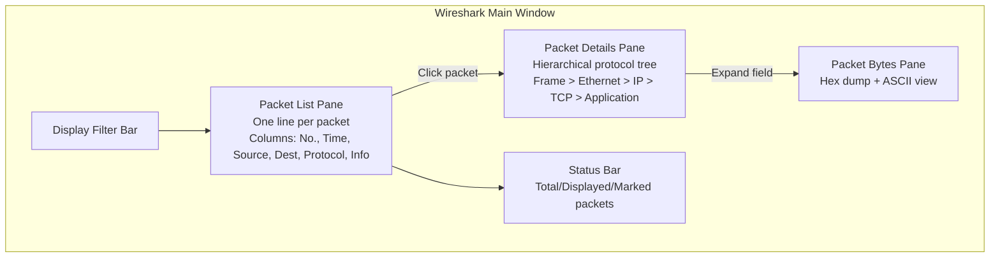
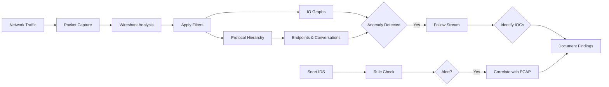

# The Wireshark User Interface and Workflow

## TCM Exam Objectives

Before taking the PSAA exam, you must be able to:

- Apply Wireshark capture filters (BPF) and display filters to isolate relevant traffic
- Navigate the Wireshark UI including Packet List, Packet Details, and Packet Bytes panes
- Use Statistics features (Endpoints, Conversations, Protocol Hierarchy, I/O Graph) for triage
- Follow HTTP, DNS, and TCP streams to extract payload evidence
- Detect and analyze malware beaconing activity using I/O Graphs
- Identify command and control (C2) traffic through protocol and behavioral analysis
- Detect data exfiltration patterns including DNS tunneling and volumetric transfers
- Analyze suspicious DNS queries for DGA, tunneling, and domain fronting indicators

Wireshark is the graphical packet analysis workhorse for SOC investigations. It reassembles TCP streams, decodes hundreds of protocols, follows application-layer conversations, and exports files. The TCM Security PSAA exam requires proficiency in navigating the UI, customizing the workspace for security analysis, and executing a repeatable investigative workflow.

- Understanding the three-pane interface (Packet List, Packet Details, Packet Bytes)
- Customizing columns, coloring rules, and profiles for security analysis
- The complete security investigation workflow
- Must-know features for malware and attack analysis

## The Wireshark Interface

### Start Page

When Wireshark launches, the start page shows available network interfaces. For live capture, double-click an interface or enter a BPF capture filter. Most PSAA tasks involve pre-captured files � use **File > Open** or drag the PCAP into the window.

### The Main Window (3 Panes + Filter Bar)

| Pane | Official Name | What It Shows |
|------|---------------|---------------|
| Top | Packet List | One line per packet; columns show summary info |
| Middle | Packet Details | Hierarchical view of protocol headers and data |
| Bottom | Packet Bytes | Raw hexdump and ASCII representation |

Above the Packet List is the **Display Filter Bar** � the most important field in Wireshark. Type display filters to show/hide packets based on any protocol field.

### Essential Menu Items for SOC

- **File** � Open, Merge, Export Specified Packets, Export Objects (HTTP, SMB, TFTP)
- **Edit** � Find Packet, Mark/Unmark packets, Set Time Reference
- **View** � Colorize Packet List, Time Display Format, Name Resolution
- **Analyze** � Follow TCP/UDP/HTTP Stream, Display Filter Macros, Expert Information
- **Statistics** � Endpoints, Conversations, Protocol Hierarchy, I/O Graph, Flow Graph

### The Toolbar

1. **Start/Stop capture** � live demonstration use
2. **Open** � load a PCAP file
3. **Save As** � save filtered packets
4. **Find Packet** � search by hex string, display filter, etc.
5. **Colorize Packet List** � toggle coloring on/off
6. **Zoom In/Out** � adjust font size
7. **Apply a display filter** � save/recall filters via bookmark icon
8. **Display Filter Expression** � builder dialog for complex filters

### The Status Bar

Shows total packets, displayed packets (after filter), marked packets, profile name, file size, and load time.

## Setting Up Wireshark for Security Analysis

### Security-Focused Columns

Right-click any column header > **Column Preferences**. Add these columns for rapid triage:

| Column Title | Field Type | Why It Helps |
|-------------|------------|--------------|
| Src Port | `tcp.srcport` or `udp.srcport` | See source port immediately |
| Dst Port | `tcp.dstport` or `udp.dstport` | Spot unusual destination ports (C2) |
| Stream Index | `tcp.stream` | Group packets into TCP conversations |
| HTTP Host | `http.host` | Identify phishing domains or C2 servers |
| Info (Detailed) | `frame.protocols` | Shows full protocol stack per packet |

### Coloring Rules for Instant Visual Triage

**View > Coloring Rules.** Add custom rules for attacks:

- `tcp.flags.syn == 1 and tcp.flags.ack == 0` � red (SYN scans)
- `tcp.flags.reset == 1` � orange (abrupt resets)
- `dns.qry.name matches "\.tk$|\.top$|\.xyz$"` � magenta (malicious TLDs)
- `http.request.uri contains "/admin"` � bright yellow

### Profiles

Save entire UI layouts as **Profiles** (right side of the status bar). Create a "Security Analysis" profile with custom columns, coloring rules, and a specific packet detail layout.

## The Security Investigation Workflow

### Step 1: Open and Save

**File > Open** the PCAP, then **File > Save As** with a new name (e.g., `investigation.pcapng`) to preserve the original and allow markings/comments.

### Step 2: Apply Initial Display Filter

Start with a broad filter to see what's happening:
- `ip.addr == 10.0.0.5` � if you have a suspect IP
- `tcp.port == 4444` � if you know the C2 port
- `tcp.flags.syn == 1 and tcp.flags.ack == 0` � connection initiators
- `dns` � all DNS queries
- `http.request` � all HTTP requests

### Step 3: Scan with Colors and Columns

Look for:
- Red/orange SYN flags (scans)
- Unusual destination ports
- HTTP requests to raw IP addresses
- Huge packet lengths
- Long conversations (high stream index)

### Step 4: Inspect Individual Packets

Click a suspicious packet. The **Packet Details** pane shows a tree:
- Expand each layer (Frame, Ethernet, IP, TCP, Application)
- For TCP, check the Flags subtree
- For HTTP, expand to see full URI, User-Agent, Server headers
- Right-click any field and choose **Apply as Filter** to jump to other packets

### Step 5: Follow the Stream

**Follow** reassembles an entire TCP or UDP conversation:
- Right-click any packet > **Follow > TCP Stream**
- Data colored by direction (red = client, blue = server)
- Change "Show and save data as" to ASCII, Hex Dump, Raw
- **Filter out this stream** to remove it and see what else is happening
- Use **Follow > HTTP Stream** for web conversations

?? Stream Following Details

| Element | SOC Value |
|---------|-----------|
| Data display area | See who sent what |
| Show and save data as | ASCII for text, hex for binary, raw to export |
| Entire conversation | See request/response pairing |
| Save as, Print, Find | Export evidence, search for strings |
| Filter out this stream | Exclude known-good to find hidden anomalies |
| Stream number | Use `tcp.stream eq N` to isolate |

### Step 6: Export Files and Objects

**File > Export Objects > HTTP** (or SMB, TFTP). Lists all files transmitted via that protocol. Check for executables (`.exe`, `.dll`), scripts (`.ps1`, `.vbs`), or documents (`.docm`, `.pdf`). **Extract to a sandbox VM, not your host.**

### Step 7: Use Statistics for Anomalies

- **Statistics > Endpoints** � lists all IP addresses with total bytes/packets. Sort descending to find top talkers.
- **Statistics > Conversations** � shows pairs. Identify long-lived TCP sessions, high packet counts, asymmetric transfers.
- **Statistics > Protocol Hierarchy** � tree map of protocols. High percentage of unknown protocols = investigate.
- **Statistics > I/O Graph** � visualize throughput over time. Add multiple graphs with different filters. A steady 60-second beacon on a non-standard port is a massive C2 indicator.
- **Statistics > Flow Graph** � sequence diagram of packets. Useful for understanding handshake failures.

### Step 8: Mark, Comment, and Export Findings

- **Mark packets** (Ctrl+M) � black background
- **Packet Comments** � right-click > Packet Comment, saved inside the PCAPNG file
- **File > Export Specified Packets** � export only marked or filtered packets
- Use `tshark` to generate a quick CSV: `tshark -r case.pcap -T fields -e ip.src -e tcp.dstport -e http.request.uri > iocs.csv`

?? **Exam Tip:** On the PSAA exam, always document your analysis methodology step-by-step in the incident report. Include timestamps, source/destination IPs, and the specific evidence that supports your conclusion.

?? **Exam Tip:** Correlate across multiple data sources. A suspicious IP address in network traffic is stronger evidence when confirmed by Windows Event Log ID 4625 (failed logon) or EDR process telemetry.

## Must-Know Features for Malware Analysis

- **Expert Information** (Analyze > Expert Info) � Wireshark flags TCP ZeroWindow, retransmissions, resets, malformed packets. Sort by severity (Error, Warning, Note).
- **TCP Stream Graph** � right-click TCP > TCP Stream Graph > Window Scaling (watch for sudden drops).
- **Decode As** � if Wireshark misidentifies a protocol, right-click > Decode As and force interpretation as SSL, HTTP, or None.
- **GeoIP** � with MaxMind databases, enables country flags for traffic to hostile geographies.

## Limitations

| Limitation | Workaround |
|------------|------------|
| Very large captures (slow) | Use `tshark` or BPF pre-filtering first |
| Encrypted HTTPS traffic | Need SSLKEYLOGFILE to decrypt |
| Custom application protocols | Raw hex analysis or custom Lua script |
| Time-critical triage | `tcpdump -nnr file.pcap \| head -20` is faster |

## PSAA Exam Tips

- Always save the original PCAP before any modification
- Use **Profiles** � configure columns and coloring rules ahead of time
- Pre-filter large files with `tshark` before opening in Wireshark
- Memorize common display filters � the exam asks you to write them
- Use the **Apply as Filter** right-click to build filters visually
- Check **Expert Info** first for immediate red flags
- Always **Follow streams** for context, never rely on packet-by-packet inspection

## Recap

- The Wireshark UI consists of Packet List, Packet Details, Packet Bytes, and the Display Filter Bar
- Customize columns, coloring rules, and profiles for instant security triage
- Follow the repeatable workflow: filter > scan > inspect > follow streams > export objects > statistics
- Display filters are far more powerful than capture filters and work on any field
