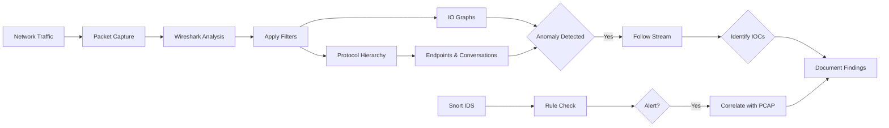
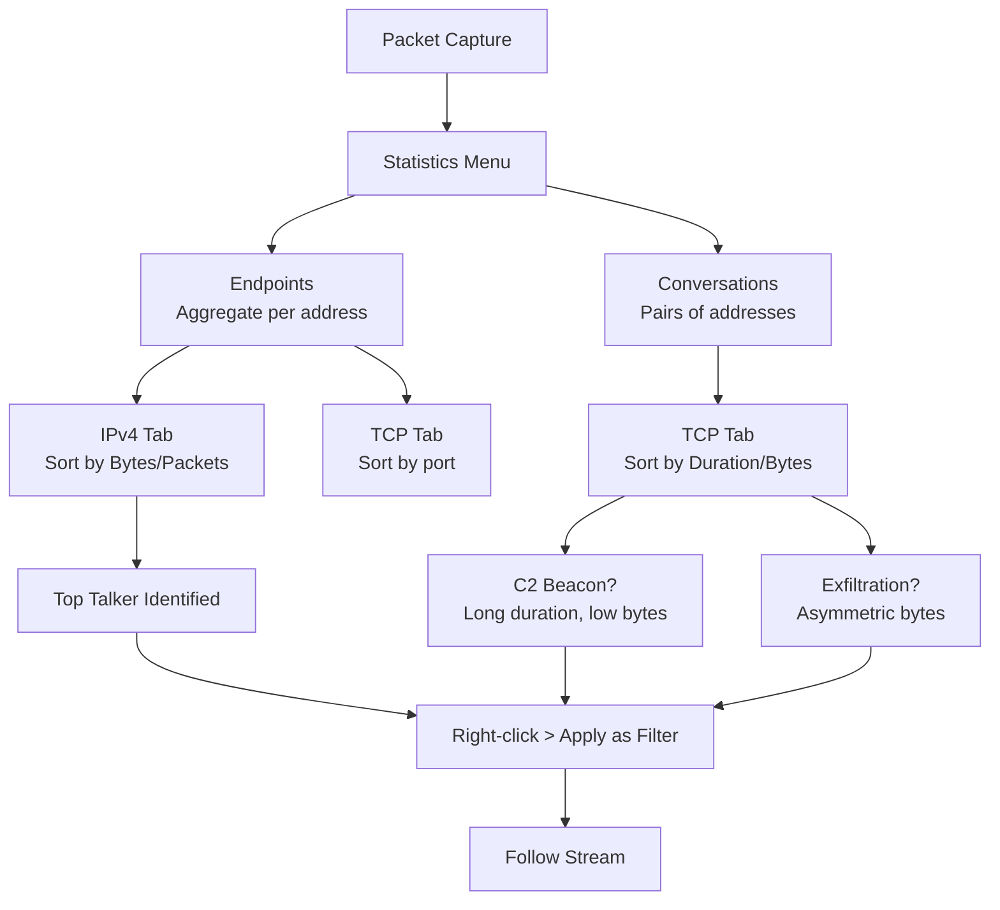

# Endpoints and Conversations

## TCM Exam Objectives

Before taking the PSAA exam, you must be able to:

- Apply Wireshark capture filters (BPF) and display filters to isolate relevant traffic
- Navigate the Wireshark UI including Packet List, Packet Details, and Packet Bytes panes
- Use Statistics features (Endpoints, Conversations, Protocol Hierarchy, I/O Graph) for triage
- Follow HTTP, DNS, and TCP streams to extract payload evidence
- Detect and analyze malware beaconing activity using I/O Graphs
- Identify command and control (C2) traffic through protocol and behavioral analysis
- Detect data exfiltration patterns including DNS tunneling and volumetric transfers
- Analyze suspicious DNS queries for DGA, tunneling, and domain fronting indicators

Endpoints and Conversations are Wireshark's most powerful statistics tools for identifying top talkers, suspicious communication pairs, and attack patterns. Endpoints show aggregated traffic for a single address; Conversations show aggregated traffic for a communication pair. Both let you sort by packets, bytes, or duration, making it trivial to answer investigative questions.

- Navigating the Endpoints and Conversations windows
- Sorting by packets, bytes, and duration to find anomalies
- Spotting data exfiltration, C2 beacons, port scanning, and lateral movement
- Pivoting from statistics to packets with right-click filtering
- Using tshark equivalents for scripting

## Endpoints Window

**Access:** Statistics > Endpoints

### Tabs

- **Ethernet** � MAC addresses. Useful for ARP spoofing or device identification.
- **IPv4 / IPv6** � IP addresses. Most common for host-based analysis.
- **TCP** � Individual TCP ports (source or destination).
- **UDP** � Individual UDP ports.

### IPv4 Tab Columns

| Column | Description | Security Insight |
|--------|-------------|-----------------|
| Address | IP address | Known-bad IPs, hosts that shouldn't talk externally |
| Packets | Total packets to/from this address | High counts = scanners or amplifiers |
| Bytes | Total bytes | High bytes with low packets = large payloads |
| Tx Packets | Packets transmitted by this address | Many SYNs = scanner |
| Tx Bytes | Bytes transmitted | Huge Tx bytes = exfiltration |
| Rx Packets | Packets received | Many small packets = victim of scan/DDoS |
| Rx Bytes | Bytes received | Large file download (malware) |
| Country | GeoIP lookup | Traffic to hostile geographies |

### Security Use Cases for Endpoints

**Find the top talker (exfiltration suspect):** Sort by Bytes descending. The internal host with huge outbound traffic to a single external IP is the prime suspect.

**Detect a port scanner:** Look for an IP with extremely high Tx Packets but low Tx Bytes (SYN packets are small). An IP sending 10,000 packets but receiving only 1,000 is likely scanning.

**Identify a DDoS amplifier:** An external IP sending massive Rx Bytes to an internal host (e.g., DNS amplification).

**Spot broadcast storms:** In the Ethernet tab, the broadcast MAC (`ff:ff:ff:ff:ff:ff`) with abnormally many packets indicates scanning.

## Conversations Window

**Access:** Statistics > Conversations

### TCP Tab Columns

| Column | Description | Security Insight |
|--------|-------------|-----------------|
| Address A / Address B | The two communicating endpoints (IP:port) | See exactly who talks to whom |
| Packets | Packets in both directions combined | High packets = active conversation |
| Bytes | Total bytes in both directions | Large data transfer |
| Duration | Length in seconds | Long-duration low-data = beacon |
| Rel Start | When the conversation started | Time-correlate with events |
| Bits/s A->B / B->A | Throughput each direction | Asymmetric traffic = suspicious |

### Security Use Cases for Conversations

**Find C2 Beaconing:** Sort by Duration ascending. Low Bytes but long Duration (e.g., 600 seconds, 120 packets = one per 5 seconds) indicates beaconing.

**Detect Lateral Movement:** Look for internal conversations on port 445 (SMB) between hosts that shouldn't communicate. Short-lived RDP (3389) from one source to many destinations indicates brute-force.

**Exfiltration via HTTPS:** An internal host and external IP with huge Bytes A->B (e.g., 500 MB sent) but very little B->A. Normal HTTPS is symmetric or download-heavy.

**Port Scan Discovery:** In the IPv4 tab, an internal IP with hundreds of distinct conversations all with short duration indicates scanning.

**DNS Tunnelling:** In the UDP tab, port 53 conversations with unusually high Bytes (especially B->A) or many long-duration conversations with consistent packet sizes.



## Pivoting from Statistics to Packets

The true power is filtering directly from a statistic:

- **Right-click a row > "Apply as Filter" > "Selected"** � instantly creates a display filter for that IP or conversation
- **"And Selected"** � adds to an existing filter
- **"Prepare as Filter"** � copies the filter to the bar without applying
- **"Apply as Filter" > "... and Not Selected"** � excludes a noisy conversation

?? **Exam Tip:** Always save a copy of the original evidence before performing any analysis. Reference specific packet numbers, event IDs, and timestamps to demonstrate thorough investigation.

?? **Exam Tip:** When writing incident reports, use the STAR method: Situation (what was alerted), Task (what you needed to find), Action (tools and filters used), Result (IOCs confirmed and remediation steps).

## TShark Equivalents

```bash
tshark -r capture.pcap -q -z endpoints,ipv4

tshark -r capture.pcap -q -z conv,tcp

tshark -r capture.pcap -q -z conv,tcp,'tcp.port==445'

tshark -r capture.pcap -q -z conv,tcp | awk '{print $1","$3","$5","$7}' > conversations.csv
```

## Investigation Workflow Using Endpoints & Conversations

### Scenario: User reports "weird" workstation behavior

1. **Open Endpoints > IPv4, sort by Bytes descending.** Internal host `10.0.0.25` is sending 2.3 GB to external IP `198.51.100.77`.
2. **Right-click external IP > Apply as Filter > Selected.** Packet list shows only traffic to/from `198.51.100.77`.
3. **Go to Conversations > TCP.** See `10.0.0.25:49152 <-> 198.51.100.77:4444`. Duration: 3600 seconds. Bytes A->B: 2.2 GB. Classic C2 exfiltration.
4. **Right-click conversation > Apply as Filter > Selected.** All packets for this stream isolated.
5. **Follow TCP stream** to confirm � encrypted data, but the pattern is enough.
6. **Back to Endpoints > IPv4, sort by Packets.** Host `10.0.0.25` sent 50,000 packets. Conversations > IPv4 shows 20 internal IPs on port 445 � lateral movement.
7. **Mark and export** key packets as evidence.

<details>
<summary>?? Cheat Sheet: What to Look For</summary>

| Statistic View | Sort By | Suspicious Indicator | Likely Attack |
|---------------|---------|----------------------|---------------|
| Endpoints IPv4 | Bytes (Tx) | One internal host sending many bytes externally | Data exfiltration |
| Endpoints IPv4 | Packets (Tx) | One host sending many small packets to many addresses | Port/network scan |
| Endpoints TCP | Packets | High packet count to a single external port | Brute-force or C2 |
| Conversations TCP | Duration | Many short-lived connections to different ports | Port scan |
| Conversations TCP | Bytes A->B | Massive asymmetry (host sending GB) | Upload exfiltration |
| Conversations TCP | Rel Start | Connections starting at regular intervals (every 60s) | Beaconing |
| Conversations IPv4 | Packets | One host with thousands of distinct conversations | Scanning or P2P malware |
| Endpoints UDP | Bytes | High bytes to port 53 but low packet count | DNS tunnelling |
| Conversations Ethernet | Packets | High traffic to broadcast MAC | ARP storm, worm |

</details>

## PSAA Exam Traps

- Don't assume the top-talker by packets is the attacker. It could be a noisy backup server. Check protocol, ports, and direction.
- Duration is your beacon detective. A conversation lasting hours with only a few kilobytes is a textbook C2 heartbeat.
- Use **"Limit to display filter"** checkbox in Statistics windows to run endpoints/conversations only on filtered traffic.
- Combine with Protocol Hierarchy: the hierarchy tells you *what* protocol; endpoints/conversations tell you *who* and *how much*.
- For large captures, use `tshark -z` first to get statistics instantly, then pre-filter with `tshark -r big.pcap -f 'host ...' -w small.pcap`.

## Recap

- Endpoints show single-address statistics (MAC, IP, port). Use to identify top talkers, heavy data sources, and scanning hosts
- Conversations show communication pairs. Use to find C2 beacons, lateral movement, and data exfiltration channels
- Sort by Bytes for volume, Packets for activity, Duration for beacons
- Right-click any row to Apply as Filter � your fastest pivot to packet-level analysis
