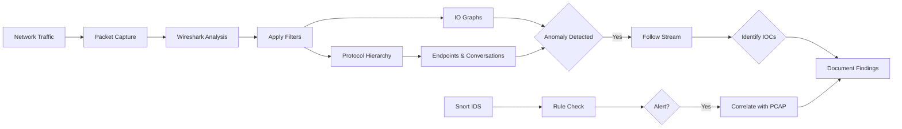
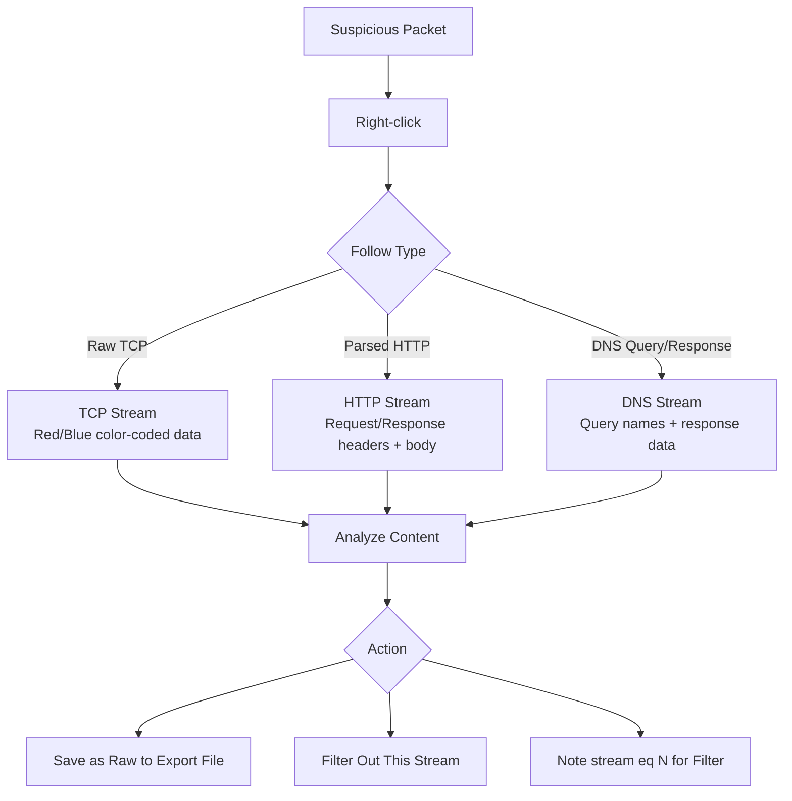

# Following HTTP, DNS, and TCP Streams

## TCM Exam Objectives

Before taking the PSAA exam, you must be able to:

- Identify indicators of a phishing email in email headers, body, and attachments
- Configure email analysis tools (Thunderbird, PhishTool) for forensic examination
- Implement and tune DMARC, SPF, and DKIM authentication to block spoofed email
- Execute phishing simulation campaigns to measure organizational risk
- Apply reactive defense measures: block domains, URLs, and sender addresses
- Perform email search and purge procedures for incident response
- Deliver user notification and remediation following a confirmed phishing incident
- Analyze email authentication results to determine spoofing vs. legitimate mail

The Follow feature reassembles entire application-layer conversations from scattered packets into a single readable view, reordering segments and removing headers. This lets you read exactly what the attacker typed and what the victim sent back. For the PSAA, answers to "What command did the attacker run?" or "What file was exfiltrated?" are almost always inside a stream.

- Following TCP Streams (raw application data)
- Following HTTP Streams (parsed request/response structure)
- Following DNS Streams (uncovering tunnels and covert channels)
- Stream following workflow: from statistics to streams
- TShark equivalents for automated stream extraction

## Following TCP Streams

### How to Follow

Right-click any packet in the TCP conversation > **Follow > TCP Stream**.

### Stream Window Anatomy

| Element | SOC Value |
|---------|-----------|
| Data display area (red/blue) | Red = client to server, blue = server to client |
| Show and save data as | ASCII for text, hex for binary, Raw to export file |
| Entire conversation | See request/response pairing |
| Filter out this stream | Applies `!tcp.stream eq N` to remove noise |
| Stream number | `tcp.stream eq N` isolates this conversation |
| Save as | Export evidence |

### Security Uses

**Reverse Shell / Bind Shell:** TCP stream to port 4444 or 1337 often shows a command prompt. Read the attacker's commands: `whoami`, `net user`, `dir`, `powershell -enc`.

**IRC Botnet C2:** IRC is text-based. Follow TCP stream on port 6667. You'll see NICK, JOIN, PRIVMSG, and commands like `!bot.attack`, `!scan`.

**File Transfer:** Follow FTP-data stream (port 20) or TFTP (UDP 69). Change to Raw, Save as to extract the file.

**PowerShell C2:** Many frameworks run over HTTP, but if they fall back to raw TCP, you'll see PowerShell output.

### Key Filter

```
tcp.stream eq N
```

Once you identify a malicious stream, note its number and use this filter to isolate all its packets.

## Following HTTP Streams

### How to Access

Right-click any HTTP packet > **Follow > HTTP Stream**. The window highlights request in red, response in blue. Shows request line, headers, body, then response line, headers, body.

### What to Look For

| HTTP Field/Pattern | Suspicious Meaning |
|-------------------|-------------------|
| Unusual User-Agent | Custom C2 agents, scripting (`python-requests`, `curl`) |
| Host header pointing to raw IP | Direct C2, no domain |
| Long, random URI paths | Obfuscated C2 endpoint |
| POST to a very short script | `/a.php`, `/upload.php` = data exfiltration |
| Base64 encoded body | C2 encoding for commands/stolen data |
| Set-Cookie with unusual values | Botnet session token |
| HTTP response with raw binary (`MZ`) | Malware download |
| 404 responses with data | Tunnelling inside 404 pages |
| Repeated POSTs to same URI at regular intervals | Beaconing |

### Practical Examples

**Phishing Page:** Follow HTTP stream where a user submitted credentials. Body shows `username=admin&password=P@ssw0rd`.

**Malware Download:** GET to `/evil.exe` returns `Content-Type: application/x-msdownload`. Save as or use File > Export Objects > HTTP.

**C2 Beacon:** Every 30 seconds, POST to `/index.php` with small encrypted body. Note exact body format for IDS signatures.

**Data Exfiltration via GET:** `GET /data?d=aGVsbG8gd29ybGQK HTTP/1.1`. Decode `d` to see stolen data.

### Exporting HTTP Objects

**File > Export Objects > HTTP** lists all files (images, scripts, executables) sent via HTTP. Save in bulk.



## Following DNS Streams

### How to Access

Right-click a DNS packet > **Follow > DNS Stream** (Wireshark 3.x+). For older versions, use Follow > UDP Stream.

### Spotting Malicious DNS Activity

| Indicator in DNS Stream | What It Means |
|------------------------|---------------|
| Very long query names (>100 bytes) | DNS tunnelling � data in subdomain |
| High volume of TXT queries | TXT records hold arbitrary data (C2 commands) |
| Queries to .tk, .ml, .ga, .cf TLDs | Free domains used by malware |
| Multiple AAAA records or large response sizes | IP-over-DNS tunneling |
| Regular queries to same domain every N seconds | Beaconing |
| Unusual record types (NULL, CNAME loops) | Protocol abuse or covert channels |
| DNS responses containing `MZ` or executable headers | Malware download via DNS (rare) |

### Practical Example

You notice a UDP stream where the query name is `AQIDBAUGBwgJCgsMDQ4PEA==.evil.com`. Follow DNS Stream. The base64 string decodes to a command or data. Extract, decode, confirm exfiltration.

```bash
echo "AQIDBAUGBwgJCgsMDQ4PEA==" | base64 -d
```

### Display Filters for DNS Streams

```
dns.qry.name contains "evil.com"
dns.resp.len > 200
```

?? **Exam Tip:** When triaging alerts, prioritize by severity and potential business impact. A single true positive C2 alert is more critical than 1,000 false positive scan alerts.

?? **Exam Tip:** Master the difference between capture filters and display filters. Capture filters (BPF) discard at kernel level; display filters only hide packets. Use capture filters for large PCAPs to reduce file size before analysis.

## Stream Following Workflow

## TShark for Stream Extraction

```bash
tshark -r capture.pcap -q -z follow,tcp,ascii,0

tshark -r capture.pcap -Y "http" -T fields -e http.request.full_uri -e http.response.code

tshark -r capture.pcap -q -z follow,udp,ascii,3

tshark -r capture.pcap -Y "dns" -T fields -e dns.qry.name -e dns.resp.addr
```

<details>
<summary>?? PSAA-Style Scenarios</summary>

**Scenario 1: Identify the attacker's reverse shell commands**
- Filter `tcp.port == 4444`
- Right-click > Follow TCP Stream
- Read ASCII data: `$ id`, `$ uname -a`, `$ cat /etc/shadow`
- Note the attacker's IP from source of first data packet

**Scenario 2: Find the exfiltrated file via HTTP POST**
- Use `http.request.method == POST`
- Follow the HTTP stream of the largest POST
- Body shows `filename="passwords.txt"` and `application/octet-stream`
- Save raw body as `passwords.txt`

**Scenario 3: Detect DNS tunneling**
- Filter `dns`, then Follow DNS Stream of a query with suspicious long subdomain
- See `query: 5235634d4357747062334a6c59513d3d.tunnel.attacker.com`
- Decode hex to find base64, decode again to reveal data
</details>

## Best Practices

- Always check "Entire conversation" first, then switch to individual directions
- Use "Save as" to preserve evidence in original format (raw, hex)
- Filter out benign streams to reduce analysis noise
- Note the stream index (`tcp.stream eq N`) for quick access
- Combine with display filters like `http.request.uri contains "admin"` or `dns.qry.name matches "[A-F0-9]{20,}"`
- Check for incomplete reassembly: gaps in stream window may indicate missing data

## PSAA Exam Traps

- HTTP/2 may show binary gibberish in TCP stream; use **Follow > HTTP/2 Stream** instead
- DNS may use TCP (zone transfers, large responses); filter both `udp.port == 53` and `tcp.port == 53`
- Malware often uses XOR or base64 encryption � stream data may be encoded; decode outside Wireshark
- A stream on port 8080 might look like HTTP but be a custom C2 protocol; if "Follow HTTP Stream" option isn't available, fall back to Follow TCP Stream
- Always toggle "Show data as" dropdown � garbage in ASCII might be a PDF or executable in Raw

## Recap

- Stream following reassembles scattered packets into one complete, searchable conversation
- TCP Streams are the universal catch-all for any clear-text protocol (shells, IRC, custom C2)
- HTTP Streams automatically parse web traffic, making request/response pairs crystal clear
- DNS Streams expose domain queries, record types, and response data for uncovering tunneling
