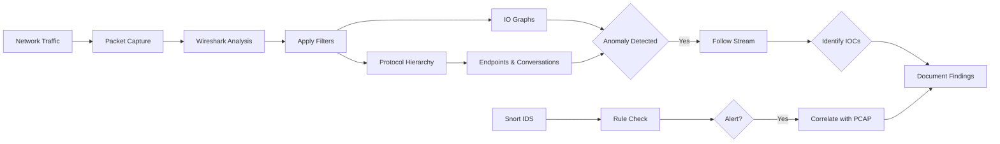
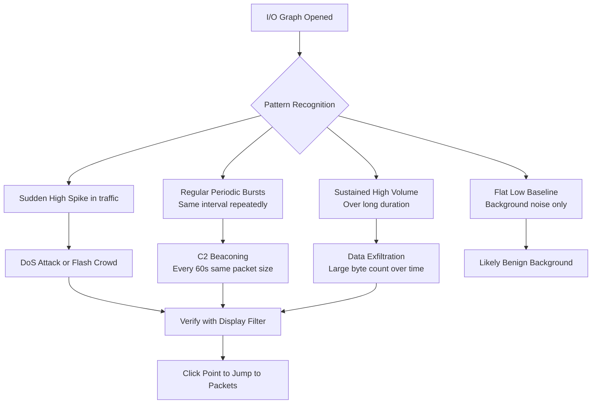

# I.O Graphs and Flow Visualization

## TCM Exam Objectives

Before taking the PSAA exam, you must be able to:

- Apply Wireshark capture filters (BPF) and display filters to isolate relevant traffic
- Navigate the Wireshark UI including Packet List, Packet Details, and Packet Bytes panes
- Use Statistics features (Endpoints, Conversations, Protocol Hierarchy, I/O Graph) for triage
- Follow HTTP, DNS, and TCP streams to extract payload evidence
- Detect and analyze malware beaconing activity using I/O Graphs
- Identify command and control (C2) traffic through protocol and behavioral analysis
- Detect data exfiltration patterns including DNS tunneling and volumetric transfers
- Analyze suspicious DNS queries for DGA, tunneling, and domain fronting indicators

I/O Graphs visualize traffic volume over time, and Flow Graphs visualize conversations as sequence diagrams. These tools transform a mountain of packets into a clear visual timeline for spotting data exfiltration bursts, DoS attacks, beaconing activity, and the step-by-step sequence of network conversations.

- I/O Graph: visualizing traffic over time (when and how much)
- Flow Graph: visualizing conversations as sequence diagrams (how)
- Essential configurations for security analysis
- PSAA investigation scenarios using both tools

## I/O Graphs

**Access:** Statistics > I/O Graphs

The I/O Graph is your primary tool for understanding traffic volume and patterns across a timeline. It answers "when" and "how much."

### Reading the I/O Graph

- **X-Axis (Horizontal):** Time (relative seconds since capture start, or Time of Day)
- **Y-Axis (Vertical):** Unit of measurement (Packets, Bytes, Bits)
- **Interval:** Width of each data point (1 sec for general, 100ms for DoS bursts)

Hovering over a data point shows exact packet and value. **Clicking a point jumps to the corresponding packets in Wireshark.**

### Essential Configurations

| Feature | Description |
|---------|-------------|
| Display Filter | Applies a filter to a single graph line for isolating traffic |
| Y-Axis (Unit) | Packets/Tick for protocol behavior, Bytes/Tick for throughput |
| Style | Line for continuous, Bar for bursts, Dot/Impulse for rare events |
| SMA (Simple Moving Average) | Smooths noisy data to reveal long-term trends |
| Time of Day | Switch to absolute time for correlating with logs |
| Log Scale | Essential when traffic has a few massive spikes with quiet background |

### PSAA Investigation Scenarios

**Detecting a Port Scan:** Create a graph filtered for `tcp.flags.syn == 1 && tcp.flags.ack == 0`. A constant low-level line of these packets across the timeline indicates scanning.

**Analyzing DoS/Flood Attack:** A massive sustained spike in traffic volume. Add multiple graph lines filtered for different source IPs to identify which aligns with the spike.

**Spotting Data Exfiltration:** Set Y-axis to Bytes/Tick and filter for `ip.src == 192.168.1.105`. A sudden, prolonged period of high byte volume on an unusual port or odd time is critical.

**Detecting Beaconing:** Look for a perfect, periodic rhythm of small packet bursts. Filter for traffic to the suspect external IP. A regularly repeating pattern on a larger time interval confirms a C2 beacon.



## Flow Graphs

**Access:** Statistics > Flow Graph

While I/O Graphs answer "when" and "how much," a Flow Graph answers "how." It visualizes a conversation between endpoints as a sequence diagram.

### Reading a Flow Graph

- **Vertical Lines:** Represent the two communicating hosts (addresses at top)
- **Arrows:** Show direction of each packet
- **Left Column:** Timestamp for each packet
- **Port Numbers:** At the ends of arrows

Clicking any line in the Flow Graph highlights the corresponding packet in the main Wireshark window.

### Information Revealed by Flow Graphs

- **Complete TCP Handshake:** Is the initial SYN met with SYN-ACK and final ACK?
- **Connection Failures and Resets:** SYN immediately followed by RST indicates closed port or firewall blocking
- **Data Transfer Flow:** Visually see which host is sending data and when
- **Abnormal Sequences:** Retransmissions shown as multiple arrows for the same sequence number

### PSAA Investigation Scenarios

**Reconstructing an Attack Sequence:** After isolating a suspicious TCP stream to a known-bad IP, the Flow Graph shows the exact sequence: handshake, attacker's first command, victim's response, and close.

**Analyzing a Port Scan:** Filter for a single source IP. The Flow Graph shows a long list of SYN arrows from the attacker to many ports, many followed by RST arrows back (closed ports).

**Troubleshooting Dropped Connections:** If a host repeatedly sends SYN with no response, the Flow Graph shows a series of upward arrows with no corresponding downward arrows.

<details>
<summary>?? Flow Graph Filtering Technique</summary>

Best practice: First apply a display filter in the main window to isolate the suspicious TCP stream, then open the Flow Graph. In the dialog, select **"Displayed packets"** to graph only that filtered traffic.

Example filter before opening Flow Graph:
```
tcp.stream eq 5
```

This ensures the Flow Graph shows only the single conversation of interest.
</details>

?? **Exam Tip:** When writing incident reports, use the STAR method: Situation (what was alerted), Task (what you needed to find), Action (tools and filters used), Result (IOCs confirmed and remediation steps).

?? **Exam Tip:** On the PSAA exam, always document your analysis methodology step-by-step in the incident report. Include timestamps, source/destination IPs, and the specific evidence that supports your conclusion.

## The PSAA Visualization Workflow

1. **Start High with I/O Graphs:** Get a bird's-eye view. Look for unusual spikes, drops, or repeating patterns. Identify the time window and scale of suspicious activity.

2. **Form a Hypothesis:** Is this a volumetric DoS attack? Port scan? Data exfiltration? Beaconing? Based on the I/O Graph pattern.

3. **Isolate the Culprit:** Use display filters to narrow to the top talkers or specific protocol. Apply this as a filter in the I/O Graph to confirm the pattern belongs to that host.

4. **Zoom In with Flow Graphs:** Isolate the specific conversation with a display filter and open the Flow Graph. This shows the exact sequence of the conversation.

5. **Document and Report:** Reference your visual analysis. "The I/O Graph below shows a sustained 15-minute spike in traffic to 203.0.113.45 on port 4444, consistent with data exfiltration."

## Quick Reference

| Tool | Menu Location | Key Use Cases |
|------|---------------|---------------|
| I/O Graph | Statistics > I/O Graphs | Detecting DoS, exfiltration bursts, beaconing, time-based patterns |
| Flow Graph | Statistics > Flow Graph | Analyzing TCP handshakes, attack sequencing, port scans, connection troubleshooting |

## PSAA Exam Tips

- Start with I/O Graphs to find the "when" � your first step for any time-based question
- Use Flow Graphs to understand the "how" � reconstruct the step-by-step mechanics
- Click any data point to jump directly to the packet list (instant pivot)
- Add independent graph lines with custom filters to compare traffic types
- Include clear, well-labeled graphs in your incident report for compelling evidence

## Recap

- I/O Graphs visualize traffic volume over time; start here to find the timeframe of an incident
- Flow Graphs visualize conversation sequences; use to understand exact attack mechanics
- The ability to click a data point and jump to packets is the most important feature for efficient analysis
