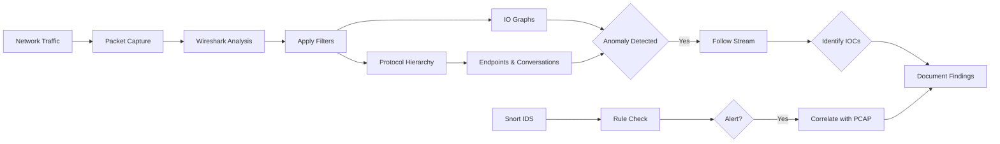
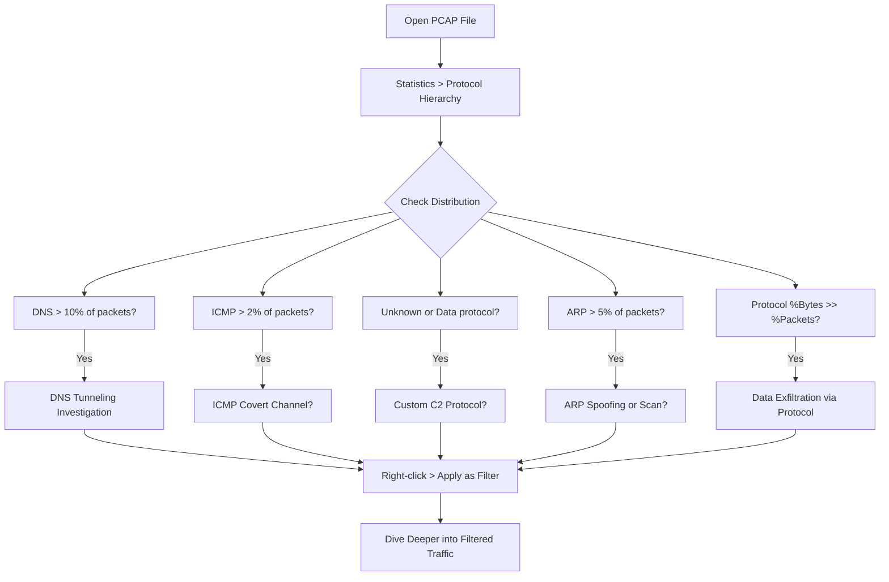

# Protocol Hierarchy Statistics

## TCM Exam Objectives

Before taking the PSAA exam, you must be able to:

- Apply Wireshark capture filters (BPF) and display filters to isolate relevant traffic
- Navigate the Wireshark UI including Packet List, Packet Details, and Packet Bytes panes
- Use Statistics features (Endpoints, Conversations, Protocol Hierarchy, I/O Graph) for triage
- Follow HTTP, DNS, and TCP streams to extract payload evidence
- Detect and analyze malware beaconing activity using I/O Graphs
- Identify command and control (C2) traffic through protocol and behavioral analysis
- Detect data exfiltration patterns including DNS tunneling and volumetric transfers
- Analyze suspicious DNS queries for DGA, tunneling, and domain fronting indicators

Protocol Hierarchy Statistics reveal the DNA of a packet capture. It answers "What's happening in this PCAP?" in under 60 seconds by showing a tree-structured breakdown of every protocol in the capture, with packet counts, byte counts, and percentages.

- Opening and interpreting the Protocol Hierarchy window
- Normal vs. suspicious protocol distributions
- Identifying covert channels, exfiltration, lateral movement, and malware beacons
- Using Protocol Hierarchy as a rapid triage tool

## What Is Protocol Hierarchy?

**Access:** Statistics > Protocol Hierarchy

Each row represents a protocol with parent-child relationships (e.g., IP contains TCP, which contains HTTP). For each protocol, it shows packets, bytes, and bit rate.

### Column Breakdown

| Column | Meaning | Security Relevance |
|--------|---------|-------------------|
| Protocol | Protocol name, nested under parent | Look for unrecognized protocols |
| Percent Packets | % of total packets containing this protocol | Compare with % Bytes for anomalies |
| Packets | Absolute number of packets | See how many frames per protocol |
| Percent Bytes | % of total bytes for this protocol | Large %Bytes but small %Packets = large payloads |
| Bytes | Total bytes including headers | Quantify volume per protocol |
| Bits/s | Average bit rate | Abnormal sustained rates = exfiltration |
| End Packets / End Bytes | Where this protocol was the final dissector | Large discrepancy = encapsulation (IP-in-IP, GRE tunnels) |

## Normal Protocol Distributions

A typical enterprise PCAP:

- **Ethernet** � 100%
- **IPv4** � ~95-99%
- **TCP** � ~70-90%
- **TLS/SSL** � often 50%+
- **HTTP/HTTP2** � variable
- **DNS** � usually 2-5% of packets
- **UDP** � <10% (mostly DNS, NTP, SNMP, QUIC)
- **ICMP/ICMPv6** � <1%
- **ARP** � minimal (<1%)



## Suspicious Protocol Patterns

| Suspicious Pattern | Possible Attack | Why |
|-------------------|----------------|-----|
| High ICMP (20%+) | ICMP tunnelling, ping sweep, Smurf amplification | Normal ICMP is <1% |
| High DNS (>10% packets or large bytes) | DNS tunnelling / exfiltration | Typical DNS is small queries |
| Unusual protocols at top level (GRE, IPv6 when not deployed) | Tunnelling, hidden VPNs, covert C2 | Attackers wrap traffic in protocols IDS may not inspect |
| ARP >5% | ARP scanning, spoofing, MITM | ARP should be minimal |
| "Data" or "Unknown" protocol | Custom C2 protocol, encrypted binary channel | Wireshark couldn't decode the payload |
| IRC (Internet Relay Chat) | C2 communication, botnet commands | Rare in corporate traffic |
| Telnet, FTP, SMTP (clear-text) | Data exfiltration, credential theft | Clear-text on non-standard ports |
| SMB/CIFS on non-standard port or high volume | Lateral movement, ransomware spread | Web server talking SMB is a red flag |
| IPv6 traffic when not using IPv6 | IPv6 tunnels, C2 hidden in extension headers | IPv6 often bypasses security controls |

?? **Exam Tip:** Correlate across multiple data sources. A suspicious IP address in network traffic is stronger evidence when confirmed by Windows Event Log ID 4625 (failed logon) or EDR process telemetry.

?? **Exam Tip:** On the PSAA exam, always document your analysis methodology step-by-step in the incident report. Include timestamps, source/destination IPs, and the specific evidence that supports your conclusion.

## Step-by-Step Investigation

### Scenario: PCAP from a suspected breached host

1. **Open Statistics > Protocol Hierarchy.** Notice:
   - IPv4: 100%, TCP: 85%, UDP: 15%
   - TCP children: TLS 40%, HTTP 10%, **IRC 2%**, **Unassigned port 4444 5%**
   - UDP children: DNS 8%, **TFTP 1%**

2. **Interpret:**
   - IRC appears � highly unusual. Right-click > Apply as Filter > Selected. See commands: `!shell`, `@login`. Confirmed C2.
   - Unassigned port 4444: right-click and filter. Large data transfers with `[PSH, ACK]` flags. Exfiltration.
   - TFTP: rarely legitimate; filter to see file transfer of a password dump.

3. **Use % Bytes column:** DNS is 8% of packets but 30% of bytes � much higher than expected. Filter DNS, inspect lengths: many 500-byte TXT responses. DNS tunnelling.

### Spotting Covert Channels

**HTTP with Huge % Bytes:** If HTTP shows 10% packets but 80% bytes, check for large file transfers or data exfil. Apply `http.content_type` filter or Follow HTTP Stream.

**DNS with High End Bytes:** Normal DNS queries are small (<100 bytes). If bytes-per-packet is high, filter `dns.qry.type == 16` (TXT) and check for base64-like strings.

**Non-Standard Ports with Recognizable Protocols:** The hierarchy might list "HTTP" under TCP even on port 4444 if payload matches. Large "Data" section under TCP suggests custom C2 protocol.

**Protocol inside Protocol (Encapsulation):** If you see "IP" as a child of "IP" or "GRE" at the top level, attackers may be using IP-in-IP tunnels � a huge red flag in a standard corporate environment.

<details>
<summary>?? TShark Protocol Hierarchy Automation</summary>

```bash
tshark -r capture.pcap -q -z io,phs
```

Output:
```
eth                                            frames:10000 bytes:6500000
  ip                                           frames:9800 bytes:6400000
    tcp                                        frames:9000 bytes:6200000
      http                                     frames:1500 bytes:5000000
      tls                                      frames:4000 bytes:1000000
      irc                                      frames:200 bytes:120000
    udp                                        frames:800 bytes:200000
      dns                                      frames:800 bytes:200000
  arp                                          frames:200 bytes:100000
```

Use `grep`/`awk` to script IOC extraction.
</details>

## Summary Cheat Sheet

| You See | It Could Mean | Next Action |
|---------|---------------|-------------|
| ICMP >2% | ICMP tunnelling, ping sweep | Filter `icmp`, check lengths |
| DNS >10% packets or large bytes | DNS exfiltration | Filter `dns`, look for TXT/long queries |
| ARP >5% | ARP scanning/spoofing | Check duplicate IPs, gateway MAC changes |
| Uncommon protocols (IRC, Telnet, TFTP, DCE/RPC) | Malicious C2, lateral movement | Filter and follow streams |
| "Data" or "Unknown" on a port | Custom C2, encrypted tunnel | Follow stream, check for beaconing |
| High-byte protocols relative to packet count | File transfer, exfiltration | Export objects, check endpoints |
| Nested IP (IP inside IP) | VPN, tunnelling | Filter `ip.proto == 4` |

## PSAA Exam Traps

- Percentages don't add up to 100% � each protocol counts all packets that contain it
- A protocol may be small in % but malicious (low-volume, long-duration beacons)
- Always expand all subtrees � malicious protocols might be nested deep
- Wireshark might decode traffic on port 4444 as "HTTP" if it starts with `GET` � check manually
- If ARP is 20% of packets, it could be misconfigured device, but in an exam it's likely MITM

## Recap

- Protocol Hierarchy is the quickest way to understand what's in a PCAP
- Read the tree from top to bottom; expand every subtree
- Use packet count vs. byte count to spot exfiltration � disproportionately high bytes are suspicious
- Right-click any protocol to Apply as Filter and dive deeper
