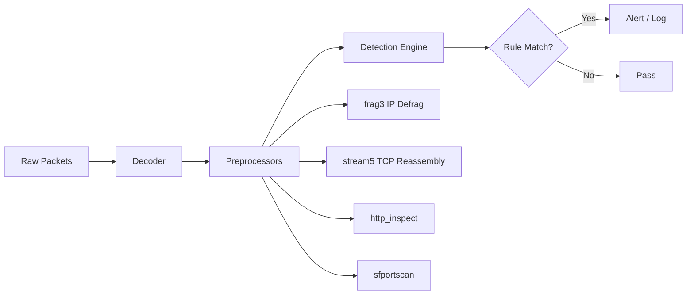
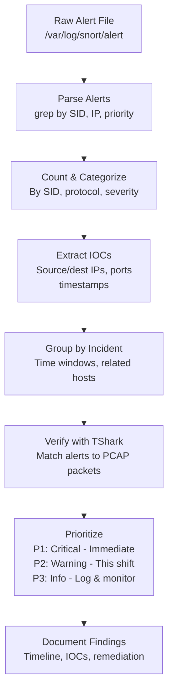

# Analyzing Snort Alert Logs

## TCM Exam Objectives

Before taking the PSAA exam, you must be able to:

- Distinguish between Sniffer, Packet Logger, and NIDS modes and their use cases
- Configure Snort configuration files including snort.conf and local.rules
- Write Snort rules with proper rule header and rule options syntax
- Tune and test Snort rules to reduce false positives while maintaining detection
- Write detection rules for common attack patterns (recon, exploit, C2, malware delivery)
- Run Snort in IDS mode and interpret alert output formats
- Analyze Snort alert logs to extract IOCs and prioritize incidents
- Correlate Snort alerts with PCAP data for full incident reconstruction

Snort generates a wealth of alert data, but raw alerts are just noise until you analyze and correlate them. This module covers navigating the Snort alert log, extracting actionable IOCs, grouping related alerts into incidents, and using TShark to verify payload matches.

- The alert file format (fast vs. full vs. unified2)
- Analyzing fast alerts for triage and prioritization
- Extracting IOCs: SIDs, source/dest IPs, timestamps, payloads
- Alert correlation: grouping related alerts into incidents


## Alert File Format

### Fast Alert

```
[**] [1:1000001:1] SQL injection attempt - ' OR 1=1 [**]
[Priority: 1]
03/21-15:30:45.123456 192.168.1.105:54321 -> 10.0.0.1:80
TCP TTL:64 TOS:0x0 ID:54321 IpLen:20 DgmLen:1450 DF
```

Components:
- **[**]** indicates start of alert
- **[GID:SID:Rev]** � Generator ID (always 1 for rules), Signature ID, Revision
- **Message** � content of `msg:` field from rule
- **[Priority: N]** � 1 (critical), 2 (warning), 3 (informational)
- **Timestamp** � GMT/UTC unless configured otherwise
- **SRC -> DST** � source IP:port to destination IP:port
- **Protocol details** � TTL, TOS, IP ID, datagram length, DF flag

### Full Alert

```
[**] [1:1000001:1] SQL injection attempt - ' OR 1=1 [**]
[Priority: 1]
03/21-15:30:45.123456 192.168.1.105:54321 -> 10.0.0.1:80
TCP TTL:64 TOS:0x0 ID:54321 IpLen:20 DgmLen:1450 DF
TCP Options => MSS: 1460, WS: 8, TS: 123456789, NOP, SackOK
+-+-+-+-+-+-+-+-+-+-+-+-+-+-+-+-+-+-+-+-+-+-+-+-+-+-+-+-+-+-+
| 47 45 54 20 2F 61 64 6D 69 6E 2E 61 73 70 3F 75 | GET /admin.asp?u|
| 73 65 72 3D 31 27 20 4F 52 20 31 3D 31 20 2D 2D | ser=1' OR 1=1 --|
+-+-+-+-+-+-+-+-+-+-+-+-+-+-+-+-+-+-+-+-+-+-+-+-+-+-+-+-+-+-+
```

Full alerts include the hex dump + ASCII translation of the matching packet payload.

### Unified2 Format

Binary format designed for **Barnyard2** � a spooling system that reads unified2 files and pushes alerts to a database (MySQL, PostgreSQL). The command to read:

```bash
u2boat -t fast /var/log/snort/snort.u2 /tmp/alerts.txt
```

## Alert Analysis Workflow

### Step 1: Navigate to Alert File

```bash
ls /var/log/snort/alert

tail -n 50 /var/log/snort/alert

tail -f /var/log/snort/alert
```

### Step 2: Count and Categorize Alerts

**Count by SID:**
```bash
grep -oP '\[1:\d+:\d+\]' /var/log/snort/alert | sort -u
```

**Count by protocol:**
```bash
grep -oP '\{TCP\}|\{UDP\}|\{ICMP\}' /var/log/snort/alert | sort -u
```

**Count by priority:**
```bash
grep -oP '\[Priority:' /var/log/snort/alert | sort -u
```

### Step 3: Extract IOCs

```bash
grep -oP '\d+\.\d+\.\d+\.\d+:\d+ ->' /var/log/snort/alert | sed 's/:[0-9]* ->//' | sort -u

grep -oP '-> \d+\.\d+\.\d+\.\d+' /var/log/snort/alert | sed 's/-> //' | sort -u
```

### Step 4: Group Alerts by Incident


## Alert Correlation with TShark


```bash
tail -n 5 /var/log/snort/alert

tshark -r /var/log/snort/snort.log -Y "ip.src==192.168.1.105 and ip.dst==10.0.0.1 and tcp.port==80"

tshark -r /var/log/snort/snort.log -Y "ip.src==192.168.1.105" -x | grep "1' OR 1=1"
```

## Analyzing Large Alert Volumes

When Snort generates thousands of alerts in minutes:

| Metric | High Alert Volume | Low Alert Volume |
|--------|-------------------|------------------|
| Likely cause | Port scan, worm propagation, false positive rule | Targeted exploit, true positive |
| First action | Check for `sfportscan` alerts in log | Examine individual alerts |
| Filter by SID | If all alerts are SID X, disable/tune that rule | Keep rule enabled |
| Filter by source | If all from one IP, check if it's a scanner | Investigate IP |

?? **Exam Tip:** On the PSAA exam, always document your analysis methodology step-by-step in the incident report. Include timestamps, source/destination IPs, and the specific evidence that supports your conclusion.

?? **Exam Tip:** Correlate across multiple data sources. A suspicious IP address in network traffic is stronger evidence when confirmed by Windows Event Log ID 4625 (failed logon) or EDR process telemetry.


## Alert Tuning Decision Matrix

```bash

grep "sid:1000001" /var/log/snort/alert | head -n 10

systemctl restart snort
```

## Common Alert Interpretation Patterns

| Alert Pattern | Likely Scenario | Action |
|---------------|-----------------|--------|
| Multiple sources, same rule (port scan) | Internal or external scanner | Block source IP, report |
| Single source, multiple rules | Compromised host, multi-stage attack | Isolate host, full investigation |
| Single source, single rule, many times | Failed exploit attempt (worm) | Check if target is vulnerable |
| Random timing, few alerts | Targeted, patient attacker | High priority investigation |
| Exactly repeating intervals | Beaconing / C2 | Check destination IP blocklist |

## Important Alert File Analysis Queries

```bash
grep -oP '\[1:\d+:\d+\]' /var/log/snort/alert | sed 's/\[1:\([0-9]*\):[0-9]*\]/\1/' | sort -unr | head -n 5

grep "03/21-" /var/log/snort/alert | grep "15:30:"

grep "Priority: 1" /var/log/snort/alert | grep -oP '\d+\.\d+\.\d+\.\d+:\d+ -> \d+\.\d+\.\d+\.\d+' | sort -u
```

## PSAA Exam Traps

- **The alert file is APPEND-ONLY.** It never rotates by itself. In long-running captures, `/var/log/snort/alert` can grow to gigabytes.
- **Alert timestamps are UTC by default.** If the exam shows a log from 03:00 UTC but the workstation showed activity at 11:00 local, check timezone difference.
- **SID:GID:Rev format:** `[1:1000001:1]` � Generator 1 rules, SID 1000001, Revision 1. Second number is always the SID.



 

 
## Recap

- The alert file is the primary output for analysis � structured into header lines (metadata) and payload lines (hex dump)
- Fast alerts are one-line summaries suitable for high-volume triage; full alerts include packet payload for forensic verification
- Count, categorize, and group alerts by SID, source IP, and time windows to form incident hypotheses
- Extract IOCs (IPs, ports, SIDs) from alert file for blocklist creation and further investigation


