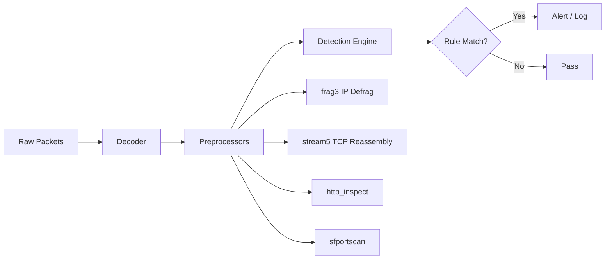

# Correlating Alerts with PCAP Data

## TCM Exam Objectives

Before taking the PSAA exam, you must be able to:

- Map Snort alert metadata (timestamp, source IP, destination IP, GID:SID) to specific packets in a PCAP
- Use TShark display filters to extract the exact packets that triggered a Snort rule
- Follow TCP streams with TShark to reconstruct full conversations around Snort alerts
- Use Snort unified2 logs and convert them to readable formats with Barnyard2
- Correlate multiple Snort alerts with PCAP analysis to build a timeline-based incident reconstruction
- Apply Snort's config rules and tested rule groups to reduce false positives in correlation
- Examine payload content around matched patterns to confirm malicious intent
- Document correlation findings in a structured incident report with packet-level evidence

Snort alerts tell you a rule matched, but the alert alone doesn't reveal the full story. Correlating alerts with raw PCAP data gives you the context to understand the attack � the full TCP conversation, the payload around the matched content, and the broader traffic pattern.

- Mapping Snort alerts to specific packets in the PCAP
- Using TShark to find the exact traffic that triggered an alert
- Reconstructing the full conversation around an alert
- Building timeline-based incident reconstructions


## The Correlation Workflow


### Step 1: Extract Alert Metadata

From a Snort alert:
```
[**] [1:1000001:1] Possible SQL injection - OR 1=1 [**]
[Priority: 1]
03/21-15:30:45.123456 192.168.1.105:54321 -> 10.0.0.1:80
```

Extract:
- Timestamp: `03/21-15:30:45.123456`
- Source IP:Port: `192.168.1.105:54321`
- Dest IP:Port: `10.0.0.1:80`
- SID: `1000001`

### Step 2: Find the Packet in PCAP

**By timestamp (most precise):**
```bash
tshark -r capture.pcap -Y "frame.number == 12345" -x
```

Better approach � use TShark's `-Y` filter with src/dst IP and port:
```bash
tshark -r capture.pcap -Y "ip.src==192.168.1.105 and ip.dst==10.0.0.1 and tcp.port==80 and tcp.payload" -x | head -n 50
```

**For binary PCAP logged by Snort:**
```bash
tshark -r /var/log/snort/snort.log -Y "ip.src==192.168.1.105"
```

### Step 3: Extract the Payload

```bash
tshark -r capture.pcap -Y "ip.src==192.168.1.105 and ip.dst==10.0.0.1" -x

tshark -r capture.pcap -Y "ip.src==192.168.1.105 and ip.dst==10.0.0.1" -T fields -e tcp.payload | head -n 1
```

### Step 4: Reconstruct the Full Conversation

```bash
tshark -r capture.pcap -Y "ip.addr==192.168.1.105 and ip.addr==10.0.0.1" -T fields -e tcp.stream | sort -u

tshark -r capture.pcap -q -z follow,tcp,ascii,5
```

(Where `5` is the TCP stream number from previous command.)

### Step 5: Correlate Multiple Alerts

```
Alert A (15:30:00): NULL scan from 203.0.113.5 -> 192.168.1.105
Alert B (15:30:05): SMB write attempt from 203.0.113.5 -> 192.168.1.105
Alert C (15:30:10): Meterpreter C2 from 192.168.1.105 -> 203.0.113.5
Alert D (15:30:45): SQL injection from 192.168.1.105 -> 10.0.0.1
```

Timeline: Recon (A) ? Attack (B) ? C2 Install (C) ? Lateral Movement (D).

## TShark Correlation Cheat Sheet

| Objective | TShark Command |
|-----------|---------------|
| Find packet by alert timestamp | `tshark -r capture.pcap -Y "frame.time_relative > 300 and frame.time_relative < 301"` |
| Show all traffic between two IPs | `tshark -r capture.pcap -Y "ip.addr==192.168.1.105 and ip.addr==10.0.0.1"` |
| Find TCP stream number | `tshark -r capture.pcap -Y "ip.addr==A and ip.addr==B" -T fields -e tcp.stream \| sort -u` |
| Follow stream as ASCII | `tshark -r capture.pcap -q -z follow,tcp,ascii,STREAM_NUM` |
| Show hex payload of specific frame | `tshark -r capture.pcap -Y "frame.number == 12345" -x` |
| Extract HTTP request URI | `tshark -r capture.pcap -Y "ip.addr==A and ip.addr==B and http.request" -T fields -e http.request.uri` |

## Binary vs. ASCII Log Correlation


| Log Method | Alert Available | Packet Available | Correlation |
|------------|----------------|-----------------|-------------|
| Text alert + binary PCAP | `cat /var/log/snort/alert` | `tshark -r /var/log/snort/snort.log -Y "ip.addr==IP"` | Most flexible |
| Text alert only | Yes | No | Metadata only |
| Full alert | Yes | Hex dump in alert | Payload visible in alert |
| Console alert | stdout only | No | Debugging only |

?? **Exam Tip:** On the PSAA exam, always document your analysis methodology step-by-step in the incident report. Include timestamps, source/destination IPs, and the specific evidence that supports your conclusion.

?? **Exam Tip:** Always save a copy of the original evidence before performing any analysis. Reference specific packet numbers, event IDs, and timestamps to demonstrate thorough investigation.


## Full Incident Reconstruction Example

```
Scenario: Snort IDS monitoring a web server
Alert triggered: SID 1000005 (SQL injection via URL parameter)
```

**Step 1:** Extract from alert file:
```
[**] [1:1000005:1] SQL injection via URL parameter [**]
[Priority: 1]
06/15-14:22:33.456789 185.220.101.45:54321 -> 10.0.0.5:80
```

**Step 2:** Find the TCP stream:
```bash
tshark -r webserver.pcap -Y "ip.addr==185.220.101.45 and ip.addr==10.0.0.5" -T fields -e tcp.stream | sort -u
```
Output: `3`

**Step 3:** Follow full conversation:
```bash
tshark -r webserver.pcap -q -z follow,tcp,ascii,3
```

Output shows attacker's full HTTP request with SQL injection, then the server's 500 error response, and subsequent requests.

**Step 4:** Check for lateral movement:
```bash
tshark -r webserver.pcap -Y "ip.src==10.0.0.5 and tcp.dstport==445" -T fields -e ip.dst | sort -u
```

Shows the victim web server trying SMB connections to internal hosts � lateral movement.

## Snort Logging Configuration for Correlation

To ensure maximum correlation capability, configure Snort to log both alerts AND binary PCAP:

```bash
output alert_fast: /var/log/snort/alert
output log_tcpdump: /var/log/snort/snort.log
```

Then run:
```bash
snort -c /etc/snort/snort.conf -i eth0 -l /var/log/snort
```

This gives you both `alert` (text) and `snort.log` (binary) for full correlation.

## Automated Correlation Scripting

```bash
grep "Priority: 1" /var/log/snort/alert | grep -oP '\d+\.\d+\.\d+\.\d+:\d+ ->' | sed 's/:[0-9]* ->//' | sort -u > critical_sources.txt

while IFS= read -r src; do
    tshark -r /var/log/snort/snort.log -Y "ip.src==$src" -T fields -e ip.dst | sort -u | while IFS= read -r dst; do echo "$src -> $dst"; done
done < critical_sources.txt
```

## PSAA Exam Traps

- **The Snort alert timestamp differs from the PCAP timestamp if Snort re-processes PCAP.** When using `snort -r file.pcap`, the alert timestamp reflects the time of analysis, not original capture.
- **`snort.log` is binary pcap.** You cannot `cat` it. Always use `tshark -r` or `tcpdump -r` to read it.
- **Alert payload hex is only first ~1500 bytes.** For longer conversations, use Follow Stream instead.
- **Unified2 format needs Barnyard2.** Cannot be read with TShark directly. Use `u2boat` to convert.




```mermaid
flowchart TD
    ALERT[Snort Alert Triggers\nGID:SID:Rev + IP:Port] --> EXTRACT[Extract Metadata\ntimestamp, src/dst IP, port]
    EXTRACT --> FIND[Locate in PCAP\ntshark -r capture.pcap\n-Y \"ip.addr==IP\"]
    FIND --> STREAM[Identify TCP Stream\ntshark -Y \"ip.addr==A and ip.addr==B\"\n-T fields -e tcp.stream]
    STREAM --> FOLL[Follow Full Conversation\ntshark -q -z follow,tcp,ascii,N]
    FOLL --> TIMELINE[Build Attack Timeline\nAlert sequence → Incident narrative]
    TIMELINE --> VERDICT{Malicious?}
    VERDICT -->|Yes| INCIDENT[Escalate - Full IR]
    VERDICT -->|No| TUNE[Tune Rule - Reduce FP]
```

> **Cross-reference:** For Wireshark-based packet analysis and stream following techniques used after alert correlation, see Chapter 4.1 — Following HTTP, DNS, and TCP Streams. For TShark CLI equivalents of Wireshark operations, see Chapter 4.1 — Capture and Display Filters. For Snort rule writing that generates the alerts being correlated, see Chapter 4.2 — Writing Rules for Common Attack Patterns.

## Recap

- Snort alerts provide the trigger; PCAP data provides the full context
- Extract timestamp, source, destination from alerts; use TShark filters to find matching packets
- Follow TCP Stream to reconstruct the full attack conversation
- Multiple alerts from different rules for the same traffic flow strengthen the malicious verdict


