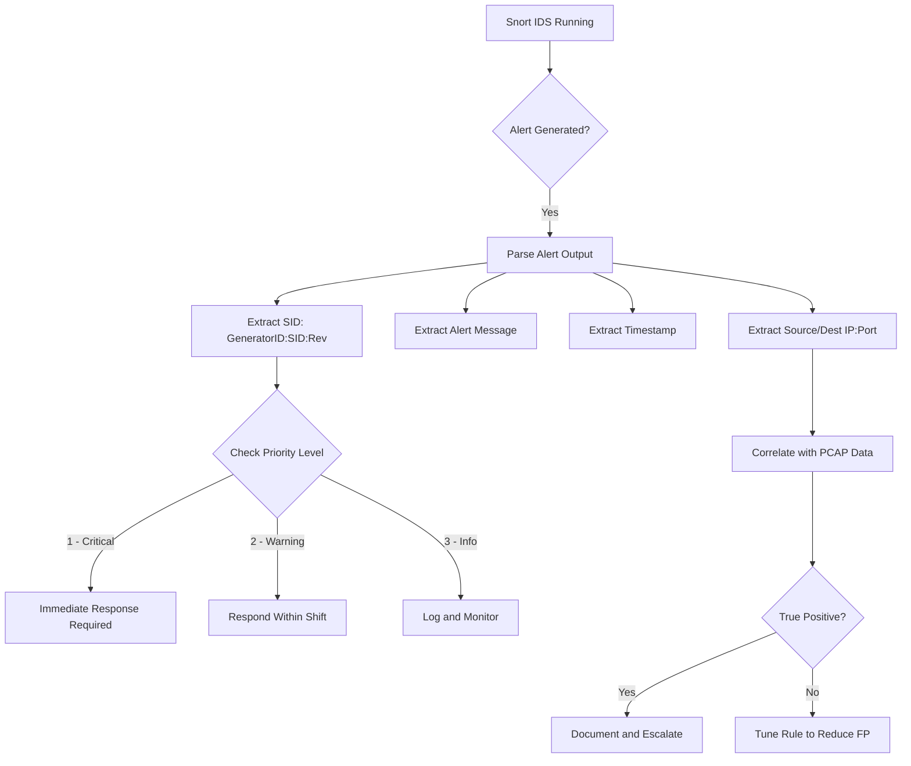

# Running Snort in IDS Mode

## TCM Exam Objectives

Before taking the PSAA exam, you must be able to:

- Distinguish between Sniffer, Packet Logger, and NIDS modes and their use cases
- Configure Snort configuration files including snort.conf and local.rules
- Write Snort rules with proper rule header and rule options syntax
- Tune and test Snort rules to reduce false positives while maintaining detection
- Write detection rules for common attack patterns (recon, exploit, C2, malware delivery)
- Run Snort in IDS mode and interpret alert output formats
- Analyze Snort alert logs to extract IOCs and prioritize incidents
- Correlate Snort alerts with PCAP data for full incident reconstruction

Running Snort in IDS mode activates the full detection engine against live traffic or PCAP files. This module covers the complete workflow: starting Snort, verifying it's running, reading alerts, and integrating with output modules.

- Starting Snort in IDS mode with proper configuration
- Verification and monitoring of the Snort process
- Alert output formats (fast, full, console, syslog, unified2)
- Snort as a background service with daemon mode


## Starting Snort in IDS Mode

### Minimum Viable Command

```bash
snort -c /etc/snort/snort.conf -i eth0
```

This starts Snort with the config file on interface `eth0`. Alerts go to default location `/var/log/snort/alert`.

### Common IDS Commands

```bash
snort -c /etc/snort/snort.conf -i eth0 -A fast -l /var/log/snort -b

snort -c /etc/snort/snort.conf -i eth0 -A console

snort -c /etc/snort/snort.conf -r capture.pcap -l /var/log/snort

snort -c /etc/snort/snort.conf -i eth0 -D -l /var/log/snort -u snort -g snort
```

## Understanding IDS Mode Output

When Snort starts in IDS mode, it outputs:

```
Running in IDS mode

        --== Initializing Snort ==--
Initializing Output Plugins!
Log directory = /var/log/snort

        --== Initialization Complete ==--

   ,,_     -*> Snort! <*-
  o"  )~   Version 2.9.20 GRE (Build X)
   ''''    By Martin Roesch & The Snort Team: http://www.snort.org/contact#team
           Copyright (C) 2014-2024 Cisco and/or its affiliates. All rights reserved.
           Copyright (C) 1998-2013 Sourcefire, Inc., et al.
           Using libpcap version 1.10.3
           Using PCRE version: 8.45
           Using ZLIB version: 1.2.13

Commencing packet processing (pid=12345)
```

Key items to verify:
- `Running in IDS mode` � confirms NIDS mode activated
- `Log directory = /var/log/snort` � alerts going here
- `pid=12345` � process ID for monitoring/killing
- No errors listed (missing preprocessors, invalid rules)

## Alert Output Formats

### Fast Alerts

```
[**] [1:1000001:1] SQL injection attempt - ' OR 1=1 [**]
[Priority: 1]
03/21-15:30:45.123456 192.168.1.105:54321 -> 10.0.0.1:80
TCP TTL:64 TOS:0x0 ID:54321 IpLen:20 DgmLen:1450 DF
```

Format: `[GeneratorID:SID:Rev] Message [Priority: N] Timestamp SRC:Port -> DST:Port Protocol Details`

### Full Alerts

Includes everything from fast alert plus:

```
TCP Options => MSS: 1460, WS: 8, TS: 123456789, NOP, SackOK
+-+-+-+-+-+-+-+-+-+-+-+-+-+-+-+-+-+-+-+-+-+-+-+-+-+-+-+-+-+-+
| 47 45 54 20 2F 61 64 6D 69 6E 2E 61 73 70 3F 75 | GET /admin.asp?u|
| 73 65 72 3D 31 27 20 4F 52 20 31 3D 31 20 2D 2D | ser=1' OR 1=1 --|
+-+-+-+-+-+-+-+-+-+-+-+-+-+-+-+-+-+-+-+-+-+-+-+-+-+-+-+-+-+-+
```

### Console Alerts

Same as fast format but printed to stdout (not file). Used for debugging.

### Syslog Alerts

```
Mar 21 15:30:45 snort[12345]: [1:1000001:1] SQL injection attempt - ' OR 1=1 [Priority: 1] {TCP} 192.168.1.105:54321 -> 10.0.0.1:80
```

## Post-Startup Verification

### Check Snort Is Running

```bash
ps aux | grep "snort"
```
or
```bash
pgrep -a snort
```

### Check Alert File

```bash
tail -f /var/log/snort/alert
```

### Check Log Files

```bash
ls /var/log/snort/
```

### Check Process Statistics

```bash
snort -c /etc/snort/snort.conf -T 2>&1 | grep "Snort successfully"
```

Or check `/var/log/snort/` for Snort's internal stats on shutdown.

## Running as a Daemon


```
snort -c /etc/snort/snort.conf -i eth0 -D -l /var/log/snort -u snort -g snort
```

Flags:
- `-D` � Fork to background
- `-u snort` � Drop root privileges to `snort` user
- `-g snort` � Drop root group to `snort` group

Verification:
```bash
ps aux | grep "snort"
tail -f /var/log/snort/alert
```

?? **Exam Tip:** Master the difference between capture filters and display filters. Capture filters (BPF) discard at kernel level; display filters only hide packets. Use capture filters for large PCAPs to reduce file size before analysis.

?? **Exam Tip:** Correlate across multiple data sources. A suspicious IP address in network traffic is stronger evidence when confirmed by Windows Event Log ID 4625 (failed logon) or EDR process telemetry.


## Analyzing PCAP Files with IDS Mode

```bash
snort -c /etc/snort/snort.conf -r suspicious.pcap -l /var/log/snort -A console
```

This replays the PCAP through Snort's detection engine. Every matching rule fires an alert to console.

Good for:
- Testing new rules against known malicious traffic
- Retrospective analysis of old PCAPs with new rules
- Validating detection before deployment

## Snort Alert Severity

Generated rules use `priority` field:

| Priority | Meaning | Response Time |
|----------|---------|---------------|
| 1 | Critical (exploit, C2, data exfil) | Immediate |
| 2 | Warning (scan, recon, policy violation) | Within shift |
| 3 | Informational (port sweep, unusual protocol) | Log and monitor |

## Integration Firewall (iptables/nftables)

For inline IPS mode (dropping packets):

```bash
iptables -A FORWARD -j NFQUEUE --queue-num 0

snort -c /etc/snort/snort.conf -Q --daq nfq -i eth0:eth1
```

Note: `-Q` enables inline mode. Without `-Q`, Snort stays in IDS mode (alert only, no blocking).

## Systemd Integration

```bash
systemctl start snort

systemctl enable snort

systemctl status snort
```

## Shutdown

```bash
kill -SIGINT <PID>

kill -SIGTERM <PID>

systemctl stop snort

pkill snort
```

## PSAA Exam Traps

- **`-r` reads PCAP, does NOT monitor interface.** These are mutually exclusive. `snort -r file.pcap -i eth0` ignores `-i`.
- **Daemon mode requires log directory to exist.** If `/var/log/snort/` doesn't exist, Snort starts but logs nothing.
- **Privilege separation arguments must be valid user/group.** `-u snort -g snort` fails if `snort` user doesn't exist.
- **IDC mode and IDS mode are different.** This page covers IDS mode. IDC (inline) mode uses `-Q` flag with `NFQUEUE`.

 
```mermaid
flowchart TD
    START[Start Snort] --> CFG{Config Ready?}
    CFG -->|snort.conf exists| VALIDATE[Validate Config\nsnort -c snort.conf -T]
    CFG -->|No config| SETUP[Create snort.conf\nDefine HOME_NET, rules, output]
    VALIDATE --> OK{Valid?}
    OK -->|Yes| RUN[Run Snort IDS\nsnort -c snort.conf -i eth0\n-l /var/log/snort -A fast]
    OK -->|No| DEBUG[Fix Errors\nCheck syntax, variables]
    RUN --> MODE{[Alert Output Mode]}
    MODE --> FAST[-A fast: One-line summary]
    MODE --> FULL[-A full: Alerts + hex dump]
    MODE --> CONSOLE[-A console: stdout]
    MODE --> DAEMON[-D: Background service]
    FAST --> MONITOR[Monitor Alerts\ntail -f /var/log/snort/alert]
    FULL --> MONITOR
    DAEMON --> MONITOR
    MONITOR --> ANALYZE[Analyze & Respond]
```
  


## Recap

- Snort IDS mode = `snort -c /etc/snort/snort.conf -i eth0`
- Always verify with `tail -f /var/log/snort/alert`
- Fast alerts are one-line summaries; full alerts include hex dumps of matching packets
- Daemon mode (`-D`) runs Snort in background with privilege separation (`-u snort -g snort`)
