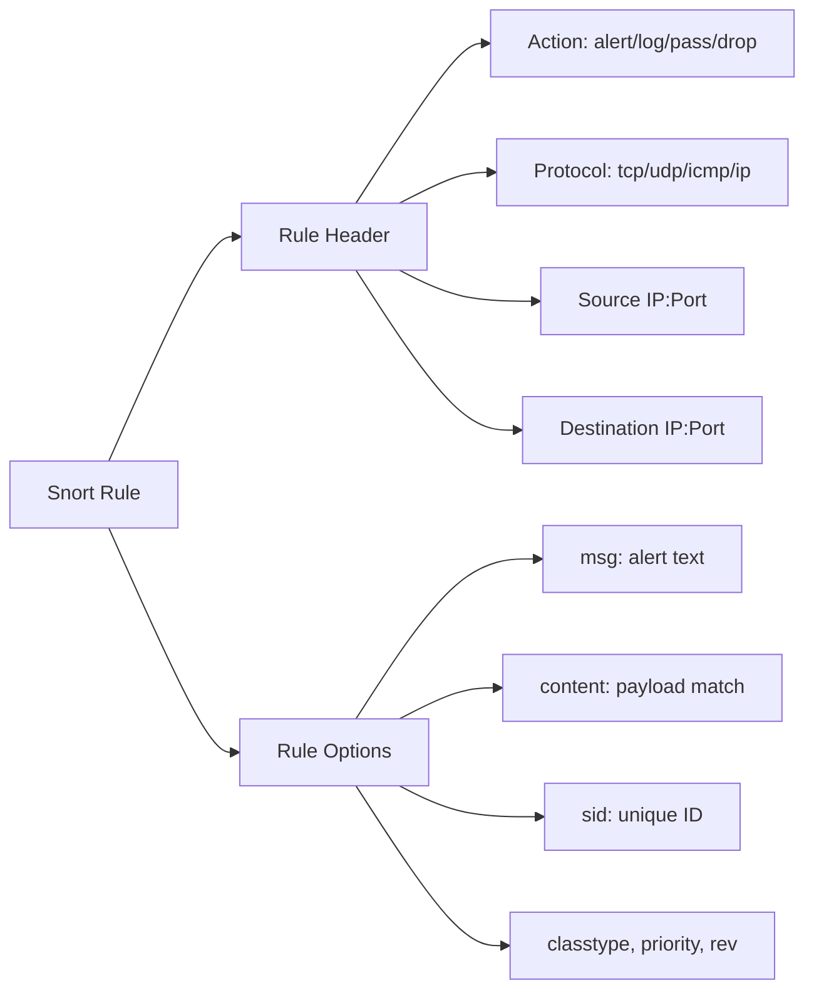
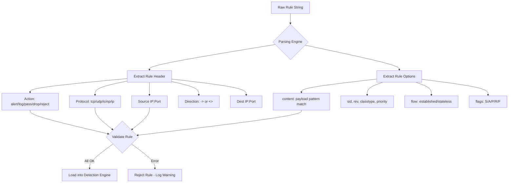

# Rule Anatomy Rule Header and Rule Options

## TCM Exam Objectives

Before taking the PSAA exam, you must be able to:

- Distinguish between Sniffer, Packet Logger, and NIDS modes and their use cases
- Configure Snort configuration files including snort.conf and local.rules
- Write Snort rules with proper rule header and rule options syntax
- Tune and test Snort rules to reduce false positives while maintaining detection
- Write detection rules for common attack patterns (recon, exploit, C2, malware delivery)
- Run Snort in IDS mode and interpret alert output formats
- Analyze Snort alert logs to extract IOCs and prioritize incidents
- Correlate Snort alerts with PCAP data for full incident reconstruction

Every Snort rule is a single-line detection signature. Understanding the rule header and rule options is the foundation of writing, reading, and tuning Snort rules for the PSAA exam.

- Rule header: action, protocol, source, destination
- Rule options: keywords, modifiers, and payload matching
- The `sid`, `rev`, `classtype`, and `priority` metadata fields
- Writing rules that match specific attack patterns


## Rule Syntax

```
[action] [protocol] [source IP] [source port] -> [dest IP] [dest port] ( [options] )
```

## The Rule Header

### Action

| Action | Behavior | Use Case |
|--------|----------|----------|
| `alert` | Generate alert, then log packet | General detection |
| `log` | Log packet without alert | Passive monitoring |
| `pass` | Ignore packet, no alert | Whitelisting / noise suppression |
| `drop` | Block packet (inline mode only) | IPS deployments |
| `reject` | Block packet + send RST/ICMP unreachable to sender | Active blocking |
| `sdrop` | Drop without logging | Stealth blocking |

### Protocol

`tcp`, `udp`, `icmp`, `ip`. Most rules target `tcp`.

### Source and Destination

```
alert tcp $HOME_NET any -> $EXTERNAL_NET $HTTP_PORTS
```

| Component | Description | Example |
|-----------|-------------|---------|
| Source IP | `$HOME_NET`, `$EXTERNAL_NET`, `any`, specific IP/CIDR | `192.168.1.0/24` |
| Source Port | Number, range, variable, or `any` | `1024:` (1024 and above) |
| Direction | `->` (one-way), `<>` (bidirectional), `|>` (stateless) | `->` |
| Dest IP | Same as source IP | `!$HOME_NET` |
| Dest Port | Same as source port | `80` |

### Direction Operator

| Operator | Meaning |
|----------|---------|
| `->` | Source to destination only (most common) |
| `<>` | Both directions (bidirectional) � for C2 detection |
| `|>` | Stateless direction (rare, used with `stream5` disabled) |

## Rule Options

Options are enclosed in parentheses, separated by semicolons.

```
(msg:"Alert message"; content:"attack payload"; nocase; sid:1000001; rev:1;)
```

### Required Metadata Options

| Option | Description | Example |
|--------|-------------|---------|
| `msg` | Alert text displayed in output | `msg:"Possible SQL Injection";` |
| `sid` | Unique Snort rule ID (< 100 = internal, 1000000+ = local) | `sid:1000001;` |
| `rev` | Rule revision number (increment on update) | `rev:1;` |

### Content Matching Options

| Option | Description | Example |
|--------|-------------|---------|
| `content` | Match string or hex in payload | `content:"|DE AD BE EF|";` |
| `nocase` | Case-insensitive content match | `content:"cmd.exe"; nocase;` |
| `rawbytes` | Match raw bytes before normalization | `content:"|0D 0A|"; rawbytes;` |
| `depth` | Max bytes from packet start to search | `content:"GET"; depth:3;` |
| `offset` | Bytes from packet start to begin search | `content:"User-Agent"; offset:50;` |
| `distance` | Bytes after previous content match to begin search | `content:"login:"; content:"password"; distance:0;` |
| `within` | Max bytes between current and previous content match | `content:"a"; content:"b"; within:10;` |

### Detection Options

| Option | Description |
|--------|-------------|
| `pcre` | Perl-compatible regular expression in payload |
| `flow` | Match STATE (to_server, from_server, established, stateless) |
| `flags` | Match specific TCP flags (S, A, P, R, F, U) |
| `sameip` | Source IP equals destination IP (land attack detection) |
| `dsize` | Match packet payload size |
| `itype` / `icode` | Match ICMP type and code |
| `ttl` | Match IP TTL value |
| `tos` | Match IP type of service |
| `id` | Match IP fragment ID |
| `ipopts` | Match IP options (SSRR, LSRR, Record Route) |

### IP/TCP Options

```bash
alert tcp any any -> any any (flags:S; msg:"SYN packet"; sid:100;)

alert tcp any any -> any any (flags:SA; msg:"SYN-ACK packet"; sid:101;)

alert ip any any -> any any (dsize:>1000; msg:"Large packet"; sid:102;)
```

## Example Rules


### Rule 1: Detect HTTP GET Request to cmd.exe

```
alert tcp $HOME_NET any -> $EXTERNAL_NET $HTTP_PORTS (
    msg:"GET request for cmd.exe from internal host";
    content:"GET";
    content:"cmd.exe";
    nocase;
    sid:1000001;
    rev:1;
    priority:1;
)
```

### Rule 2: Detect DNS TXT Query (Tunneling Indicator)

```
alert udp $HOME_NET any -> any 53 (
    msg:"Possible DNS tunneling - TXT query";
    content:"|00 10|"; depth:2; offset:12;
    sid:1000002;
    rev:1;
)
```

### Rule 3: Detect Nmap NULL Scan

```
alert tcp any any -> $HOME_NET any (
    msg:"Nmap NULL scan detected";
    flags:0;
    flow:stateless;
    sid:1000003;
    rev:1;
    classtype:attempted-recon;
)
```

### Rule 4: Detect Outbound to Known-Bad IP

```
alert tcp $HOME_NET any -> 203.0.113.45 any (
    msg:"Traffic to known malicious IP";
    sid:1000004;
    rev:1;
)
```

?? **Exam Tip:** On the PSAA exam, always document your analysis methodology step-by-step in the incident report. Include timestamps, source/destination IPs, and the specific evidence that supports your conclusion.

?? **Exam Tip:** Master the difference between capture filters and display filters. Capture filters (BPF) discard at kernel level; display filters only hide packets. Use capture filters for large PCAPs to reduce file size before analysis.


## SID Convention

| SID Range | Purpose |
|-----------|---------|
| < 100 | Reserved for internal Snort use |
| 100-1,000,000 | Community/registered rule sets |
| 1,000,000+ | Local rules (local.rules) |

## Flow Option

```
flow:[to_client|to_server|from_client|from_server|established|stateless]
```

| Value | Meaning |
|-------|---------|
| `to_server` | Packet from client to server (based on src/dst) |
| `from_server` | Packet from server to client |
| `established` | Only match packets in established TCP connection |
| `stateless` | Match regardless of connection state |

Best practice: Always use `flow:established,to_server` for application-layer rules.

## Flags Option

```
flags:[S|A|P|R|F|U|C|E|0|1|2];
```

| Flag | Value | Description |
|------|-------|-------------|
| S | 2 | SYN |
| A | 16 | ACK |
| P | 8 | PSH |
| R | 4 | RST |
| F | 1 | FIN |
| U | 32 | URG |
| C | 64 | CWR |
| E | 128 | ECE |
| 0 | N/A | No flags set (NULL scan) |

## PSAA Exam Traps

- **Semicolons terminate options.** Every option must end with `;` including the last one.
- **SID must be unique.** Running Snort with duplicate SIDs causes `Duplicate sid` warnings � second rule with same SID is ignored.
- **Content matching is case-sensitive by default.** Always add `nocase;` unless exact case match is required.
- **Flags are case-sensitive.** `flags:S` is SYN; `flags:s` is invalid.
- **Direction matters.** `->` triggers on source-to-destination traffic only; `<>` triggers on both.
- **`content:"";`** with empty string matches all packets � avoid unless deliberately used.
- **`flow` must be used with TCP rules.** Without `flow:established`, Snort matches TCP rules against handshake packets.






## Recap

- Every rule has two parts: **header** (action, protocol, source, dest) and **options** (detection and metadata)
- `alert` action generates alerts; `pass` suppresses matches; `drop` blocks (inline only)
- `content` is the primary payload matching keyword; use `nocase`, `depth`, `offset` to refine
- `sid` must be unique (1000000+ for local rules); `sid:0` is invalid
