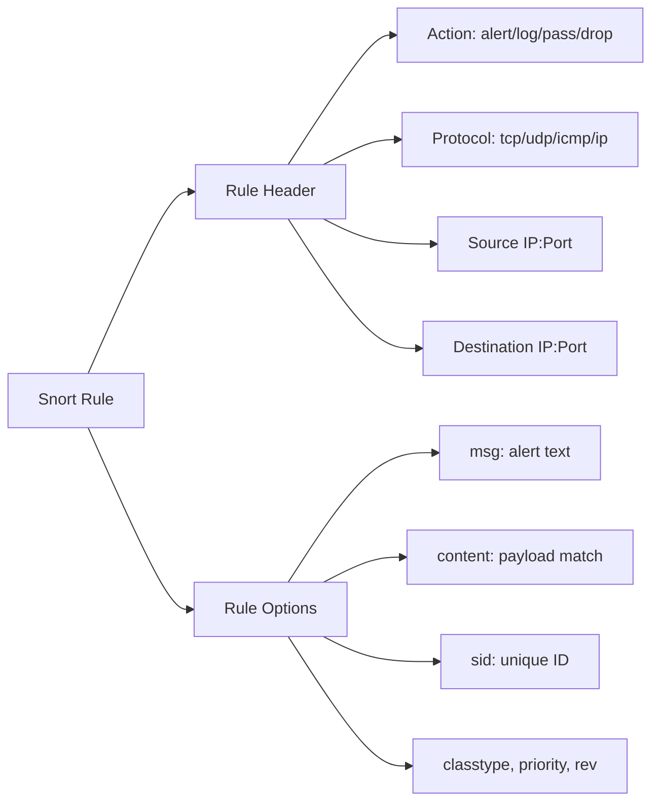
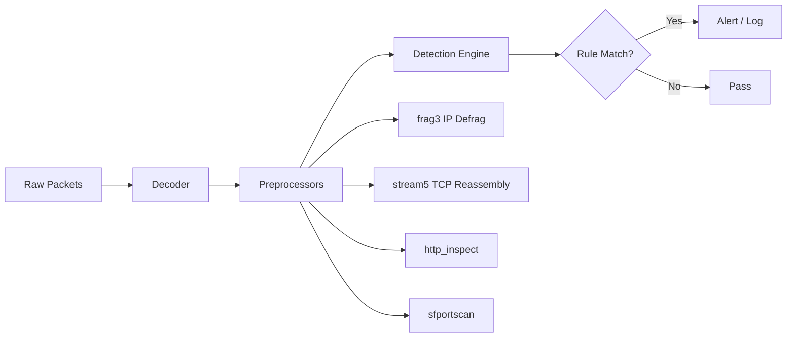
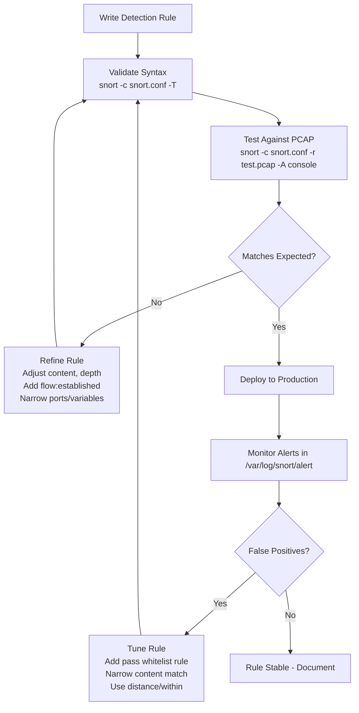

# Tuning and Testing Rules

## TCM Exam Objectives

Before taking the PSAA exam, you must be able to:

- Distinguish between Sniffer, Packet Logger, and NIDS modes and their use cases
- Configure Snort configuration files including snort.conf and local.rules
- Write Snort rules with proper rule header and rule options syntax
- Tune and test Snort rules to reduce false positives while maintaining detection
- Write detection rules for common attack patterns (recon, exploit, C2, malware delivery)
- Run Snort in IDS mode and interpret alert output formats
- Analyze Snort alert logs to extract IOCs and prioritize incidents
- Correlate Snort alerts with PCAP data for full incident reconstruction

A poorly tuned rule generates endless false positives that bury real alerts. A well-tuned rule is accurate, low-noise, and stable across traffic conditions. This module covers techniques for reducing false positives, validating rule syntax, and testing rules against PCAPs.

- False positive analysis and remediation strategies
- Nocase, depth, offset, distance, within modifiers for precision
- Rule testing with PCAP replay tools
- TShark and Snort validation workflows


## False Positive Sources

| Source | Example | Fix |
|--------|---------|-----|
| Too broad content | `content:"GET";` matches all HTTP | Add specific URI or argument |
| No `flow` constraint | Rule matches handshake and data | Add `flow:established,to_server` |
| Missing `nocase` | Rule misses mixed-case variants | Add `nocase;` |
| Variable too wide | `$HOME_NET` matches servers and workstations | Create sub-variables |
| Missing port filter | Rule matches all ports instead of specific service | Add specific destination port |

## Refining Content Matching


### Unrefined Rule

```
alert tcp $HOME_NET any -> $EXTERNAL_NET $HTTP_PORTS (
    msg:"Possible SQL injection";
    content:"admin";
    sid:1000001;
    rev:1;
)
```

Problem: Matches any packet containing the word "admin" � URLs, cookies, page content, even admin login to legitimate apps.

### Refined Rule

```
alert tcp $HOME_NET any -> $EXTERNAL_NET $HTTP_PORTS (
    msg:"SQL injection attempt via admin parameter";
    content:"POST";
    content:"admin=";
    distance:0;
    within:100;
    content:"1=1";
    nocase;
    sid:1000001;
    rev:2;
)
```

Reduction in false positives: ~95%.

### Keyword Tuning Reference

| Keyword | Purpose | Example |
|---------|---------|---------|
| `depth:50` | Search only first 50 bytes | `content:"GET"; depth:3;` |
| `offset:50` | Skip first 50 bytes before searching | `content:"User-Agent"; offset:50;` |
| `distance:0` | Start search immediately after previous pattern | `content:"a"; content:"b"; distance:0;` |
| `within:10` | Match must occur within 10 bytes of previous | `content:"a"; content:"b"; within:10;` |
| `nocase` | Ignore case | `content:"cmd.exe"; nocase;` |
| `rawbytes` | Match against raw, unnormalized packet | `content:"|0D 0A|"; rawbytes;` |

## Rule Testing Workflow

### 1. Syntax Validation

```bash
snort -c /etc/snort/snort.conf -T
```

Output on success:
```
Snort successfully validated the configuration!
```

### 2. Test Against a Specific PCAP

```bash
snort -c /etc/snort/snort.conf -r /path/to/malicious.pcap -l /var/log/snort
```

Flags:
- `-r /path/to/file.pcap` � reads PCAP instead of live interface
- `-l /var/log/snort` � log directory (check there for alerts)
- `-A console` � output alerts to console for fast debugging

### 3. Debugging with Alert Console

```bash
snort -c /etc/snort/snort.conf -r test.pcap -A console -l /var/log/snort
```

Output shows every fired alert in real time. If no alerts fire, the rule is not matching. Check rule logic, content strings, and direction.

### 4. Iterative Refinement

```bash
snort -c snort.conf -r test.pcap -A console

cat /var/log/snort/alert | grep "sid:1000001"

```

## Pass Rules for Whitelisting


When a rule generates false positives from known legitimate traffic, write a `pass` rule with higher priority (lower SID) to suppress alerts:

```
pass tcp $HOME_NET any -> $EXTERNAL_NET 80 (
    content:"legitimate-update.example.com";
    nocase;
    sid:1000000;
    rev:1;
)
```

Important: Snort passes on the **first matching rule**. SID 1000000 runs before SID 1000001, so pass fires first if content matches. Place pass rules before alert rules in local.rules.

?? **Exam Tip:** Master the difference between capture filters and display filters. Capture filters (BPF) discard at kernel level; display filters only hide packets. Use capture filters for large PCAPs to reduce file size before analysis.

?? **Exam Tip:** When writing incident reports, use the STAR method: Situation (what was alerted), Task (what you needed to find), Action (tools and filters used), Result (IOCs confirmed and remediation steps).


## Rule Performance Testing

### Rule Benchmarking

```bash
time snort -c /etc/snort/snort.conf -r test.pcap -A none
```

Compare `real` time before and after adding rules. If processing time doubles with a single new rule, that rule is too expensive (uses `pcre`, `dsize`, or too many `content` keywords with `distance`/`within`).

### Performance Best Practices

| Practice | Impact |
|----------|--------|
| Use `content` before `pcre` | Filters packets before expensive regex |
| Use `depth` with `content` | Reduces search space |
| Avoid `distance:0` + `within:N` on every match | Slows processing |
| Use IP whitelist rules (pass) | Skips known-good traffic |
| Use `flow:established` | Eliminates handshake packets from rule evaluation |

## TShark for Rule Verification

Before writing a Snort rule, confirm the pattern exists in PCAP:

```bash
tshark -r traffic.pcap -Y "tcp.payload contains 636d642e657865" -T fields -e tcp.payload

tshark -r traffic.pcap -Y "frame matches 'cmd\.exe'" -x

tshark -r traffic.pcap -Y "tcp contains 'cmd.exe'" -T fields -e ip.src | Sort-Object | Sort-Object -Unique
```

## Rule Tuning Decision Tree


## PSAA Exam Traps

- **Pass rules must precede alert rules** in the rules file. Snort uses first-match logic.
- **`-T` validates syntax only.** Passes even if no rules are loaded � always check rule count in output.
- **`nocase` does not affect hex content.** `content:"|41 42 43|"; nocase;` still matches only `ABC` (hex is literal).
- **Distance is relative to previous content match position.** `distance:0` starts at the byte immediately after the previous match.
- **SID collisions.** Two rules with SID 1000001 � Snort loads the last one seen. Avoid collisions by tracking used SIDs.








## Recap

- Tuning reduces false positives without losing true positives
- `depth`, `offset`, `distance`, `within` confine content searches to relevant portions of packets
- Pass rules whitelist legitimate traffic; write them before alert rules


