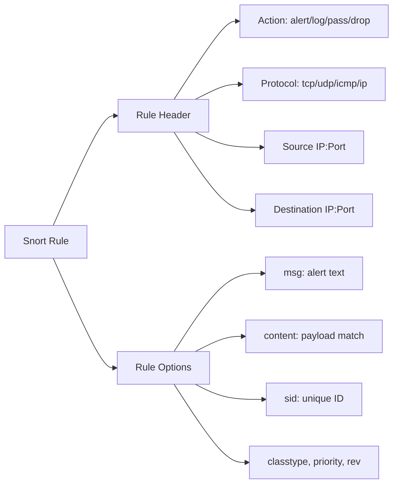
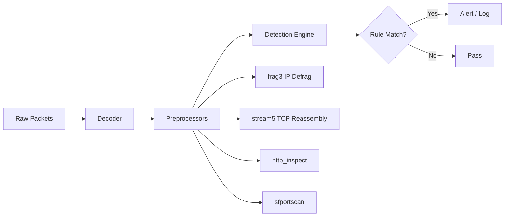
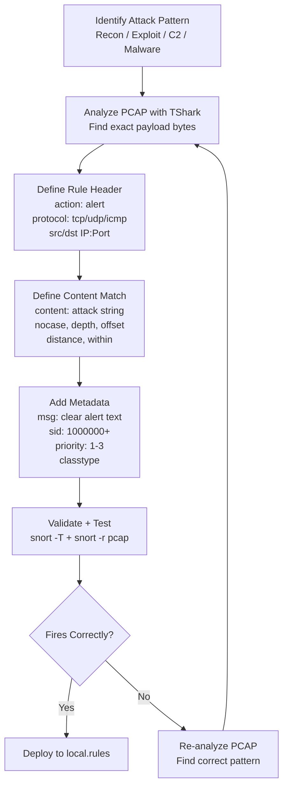

# Writing Rules for Common Attack Patterns

## TCM Exam Objectives

Before taking the PSAA exam, you must be able to:

- Distinguish between Sniffer, Packet Logger, and NIDS modes and their use cases
- Configure Snort configuration files including snort.conf and local.rules
- Write Snort rules with proper rule header and rule options syntax
- Tune and test Snort rules to reduce false positives while maintaining detection
- Write detection rules for common attack patterns (recon, exploit, C2, malware delivery)
- Run Snort in IDS mode and interpret alert output formats
- Analyze Snort alert logs to extract IOCs and prioritize incidents
- Correlate Snort alerts with PCAP data for full incident reconstruction

Writing rules for common attack patterns bridges generic signatures and real-world attack techniques. This module provides templates and approaches for detecting the most frequent attack types you will encounter on the PSAA exam and in SOC operations.

- Reconnaissance detection (port scans, OS fingerprinting, service probes)
- Exploitation detection (SQL injection, buffer overflow, directory traversal)
- C2 and backdoor detection (DNS tunneling, IRC, HTTPS anomalies)
- Malware delivery (drive-by downloads, email attachments, exploit kits)


## Reconnaissance Rules

### Nmap NULL Scan

```
alert tcp any any -> $HOME_NET any (
    msg:"Nmap NULL scan detected";
    flags:0;
    flow:stateless;
    sid:1000001;
    rev:1;
    priority:1;
    classtype:attempted-recon;
)
```

### Nmap FIN Scan

```
alert tcp any any -> $HOME_NET any (
    msg:"Nmap FIN scan detected";
    flags:F;
    flow:stateless;
    sid:1000002;
    rev:1;
)
```

### Nmap XMAS Scan

```
alert tcp any any -> $HOME_NET any (
    msg:"Nmap XMAS scan detected";
    flags:FPU;
    flow:stateless;
    sid:1000003;
    rev:1;
)
```

### SSH Banner Grab

```
alert tcp any any -> $HOME_NET 22 (
    msg:"Possible SSH version grab";
    content:"SSH-";
    depth:5;
    sid:1000004;
    rev:1;
    classtype:attempted-recon;
)
```

## Port Scan Detection with sfportscan

Instead of individual rules, Snort's **sfportscan** preprocessor detects scans across multiple packets:

```
preprocessor sfportscan: \
    proto { all } \
    memcap { 10000000 } \
    sense_level { high } \
    scan_type { all }
```

sfportscan alerts: `portscan` (multiple ports, one IP), `portsweep` (one port, multiple IPs), `decoy_portscan` (spoofed source).

## Exploitation Rules

### SQL Injection

```
alert tcp $EXTERNAL_NET any -> $HTTP_SERVERS $HTTP_PORTS (
    msg:"SQL injection attempt - ' OR 1=1";
    content:"OR 1=1";
    nocase;
    flow:established,to_server;
    sid:1000005;
    rev:1;
)
```

```
alert tcp $EXTERNAL_NET any -> $HTTP_SERVERS $HTTP_PORTS (
    msg:"SQL injection attempt - UNION SELECT";
    content:"UNION";
    content:"SELECT";
    distance:0;
    within:100;
    nocase;
    flow:established,to_server;
    sid:1000006;
    rev:1;
)
```

### Directory Traversal

```
alert tcp $EXTERNAL_NET any -> $HTTP_SERVERS $HTTP_PORTS (
    msg:"Directory traversal attempt - ../";
    content:"../";
    flow:established,to_server;
    sid:1000007;
    rev:1;
)
```

```
alert tcp $EXTERNAL_NET any -> $HTTP_SERVERS $HTTP_PORTS (
    msg:"Directory traversal attempt - windows system";
    content:"..\\";
    content:"windows\\system32";
    distance:0;
    within:50;
    nocase;
    flow:established,to_server;
    sid:1000008;
    rev:1;
)
```

### Cross-Site Scripting (XSS)

```
alert tcp $EXTERNAL_NET any -> $HTTP_SERVERS $HTTP_PORTS (
    msg:"XSS attempt - script tag";
    content:"<script";
    nocase;
    flow:established,to_server;
    sid:1000009;
    rev:1;
)
```

```
alert tcp $EXTERNAL_NET any -> $HTTP_SERVERS $HTTP_PORTS (
    msg:"XSS attempt - event handler";
    content:"onerror=";
    nocase;
    flow:established,to_server;
    sid:1000010;
    rev:1;
)


```

### Buffer Overflow

```
alert tcp $EXTERNAL_NET any -> $HTTP_SERVERS $HTTP_PORTS (
    msg:"Buffer overflow attempt - NOP sled";
    content:"|90 90 90 90 90 90 90 90|";
    sid:1000011;
    rev:1;
)
```

## C2 and Backdoor Rules

### DNS TXT Query (Possible Tunneling)

```
alert udp $HOME_NET any -> any 53 (
    msg:"Possible DNS tunneling - TXT query to external";
    content:"|00 10 00 01|";
    depth:4;
    offset:12;
    sid:1000012;
    rev:1;
)
```

### IRC Join to External Server

```
alert tcp $HOME_NET any -> $EXTERNAL_NET 6667 (
    msg:"Possible IRC botnet - JOIN to external server";
    content:"JOIN #";
    flow:established,to_server;
    sid:1000013;
    rev:1;
)
```

### Meterpreter Payload Detection

```
alert tcp $HOME_NET any -> $EXTERNAL_NET any (
    msg:"Possible Meterpreter C2";
    content:"stage";
    content:"https";
    distance:0;
    within:50;
    nocase;
    sid:1000014;
    rev:1;
)
```

?? **Exam Tip:** Master the difference between capture filters and display filters. Capture filters (BPF) discard at kernel level; display filters only hide packets. Use capture filters for large PCAPs to reduce file size before analysis.

?? **Exam Tip:** Always save a copy of the original evidence before performing any analysis. Reference specific packet numbers, event IDs, and timestamps to demonstrate thorough investigation.


## Malware Delivery Rules

### Executable Download

```
alert tcp $EXTERNAL_NET $HTTP_PORTS -> $HOME_NET any (
    msg:"Possible executable download - MZ header in HTTP response";
    content:"MZ";
    offset:0;
    depth:2;
    flow:established,to_client;
    sid:1000015;
    rev:1;
)
```

### JavaScript Obfuscation

```
alert tcp $EXTERNAL_NET $HTTP_PORTS -> $HOME_NET any (
    msg:"Suspicious JavaScript - eval in HTTP response";
    content:"eval(";
    nocase;
    flow:established,to_client;
    sid:1000016;
    rev:1;
)
```

## Multi-Pattern Rules (Combining Techniques)

For complex attacks, chain multiple `content` matches with relational modifiers:

```
alert tcp $EXTERNAL_NET any -> $HTTP_SERVERS $HTTP_PORTS (
    msg:"Combined SQL injection + dir traversal";
    content:"..\\";
    content:".asp";
    within:50;
    content:"1=1";
    distance:0;
    within:50;
    nocase;
    flow:established,to_server;
    sid:1000017;
    rev:1;
)
```

## Rule Writing Decision Tree


## PSAA Exam Traps

- **Order rules from specific to general.** Specific rules (with more `content` matches) should come before generic ones � Snort first-match logic means specific rules can `alert` before a generic `pass` fires.
- **Test each rule independently.** When writing multiple new rules, test each against a PCAP before combining.
- **Use `classtype` for SIEM correlation.** Proper `classtype` (e.g., `attempted-recon`, `attempted-admin`) feeds security tools correctly.
- **Remember the content hex format.** Hex bytes in `content:"|90 90 90|"` are space-separated. `|909090|` is also valid but less readable.








## Recap

- Recon rules detect the early kill-chain phase: NULL/FIN/XMAS scans, banner grabs, port sweeps
- Exploitation rules detect the attack payload: SQL injection, path traversal, buffer overflow, XSS
- C2 rules detect the channel: DNS tunneling, IRC commands, HTTPS anomalies


