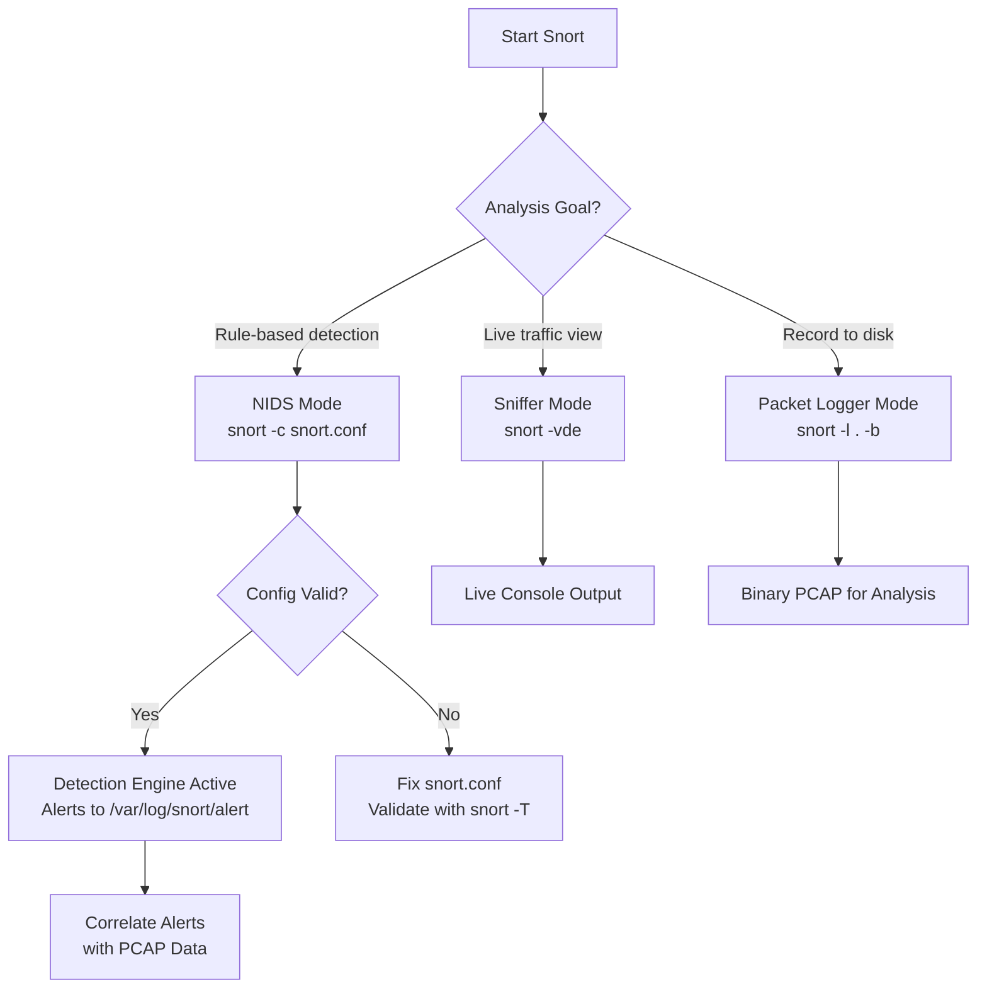
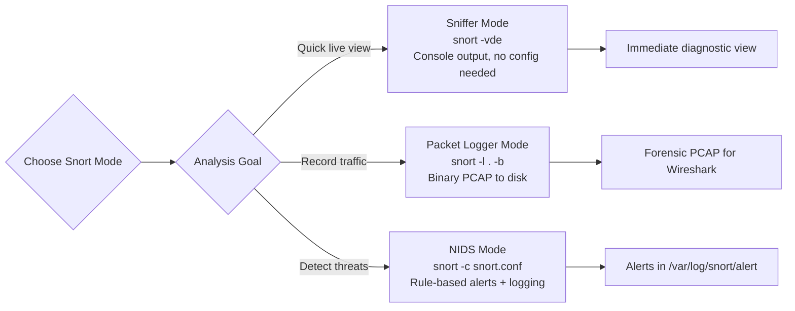

# Sniffer, Packet Logger, and NIDS Modes

## TCM Exam Objectives

Before taking the PSAA exam, you must be able to:

- Apply Berkeley Packet Filter (BPF) syntax to isolate network traffic by host, port, and protocol
- Capture packets to PCAP files using tcpdump with appropriate flags and filters
- Filter traffic by TCP flag combinations (SYN, SYN-ACK, RST, FIN) for attack detection
- Read and interpret tcpdump output including flags, sequence numbers, and options
- Identify anomalous traffic patterns including port scans, DNS tunneling, and beaconing
- Follow TCP streams to reconstruct application-layer conversations
- Analyze specific flag combinations to detect reconnaissance and scanning activity
- Document network forensic findings in a professional incident report

Snort operates in three distinct modes � sniffer, packet logger, and NIDS � each corresponding to a different stage of network security monitoring. The PSAA exam expects you to know how to invoke each mode, what it outputs, and when to use each.

- Sniffer mode: real-time packet display, filtering, and analysis
- Packet logger mode: recording traffic to disk for forensic review
- NIDS mode: rule-based detection, alerting, and blocking


## Sniffer Mode

Sniffer mode reads packets from the network interface and displays them to the console.

### Basic Sniffer Commands

| Command | Behavior |
|---------|----------|
| `snort -v` | Display TCP/IP headers to console |
| `snort -vd` | Display headers + application payload |
| `snort -vde` | Display headers, payload, and data-link layer headers |
| `snort -i eth0` | Specify interface (use `-W` to list interfaces) |

### Practical Usage

```bash
snort -v -i eth0

snort -vd -i eth0

snort -vde -i eth0
```

Press `Ctrl+C` to stop. Snort outputs a summary of packets captured/analyzed.

### PSAA Context: When to Use Sniffer Mode

Sniffer mode is for **quick, on-the-box diagnostics** � capturing traffic without writing a config file. In a PSAA scenario, if you need to see what traffic is currently hitting an interface, sniffer mode is the fastest approach.

## Packet Logger Mode

Packet logger mode writes packets to disk for later analysis. The output directory structure mirrors the packet capture.

### Logger Mode Commands

| Command | Behavior |
|---------|----------|
| `snort -l .` | Log to current directory |
| `snort -l /var/log/snort` | Log to specified directory |
| `snort -l /var/log/snort -K ASCII` | Log in human-readable ASCII format |
| `snort -b` | Log in binary (tcpdump/libpcap) format |

```bash
snort -b -l /var/log/snort

snort -l /var/log/snort -K ASCII
```

### Binary vs. ASCII Logging

| Format | File Extension | Pros | Cons |
|--------|---------------|------|------|
| Binary (`-b`) | `.pcap` | Compressed, Wireshark/tcpdump compatible, fast | Needs Wireshark/tcpdump to read |
| ASCII (`-K ASCII`) | `.ids` | Human-readable immediately | Large file size, slow |

### PSAA Context: When to Use Logger Mode

- **Binary logging** is best for comprehensive forensic capture (open in Wireshark/TShark later)
- **ASCII logging** is for immediate human review of packet/text contents
- Always log in binary format for legal/admissibility purposes

## NIDS Mode


NIDS mode enables Snort's core detection engine against a ruleset.

### NIDS Mode Commands

| Command | Behavior |
|---------|----------|
| `snort -c /etc/snort/snort.conf -i eth0` | Run NIDS on interface with config |
| `snort -c snort.conf -l /var/log/snort` | NIDS with custom log directory |
| `snort -c snort.conf -A fast` | Fast alert output (one-line format) |
| `snort -c snort.conf -A full` | Full alert output (detailed) |
| `snort -c snort.conf -D` | Daemon mode (run as background service) |
| `snort -c snort.conf -u snort -g snort` | Drop privileges to `snort` user/group |

### Alert Mode Options

| Mode | Syntax | Output Format |
|------|--------|---------------|
| Fast | `-A fast` | `[**] [1:1000001:1] msg [**] [Priority: 1] {PROTO} SRC->DST` |
| Full | `-A full` | Fast output + packet headers |
| Console | `-A console` | Fast output to stdout (not syslog) |
| None | `-A none` | Suppress alerts (log only) |
| Unsup/UNIX socket | `-A unsock` | Send alerts to UNIX socket (for custom processing) |

### NIDS Output Location

Alerts go to `/var/log/snort/alert` by default. Packet logs go to `/var/log/snort/`. Files are named by protocol/port combination (e.g., `tcp:80:80`).

### Running Snort as a Daemon

```bash
snort -c /etc/snort/snort.conf -i eth0 -D -l /var/log/snort -u snort -g snort
```

- `-D` forks into background
- `-u` / `-g` drops root privileges after interface initialization (security best practice)
- Always verify with `tail -f /var/log/snort/alert`

?? **Exam Tip:** Master the difference between capture filters and display filters. Capture filters (BPF) discard at kernel level; display filters only hide packets. Use capture filters for large PCAPs to reduce file size before analysis.

?? **Exam Tip:** Always save a copy of the original evidence before performing any analysis. Reference specific packet numbers, event IDs, and timestamps to demonstrate thorough investigation.


## Multi-Mode Combinations

```bash
snort -vde -l /var/log/snort -b

snort -c /etc/snort/snort.conf -l /var/log/snort -b

snort -c /etc/snort/snort.conf -A console -l /var/log/snort -b
```

## Performance Considerations

| Mode | CPU Impact | Disk Impact | Best For |
|------|-----------|-------------|----------|
| Sniffer (`-v`) | High | None | Quick diagnostics |
| Logger ASCII | High | Very High | Audit trails, small captures |
| Logger binary | Low | Low-Medium | Production deployment |
| NIDS + binary log | Medium | Medium | Comprehensive detection + forensics |

## PSAA Exam Traps

- **Sniffer mode does NOT use rules.** `-v` alone bypasses `-c`. If no config is loaded, no alerts fire.
- **`-b` and `-K ASCII` are mutually exclusive.** Binary format captures raw libpcap, ASCII reconstructs packet text. Choose based on need.
- **NIDS mode requires a valid config file.** `snort -c /etc/snort/snort.conf` � if it's missing or malformed, Snort exits immediately.
- **Running raw sniffer as root.** Snort needs root for packet capture. Always use `-u snort -g snort` to drop privileges after initialization.
- **Default log location is /var/log/snort.** Always specify `-l` to ensure logs go where expected.

 

  


## Recap

- Sniffer mode (`-v -d -e`) � live packet dump to console for immediate diagnostic observation
- Packet logger mode (`-l -b -K ASCII`) � packets to disk for forensic analysis in Wireshark/tcpdump
