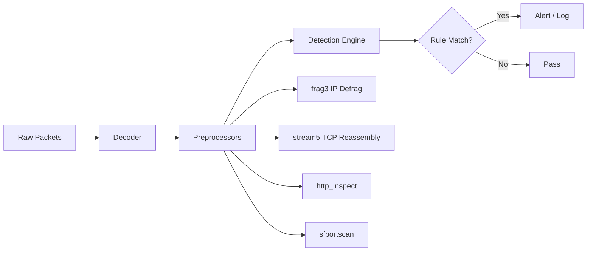
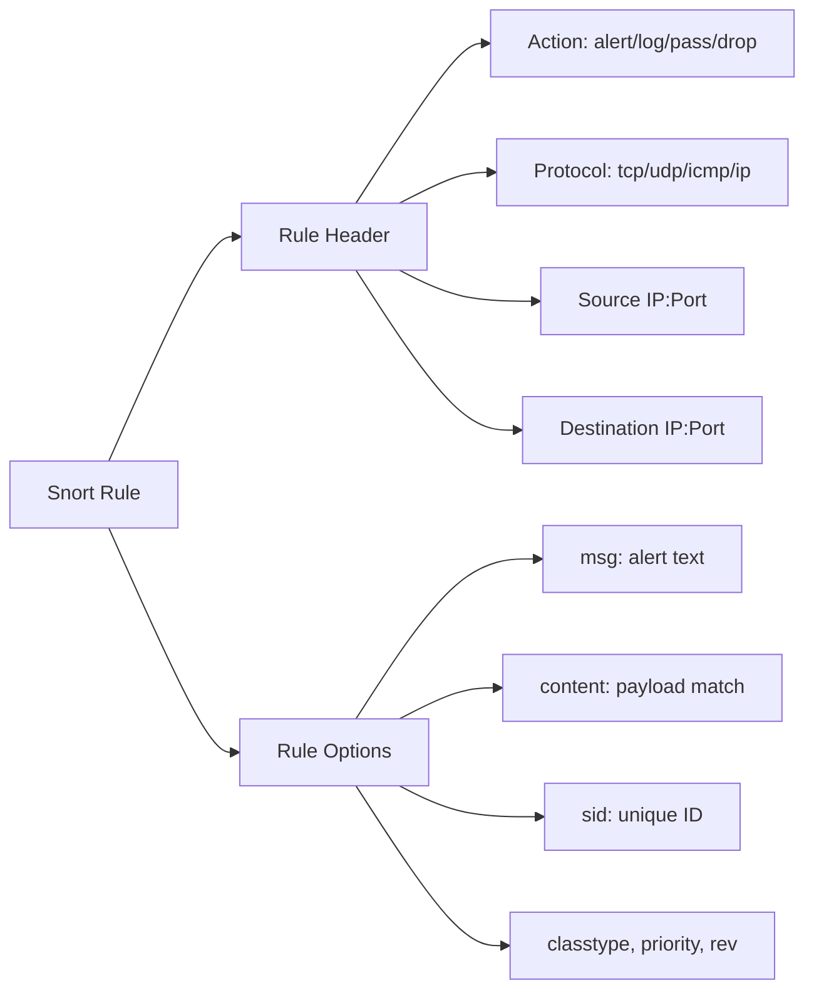
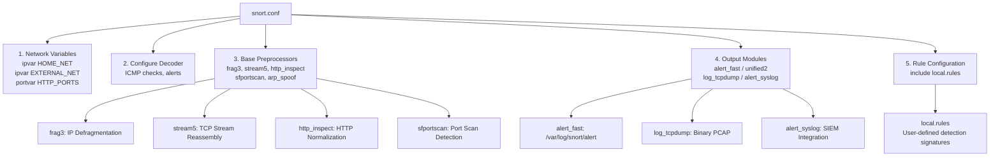

# Snort Configuration Files

## TCM Exam Objectives

Before taking the PSAA exam, you must be able to:

- Apply Berkeley Packet Filter (BPF) syntax to isolate network traffic by host, port, and protocol
- Capture packets to PCAP files using tcpdump with appropriate flags and filters
- Filter traffic by TCP flag combinations (SYN, SYN-ACK, RST, FIN) for attack detection
- Read and interpret tcpdump output including flags, sequence numbers, and options
- Identify anomalous traffic patterns including port scans, DNS tunneling, and beaconing
- Follow TCP streams to reconstruct application-layer conversations
- Analyze specific flag combinations to detect reconnaissance and scanning activity
- Document network forensic findings in a professional incident report

Snort's configuration files define everything about its behavior � what to monitor, how to alert, which rules to load, and how to preprocess traffic. The two critical files are `snort.conf` (the main configuration) and `local.rules` (user-defined rules). Understanding their structure is essential for deploying Snort in any environment.

- The snort.conf file: key sections and their function
- Rule files (local.rules) and the `include` mechanism
- Variables, preprocessors, output modules, and rule configuration
- Essential configuration for PSAA-style deployments


## The snort.conf File

### 1. Network Variables

Variables define IP addresses and ports so rules can reference them dynamically.

```bash
ipvar HOME_NET 192.168.1.0/24

ipvar EXTERNAL_NET !$HOME_NET

ipvar DNS_SERVERS 192.168.1.5
ipvar SMTP_SERVERS 192.168.1.10
ipvar HTTP_SERVERS 192.168.1.0/24
ipvar SQL_SERVERS 192.168.1.15

portvar HTTP_PORTS 80
portvar SHELLCODE_PORTS !80
portvar ORACLE_PORTS 1521
```

| Variable Convention | PSAA Best Practice |
|--------------------|-------------------|
| Always define `HOME_NET` | All internal IP space |
| Set `EXTERNAL_NET` to `!$HOME_NET` | Everything outside your network |
| Define server IPs specifically | Prevents false positives from non-server traffic matching server rules |
| Use `any` cautiously | Only when rule genuinely targets any network |

### 2. Configure Decoder

Turns off ICMP checks, alerts on bad headers, etc. Defaults are fine for PSAA.

### 3. Configure Base Preprocessors

| Preprocessor | Function | PSAA Relevance |
|-------------|----------|----------------|
| `frag3` | IP defragmentation | Detects fragmentation-based evasion |
| `stream5` | TCP stream reassembly | Essential for stateful inspection |
| `http_inspect` | HTTP normalization | Decodes obfuscated HTTP attacks |
| `sfportscan` | Port scan detection | Detects reconnaissance |
| `arp_spoof` | ARP spoof detection | Detects MITM |
| `ssl/tls` | SSL/TLS inspection | Detects TLS anomalies |
| `dcerpc2` | DCE/RPC normalization | Detects SMB exploits |
| `reputation` | IP blocklist filtering | Fast passive block of known-bad IPs |

```bash
preprocessor frag3_global
preprocessor stream5_global
preprocessor http_inspect_server
preprocessor sfportscan
preprocessor arp_spoof
```

### 4. Configure Output Modules

```bash
output alert_fast: /var/log/snort/alert

output unified2: filename snort.u2, limit 128

output log_tcpdump: /var/log/snort/snort.log

output alert_syslog: LOG_AUTH LOG_ALERT
```

| Output Module | Use Case |
|---------------|----------|
| `alert_fast` | Quick human-readable alerts, exam scenarios |
| `unified2` | High-performance production with Barnyard2 |
| `log_tcpdump` | Binary capture for Wireshark analysis |
| `alert_syslog` | Integration with SIEM/Splunk |

### 5. Rule Configuration

```bash
include $RULE_PATH/local.rules

include $RULE_PATH/community.rules

include $RULE_PATH/snort.rules

include $RULE_PATH/emerging-threats.rules
```

## local.rules


This file contains the rules the SOC analyst writes. Located in `/etc/snort/rules/local.rules`.

## Minimal PSAA-Ready snort.conf

```bash
ipvar HOME_NET 192.168.1.0/24
ipvar EXTERNAL_NET !$HOME_NET
portvar HTTP_PORTS 80

config disable_decode_alerts

preprocessor frag3_global
preprocessor stream5_global
preprocessor http_inspect_server

output alert_fast: /var/log/snort/alert
output log_tcpdump: /var/log/snort/snort.log

var RULE_PATH /etc/snort/rules
include $RULE_PATH/local.rules
```

?? **Exam Tip:** When writing incident reports, use the STAR method: Situation (what was alerted), Task (what you needed to find), Action (tools and filters used), Result (IOCs confirmed and remediation steps).

?? **Exam Tip:** Correlate across multiple data sources. A suspicious IP address in network traffic is stronger evidence when confirmed by Windows Event Log ID 4625 (failed logon) or EDR process telemetry.


## Validating Configuration

```bash
snort -c /etc/snort/snort.conf -T

snort -c /etc/snort/snort.conf -T -l /var/log/snort
```

A valid config outputs: `Snort successfully validated the configuration!` with a rules summary (e.g., `149 Snort rules have been loaded`).

## PSAA Exam Traps

- **Order matters.** In snort.conf, variables must be defined before they are used in preprocessor or rule configuration sections.
- **Include order matters.** `include local.rules` must come after variable definitions and output configuration. Snort loads config entries sequentially.
- **Rules without matching variables cause errors.** A rule referencing `$SMTP_SERVERS` that is undefined will cause Snort to fail on startup.
- **local.rules is the default custom rules file,** but technically any file with `.rules` extension can be `include`d. The exam uses `local.rules`.
- **Configuration test (`-T`) does NOT capture traffic.** It validates syntax and exits. Always add `-i <interface>` when running live.
- **Variable names are case-sensitive in older versions** of Snort (2.x). Always use uppercase.

## Common Configuration Mistakes

| Mistake | Consequence | Solution |
|---------|-------------|----------|
| `HOME_NET` set too broad (e.g., 0.0.0.0/0) | All traffic matches home net rules | Set to internal CIDR |
| `EXTERNAL_NET` not set to `!$HOME_NET` | Rules may not match as expected | Use `ipvar EXTERNAL_NET !$HOME_NET` |
| Missing preprocessors | Evasion attacks bypass Snort | Enable frag3, stream5, http_inspect |
| No output module | Alerts generated but not logged | Add `output alert_fast` |
| Rule path undefined | Snort can't find local.rules | Set `var RULE_PATH /etc/snort/rules` |








## Recap

- `snort.conf` is Snort's master configuration � variables, preprocessors, output, rules (in that order)
- `local.rules` contains user-defined detection signatures
- Variables (`HOME_NET`, `EXTERNAL_NET`, port variables) keep rules adaptive to any network
- Preprocessors normalize traffic so rules match correctly (evasion countermeasures)


