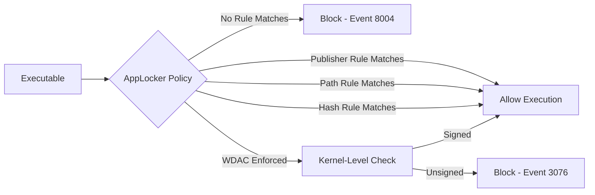
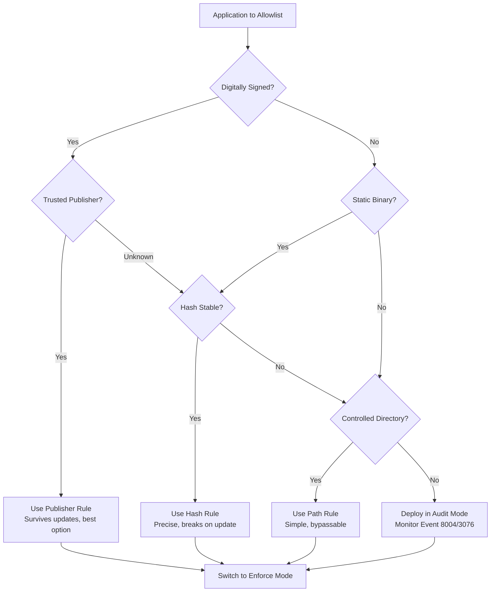

# Application Allowlisting (AppLocker, WDAC)

## TCM Exam Objectives

Before taking the PSAA exam, you must be able to:

- Compare traditional Antivirus (AV) with Endpoint Detection and Response (EDR) capabilities
- Configure and interpret Application Allowlisting using AppLocker and WDAC
- Create and analyze host-based firewall rules (Windows Defender Firewall)
- Examine file system and registry artifacts for forensic evidence of compromise
- Analyze Linux syslog and auth logs for SSH brute force and privilege escalation
- Investigate process and service information to detect malware and persistence
- Query Windows Event Logs (System, Security, Application) for incident detection
- Correlate endpoint telemetry with network evidence for comprehensive incident response

Application allowlisting is a zero-trust security control that says "deny all unless explicitly approved." Unlike AV (which blocks known bad) or EDR (which detects bad behavior), allowlisting enforces a positive security model � only approved executables, scripts, and installers can run.

- AppLocker: Windows built-in allowlisting for executable, script, MSI, and packaged apps
- Windows Defender Application Control (WDAC): kernel-level code integrity for deeper protection
- Differences between AppLocker and WDAC
- Rules types: publisher, path, hash, file attribute


## AppLocker

### Rule Types

AppLocker defines rules for four rule collections:

| Collection | Files Covered | Default Rule |
|------------|---------------|--------------|
| Executable Rules | `.exe`, `.com` | Allow `Program Files`, `Windows`, `BUILTIN\Administrators` |
| Windows Installer Rules | `.msi`, `.msp`, `.mst` | Allow `Program Files`, `Windows`, `BUILTIN\Administrators` |
| Script Rules | `.ps1`, `.vbs`, `.js`, `.bat`, `.cmd` | Allow `Program Files`, `Windows`, `BUILTIN\Administrators` |
| Packaged App Rules | `.appx` | Allow all signed packaged apps |

### Rule Conditions

| Condition | Description | Pros | Cons |
|-----------|-------------|------|------|
| **Publisher** | Matches digital signature publisher | Survives file renames/updates | Requires signed binaries |
| **Path** | Matches file path or folder | Simple to configure | Bypassable by writing to allowed path |
| **File Hash** | Matches specific file hash | Most precise, survives path changes | Rule breaks on file update |
| **File Attribute** | Matches file metadata | Rarely used | Limited applicability |

### PSAA AppLocker Audit Mode

Before enforcing, deploy in **Audit Only** mode:

```bash
Get-AppLockerPolicy

Set-AppLockerPolicy -Policy .\AppLocker.xml -RuleMode Audit

Set-AppLockerPolicy -Policy .\AppLocker.xml -RuleMode Enforce
```

Audit events appear in **Event Viewer > Applications and Services Logs > Microsoft > Windows > AppLocker**.

### Bypass Techniques (PSAA-Relevant)

| Technique | How It Works | Mitigation |
|-----------|-------------|------------|
| **Executable from allowed path** | Drop `.exe` to `C:\Windows\Temp` or user `AppData` | Use publisher rules, not path rules |
| **LOLBins** | Run `rundll32.exe` or `mshta.exe` from `C:\Windows` | WDAC blocks script execution via LOLBins |
| **Renaming** | Rename `malware.exe` to `malware.txt` and run via LOLBin | Script rules block non-.exe execution |
| **DLL Side-Loading** | Plant malicious DLL next to trusted `.exe` | WDAC checks DLL signatures too |


## Windows Defender Application Control (WDAC)

WDAC is a kernel-level code integrity policy that controls what can run at the kernel level � harder to bypass than AppLocker because it operates below user mode.

### WDAC vs. AppLocker

| Feature | AppLocker | WDAC |
|---------|-----------|------|
| Enforcement Level | User mode | Kernel + User mode |
| Configurable via GPO | Yes | Yes |
| Bypass Difficulty | Medium | Very high |
| Policy Format | XML | XML (binary-converted) |
| Managed Installer Support | No | Yes |
| Supported Windows Editions | Enterprise, Education | Enterprise, Education, Server |
| Default on Windows | No | Yes (some SKUs with Memory Integrity) |

### Policy Rules

WDAC policies define trust levels:

| Rule Level | Description | Example |
|------------|-------------|---------|
| **Signed** | Only files signed by trusted publishers | All Microsoft-signed binaries |
| **Managed Installer** | Files installed by ConfigMgr/Intune are trusted | Enterprise software management |
| **Reputable** | Based on Microsoft reputation (cloud) | Common well-known software |
| **Hash** | Specific file hash allowed | Custom in-house tools |
| **File Path** | Files in specific paths allowed (last resort) | Legacy unsigned software |

### WDAC Policy Creation

```bash
New-CIPolicy -FilePath .\DefaultPolicy.xml -UserPEs

ConvertFrom-CIPolicy -XmlFilePath .\DefaultPolicy.xml -BinaryFilePath .\policy.bin

Copy-Item .\policy.bin \\DC\SYSVOL\domain\Policies\{GUID}\Machine\EFI\Microsoft\Boot\Policy.p7b
```

### WDAC Event Logs


WDAC block events are in: **Event Viewer > Applications and Services Logs > Microsoft > Windows > CodeIntegrity > Operational**

| Event ID | Meaning |
|----------|---------|
| 3075 | WDAC policy loaded |
| 3076 | WDAC policy blocked file execution |
| 3089 | WDAC attempted to run unsigned binary |

## AppLocker Event Logs

| Event ID | Meaning |
|----------|---------|
| 8000 | AppLocker policy applied |
| 8003 | Allowed by AppLocker (success audit) |
| 8004 | Blocked by AppLocker |
| 8005 | AppLocker script rule applied |
| 8006 | Packaged app installation blocked |

> **Exam Tip:** When investigating a blocked execution (Event 8004/3076), check the file's origin. Was it downloaded via browser? Dropped by an Office macro? Pivoting to the parent process (Event 4688) reveals the infection vector.

> **Exam Tip:** AppLocker's default rules allow ALL executables in `Program Files` and `Windows` directories. This includes LOLBins like `powershell.exe`, `rundll32.exe`, and `mshta.exe`. Custom deny rules or WDAC are needed to block LOLBin abuse.

> **Exam Tip:** Always deploy allowlisting in Audit Mode first. Monitor Event 8004 (AppLocker) or 3076 (WDAC) for 7-14 days to identify legitimate software that would be blocked before switching to Enforce mode.


## Practical PSAA Scenario

**Scenario: Ransomware dropped to `%APPDATA%`**

| Control | Outcome |
|---------|---------|
| No allowlisting | Ransomware executes, encrypts files |
| AppLocker (path rule) | Allowed if path not enforced; blocked if `%APPDATA%` excluded |
| AppLocker (publisher rule) | Blocked (unsigned or wrong publisher) |
| WDAC | Blocked (unsigned, not managed installer, not reputable) |

**Detection evidence:** Event ID 8004 (AppLocker) or 3076 (WDAC) shows the blocked execution attempt.

## Allowlisting as Defense-in-Depth

| Layer | Technology | What It Blocks |
|-------|-----------|----------------|
| 1 � Perimeter | Firewall, VPN | Network-level access |
| 2 � AV | Signature/Heuristic | Known malware files |
| 3 � Allowlisting | AppLocker / WDAC | Unauthorized executables |
| 4 � EDR | Behavioral detection | Fileless / bypass techniques |
| 5 � Least Privilege | User Account Control | Privilege escalation |

## PSAA Exam Traps

- **AppLocker does NOT block kernel drivers** � only user-mode applications. WDAC is needed for driver control.
- **AppLocker can be bypassed by writing files to allowed paths** unless publisher rules are used.
- **Default AppLocker rules allow everything in `Program Files` and `Windows`** � including LOLBins. Custom rules must explicitly block `cmd.exe`, `powershell.exe`, `wscript.exe` for non-admin users.
- **WDAC policies require reboot** to take effect in enforcement mode.
- **AppLocker audit mode only logs** � use it to test before enforcing.




  


## Recap

- Application allowlisting enforces a positive security model: deny all unless explicitly approved
- AppLocker controls executables, scripts, MSIs, and packaged apps via publisher/path/hash rules
- WDAC provides kernel-level code integrity � harder to bypass than AppLocker
- AppLocker bypasses include LOLBins, path abuse, and DLL side-loading
- Event logs (AppLocker: 8004, WDAC: 3076) record blocked executions � critical forensic evidence
- Allowlisting prevents ransomware and unauthorized software even when AV signatures don't exist
