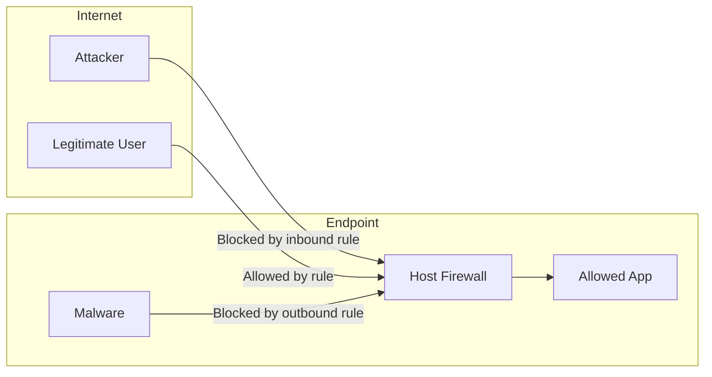
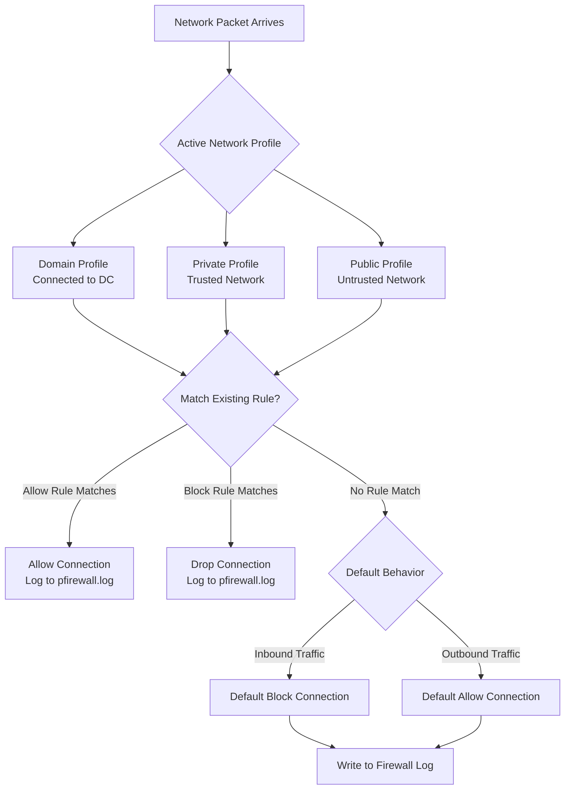

# Host-Based Firewalls

## TCM Exam Objectives

Before taking the PSAA exam, you must be able to:

- Compare traditional Antivirus (AV) with Endpoint Detection and Response (EDR) capabilities
- Configure and interpret Application Allowlisting using AppLocker and WDAC
- Create and analyze host-based firewall rules (Windows Defender Firewall)
- Examine file system and registry artifacts for forensic evidence of compromise
- Analyze Linux syslog and auth logs for SSH brute force and privilege escalation
- Investigate process and service information to detect malware and persistence
- Query Windows Event Logs (System, Security, Application) for incident detection
- Correlate endpoint telemetry with network evidence for comprehensive incident response

A host-based firewall controls traffic to and from a single endpoint, enforcing least-privilege network access even when the perimeter firewall is bypassed. Windows Defender Firewall with Advanced Security is the primary host firewall in Windows environments.

- Windows Defender Firewall: profiles, rules, and logging
- Inbound vs. Outbound rules and their security implications
- Default block vs. default allow strategies
- Using firewall logs for forensic analysis


## Windows Defender Firewall

### Network Profiles

| Profile | When Active | Default Inbound | Default Outbound |
|---------|-------------|-----------------|------------------|
| Domain | Connected to corporate domain controller | Block | Allow |
| Private | User-designated trusted network (home/work) | Block | Allow |
| Public | Public Wi-Fi, untrusted networks | Block | Allow (strictest) |

The active profile is shown in `wf.msc` (Windows Defender Firewall with Advanced Security).

### Rule Types

| Rule Type | What It Filters | Direction |
|-----------|----------------|-----------|
| **Program** | Traffic from a specific executable | Inbound / Outbound |
| **Port** | Traffic on a specific TCP/UDP port | Inbound / Outbound |
| **Predefined** | Rules for built-in Windows roles (File Sharing, Remote Desktop) | Inbound / Outbound |
| **Custom** | Combination of program, port, IP range, protocol, interface | Inbound / Outbound |

### Rule Actions

| Action | Behavior | Use Case |
|--------|----------|----------|
| **Allow the connection** | Permits matching traffic | Legitimate application |
| **Allow the connection if it is secure** | Requires IPsec authentication | Domain-joined, sensitive traffic |
| **Block the connection** | Drops matching traffic | Known-bad application/port |


## Inbound vs. Outbound Rules

### Inbound Rules (Default: Block)

Inbound rules control traffic originating from outside the endpoint. Examples:
- Allow Remote Desktop (TCP/3389) from management jump box
- Block all inbound SMB (TCP/445) except from AD domain controllers

**PSAA scenario:** A host firewall with strict inbound rules prevents an attacker from connecting to a listening service on the compromised endpoint.

### Outbound Rules (Default: Allow)

Outbound rules control traffic originating from the endpoint. Examples:
- Block `powershell.exe` from making outbound connections
- Allow only `svchost.exe` on port 443 for Windows Update
- Block all outbound traffic from `%APPDATA%` executables

**PSAA scenario:** Outbound rules are critical for C2 detection. An EDR + host firewall combination can block `powershell.exe` from establishing outbound connections to unknown IPs.

## Creating Firewall Rules

### GUI: wf.msc

1. Open `wf.msc` (Windows Defender Firewall with Advanced Security)
2. Right-click **Inbound Rules** or **Outbound Rules** > **New Rule**
3. Choose rule type: Program, Port, Predefined, or Custom
4. Set Action: Allow, Block, or Allow if Secure
5. Select Profiles: Domain, Private, Public
6. Name the rule

### PowerShell

```powershell
New-NetFirewallRule -DisplayName "Block malware.exe outbound" `
    -Direction Outbound `
    -Program "C:\Users\Public\malware.exe" `
    -Action Block

New-NetFirewallRule -DisplayName "Allow RDP from admin" `
    -Direction Inbound `
    -Protocol TCP `
    -LocalPort 3389 `
    -RemoteAddress 192.168.1.100 `
    -Action Allow

New-NetFirewallRule -DisplayName "Block Metasploit port" `
    -Direction Outbound `


    -Protocol TCP `
    -RemotePort 4444 `
    -Action Block
```

> **Exam Tip:** The Windows Firewall log (`pfirewall.log`) records dropped connections with `DROP` action. A pattern of `DROP` entries from a single external IP to multiple ports is a definitive port scan indicator.

> **Exam Tip:** Outbound firewall rules are rarely configured by default. In the PSAA exam, look for scenarios where `powershell.exe` or `rundll32.exe` makes outbound connections — a host firewall with outbound rules would have blocked these.

> **Exam Tip:** Firewall rule ordering matters — the first matching rule wins. If you have both an Allow and Block rule for the same program, the one with the highest priority (lowest number) takes effect.


## Firewall Logging for Forensics

### Enabling Logging

```powershell
netsh advfirewall set currentprofile logging filename "%SystemRoot%\System32\LogFiles\Firewall\pfirewall.log"
netsh advfirewall set currentprofile logging maxfilesize 4096
netsh advfirewall set currentprofile logging droppedconnections enable
netsh advfirewall set currentprofile logging allowedconnections enable
```

### Log Format

```
#Version: 1.5
#Software: Microsoft Windows Firewall
#Time Format: Local
#Fields: date time action protocol src-ip dst-ip src-port dst-port size flags tcpflags tcpsyn tcpack tcpwin icmptype icmpcode info path

2024-03-21 15:30:45 DROP TCP 185.220.101.45 192.168.1.105 443 55555 0 S 1248627714 1234356 65535 - - - - - -
2024-03-21 15:30:46 DROP TCP 185.220.101.45 192.168.1.105 443 55556 0 S 1248627715 1234357 65535 - - - - - -
2024-03-21 15:30:47 ALLOW TCP 192.168.1.105 10.0.0.1 54321 443 0 A 1234567 1234567 65535 - - - - - -
```

### Log Field Interpretation

| Field | Value | Meaning |
|-------|-------|---------|
| `DROP` | Action | Packet was blocked by firewall rule |
| `ALLOW` | Action | Packet was permitted by firewall rule |
| `TCP` | Protocol | Transport protocol |
| `185.220.101.45` | src-ip | Source IP address |
| `192.168.1.105` | dst-ip | Destination IP address |
| `S` | tcpflags | SYN flag (new connection attempt) |
| `A` | tcpflags | ACK flag (established connection) |

### PSAA Log Analysis

**Finding a blocked port scan:**
Search for `DROP` entries with `S` (SYN) flag from a single external IP to multiple ports on the endpoint.

```powershell
Get-Content "$env:SystemRoot\System32\LogFiles\Firewall\pfirewall.log" | Where-Object { $_ -match "DROP.*S.*185.220.101.45" }
```

**Finding C2 connections:**
Search for `ALLOW` entries from `powershell.exe` to external IPs on non-standard ports.

## Application-Specific Outbound Blocking

The most effective host firewall strategy for C2 detection is application-specific outbound blocking. Here are critical rules for any Windows environment:

| Application | Risk | Rule |
|-------------|------|------|
| `powershell.exe` | Encoded command downloads + C2 | Block outbound except to Windows Update/CDN |
| `rundll32.exe` | JavaScript/HTML application execution | Block outbound; legitimate use is local only |
| `mshta.exe` | HTA file download + execute | Block outbound; deprecated Microsoft technology |
| `regsvr32.exe` | COM scriptlet download | Block outbound; legitimate use is local only |
| `wmic.exe` | Lateral movement execution | Block outbound; management traffic only |
| `cscript.exe` / `wscript.exe` | Script execution | Block outbound; scripts should not make network calls |
| `certutil.exe` | Malware download tool | Block outbound; use `certutil` for certificate management only |
| `bitsadmin.exe` | BITS job creation | Block outbound; attack tool for stealthy downloads |

**PowerShell deployment of application rules:**

```powershell
# Block powershell.exe outbound (allow only specific IPs)
$rule = @{
    DisplayName = "Block PowerShell outbound except DC"
    Direction = 'Outbound'
    Program = '%SystemRoot%\System32\WindowsPowerShell\v1.0\powershell.exe'
    Action = 'Block'
    RemoteAddress = '0.0.0.0-255.255.255.255'
    Protocol = 'TCP'
}
# Create block rule, then create allow rule for management IPs to override
New-NetFirewallRule @rule

# Block commonly abused LOLBins from outbound traffic
$lolbins = @(
    '%SystemRoot%\System32\rundll32.exe',
    '%SystemRoot%\System32\mshta.exe',
    '%SystemRoot%\System32\regsvr32.exe',
    '%SystemRoot%\System32\certutil.exe',
    '%SystemRoot%\System32\bitsadmin.exe'
)
foreach ($bin in $lolbins) {
    New-NetFirewallRule -DisplayName "Block $bin outbound" -Direction Outbound -Program $bin -Action Block
}
```

> **Cross-reference:** For LOLBin detection via process telemetry, see Chapter 4.3 — Process and Service Information. For identifying the process making suspicious outbound connections, see Chapter 5.1 — Identifying Malicious Processes and Parent-Child Relationships.

## Host Firewall vs. Network Firewall

| Feature | Host Firewall (WF) | Network Firewall |
|---------|-------------------|------------------|
| Scope | Single endpoint | Entire network segment |
| Visibility | Per-application, per-user | IP/port/protocol only |
| Bypass | Must compromise endpoint | Must traverse network perimeter |
| Default posture | Block inbound, allow outbound | Block all, allow specific |
| Management | GPO, Intune, local | Centralized appliance |
| Detection | Application-aware | Flow-based |

## PSAA Exam Traps

- **Default outbound is ALLOW.** Most Windows deployments never configure outbound rules. Attackers exploit this for C2.
- **Firewall rules are process-aware.** A rule blocking `malware.exe` can be bypassed by renaming the executable. Use path or hash rules for stronger control.
- **Disabled rules are still present.** They just have `Enabled:False`. Disabled rules remain in the policy and can be enabled.
- **Logs rotate.** Default max log size is 4MB. For forensic purposes, ensure logs are large enough or forwarded to a SIEM.




  


## Recap

- Host-based firewalls provide per-endpoint network access control as a defense-in-depth layer
- Windows Firewall uses three profiles (Domain, Private, Public) with different default behaviors
- Inbound rules are blocked by default; outbound rules are allowed by default � configure outbound rules for C2 prevention
- Firewall logs (`pfirewall.log`) record dropped and allowed connections with timestamps, IPs, ports, and process paths
