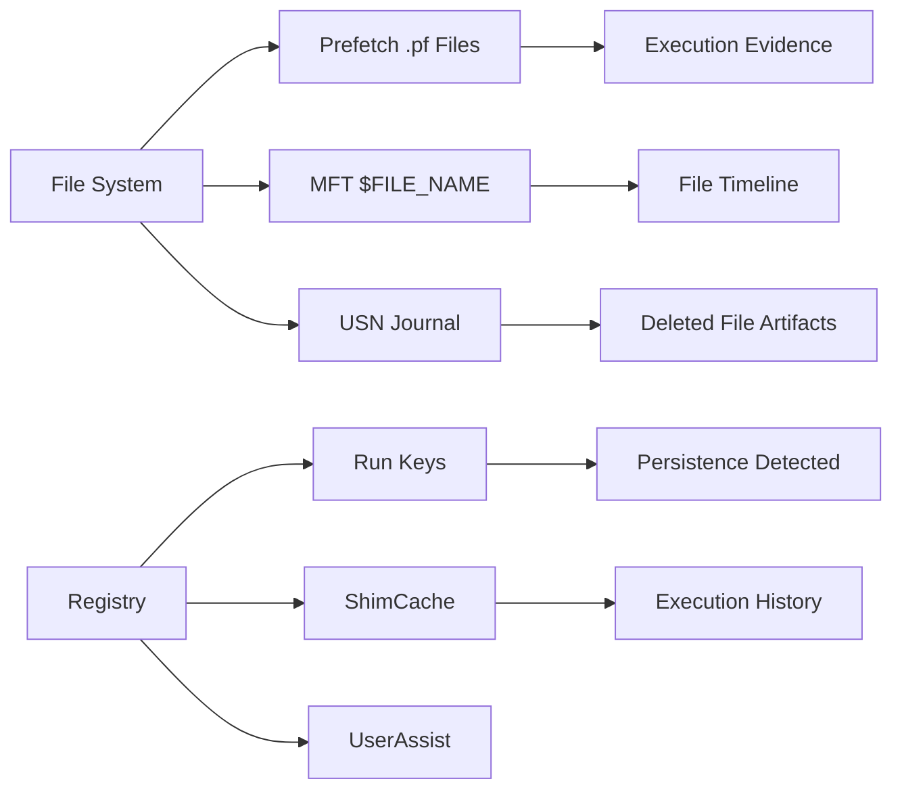
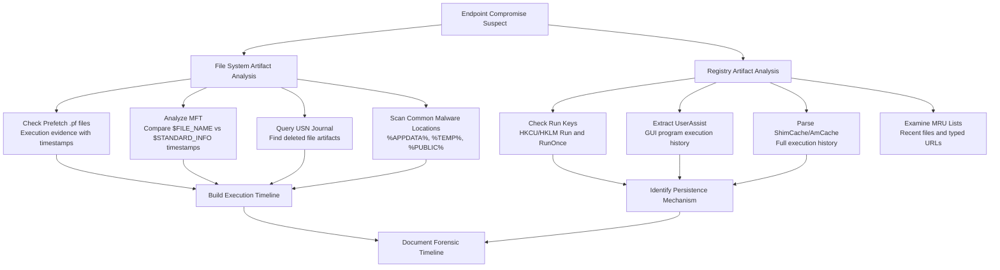

# File System and Registry Artifacts

## TCM Exam Objectives

Before taking the PSAA exam, you must be able to:

- Compare traditional Antivirus (AV) with Endpoint Detection and Response (EDR) capabilities
- Configure and interpret Application Allowlisting using AppLocker and WDAC
- Create and analyze host-based firewall rules (Windows Defender Firewall)
- Examine file system and registry artifacts for forensic evidence of compromise
- Analyze Linux syslog and auth logs for SSH brute force and privilege escalation
- Investigate process and service information to detect malware and persistence
- Query Windows Event Logs (System, Security, Application) for incident detection
- Correlate endpoint telemetry with network evidence for comprehensive incident response

File system and registry artifacts are the forensic fingerprints of malicious activity on Windows endpoints. Malware writes files to disk for payload storage and modifies registry keys for persistence, configuration, and evasion. Understanding where attackers place artifacts and how to detect them is critical for endpoint investigations.

- Common malware file locations and naming conventions
- Registry persistence mechanisms: Run keys, services, COM hijacking
- File system forensic artifacts: Prefetch, $MFT, USN Journal
- Registry forensic artifacts: UserAssist, ShimCache, AmCache


## File System Artifacts

### Common Malware File Locations

| Location | Purpose | Example |
|----------|---------|---------|
| `%APPDATA%\Microsoft\` | Disguised as legitimate app data | `C:\Users\user\AppData\Roaming\Microsoft\svchost.exe` |
| `%TEMP%` | Dropper/payload staging | `C:\Users\user\AppData\Local\Temp\malware.exe` |
| `%USERPROFILE%\AppData\Local\Temp\` | Same as above | `C:\Users\user\AppData\Local\Temp\update.ps1` |
| `C:\Users\Public\` | Shared, less monitored | `C:\Users\Public\svchost.exe` |
| `C:\Windows\Tasks\` | Scheduled task binaries | `C:\Windows\Tasks\updater.exe` |
| `C:\Windows\Temp\` | System-wide temp | `C:\Windows\Temp\installer.exe` |
| `C:\ProgramData\` | Application data | `C:\ProgramData\Microsoft\Windows\service.exe` |
| `C:\Windows\System32\Tasks\` | Scheduled task files | Registered tasks with malicious actions |

### Malicious Naming Conventions

| Technique | Example | Why It Works |
|-----------|---------|--------------|
| Typosquatting system binaries | `svch0st.exe`, `scvhost.exe`, `lsass.exe` | Visual similarity |
| Legitimate-looking names | `update.exe`, `installer.exe`, `setup.exe` | Seems benign |
| Double extensions | `README.txt.exe` | Windows hides known extensions |
| Hidden/system attributes | `attrib +h +s malware.exe` | File not shown by default |
| Legitimate location + malicious name | `C:\Windows\System32\winupdate.exe` | Looks like part of OS |

### Prefetch (Execution Evidence)

Windows creates `.pf` files when applications execute. Located in `C:\Windows\Prefetch\`.

```
C:\Windows\Prefetch\MALWARE.EXE-3F7A2B1C.pf
```

| Artifact | Value |
|----------|-------|
| File name | `EXECUTABLE.EXE-HASH.pf` |
| Created | Time of first execution |
| Count | Number of executions (embedded in file) |
| Last run | Last execution time |
| DLL list | What it loaded (evidence of injection) |

**Detection:**
```powershell
Get-ChildItem "C:\Windows\Prefetch\*.pf" | Sort-Object LastWriteTime -Descending | Select-Object Name, LastWriteTime -First 20

Get-ChildItem "C:\Windows\Prefetch\*svchost*.pf"
```

### NTFS MFT (Master File Table)

The MFT is a database of every file on an NTFS volume. Contains:

| Attribute | Forensic Value |
|-----------|----------------|
| `$STANDARD_INFORMATION` | Timestamps (can be modified by attacker) |
| `$FILE_NAME` | Original filename (cannot be modified by user) |
| `$DATA` | File content |
| `$I30` | Directory index (deleted file remnants) |

**Key analysis:** Compare `$SI` timestamps vs `$FN` timestamps. If they differ, an attacker used `SetMace` or `TimeStomp` to manipulate timestamps � clear evidence of anti-forensics.

### USN Journal (Update Sequence Number)

Records every change to files on an NTFS volume. `C:\$Extend\$UsnJrnl:$J`

```powershell
Get-ForensicUSNJournal | Where-Object { $_.Timestamp -gt (Get-Date).AddDays(-1) } | Select-Object FileName, Timestamp, Reason
```

**Key forensic usage:** Files that have been deleted may still have USN entries. Attacker tools run from USB drives leave traces in the USN journal even if they never write to disk.

### Recycle Bin

`$Recycle.Bin\$SID\$R<FileName>` (original file) and `$Recycle.Bin\$SID\$I<FileName>` (metadata including original path).

**Detection:** If an attacker deletes tools after use, the Recycle Bin might contain the original file or metadata showing the original file path.

## Registry Artifacts


### Persistence via Run Keys

| Key | Path | Trigger |
|-----|------|---------|
| HKCU Run | `HKCU\Software\Microsoft\Windows\CurrentVersion\Run` | User logon |
| HKLM Run | `HKLM\Software\Microsoft\Windows\CurrentVersion\Run` | Any user logon |
| HKCU RunOnce | `HKCU\...\RunOnce` | Next logon (one time) |
| HKLM RunOnce | `HKLM\...\RunOnce` | Next boot (one time) |

**Detection:**
```powershell
Get-ItemProperty "HKCU:\Software\Microsoft\Windows\CurrentVersion\Run"
Get-ItemProperty "HKLM:\SOFTWARE\Microsoft\Windows\CurrentVersion\Run"
```

### UserAssist (Program Execution History)

Records GUI-based executions via Windows Explorer. Location: `HKCU\Software\Microsoft\Windows\CurrentVersion\Explorer\UserAssist\{GUID}\Count`

Contains ROT13-encoded program paths and execution count/timestamp.

**Detection:** Program executions are stored even if the file was deleted later. Shows malware that ran from the desktop or downloads folder.

### ShimCache (Application Compatibility)

Records all executed binaries (even if they crashed), including those deleted after execution.

Location: `HKLM\SYSTEM\CurrentControlSet\Control\Session Manager\AppCompatCache`

```powershell
Get-ItemProperty "HKLM:\SYSTEM\CurrentControlSet\Control\Session Manager\AppCompatCache"
```

**Forensic value:** ShimCache records last modified timestamp and whether the file existed on last boot. Even if the attacker deleted their tools, ShimCache retains evidence they were executed.

### AmCache

Stores execution metadata for installed applications. More detailed than ShimCache. Location: `C:\Windows\AppCompat\Programs\AmCache.hve`

Records: file path, SHA1 hash, file size, install date, last execution time, publisher.

### MRU Lists (Most Recently Used)

| Key | What It Records |
|-----|-----------------|
| `HKCU\...\ComDlg32\LastVisitedMRU` | Files opened via File Open/Save dialog |
| `HKCU\...\ComDlg32\OpenSavePIDlMRU` | Specific file paths opened |
| `HKCU\...\RecentDocs` | Recent documents (MRU) |
| `HKCU\...\TypedURLs` | URLs typed in IE |
| `HKCU\...\PortMRU` | Ports used |
| `HKLM\...\MountedDevices` | USB devices connected (name, serial) |

> **Exam Tip:** When analyzing Prefetch files, check the run count embedded in the `.pf` file. A legitimate system binary may have hundreds of runs; a malicious binary dropped today with run count 1 is suspicious. Use `PECmd` (Zimmerman) to parse Prefetch details, not just `Get-ChildItem`.

> **Exam Tip:** Registry Run keys are the most common persistence, but attackers increasingly use WMI Event Subscriptions (`\\.\root\subscription`) and Scheduled Tasks (Event 4698) because they don't appear in `autorunsc.exe` output by default.

> **Exam Tip:** The USN Journal is invaluable for fileless attack investigation. Even if a PowerShell script never touches disk, its download cradle may create temporary files that appear in the USN Journal. Query with `$USN = Get-ForensicUSNJournal` — tool requires KAPE or similar.


## File System Analysis Tools

| Tool | Purpose | Command |
|------|---------|---------|
| PowerShell | List files, timestamps, owners | `Get-ChildItem -Recurse -Force` |
| Sysinternals LogonSessions | Show active sessions | `logonsessions.exe` |
| Sysinternals AutoRuns | Show all auto-start locations | `autorunsc.exe -a *` |
| Sysinternals SigCheck | Verify file signatures | `sigcheck.exe -a -c file.exe` |
| Sysinternals Streams | Check ADS (alternate data streams) | `streams.exe -s C:\` |
| Sysinternals PendMoves | Pending file rename/move operations | `pendmoves.exe` |
| WinPrefetchView | Prefetch analysis | NirSoft tool |
| Registry Explorer | Registry hive forensic analysis | Eric Zimmerman tool |

## Registry Analysis Tools

| Tool | Purpose |
|------|---------|
| RegRipper | Automated registry artifact extraction |
| Registry Explorer (Zimmerman) | Registry hive viewer with timeline |
| RECmd (Zimmerman) | Command-line registry queries |
| AutoRuns (Sysinternals) | GUI view of all auto-start locations |

```powershell
$runKeys = @(
    "HKLM:\SOFTWARE\Microsoft\Windows\CurrentVersion\Run",
    "HKLM:\SOFTWARE\Microsoft\Windows\CurrentVersion\RunOnce",
    "HKCU:\Software\Microsoft\Windows\CurrentVersion\Run",
    "HKCU:\Software\Microsoft\Windows\CurrentVersion\RunOnce"
)
$runKeys | ForEach-Object {
    if (Test-Path $_) {
        Get-ItemProperty $_ | Select-Object *
    }
}
```

> **Cross-reference:** For timestomping detection via MFT SI vs FN comparison, see Chapter 5.2 — Identifying Modified Files and Timestamps (MACB Times). For Prefetch and Amcache deep analysis, see Chapter 5.1 — Prefetch and Amcache for Program Execution. For Registry ASEP analysis, see Chapter 5.1 — Registry Artifacts for ASEPs.

## PSAA Exam Traps

- **Prefetch is on by default** (Windows 10/11). If Prefetch is disabled or cleared, that itself is suspicious.
- **ShimCache does not include timestamps** in older Windows versions (pre-Win8). Use AmCache for Win8+.
- **Run keys are the most common persistence**, but attackers also use: Startup folders, Scheduled Tasks, Service entries, COM hijacking, WMI event subscriptions, and Bootkit/driver loading.
- **ADS (Alternate Data Streams)** can hide data inside any NTFS file without changing visible size. Check with `dir /r` or `streams.exe`.
- **File timestamps can be modified** in NTFS. $FN timestamps in MFT are harder to fake than $SI timestamps.






## Recap

- File system artifacts (Prefetch, MFT, USN Journal, Recycle Bin) record file execution, creation, and deletion � even after files are removed
- Registry artifacts (Run keys, UserAssist, ShimCache, AmCache, MRU) record persistence, program execution, and user activity
- Common malware locations: `%APPDATA%`, `%TEMP%`, `C:\Users\Public\`, `C:\Windows\Tasks\`
