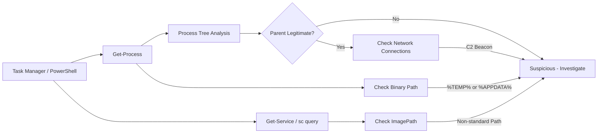
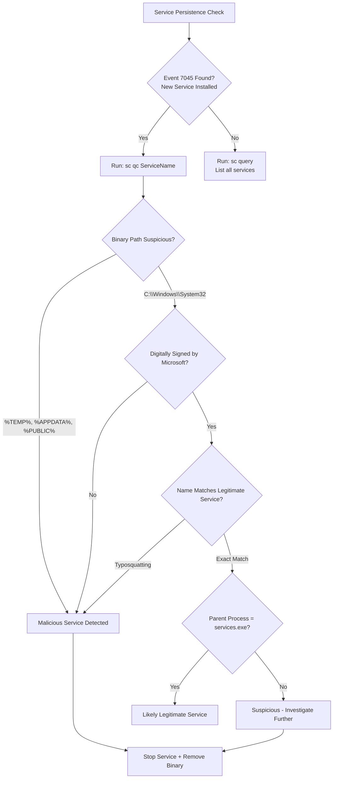

# Process and Service Information

## TCM Exam Objectives

Before taking the PSAA exam, you must be able to:

- Compare traditional Antivirus (AV) with Endpoint Detection and Response (EDR) capabilities
- Configure and interpret Application Allowlisting using AppLocker and WDAC
- Create and analyze host-based firewall rules (Windows Defender Firewall)
- Examine file system and registry artifacts for forensic evidence of compromise
- Analyze Linux syslog and auth logs for SSH brute force and privilege escalation
- Investigate process and service information to detect malware and persistence
- Query Windows Event Logs (System, Security, Application) for incident detection
- Correlate endpoint telemetry with network evidence for comprehensive incident response

Process and service information provides real-time and forensic visibility into exactly what is running on an endpoint. Attackers rely on process execution to run their payloads, and understanding process trees, services, and drivers is essential for detecting compromise.

- Live process analysis: Task Manager, PowerShell, WMIC, Sysinternals
- Service analysis: services.msc, sc, Get-Service
- Process trees: detecting parent-child anomalies
- Persistence through services: detection and analysis


## Process Analysis

### Task Manager (`taskmgr`)

Access: `Ctrl+Shift+Esc` or `taskmgr.exe`

| Column | Security Value |
|--------|----------------|
| Process Name | Look for disguised names (`svchost.exe` in wrong location) |
| CPU/Memory | Unexpected resource usage (miner, beacon) |
| Disk/Network | Unexpected I/O (exfiltration, C2) |
| User name | SYSTEM processes should match, not user running `lsass.exe` |
| Command Line (Details tab) | Hidden in columns, shows full path + arguments |

### PowerShell

```powershell
Get-Process | Select-Object Name, Id, StartTime, CPU, Path, Company, Description | Format-Table -AutoSize

Get-Process | Where-Object { $_.Company -eq $null } | Select-Object Name, Id, Path

Get-Process | Where-Object { $_.Path -match "AppData|Temp|Users\\Public" } | Select-Object Name, Id, Path

Get-Process -Name "svchost" -ErrorAction SilentlyContinue | Where-Object { $_.Path -ne "C:\Windows\System32\svchost.exe" }

Get-NetTCPConnection | Where-Object State -eq "Established" | Group-Object OwningProcess | ForEach-Object {
    $proc = Get-Process -Id $_.Name
    [PSCustomObject]@{
        ProcessName = $proc.ProcessName
        PID = $_.Name
        Path = $proc.Path
        Connections = $_.Count
    }
}
```

### WMIC

```cmd
wmic process list full
wmic process where name="svchost.exe" get processid,executablepath,commandline
wmic process get name,processid,executablepath,parentprocessid
```

### Sysinternals Process Explorer

**Download:** `live.sysinternals.com` or `procexp.exe`

| Feature | Security Use |
|---------|--------------|
| Process Tree | Visualize parent-child relationships |
| Verify Signatures | Right-click > Check VirusTotal |
| DLL View | View loaded DLLs for each process |
| Strings Tab | View strings in process memory |
| Lower Pane | Show open handles (files, registry, network) |

## Suspicious Process Indicators

| Indicator | What It Suggests |
|-----------|------------------|
| `svchost.exe` from `C:\Users\` | Masquerading |
| `powershell.exe -enc <base64>` | Encoded command (fileless attack) |
| `rundll32.exe` with URL argument | JavaScript/HTML application execution |
| `mshta.exe` with URL argument | HTA file execution |
| `wmic.exe process call create` | Lateral movement |
| `regsvr32.exe` with URL | COM scriptlet execution |
| `cmd.exe` spawned by `winword.exe` | Phishing with malicious macro |
| Unsigned binary in `C:\Windows\Tasks` | Persistence via scheduled task |
| Process with no parent (orphaned) | Injected process, rootkit hiding |
| Process with same name nested | `svchost.exe > svchost.exe` | Always suspicious |

## Service Analysis


### services.msc

Access: `services.msc` or `Start > Run > services.msc`

| Column | Security Value |
|--------|----------------|
| Name | Look for suspicious names (legitimate-sounding but wrong path) |
| Status | Running, Stopped, or Paused |
| Startup Type | Automatic (boot persistence), Manual, Disabled |
| Log On As | LocalSystem (*highest privilege*), NetworkService, LocalService |

### PowerShell

```powershell
Get-CimInstance -ClassName Win32_Service | Select-Object Name, DisplayName, PathName, StartMode, State, StartName

Get-CimInstance -ClassName Win32_Service | Where-Object { $_.PathName -match "AppData|Temp|Users\\Public" }

Get-CimInstance -ClassName Win32_Service | Where-Object { $_.StartName -eq "LocalSystem" -and $_.PathName -notmatch "system32|Program Files" }
```

### sc (Service Control)

```cmd
sc query        # List all services
sc qc <name>    # Query service configuration (binary path, dependencies)
sc queryex <name>   # Extended info (PID, state, flags)
sc sdshow <name>    # Show service security descriptor

sc qc "WindowsUpdate"
```

### Sysinternals AutoRuns

`autorunsc.exe` shows everything that runs at startup � services, drivers, scheduled tasks, run keys, etc.

```cmd
autorunsc -a b -c  # All boot execute items as CSV
autorunsc -s       # Hide Microsoft entries (show only third-party)
autorunsc -vt      # Check VirusTotal for each entry
```

?? **Exam Tip:** Master the difference between capture filters and display filters. Capture filters (BPF) discard at kernel level; display filters only hide packets. Use capture filters for large PCAPs to reduce file size before analysis.

?? **Exam Tip:** When writing incident reports, use the STAR method: Situation (what was alerted), Task (what you needed to find), Action (tools and filters used), Result (IOCs confirmed and remediation steps).


## Service Persistence Analysis

Attackers frequently install malicious services for persistence. Key indicators:

| Indicator | Normal | Suspicious |
|-----------|--------|------------|
| Service name | Windows-standard names | Look-alike names (`WinUpdates`, `DefenderSvc`) |
| Binary path | `C:\Windows\System32\` | `C:\Users\Public\`, `%TEMP%`, `C:\Windows\Tasks` |
| Run as | NetworkService, LocalService | LocalSystem (but also normal) |
| Startup | Manual or Automatic | Automatic (persistence) |
| Dependencies | May have none | May depend on core services to ensure restart |

**Detection chain:**
1. Event 7045 (service installed) in System log
2. `sc qc <service>` reveals binary path in suspicious location
3. Command line: `C:\Users\Public\svchost.exe -k netsvcs` (masquerading as legitimate)
4. Binary not signed by Microsoft when expected

## Driver Analysis

```powershell
Get-CimInstance -ClassName Win32_SystemDriver | Select-Object Name, DisplayName, PathName, State, StartMode

Get-CimInstance -ClassName Win32_SystemDriver | Where-Object { $_.PathName -notmatch "system32|Program Files" }
```

> **Cross-reference:** For deep-dive analysis of suspicious parent-child process relationships (e.g., `winword.exe -> cmd.exe -> powershell.exe`), see Chapter 5.1 — Identifying Malicious Processes and Parent-Child Relationships. For persistence detection via services, see Chapter 5.1 — Analyzing Persistence Mechanisms. For Sysmon-enhanced process telemetry (Event ID 1), see Chapter 5.3 — Key Sysmon Event IDs for SOC Analysis.

## PSAA Exam Traps

- **Task Manager can hide processes.** Malware can register as a service running as SYSTEM and won't appear in user's Task Manager context � use Process Explorer or `Get-Process` as admin.
- **Process name is not unique.** Multiple processes can share the same name. Always check PID and path.
- **ImagePath in registry overrides binary path.** Services read `HKLM\SYSTEM\CurrentControlSet\Services\<ServiceName>\ImagePath`.
- **Process hollowing.** `svchost.exe` running from `C:\Windows\System32\` with expected parent but unusual network connections � the legitimate process was hollowed.






## Recap

- Service analysis detects persistence: look for Event 7045, check ImagePath, verify digital signatures
- Sysinternals tools (Process Explorer, AutoRuns) provide deeper visibility than built-in tools
- Combine process, service, and network connection analysis for complete endpoint compromise detection
