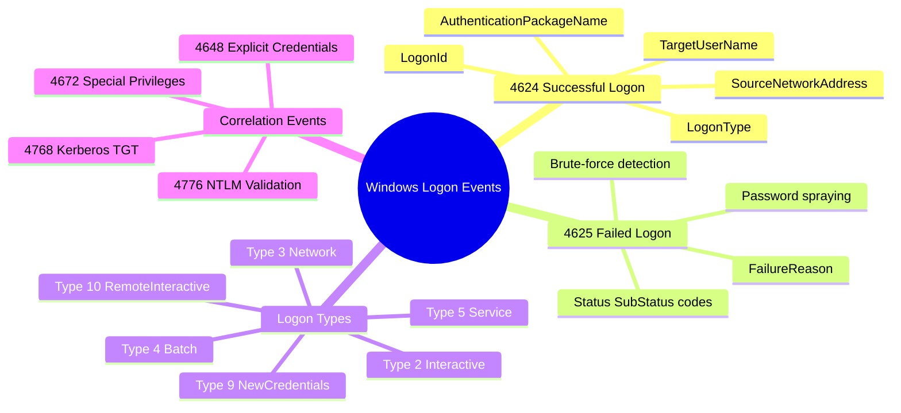
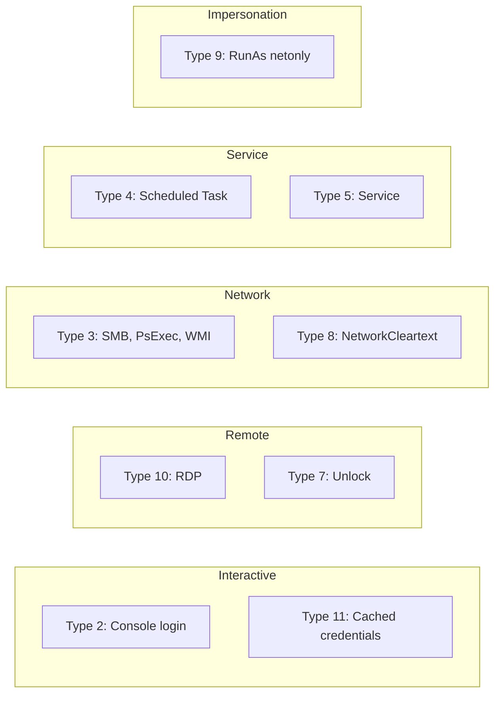
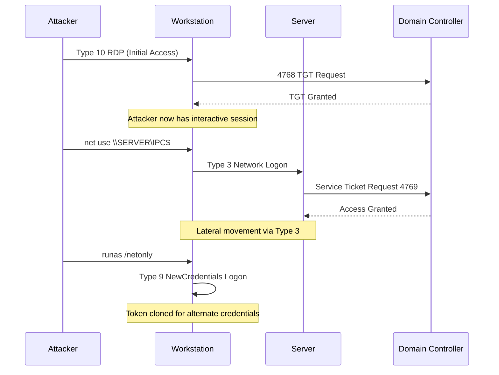
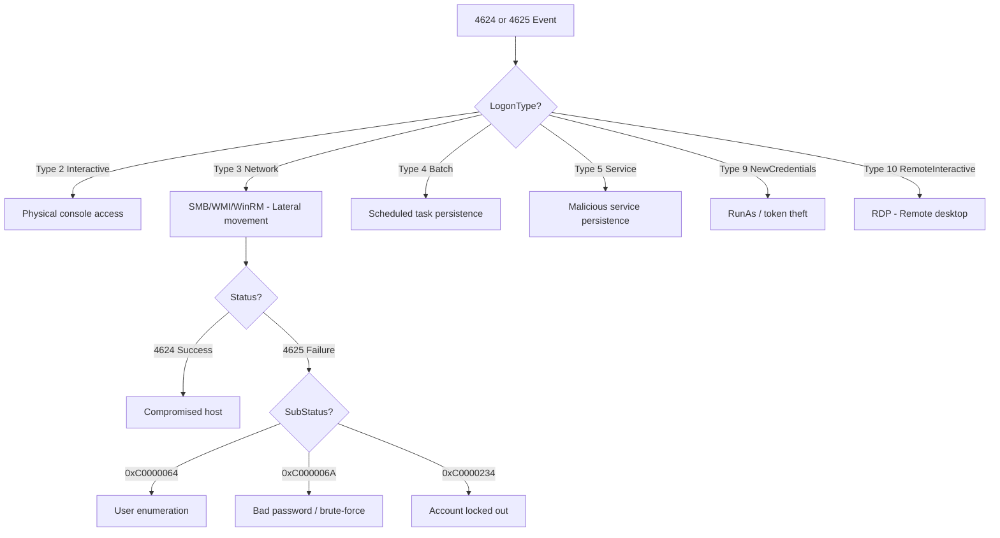
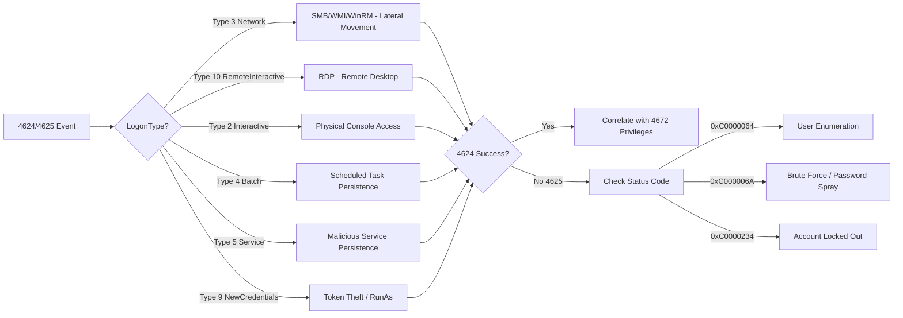

# Security Event Logs: Logon Events (Event ID 4624 & 4625)

## TCM Exam Objectives

- Analyze Event ID 4624 fields including LogonType, TargetUserName, SourceNetworkAddress, and AuthenticationPackageName
- Distinguish between all 12 logon types and map each to attacker techniques (Type 3 = lateral movement, Type 10 = RDP, Type 9 = token theft)
- Detect brute-force attacks and password spraying using Event ID 4625 Status/SubStatus failure codes
- Query Security logs using Get-WinEvent, wevtutil, and custom XML XPath filters
- Correlate logon events with privilege escalation (4672), credential validation (4776), and Kerberos TGT requests (4768)
- Recognize that Type 3 (Network) is SMB/WMI/WinRM/PsExec — NOT RDP (Type 10 is RDP)
- Identify token manipulation via LogonId reuse across two accounts
- Read Status/SubStatus code combinations: 0xC0000064 (user unknown), 0xC000006A (bad password), 0xC0000234 (locked out)
- Track complete session activity using LogonId for cross-event correlation

Event ID 4624 (successful logon) and Event ID 4625 (failed logon) are the foundation of every Windows authentication investigation. Every interactive or network-based access to a Windows system requires authentication, and the Security log records every attempt---answering who logged in, how they logged in, where they logged in from, and whether the attempt succeeded or failed.

- Anatomy of Event ID 4624 fields and their security relevance
- The twelve logon types and attacker associations
- Event ID 4625 failure codes for brute-force and spraying detection
- Filtering with Get-WinEvent, wevtutil, and XML queries
- Logon type cheat sheet: Type 2, 3, 4, 5, 9, 10, 11
- Correlation with authentication events (4648, 4672, 4768, 4776)



## Event ID 4624 -- Successful Logon

### Field Reference

| Field (XML Name) | Meaning | Security Relevance |
|------------------|---------|-------------------|
| **SubjectUserSid** | SID of the account that performed the logon | SYSTEM for service-initiated logons; anything else for interactive requires scrutiny |
| **SubjectUserName** | Account name that initiated the logon | Usually local service or machine account |
| **TargetUserSid** | SID of the account being logged on | The credential that gained access |
| **TargetUserName** | Account name logged on | Primary answer to "who logged in" |
| **TargetDomainName** | Domain of the target account | Local vs. domain logon distinction |
| **LogonType** | Numeric code for the logon method | The single most critical field |
| **LogonId** | Unique hex identifier for this logon session | Tracks all actions performed under this session |
| **SourceNetworkAddress** | Source IP address of the client | Essential for identifying attacker IP |
| **WorkstationName** | Machine name from which the logon originated | Identifies source host |
| **ProcessName** | Executable that received the logon | Unusual processes indicate attack tools |
| **AuthenticationPackageName** | Package used for authentication (Kerberos, NTLM, Negotiate) | NTLM to a DC from a modern client is suspicious |
| **KeyLength** | Key length of the session (0 for NTLM, 256 for Kerberos) | NTLM key length 0 is a red flag |

### Logon Types Reference



| Logon Type | Name | Description | Attacker Association |
|------------|------|-------------|---------------------|
| **2** | Interactive | Physical local logon via keyboard/screen | Physical access; rare in remote intrusions |
| **3** | Network | Network logon via SMB, PsExec, WMI, WinRM | Lateral movement |
| **4** | Batch | Scheduled task execution | Persistence via scheduled tasks |
| **5** | Service | Service startup | Malicious services running as specific account |
| **7** | Unlock | Desktop unlock | Indicates an existing logged-on user session |
| **8** | NetworkCleartext | Network logon with cleartext credentials (IIS) | Rare; often disabled |
| **9** | NewCredentials | RunAs with /netonly flag | Token theft, credential cloning |
| **10** | RemoteInteractive | Terminal Services / RDP | RDP brute-force, lateral movement |
| **11** | CachedInteractive | Logon with cached domain credentials | Stolen credentials on offline host |
| **12** | CachedRemoteInteractive | Cached RDP logon | Rare |
| **13** | CachedUnlock | Cached unlock | Rare |

> 📌 **Exam Tip:** Logon Type 3 (Network) is NOT RDP! Type 3 covers SMB, WMI, WinRM, and PsExec — used for lateral movement. Type 10 (RemoteInteractive) is RDP. Confusing these two is one of the most common PSAA exam mistakes. Always verify: lateral movement = Type 3, remote desktop = Type 10.

Type 3 is strictly SMB, WMI, WinRM, or PsExec---it is **not** RDP. Type 10 is RDP.

## Event ID 4625 -- Failed Logon

### Failure Code Reference

| Status | SubStatus | Meaning | Attack Significance |
|--------|-----------|---------|---------------------|
| 0xC000006D | 0xC0000064 | Unknown user name | User enumeration |
| 0xC000006D | 0xC000006A | Bad password (valid user) | Brute-force or password spraying |
| 0xC000006D | 0xC0000234 | Account locked out | Brute-force lockout |
| 0xC0000071 | 0x0 | Password expired | Account may still be valid |
| 0xC000006E | 0x0 | Account disabled | Target account is disabled |
| 0xC0000072 | 0x0 | Account expired | Target account is expired |
| 0xC000015B | 0x0 | Logon type not granted | User lacks permission for this logon type |

> 📌 **Exam Tip:** Not every 4625 (failed logon) is an attack. Users legitimately mistype passwords. The key distinction is pattern: a single source IP targeting many usernames = password spraying; one username with many failures from one IP = brute-force; Status 0xC0000064 across multiple users = account enumeration. Always group by SourceNetworkAddress.

### Attack Pattern Detection

**Brute-force on a single account:** Many 4625 events for the same `TargetUserName` with Status 0xC000006D / 0xC000006A, all from the same source IP and logon type (typically 10 or 3).

**Password spraying:** Many 4625 events with different `TargetUserName` values, same source IP, small gaps between attempts to avoid lockout. Status is 0xC000006D / 0xC000006A; lockouts (0xC0000234) are rare because spraying stays below the lockout threshold.

**Account enumeration:** Many 4625 events with Status 0xC0000064 (user does not exist) from a single source IP, often with common usernames (admin, administrator, service, test).

## Filtering and Querying

### Event Viewer XML Filter

```xml
<QueryList>
  <Query Id="0" Path="Security">
    <Select Path="Security">
      *[System[(EventID=4624 or EventID=4625)]]
    </Select>
  </Query>
</QueryList>
```

Filter for specific logon type:
```xml
<Select Path="Security">
  *[System[(EventID=4624)]] and *[EventData[Data[@Name='LogonType'] and (Data='10')]]
</Select>
```

### Get-WinEvent

```powershell
# All 4624 and 4625 events
Get-WinEvent -FilterHashtable @{LogName='Security'; ID=4624,4625} -MaxEvents 100

# RDP successful logons only (Type 10)
Get-WinEvent -LogName Security -FilterXPath @'
<QueryList>
  <Query Id="0" Path="Security">
    <Select Path="Security">
      *[System[(EventID=4624)]] and *[EventData[Data[@Name='LogonType']='10']]
    </Select>
  </Query>
</QueryList>
'@

# Failed logons from a specific IP
Get-WinEvent -FilterHashtable @{LogName='Security'; ID=4625} |
    Where-Object { $_.Properties[19].Value -eq '10.0.0.50' }
```

### wevtutil

```cmd
rem All Type 3 network logons
wevtutil qe Security /q:"*[System[(EventID=4624)]] and *[EventData[Data[@Name='LogonType']='3']]" /c:10 /f:text

rem Failed logons for a specific user
wevtutil qe Security /q:"*[System[(EventID=4625)]] and *[EventData[Data[@Name='TargetUserName']='administrator']]" /c:20
```

## Investigation Workflow

### Step 1: Identify the Suspicious Pattern

- Brute-force alert: Start with 4625, group by TargetUserName and SourceNetworkAddress
- Lateral movement alert: Start with 4624, focus on LogonType 3 and 10
- Unusual access alert: Filter by LogonType and compare against baseline

### Step 2: Filter for the Time Window

```powershell
Get-WinEvent -FilterHashtable @{
    LogName='Security'
    ID=4624,4625
    StartTime=(Get-Date).AddHours(-2)
}
```

### Step 3: Group and Sort

```powershell
# Group failed logons by user and source IP
Get-WinEvent -FilterHashtable @{LogName='Security'; ID=4625} |
    Group-Object -Property @{e={$_.Properties[5].Value}}, @{e={$_.Properties[19].Value}} |
    Sort-Object Count -Descending |
    Select-Object Count, Name
```

### Step 4: Analyze the Suspicious Session

For a 4624 event with an anomalous logon type, find all events with the same `LogonId` to track everything that session did. Then correlate with:

| Event ID | What It Records | Correlation Value |
|----------|-----------------|-------------------|
| **4672** | Special Privileges Assigned | Indicates the account received admin rights |
| **4648** | Explicit Credential Logon | Precedes Type 9 (runas) logons |
| **4768** | Kerberos TGT Requested | Maps to 4624 if Kerberos was used |
| **4776** | NTLM Credential Validation | Suspicious when used from modern clients |
| **4771** | Kerberos Pre-auth Failed | Kerberos equivalent of 4625 |

## Logon Type Attack Patterns



<details>
<summary>Exam Traps and Common Mistakes</summary>

- **Logon type 3 is not RDP.** Type 3 is SMB, WMI, WinRM, or PsExec. Type 10 is RDP. Confusing these is a common exam error.
- **Missing SourceNetworkAddress** for Type 3 with LogonProcessName "Advapi" likely indicates a local system account, not a remote attacker.
- **LogonId reuse across two accounts** indicates token manipulation or credential theft.
- **SubjectUserSid may be SYSTEM** for network logons---this does not mean SYSTEM logged on; it means a service initiated the logon for the target user.
- **Not every 4625 is an attack.** Account lockouts can occur from users forgetting passwords. Look for repeated patterns from a single source IP.
- **Empty WorkstationName** for RDP logons is common. SourceNetworkAddress is the key field for RDP investigations.
- **NTLM authentication to a Domain Controller** from a modern Windows 10/11 client is suspicious. These clients should use Kerberos. This may indicate a pass-the-hash or NTLM relay attack.
</details>



## Quick Reference

### 4624 Key Fields

| Field | Importance |
|-------|------------|
| TargetUserName | Who logged in |
| LogonType | How they logged in |
| SourceNetworkAddress | Where they came from |
| AuthenticationPackageName | Kerberos or NTLM |

### 4625 Failure Codes

| Code Pair | Meaning |
|-----------|---------|
| 0xC000006D / 0xC0000064 | User does not exist |
| 0xC000006D / 0xC000006A | Bad password (valid user) |
| 0xC000006D / 0xC0000234 | Account locked out |

### Logon Types for Attacks

| Type | Description | Attack Vector |
|------|-------------|---------------|
| 3 | Network | SMB/PsExec lateral movement |
| 4 | Batch | Scheduled task persistence |
| 5 | Service | Malicious service persistence |
| 9 | NewCredentials | Token theft, credential cloning |
| 10 | RemoteInteractive | RDP initial access |



## Recap

Event ID 4624 records successful logons with the critical fields LogonType, TargetUserName, and SourceNetworkAddress. Event ID 4625 records failed logons with Status/SubStatus codes that distinguish user enumeration (0xC0000064) from password brute-force (0xC000006A). The logon type field is the single most important discriminator: Type 3 indicates network lateral movement via SMB/WMI, Type 10 indicates RDP access, and Type 9 indicates token impersonation via runas. Correlation with events 4648, 4672, 4768, and 4776 provides the full authentication picture required for incident reconstruction.
