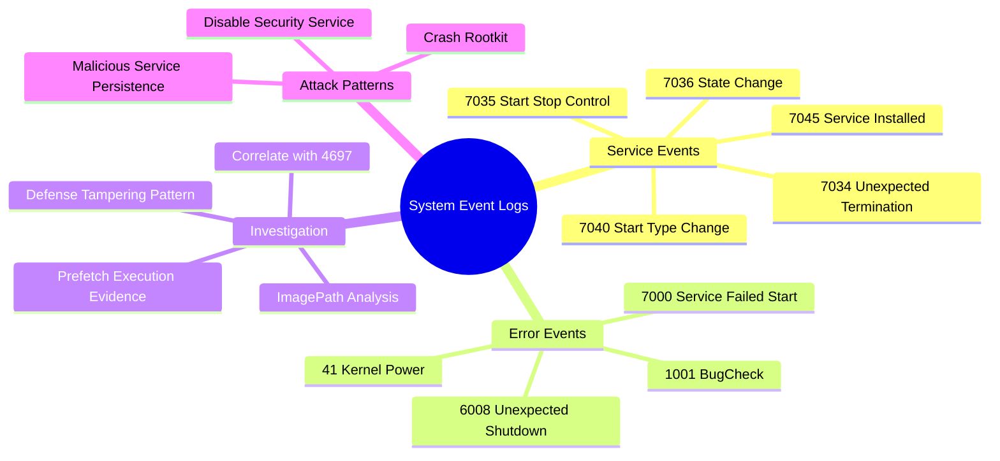
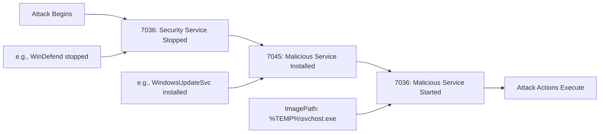
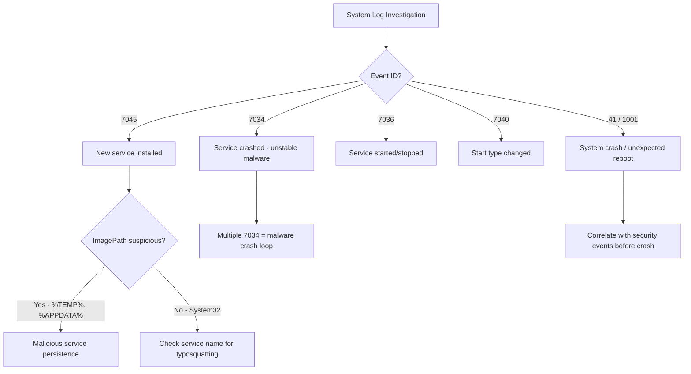
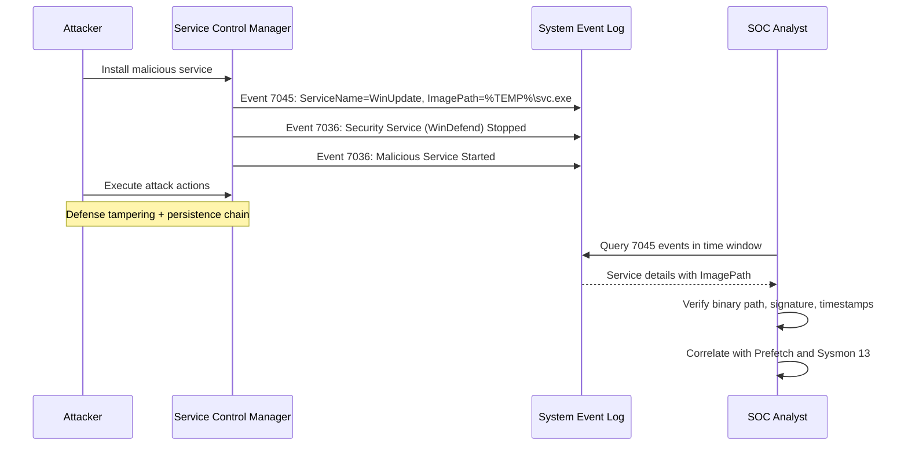

# System Event Logs: Service Starts/Stops & System Errors

## TCM Exam Objectives

- Identify service-based persistence using System log Event ID 7045 (Service Installed) and its ImagePath field
- Detect defense tampering by correlating security service stop events (7036) with malicious service installations
- Analyze BugCheck Event ID 1001 for kernel-mode rootkit or driver exploit indicators
- Investigate unexpected shutdowns via Kernel-Power Event ID 41 and Event ID 6008
- Spot service red flags: ImagePath in %TEMP%, typosquatted names, StartType Auto with LocalSystem
- Query System logs using Get-WinEvent and wevtutil for service installation forensics
- Correlate System events with Security 4697, Sysmon 13 (registry), and Prefetch execution evidence
- Recognize the defense-disabling attack pattern: stop security service → install malicious service → start malicious service
- Differentiate between service crash loops (7034/7031) and legitimate service failures

The Windows System event log records events generated by the operating system kernel, Service Control Manager (SCM), device drivers, and core system components. Unlike the Security log (which tracks audited access) or the Application log (which records user-mode application events), the System log tracks the fundamental health and behavior of the machine---making it the primary source for detecting service-based persistence, defense tampering, and attack-induced system instability.

- Service Control Manager event IDs (7045, 7034, 7035, 7036, 7040)
- Service installation forensics and red flags
- System error and crash events (41, 1001, 6008)
- BugCheck analysis for kernel-mode rootkit detection
- Investigation workflow for service persistence alerts
- PowerShell and wevtutil query patterns



## Service Control Manager Events

The Service Control Manager records all service-related activities in the System log. Attackers exploit services to maintain persistence by installing rogue services that survive reboots.

### Key Service Event IDs

| Event ID | Description | Forensic Significance |
|----------|-------------|----------------------|
| **7045** | A service was installed in the system | The primary persistence indicator. Records service name, binary path, service type, and start type |
| **7034** | A service terminated unexpectedly | Indicates a crash or forced termination; multiple occurrences signal a malfunctioning malicious service |
| **7035** | A service entered the pending state | Shows an explicit start or stop request and the user account that initiated it |
| **7036** | A service entered the started/stopped state | Confirms a service reached a steady state after a control request |
| **7040** | The start type of a service was changed | Detects when a service is switched from Manual to Auto, a common persistence technique |
| **7000** | A service failed to start | Binary missing or corrupt; common after attacker cleanup |
| **7009** | A timeout was reached waiting for service connection | Indicates a service that hangs on startup, typical of poorly written malware |
| **7023** | A service terminated with an error | Service started but immediately crashed; common with unstable malicious DLLs |
| **7022** | A service hung on starting | Service never reached the running state |

> 📌 **Exam Tip:** Event ID 7045 records the service name, ImagePath, ServiceType, StartType, and AccountName — but NOT the user who installed the service. To identify who installed it, correlate with Security Event ID 4697 (advanced audit) which includes the installer's account SID.

### Event ID 7045 Forensic Anatomy

| Data Field | Meaning | Example Value |
|------------|---------|---------------|
| `ServiceName` | The name of the new service | `WindowsUpdateSvc` (masquerading as legitimate) |
| `ImagePath` | Full command line for the service binary | `%TEMP%\payload.exe` |
| `ServiceType` | Kernel driver (0x1), own process (0x10), share process (0x20) | `user mode service` |
| `StartType` | Boot (0x0), System (0x1), Auto (0x2), Manual (0x3), Disabled (0x4) | `auto start` |
| `AccountName` | Security context the service runs under | `LocalSystem` |

### Service Installation Red Flags

- **ImagePath** pointing to `%TEMP%`, `%APPDATA%`, `C:\Users\Public\`, or a randomly named folder
- **StartType** set to Auto (0x2) for persistence across reboots
- **AccountName** set to `LocalSystem` for high-privilege execution
- **Service name** typosquatting a legitimate service (e.g., `WndowsUpdate` instead of `wuauserv`)
- **Service type** of Own Process (0x10) pointing to an unsigned binary

## System Error Events

### Key Error Event IDs

| Event ID | Provider | Description | Forensic Context |
|----------|----------|-------------|------------------|
| **41** | Kernel-Power | System rebooted without clean shutdown | Triggered by crash, power loss, or forced shutdown |
| **1001** | Wer-System | BugCheck (BSOD) | Contains BugCheck code and dump file path; reveals kernel-mode crashes |
| **6008** | EventLog | Previous system shutdown was unexpected | Records time of improper shutdown |
| **36887** | Schannel | Fatal TLS/SSL alert received | TLS handshake failure; burst from a single IP indicates scanning or C2 failure |
| **7031** | SCM | Service terminated unexpectedly (repeated) | Service crash loop indicates exploitation or misbehaving malware |

> 📌 **Exam Tip:** Kernel-Power Event ID 41 only confirms an unclean shutdown — it does NOT record the cause. Always look at the 20-30 events BEFORE Event 41 in the System log. If you see Event 7035 stopping `csrss.exe` or `winlogon.exe`, that indicates an attacker forced a shutdown, not a power failure.

### BugCheck Event (1001) Analysis

When a Windows system crashes with a Blue Screen of Death, the BugCheck event is recorded after the reboot. It provides:
- **BugCheckCode**: The STOP error code (e.g., `0x000000D1` for DRIVER_IRQL_NOT_LESS_OR_EQUAL)
- **Four parameters**: Specific to the BugCheckCode
- **Dump file path**: Location of the memory dump for deep analysis

Query for recent BugCheck events:
```powershell
Get-WinEvent -LogName System -FilterXPath "*[System[EventID=1001]]" |
    Select-Object TimeCreated, Message -First 10
```

### Kernel-Power Event (41) Analysis

Event ID 41 is logged when the system boots after an unexpected shutdown. It does **not** record the cause---it only confirms an unclean shutdown occurred. The cause must be inferred by correlating with events immediately preceding the 41.

Malicious causes include:
- An attacker using `shutdown /r /f` to force a reboot
- A process with `SeShutdownPrivilege` forcing a reboot
- A denial-of-service exploit crashing `csrss.exe`

**Correlation technique**: Examine the last 20-30 events in the System log before the 41 event. If an Event ID 7035 for `csrss.exe` being stopped appears, that is a red flag.

## Service Defense Tampering Pattern



This sequence---disable defenses (WinDefend, MpsSvc), install persistence, start the malicious service---is the textbook pattern for service-based malware deployment.

## Querying System Event Logs

```powershell
# All service installations in last 24 hours
Get-WinEvent -LogName System -FilterXPath @"
*[System[EventID=7045 and TimeCreated[timediff(@SystemTime) <= 86400000]]]
"@ | ForEach-Object {
    $xml = [xml]$_.ToXml()
    $data = @{}
    $xml.Event.EventData.Data | ForEach-Object { $data[$_.Name] = $_.'#text' }
    [PSCustomObject]@{
        Time        = $_.TimeCreated
        ServiceName = $data['ServiceName']
        ImagePath   = $data['ImagePath']
        StartType   = $data['StartType']
        AccountName = $data['AccountName']
    }
} | Format-Table -AutoSize

# Critical and error events in last hour
Get-WinEvent -LogName System -MaxEvents 100 |
    Where-Object { $_.Level -le 2 -and $_.TimeCreated -gt (Get-Date).AddHours(-1) }

# Unclean shutdowns
Get-WinEvent -LogName System -FilterXPath "*[System[EventID=41]]" |
    Select-Object TimeCreated, Message -First 10

# Service stopped for a specific security service
Get-WinEvent -LogName System |
    Where-Object {
        $_.Id -eq 7036 -and
        $_.Properties[1].Value -like "*WinDefend*" -and
        $_.Message -like "*stopped*"
    }
```

```cmd
wevtutil qe System /q:"*[System[EventID=7045]]" /c:20 /f:text
wevtutil epl System C:\output\System.evtx
```

## Investigation Workflow

### Phase 1: Triage the Alert

Record the hostname, timestamp, and event ID from the alert. Common alerts include "New Service Installed on Host," "Unexpected System Shutdown," or "Service Crash Loop Detected."

### Phase 2: Extract Service Installation Details

Run the 7045 query for the relevant time window. For each installation, assess:

| Question | Red Flag |
|----------|----------|
| Is the service name suspicious? | Typosquatted names, random strings, or names mimicking security tools |
| Is ImagePath in a trusted location? | Any path outside `C:\Windows\System32\` or `C:\Program Files\` |
| Is StartType "Auto"? | Malware requires auto-start for reboot persistence |
| Is AccountName "LocalSystem"? | Gives the service high privileges |

### Phase 3: Check Service Start/Stop Pattern

Search for 7035/7036 events around the installation. A sequence of security service stops, malicious service installation, then malicious service start is the classic defense-disabling attack pattern.

### Phase 4: Correlate with Other Evidence

| Artifact | What to Check |
|----------|---------------|
| Registry | `HKLM\SYSTEM\CurrentControlSet\Services\<ServiceName>` for ImagePath and Start values |
| Prefetch | `C:\Windows\Prefetch\` for execution evidence of the service binary |
| Security Log | Event ID 4697 (service installation, if advanced audit is enabled) |
| Sysmon | Event ID 13 (registry value set) for service key modification |
| File System | Confirm the binary at ImagePath still exists; check creation timestamps |

<details>
<summary>Hands-On Exercise: Service Persistence Investigation</summary>

**Scenario**: SIEM alerts on "New Service Installed on DESKTOP-ABC123" for a service named `WindowsUpdateSvc` at `2026-05-18 14:20:05`.

**Query 7045**:
```powershell
Get-WinEvent -LogName System -FilterXPath "*[System[EventID=7045]]" |
    Where-Object { $_.TimeCreated -ge (Get-Date -Year 2026 -Month 5 -Day 18 -Hour 14 -Minute 19) } |
    ForEach-Object {
        $xml = [xml]$_.ToXml()
        $data = @{}
        $xml.Event.EventData.Data | ForEach-Object { $data[$_.Name] = $_.'#text' }
        [PSCustomObject]@{
            Time        = $_.TimeCreated
            ServiceName = $data['ServiceName']
            ImagePath   = $data['ImagePath']
            StartType   = $data['StartType']
            AccountName = $data['AccountName']
        }
    }
```
**Result**: ImagePath = `C:\Users\brolf\AppData\Local\Temp\svchost.exe`, StartType = auto start, AccountName = LocalSystem.

**Red flags**: (1) Service name is typosquatted (WindowsUpdateSvc vs wuauserv), (2) ImagePath points to user temp directory, (3) auto-starts with LocalSystem.

**Check service start**: 7036 events confirm the service entered running state at 14:20:07.

**Check defense tampering**: 7036 events show WinDefend stopped at 14:19:58, immediately before installation.

**Conclusion**: Confirmed malware persistence with defense disabling.
</details>



## Quick Reference

### Critical Service Event IDs

| Event ID | Description | Investigation Trigger |
|----------|-------------|----------------------|
| 7045 | Service installed | New persistence. Inspect ImagePath |
| 7034 | Service terminated unexpectedly | Potential defense tampering |
| 7036 | Service started/stopped | Confirm operational state |
| 7040 | Service start type changed | Persistence reconfiguration |
| 7000 | Service failed to start | Binary missing or corrupted |

### Critical System Error Event IDs

| Event ID | Description | Investigation Trigger |
|----------|-------------|----------------------|
| 41 | Kernel-Power unexpected reboot | Forced shutdown as part of attack |
| 1001 | BugCheck system crash | Kernel-level rootkit or driver exploit |
| 6008 | Unexpected previous shutdown | Corroborates crash or forced power-off |
| 36887 | Schannel fatal alert | TLS C2 failures, port scanning |



## Recap

Service installation (7045) is the foremost persistence indicator in the System log, requiring immediate scrutiny of the ImagePath for execution from untrusted locations like `%TEMP%` or `%APPDATA%`. Correlating service stops (defense disabling) with service installations provides the attack timeline. System error events (41, 1001) reveal attack-induced crashes and kernel-mode compromise. Cross-reference with the Security log (4697), registry, Prefetch, and Sysmon Event 13 for a complete persistence investigation.
