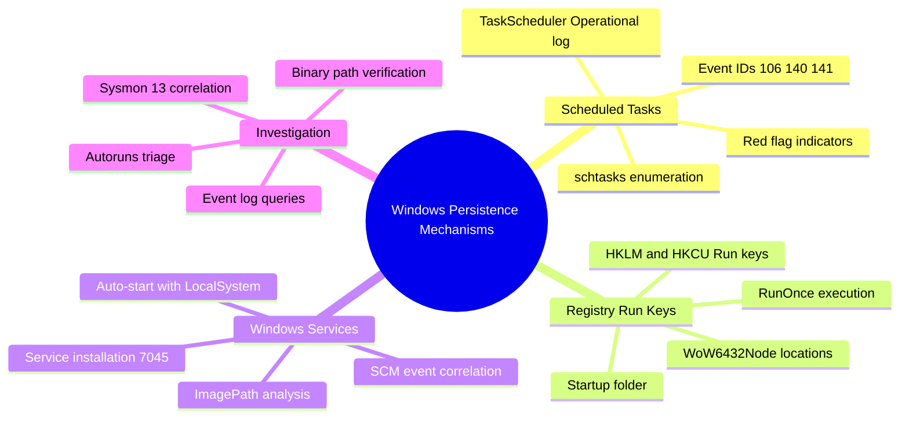
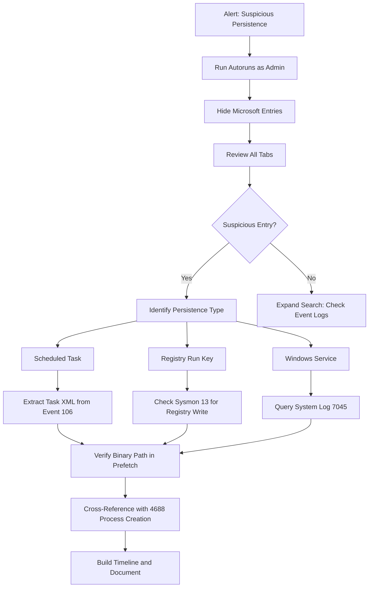
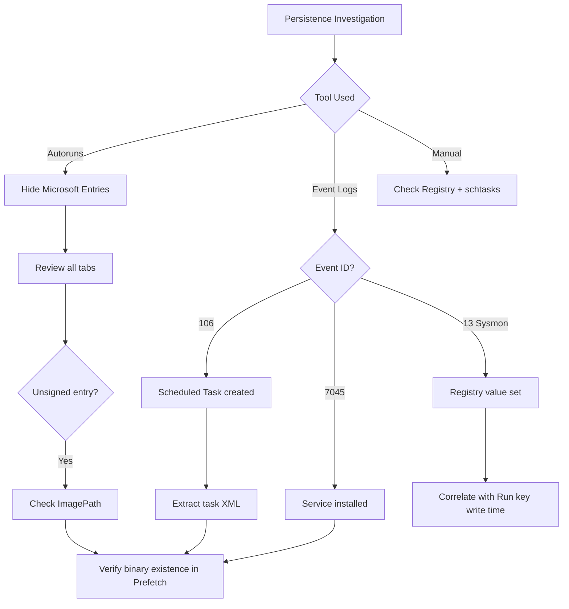
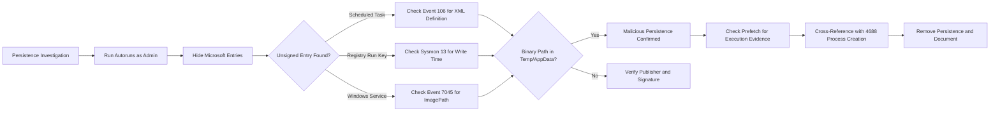

# Analyzing Persistence Mechanisms: Scheduled Tasks, Registry Run Keys & Services

## TCM Exam Objectives

- Enumerate Scheduled Tasks using schtasks and Get-ScheduledTask, focusing on suspicious binaries and triggers
- Analyze Registry Run Keys across HKLM, HKCU, WoW6432Node, and Policies\Explorer\Run locations
- Detect malicious service installations via System log Event ID 7045 and Security log Event ID 4697
- Use Autoruns for rapid triage of all auto-start extensibility points simultaneously
- Identify red flags: ImagePath in %TEMP%, encoded PowerShell commands, typosquatted names
- Correlate persistence installation with Sysmon Event 13 (Registry Value Set) and process creation events
- Query TaskScheduler Operational log Event IDs 106 (created), 140 (updated), and 200 (started)
- Distinguish between user-level (HKCU) and machine-level (HKLM) persistence scopes
- Map recovery actions (sc qfailure) as potential persistence mechanisms

Attackers install persistence mechanisms to automatically re-establish their foothold after a reboot, user logon, or system restart. The three most common auto-start extensibility points on Windows are Scheduled Tasks, Registry Run Keys, and Windows Services. Each leaves distinct forensic artifacts in the registry, file system, and event logs that enable analysts to identify, triage, and remove the persistence before the attacker returns.

- Scheduled Task enumeration and event log artifacts (106, 140, 141, 200, 201)
- Registry Run Key locations across HKLM, HKCU, and WoW6432Node
- Service installation analysis via System log 7045 and Security log 4697
- Autoruns tool workflow for rapid persistence triage
- Red flag indicators across all three persistence types
- Correlation with Sysmon Event 13 and process creation events



## Scheduled Tasks

> 📌 **Exam Tip:** Task Scheduler Operational log Event ID 106 contains the full task XML definition, including the user SID who created the task. Always check this event to identify which account installed the persistence — it may reveal a compromised user or an attacker who escalated privileges.

### How Attackers Use Scheduled Tasks

Attackers create tasks that execute payloads at defined intervals or system events. Common patterns include creating a task that runs `powershell.exe -enc ...` every 30 minutes for beaconing, setting a task to run at system startup with SYSTEM privileges, or masquerading as legitimate update tasks with names like "WindowsUpdate" or "AdobeFlashSync."

### Enumeration

```cmd
schtasks /query /fo csv /v | findstr /i "temp"
```

```powershell
# All ready tasks with details
Get-ScheduledTask | Where-Object State -eq 'Ready' |
    Get-ScheduledTaskInfo | Format-Table -AutoSize

# Tasks with suspicious actions
Get-ScheduledTask | ForEach-Object {
    $actions = ($_ | Get-ScheduledTask).Actions
    [PSCustomObject]@{
        TaskName  = $_.TaskName
        TaskPath  = $_.TaskPath
        Execute   = $actions.Execute
        Arguments = $actions.Arguments
    }
} | Where-Object { $_.Execute -match 'powershell|cmd|rundll32|wscript' }
```

### Task Scheduler Operational Log

| Event ID | Description | SOC Use |
|----------|-------------|---------|
| **106** | Task created | Contains user SID, task XML definition |
| **140** | Task updated | Shows modifications (changed binary path) |
| **141** | Task deleted | Attacker cleanup evidence |
| **200** | Task started | Correlate with process creation |
| **201** | Task completed | |

```powershell
Get-WinEvent -LogName "Microsoft-Windows-TaskScheduler/Operational" |
    Where-Object { $_.Id -eq 106 -or $_.Id -eq 140 } |
    Select-Object TimeCreated, Id, Message -First 20
```

### Red Flags in Scheduled Tasks

| Indicator | Why It Is Suspicious |
|-----------|---------------------|
| Executable path in `C:\Users\*`, `C:\Windows\Temp\`, `%APPDATA%` | Malware staging directories |
| Command contains `powershell -enc`, `cmd /c`, `rundll32` | LOLBin abuse |
| Task author is low-privilege user but runs with highest privileges | Privilege escalation |
| Trigger set to "At logon" or "At startup" with repetition | Constant beaconing |
| Task name misspelled or looks like legitimate service | Masquerading |
| Task path outside `\Microsoft\Windows\...` | Non-Microsoft tasks in root |

## Registry Run Keys

### Common Run Key Locations

| Registry Path | Scope | Notes |
|---------------|-------|-------|
| `HKLM\Software\Microsoft\Windows\CurrentVersion\Run` | Machine-wide | All users |
| `HKLM\Software\Microsoft\Windows\CurrentVersion\RunOnce` | Machine-wide (one-time) | Deleted after execution |
| `HKCU\Software\Microsoft\Windows\CurrentVersion\Run` | Current user | Per-user persistence |
| `HKCU\Software\Microsoft\Windows\CurrentVersion\RunOnce` | Current user (one-time) | Deleted after execution |
| `HKLM\Software\WOW6432Node\Microsoft\Windows\CurrentVersion\Run` | 32-bit on 64-bit | Often overlooked |
| `HKLM\Software\Microsoft\Windows\CurrentVersion\Policies\Explorer\Run` | Policy-driven | Hidden Run key |
| `C:\Users\<user>\AppData\Roaming\Microsoft\Windows\Start Menu\Programs\Startup` | Startup folder | Per-user folder |

### Enumeration

```powershell
# Common Run keys
Get-ItemProperty -Path "HKLM:\Software\Microsoft\Windows\CurrentVersion\Run"
Get-ItemProperty -Path "HKCU:\Software\Microsoft\Windows\CurrentVersion\Run"

# WoW6432Node for 32-bit keys on 64-bit systems
Get-ItemProperty -Path "HKLM:\Software\WOW6432Node\Microsoft\Windows\CurrentVersion\Run"

# Startup folder
Get-ChildItem "C:\Users\*\AppData\Roaming\Microsoft\Windows\Start Menu\Programs\Startup"
```

```cmd
reg query HKLM\Software\Microsoft\Windows\CurrentVersion\Run
reg query HKCU\Software\Microsoft\Windows\CurrentVersion\Run
```

> 📌 **Exam Tip:** The WoW6432Node Run key under HKLM is often overlooked by analysts. On 64-bit systems, 32-bit applications read from this path rather than the standard Run key. Attackers who drop 32-bit malware may use this location to hide persistence from analysts only checking the standard path.

### Event Log Correlation

- **Sysmon Event 13** (Registry Value Set): Filter `TargetObject` containing `\Run` or `\RunOnce`
- **Security Event 4657**: Registry value modified (if audit policy enabled)

```powershell
Get-WinEvent -FilterHashtable @{LogName='Microsoft-Windows-Sysmon/Operational'; ID=13} |
    Where-Object { $_.Message -match "\\\\Run" }
```

### Red Flags in Run Keys

- Paths referencing `Temp`, `AppData`, `C:\Users\Public`
- Commands using `powershell.exe`, `wscript.exe`, `mshta.exe`, `rundll32.exe`
- Encoded commands or Base64 strings in value data
- Fake names like "Java Update" or "Google Chrome Helper" pointing to random scripts
- HKLM\Run entries launching binaries from user profiles
- Values with only whitespace or empty strings

## Windows Services

### How Attackers Use Services

Attackers install new services pointing to trojan binaries with auto-start and LocalSystem privileges. They may also modify existing disabled services to point to their payload or hijack service binary paths in writable locations.

### Enumeration

```powershell
Get-CimInstance Win32_Service |
    Select Name, DisplayName, PathName, StartMode, StartName, State |
    Where-Object {
        $_.PathName -match "Temp|AppData|Public" -or
        $_.StartMode -eq "Auto" -and
        $_.PathName -notmatch "C:\\Windows\\System32"
    }
```

```cmd
sc query state= all
sc qc <ServiceName>
```

### Event Log Evidence

| Event ID | Log | Description |
|----------|-----|-------------|
| 7045 | System | Service installed (ServiceName, ImagePath) |
| 4697 | Security | Service installed (includes installing account) |

```powershell
Get-WinEvent -FilterHashtable @{LogName='System'; ID=7045} |
    Select TimeCreated,
        @{n='ServiceName';e={$_.Properties[0].Value}},
        @{n='ImagePath';e={$_.Properties[1].Value}},
        @{n='StartType';e={$_.Properties[3].Value}}
```

### Red Flags in Services

- ImagePath contains `cmd.exe /c`, `powershell.exe`, or paths in `Temp`, `AppData`, `C:\Users\Public`
- Service name identical to legitimate service with a typo
- Display name crafted to look like a Microsoft service
- Service type is Own Process pointing to an unsigned, recently created executable
- Service account is LocalSystem but the binary is in a user profile
- Recovery action set to run a malicious executable on failure (`sc qfailure`)

## Investigation Workflow



### Tools

| Tool | Purpose |
|------|---------|
| **Autoruns64.exe** | GUI to view all auto-start extensibility points |
| **schtasks /query /fo csv /v** | Dump scheduled tasks |
| **Get-ScheduledTask** | PowerShell task enumeration |
| **reg query** | Run key inspection |
| **Get-CimInstance Win32_Service** | List services with binary paths |
| **Get-WinEvent -FilterHashtable @{LogName='System'; ID=7045}** | New service installations |

### Key Event IDs

| Event ID | Log | Description |
|----------|-----|-------------|
| 106 | TaskScheduler Operational | New scheduled task created |
| 140 | TaskScheduler Operational | Scheduled task updated |
| 7045 | System | Service installed |
| 4697 | Security | Service installed (advanced audit) |
| 4657 | Security | Registry value modified (if audited) |
| 13 | Sysmon | Registry value set |

<details>
<summary>Multi-Persistence Attack Scenario</summary>

A workstation shows suspicious `powershell.exe` spawned by `svchost.exe`. Autoruns reveals:
1. **Scheduled task** named "GoogleUpdate" running `C:\Users\jdoe\AppData\Local\Temp\task.ps1` with SYSTEM privileges on logon.
2. **Run key** under `HKCU\...\Run` with value "SecurityHealth" pointing to `powershell.exe -WindowStyle Hidden -enc ...`.
3. **Service** "WinsUpdate" with ImagePath `C:\Users\jdoe\AppData\Local\Temp\svchost.exe` and auto-start.

Event logs confirm:
- Event 106 created the task by user jdoe.
- Event 7045 installed the service at the same timestamp.
- Sysmon 13 recorded the Run key modification.

Three distinct persistence mechanisms from a single attacker indicates a determined threat requiring immediate host isolation and credential rotation.
</details>



## Quick Reference

### Red Flags Across All Persistence Types

- Execution from `Temp`, `AppData`, `C:\Users\Public`
- Encoded PowerShell or `cmd /c` in command
- Unsigned binaries or misspelled names
- SYSTEM-level execution of user-profile binaries
- No Microsoft publisher or unusual parent process

### Autoruns Workflow

1. Launch as Administrator
2. Hide Microsoft Entries
3. Scan Scheduled Tasks, Logon, and Services tabs
4. Investigate unsigned, packed, or user-path entries
5. Verify against VirusTotal when available



## Recap

Scheduled Tasks (Event 106), Registry Run Keys (Sysmon 13), and Windows Services (Event 7045) are the three primary user-mode persistence mechanisms on Windows. Autoruns provides rapid visual triage of all three, while event logs confirm the installation time, user context, and binary path. Red flags across all types include execution from user-writable folders, encoded commands, unsigned binaries, and misspelled names. Cross-referencing persistence installation with process creation (4688) and network connections establishes the complete attack timeline.
