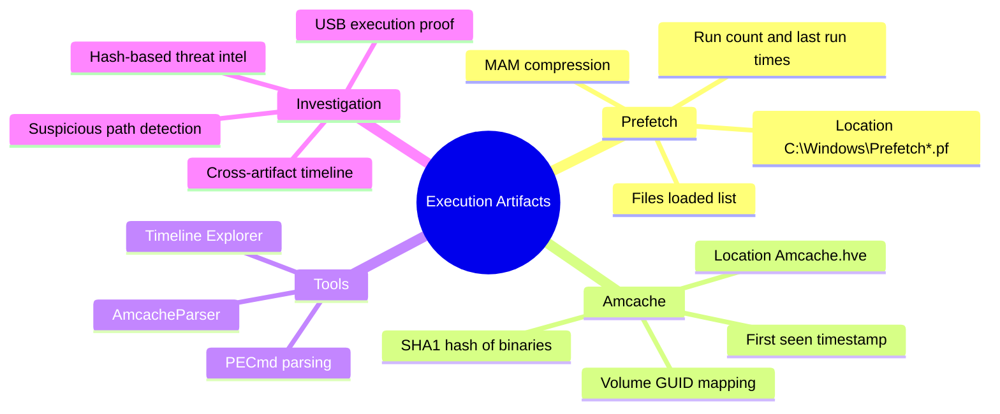
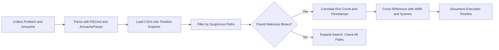
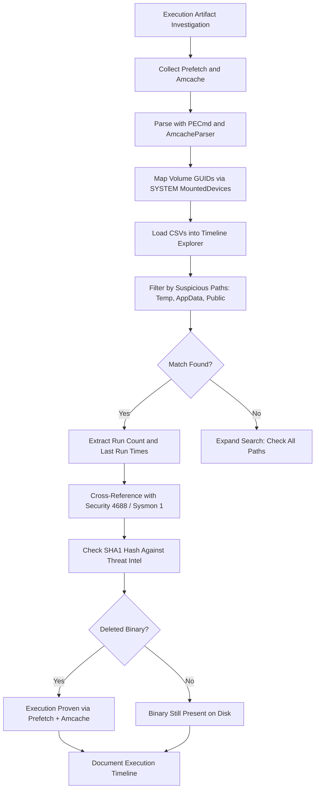

# Prefetch and Amcache for Program Execution

## TCM Exam Objectives

- Parse Prefetch files (.pf) using PECmd to extract run count, last run timestamps, and files loaded list
- Analyze Amcache.hve using AmcacheParser to retrieve SHA1 hashes and first-seen timestamps of executables
- Prove execution of deleted binaries by correlating Prefetch and Amcache artifacts
- Map Volume GUIDs to drive letters using the SYSTEM hive MountedDevices for USB execution evidence
- Detect timestomping by comparing Amcache first-seen with file system timestamps
- Identify beaconing patterns via high run counts with short intervals in Prefetch data
- Differentiate between MAM-compressed Prefetch (Windows 10/11) and legacy format
- Recognize anti-forensic indicators: empty Prefetch folder with EnablePrefetcher = 0
- Correlate Prefetch and Amcache with Security 4688, Sysmon 1, and MFT for timeline reconstruction

Prefetch files and the Amcache registry hive form the most reliable "program execution ledger" on Windows. Prefetch records how many times an executable ran and the files it loaded at startup. Amcache records the first time a binary was seen and its SHA1 hash. Both artifacts survive file deletion---proving that a binary executed even when the attacker deleted the original file. Together they provide the definitive answer to "did this binary ever run on this system?"

- Prefetch file format, location, and forensic value
- Amcache.hve structure and SHA1 hash recording
- PECmd and AmcacheParser tool usage
- Execution timeline reconstruction
- Volume GUID mapping for USB/removable media execution
- Correlation with other execution artifacts (Shimcache, BAM/DAM, UserAssist)



## Prefetch Files

### What Prefetch Records

Windows Prefetch is a performance optimization mechanism. When an application launches, Windows records the files and directories it accesses in the first 10 seconds of execution and stores this data in a `.pf` file under `C:\Windows\Prefetch`. The filename follows the pattern `<EXENAME>-<HASH>.pf` where the hash is derived from the full executable path.

### Data Stored in a Prefetch File

| Field | Description | Forensic Use |
|-------|-------------|--------------|
| **Executable name** | Original binary name | Identifies the tool |
| **Run count** | Number of executions | Determines frequency (beaconing pattern) |
| **Last run times** | Up to 8 embedded timestamps | Precise execution chronology |
| **Created time** | File system creation of `.pf` | Approximates first execution |
| **Files loaded** | Files/directories accessed at startup | Reveals loader, DLL, config file |
| **Volume paths** | Drive and directory paths | Identifies execution source (USB?) |

### Prefetch File Locations

```cmd
C:\Windows\Prefetch\CMD.EXE-89305F27.pf
C:\Windows\Prefetch\POWERSHELL.EXE-9A3B5C7D.pf
C:\Windows\Prefetch\MALWARE.EXE-A1B2C3D4.pf
```

> 📌 **Exam Tip:** Windows 10 and 11 use MAM-compressed Prefetch files. Older parsing tools (WinPrefetchView, legacy scripts) cannot read these and will silently return no data. Always use PECmd (Eric Zimmerman) for modern Prefetch analysis. On the PSAA exam, if a question mentions a Prefetch file that a tool cannot parse, the issue is likely MAM compression — the solution is to use a modern parser.

### Limitations

- Only tracks `.exe` files (not `.dll`, `.sys`, `.com` directly)
- Prefetch may be disabled on some server SKUs (`EnablePrefetcher = 0`)
- Windows 10/11 uses MAM compression (requires modern parser like PECmd)
- File creation date is not guaranteed to be first execution time

## Amcache

### What Amcache Records

The Application Compatibility Cache (Amcache) is a registry hive at `C:\Windows\AppCompat\Programs\Amcache.hve`. It records information about every executable the system has seen, including the **SHA1 hash** and **first-seen timestamp** of each binary.

### Amcache Data Structure

The key forensic path is `Root\File\{Volume GUID}\####{entry number}`. Each subkey contains:

| Value Name | Description | Forensic Relevance |
|------------|-------------|-------------------|
| **100** | Full path of the file | Where the binary was located |
| **101** | SHA1 hash of the binary | Threat intel pivot via VirusTotal |
| **102** | File size in bytes | Confirms exact variant |
| **104** | File entry timestamp | Approximate last execution time |
| **111** | First execution timestamp (Windows 10+) | Most reliable "first seen" time |

### Amcache Differences by Windows Version

| Windows Version | Amcache Capability |
|-----------------|-------------------|
| Windows 7 | Limited execution data; `RecentFileCache.bcf` also present |
| Windows 8/8.1/10/11 | Full Amcache with SHA1 and timestamps; no RecentFileCache.bcf |
| Windows 10 1809+ / 11 | Amcache.hve is locked while system is running |

> 📌 **Exam Tip:** Volume GUID mapping is essential for proving execution from USB drives. Amcache stores paths by Volume GUID (e.g., `\Device\HarddiskVolume4\malware.exe`), not by drive letter. To determine which drive letter corresponds to that GUID, cross-reference the SYSTEM hive's MountedDevices key. A USB execution chain requires both Amcache (first seen) and Prefetch (run count/timestamps) evidence, plus USB insertion events.

### Volume GUID Mapping

The `File` key is organized by volume GUID. To map GUIDs to drive letters, cross-reference the SYSTEM hive's `MountedDevices` key. This is essential for proving execution from USB drives:

```
Volume{9e3b...} → \Device\HarddiskVolume4 → E:\ (USB drive)
```

## Tools for Parsing

### PECmd (Eric Zimmerman)

```cmd
PECmd.exe -d C:\Windows\Prefetch --csv C:\evidence\prefetch
PECmd.exe -f CMD.EXE-89305F27.pf --csv C:\evidence
```

**Key output columns**: ExecutableName, RunCount, LastRun (1-8), FilesLoaded, VolumePath, FullPath, Hash.

### AmcacheParser (Eric Zimmerman)

```cmd
AmcacheParser.exe -f C:\Windows\AppCompat\Programs\Amcache.hve --csv C:\evidence\amcache
AmcacheParser.exe -f Amcache.hve -m SYSTEM --csv C:\evidence\amcache
```

The `-m SYSTEM` flag maps volume GUIDs to drive letters using the SYSTEM hive's MountedDevices.

### Other Tools

| Tool | Purpose |
|------|---------|
| **WinPrefetchView** (NirSoft) | GUI for Prefetch (may not handle MAM compression) |
| **RegRipper** | Amcache plugin for automated extraction |
| **KAPE** | Collects and parses both artifacts |

## Investigation Workflow

### Step 1: Collect the Artifacts

From a live system or forensic image, collect:
- `C:\Windows\Prefetch\*.pf`
- `C:\Windows\AppCompat\Programs\Amcache.hve`
- SYSTEM hive (for MountedDevices mapping)

### Step 2: Parse with Tools

```cmd
PECmd.exe -d C:\Windows\Prefetch --csv C:\evidence\prefetch
AmcacheParser.exe -f Amcache.hve -m SYSTEM --csv C:\evidence\amcache
```

### Step 3: Merge into Timeline

Load the CSVs into Timeline Explorer (Eric Zimmerman) or Excel. Sort by timestamp to create an execution timeline.

### Step 4: Identify Suspicious Entries

Filter for:
- Paths containing `Temp`, `AppData`, `Public`, `Downloads`
- SHA1 hashes matching known threat intel
- File names misrepresenting system binaries
- High run counts with short intervals (beaconing)
- Volume paths showing USB or network share execution

### Step 5: Correlate with Other Logs

| Artifact | What to Check |
|----------|---------------|
| Security 4688 / Sysmon 1 | Process creation for same filename and time |
| MFT | File creation and deletion timestamps |
| Sysmon 3 | Network connections from the same process |
| Event 7045 | Service installation if binary was installed as service |



<details>
<summary>Practical Scenarios</summary>

**Scenario 1: Deleted Executable Proof**
No file on disk, but Prefetch shows `BACKDOOR.EXE-A1B2C3D4.pf` with RunCount=5 and LastRun=`2024-07-15 03:14:22`. The FilesLoaded list includes `C:\Users\jdoe\Downloads\evil.dll`. Amcache confirms the SHA1 and full path. Execution is proven despite the file being deleted.

**Scenario 2: USB Execution**
Amcache entry shows `FullPath = \Device\HarddiskVolume4\malware.exe`. MountedDevices maps this to `E:\` (USB drive). Prefetch shows `MALWARE.EXE-...` with volume path `E:\malware.exe`. Combined with USB insertion events (Event 400/410), the full chain is confirmed.

**Scenario 3: Renamed Tool**
Prefetch shows `UPDATE.EXE-...` with loaded files including a `.dll` containing Mimikatz strings. Amcache SHA1 matches known Mimikatz hash. The binary was renamed but the artifacts reveal the true tool.
</details>

## Quick Reference

| Artifact | Location | Key Data | Tool |
|----------|----------|----------|------|
| **Prefetch** | `C:\Windows\Prefetch\*.pf` | Run count, last run times (8), files loaded, volume paths | PECmd |
| **Amcache** | `C:\Windows\AppCompat\Programs\Amcache.hve` | Full path, SHA1, file size, first execution timestamp | AmcacheParser |
| **RecentFileCache** | `C:\Windows\AppCompat\Programs\RecentFileCache.bcf` (Win7) | Recent executables, path only | AmcacheParser |

### Key Fields

- **Prefetch**: ExecutableName, RunCount, LastRun (1-8), FilesLoaded, VolumePath
- **Amcache**: FullPath (after volume mapping), SHA1, FileKeyLastWriteTimestamp

### Quick Commands

```cmd
PECmd.exe -d C:\Windows\Prefetch --csv C:\evidence\prefetch
AmcacheParser.exe -f Amcache.hve -m SYSTEM --csv C:\evidence\amcache
```

<details>
<summary>Exam Traps</summary>

- **Prefetch file creation date ≠ first execution date.** The embedded last run timestamps are more reliable.
- **MAM compression on Windows 10/11** will cause older parsers to fail. Always use PECmd or another modern tool.
- **Amcache.hve is locked** on a live system. Use FTK Imager Lite or boot from external OS.
- **Volume GUID mapping is crucial.** A path like `\Device\HarddiskVolume3\Users\...` does not reveal the drive letter without MountedDevices.
- **Amcache records first seen, not every execution.** Prefetch handles run frequency; Amcache handles first detection and hash.
- **Empty Prefetch folder** with `EnablePrefetcher = 0` indicates deliberate anti-forensics.
- **Run count can be reset** by attackers with SYSTEM access who delete the `.pf` file.
</details>



## Recap

Prefetch files record execution frequency, last run times (up to 8), and loaded files for every `.exe` launched on the system. Amcache records the SHA1 hash, full path, and first-seen timestamp of executed binaries. Together they prove execution even after file deletion and identify binaries run from USB drives, network shares, or renamed to masquerade as legitimate tools. PECmd and AmcacheParser extract the data, and Timeline Explorer enables chronological reconstruction of attacker activity.
