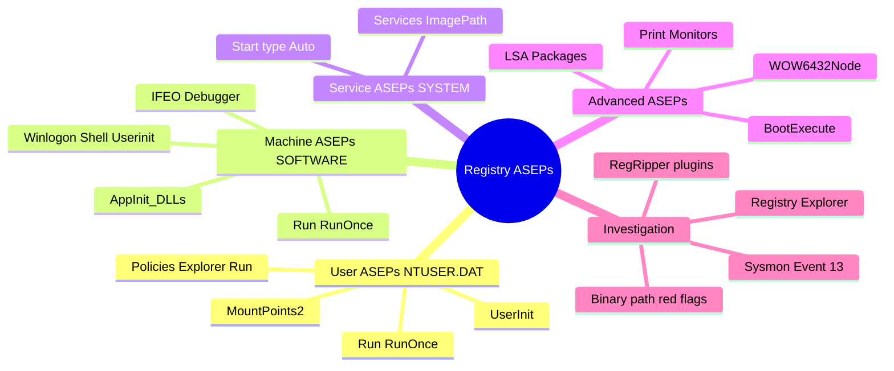
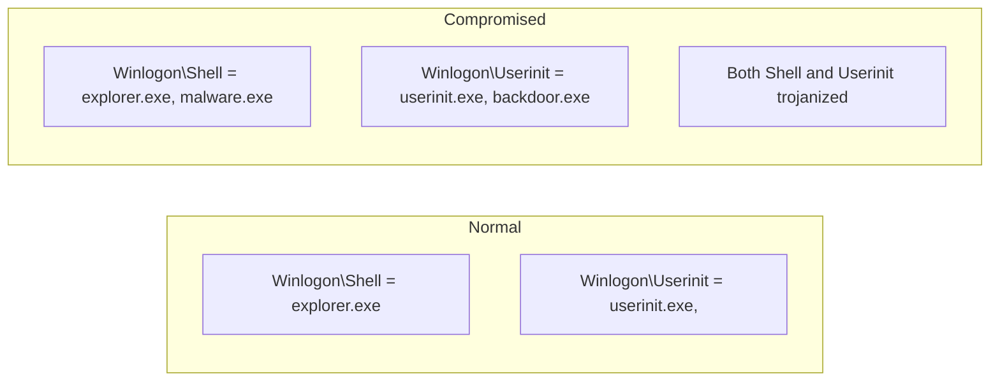
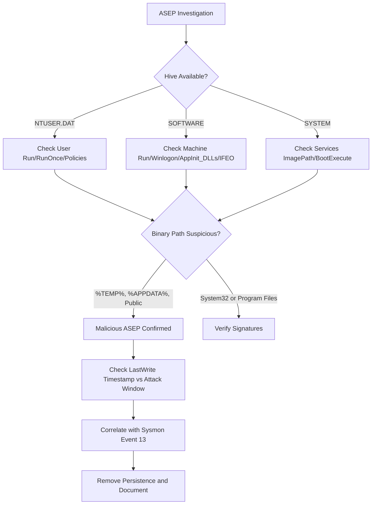

# Registry Artifacts for Auto-Start Extensibility Points (ASEPs)

## TCM Exam Objectives

- Identify user-level ASEPs in NTUSER.DAT (Run, RunOnce, Policies\Explorer\Run) for per-user persistence
- Analyze machine-level ASEPs in the SOFTWARE hive (Run, Winlogon, AppInit_DLLs, IFEO)
- Detect service-level persistence in the SYSTEM hive via ImagePath and Start type values
- Recognize Winlogon hijacking via Shell and Userinit keys with appended malicious executables
- Investigate advanced ASEPs: BootExecute, Print Monitors, LSA Packages, and WOW6432Node
- Use RegRipper and Registry Explorer to extract ASEP data from offline hive files
- Correlate ASEP modifications with Sysmon Event 13 and Security Event 4657 timestamps
- Identify red flag paths: %TEMP%, %APPDATA%, C:\Users\Public\ in ASEP value data
- Detect IFEO Debugger hijacking for sticky-key backdoors (sethc → cmd.exe)
- Map ASEP last-written timestamps to known attack windows for timeline reconstruction

Auto-Start Extensibility Points (ASEPs) are operating system registry locations that automatically launch programs at system boot, user logon, or under specific conditions. Attackers repurpose ASEPs to maintain persistence after reboot, escalate privileges by running code in a high-integrity context, load malicious DLLs into every process, or hijack system services. Because ASEPs rely on the Windows Registry, they leave clear forensic footprints in NTUSER.DAT, SOFTWARE, and SYSTEM hives.

- User-level ASEPs (Run, RunOnce, Policies\Explorer\Run in NTUSER.DAT)
- Machine-level ASEPs (Run, Winlogon, AppInit_DLLs in SOFTWARE)
- Service ASEPs and ImagePath analysis
- Image File Execution Options (IFEO) debugger hijacking
- Print Monitors, LSA Packages, and BootExecute persistence
- Sysmon Event 13 and Security Event 4657 for registry modification detection
- RegRipper and Registry Explorer analysis workflow



> 📌 **Exam Tip:** The WoW6432Node Run key under HKLM is a commonly overlooked persistence location on 64-bit Windows. 32-bit applications read from `HKLM\Software\WOW6432Node\Microsoft\Windows\CurrentVersion\Run` rather than the standard Run key. Attackers who drop 32-bit malware may hide persistence here, betting that analysts only check the 64-bit path. Always check both locations during an investigation.

## Registry Hives and ASEPs

| Hive | Disk Location | ASEP Scope |
|------|---------------|------------|
| **NTUSER.DAT** | `C:\Users\<user>\NTUSER.DAT` | User-specific auto-start |
| **SOFTWARE** | `C:\Windows\System32\config\SOFTWARE` | Machine-wide auto-start |
| **SYSTEM** | `C:\Windows\System32\config\SYSTEM` | Kernel-mode and boot-start services |
| **UsrClass.dat** | `C:\Users\<user>\AppData\Local\Microsoft\Windows\UsrClass.dat` | Shell-specific ASEPs |

## User-Level ASEPs (NTUSER.DAT)

| ASEP Key | Registry Path | Malicious Indicator |
|----------|---------------|---------------------|
| **Run** | `Software\Microsoft\Windows\CurrentVersion\Run` | Entry pointing to `%TEMP%`, `%APPDATA%`, or random string path |
| **RunOnce** | `Software\Microsoft\Windows\CurrentVersion\RunOnce` | Deleted after execution; check Sysmon 13 for creation |
| **RunServices** | `Software\Microsoft\Windows\CurrentVersion\RunServices` | Same as Run; rarely used by legitimate software |
| **Policies\Explorer\Run** | `Software\Microsoft\Windows\CurrentVersion\Policies\Explorer\Run` | Hidden Run key; bypasses standard enumeration |
| **UserInit** (HKCU) | `Software\Microsoft\Windows NT\CurrentVersion\Windows\Userinit` | If present in HKCU (normally only in HKLM), indicates backdoor |

## Machine-Level ASEPs (SOFTWARE Hive)

| ASEP Key | Registry Path | Malicious Indicator |
|----------|---------------|---------------------|
| **Run (HKLM)** | `SOFTWARE\Microsoft\Windows\CurrentVersion\Run` | Paths in user-writable folders |
| **RunOnce (HKLM)** | `SOFTWARE\Microsoft\Windows\CurrentVersion\RunOnce` | One-time execution then self-deletes |
| **Winlogon\Shell** | `SOFTWARE\Microsoft\Windows NT\CurrentVersion\Winlogon\Shell` | If set to anything other than `explorer.exe` |
| **Winlogon\Userinit** | `SOFTWARE\Microsoft\Windows NT\CurrentVersion\Winlogon\Userinit` | If additional executables appended |
| **AppInit_DLLs** | `SOFTWARE\Microsoft\Windows NT\CurrentVersion\Windows\AppInit_DLLs` | Any DLL listed with LoadAppInit_DLLs = 1 |
| **ShellServiceObjectDelayLoad** | `SOFTWARE\Microsoft\Windows\CurrentVersion\ShellServiceObjectDelayLoad` | Unexpected GUID CLSID |
| **BootExecute** | `SYSTEM\CurrentControlSet\Control\Session Manager\BootExecute` | Additional executables beyond autochk |

### Winlogon Hijacking



The `Winlogon\Shell` and `Winlogon\Userinit` keys control what programs launch during Windows logon. If an attacker appends a second executable, both run---making this one of the stealthiest persistence mechanisms on older Windows versions.

## Service ASEPs (SYSTEM Hive)

Services are defined under `SYSTEM\CurrentControlSet\Services\<ServiceName>` with the critical value `ImagePath` specifying the binary. Malicious indicators include:

- **ImagePath** pointing to `%TEMP%`, `%APPDATA%`, `C:\Users\Public\`, or random folders
- **Start** value set to 2 (auto-start)
- Service name typosquatting legitimate services
- Service description mimicking Microsoft

> 📌 **Exam Tip:** IFEO Debugger hijacking is a favorite PSAA exam topic. The classic example is the Sticky Keys backdoor: setting a Debugger value for `sethc.exe` (Sticky Keys) to `cmd.exe` means pressing Shift five times at the login screen spawns a SYSTEM-level command prompt. Check `HKLM\SOFTWARE\Microsoft\Windows NT\CurrentVersion\Image File Execution Options\` for any executable with a Debugger value set — especially sethc.exe, utilman.exe, osk.exe, and magnify.exe.

## Image File Execution Options (IFEO)

`SOFTWARE\Microsoft\Windows NT\CurrentVersion\Image File Execution Options\<executable>`

If an attacker sets the **Debugger** value for a system executable (e.g., `cmd.exe`) to point to `malware.exe`, then every time `cmd.exe` is launched, `malware.exe` runs instead.

**Forensic check**: Look for any subkey under IFEO with a **Debugger** value. The presence of a debugger for common system tools (cmd, notepad, taskmgr, sethc) is highly suspicious.

## Advanced ASEPs

### Print Monitors

`SYSTEM\CurrentControlSet\Control\Print\Monitors`

Each subkey has a `Driver` value pointing to a DLL path. Attackers can load malicious DLLs as print monitors for system-level persistence.

### LSA Packages

`SYSTEM\CurrentControlSet\Control\Lsa\OSConfig\Security Packages`

Added entries load DLLs into the Local Security Authority process, providing access to credentials and system-level persistence.

### Scheduled Tasks Registry Mirror

`SOFTWARE\Microsoft\Windows NT\CurrentVersion\Schedule\TaskCache\Tree`

Scheduled tasks are mirrored in the registry. A malicious task appears as a subkey with an `Id` value linking to the full task XML definition.

## Analysis Tools

| Tool | Purpose |
|------|---------|
| **Registry Explorer** (Eric Zimmerman) | Load and browse offline hives; shows last-written timestamps |
| **RegRipper** | Automated ASEP extraction with plugins |
| **AutoRuns** (Sysinternals) | Live system ASEP enumeration |
| **PowerShell** | Query live registry |

### RegRipper ASEP Plugins

```cmd
rip.exe -r NTUSER.DAT -p run
rip.exe -r SOFTWARE -p winlogon
rip.exe -r SYSTEM -p services
```

## Investigation Workflow

### Phase 1: Identify the ASEP Alert

Determine which registry key and value triggered the alert. Record the hostname, user context, and timestamp.

### Phase 2: Extract All ASEP Data

If given hive files, open in Registry Explorer or run RegRipper. Focus on Run, RunOnce, Winlogon, AppInit_DLLs, Services, IFEO, and BootExecute.

### Phase 3: Hunt for Anomalies

For each entry, ask:

- Is the binary path outside `C:\Windows\System32\` and `C:\Program Files\`?
- Does the file name look random or typosquatted?
- Is the binary unsigned or from an unknown publisher?
- Is the key's last-written timestamp close to known attack events?

### Phase 4: Corroborate with File System

- Check Prefetch for execution of the suspicious binary
- Check MFT for the binary's creation time and current existence
- Check LNK files or Jump Lists if a document triggered the attack

### Phase 5: Correlate with Event Logs

| Event ID | Log | What It Shows |
|----------|-----|---------------|
| Sysmon 13 | Sysmon | Registry value set (the ASEP being created) |
| Security 4657 | Security | Registry value modified (if audited) |
| System 7045 | System | Service installation |
| Security 4697 | Security | Service installation (advanced audit) |

## Red Flag Paths

```cmd
C:\Users\<user>\AppData\Local\Temp\payload.exe
C:\Users\<user>\AppData\Roaming\updater.exe
C:\ProgramData\randomname.exe
\\192.168.1.100\share\malware.exe
```

<details>
<summary>Hands-On: ASEP Investigation</summary>

**Scenario**: User reports slow workstation and strange popup at logon. You have NTUSER.DAT and SOFTWARE hives.

**Step 1**: Load hives in Registry Explorer.

**Step 2**: Check Run keys. `NTUSER.DAT\...\Run` shows:
```
Value: "WindowsUpdate" = "C:\Users\brolf\AppData\Local\Temp\updater.exe"
```
Last-written timestamp: today at 08:15 AM.

**Step 3**: Check Winlogon. `SOFTWARE\...\Winlogon`:
- Shell = `explorer.exe` (normal)
- Userinit = `userinit.exe,` (normal)

**Step 4**: Check Services in SYSTEM hive. Service named `WindowsHealth` with:
- ImagePath: `C:\Users\brolf\AppData\Local\Temp\updater.exe`
- Start: 2 (auto)
- LastWrite timestamp matches Run key.

**Step 5**: Verify with Prefetch: `UPDATER.EXE-XXXXXXXX.pf` exists with last run at 08:16 AM.

**Conclusion**: Dual persistence via Run key and rogue service, both launching the same malware from %TEMP%.
</details>

## Quick Reference

### Top ASEP Locations

| ASEP Type | Registry Path |
|-----------|---------------|
| User Run | `NTUSER.DAT\Software\Microsoft\Windows\CurrentVersion\Run` |
| Machine Run | `SOFTWARE\Microsoft\Windows\CurrentVersion\Run` |
| Winlogon Shell | `SOFTWARE\Microsoft\Windows NT\CurrentVersion\Winlogon\Shell` |
| Winlogon Userinit | `SOFTWARE\Microsoft\Windows NT\CurrentVersion\Winlogon\Userinit` |
| AppInit_DLLs | `SOFTWARE\Microsoft\Windows NT\CurrentVersion\Windows\AppInit_DLLs` |
| BootExecute | `SYSTEM\CurrentControlSet\Control\Session Manager\BootExecute` |
| Services | `SYSTEM\CurrentControlSet\Services\<Name>\ImagePath` |
| IFEO Debugger | `SOFTWARE\Microsoft\Windows NT\CurrentVersion\Image File Execution Options\<Exec>\Debugger` |
| Scheduled Tasks | `SOFTWARE\Microsoft\Windows NT\CurrentVersion\Schedule\TaskCache\Tree` |
| Print Monitors | `SYSTEM\CurrentControlSet\Control\Print\Monitors\<Monitor>\Driver` |
| LSA Packages | `SYSTEM\CurrentControlSet\Control\Lsa\OSConfig\Security Packages` |

### Malicious Indicators

- Binary path in `%TEMP%`, `%APPDATA%`, `C:\Users\Public\`
- Randomly named executable
- Typosquatted system names
- Unsigned binary
- Last-written timestamp aligning with attack window
- Value data containing Base64-encoded commands or network shares



## Recap

Registry ASEPs are the primary mechanism for Windows persistence. NTUSER.DAT contains user-level Run/RunOnce keys, SOFTWARE contains machine-wide Run, Winlogon, and AppInit_DLLs keys, and SYSTEM contains service ImagePath values. IFEO debugger keys hijack system executables, while BootExecute, Print Monitors, and LSA packages provide advanced persistence. RegRipper and Registry Explorer extract ASEP data from offline hives, and Sysmon Event 13 captures the registry modification events. All ASEP entries require confirmation via Prefetch (execution proof) and cross-reference with process creation events.
