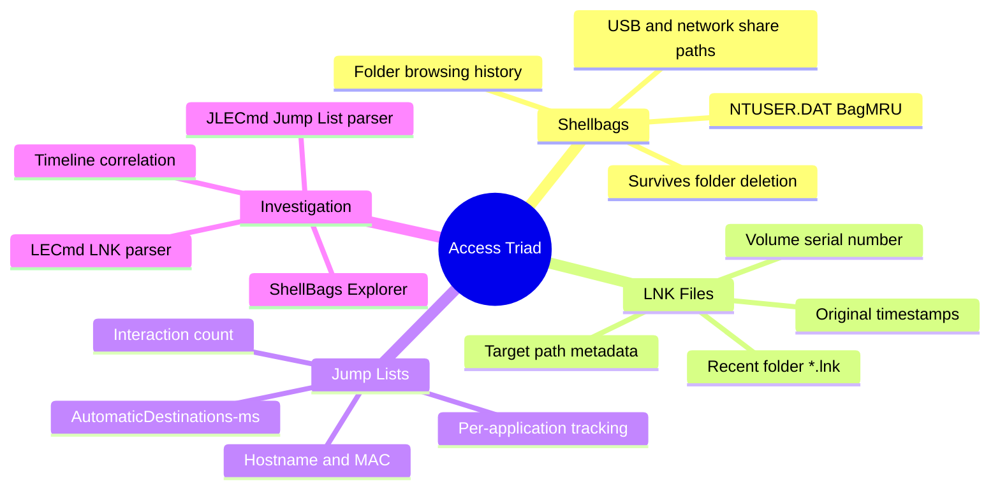
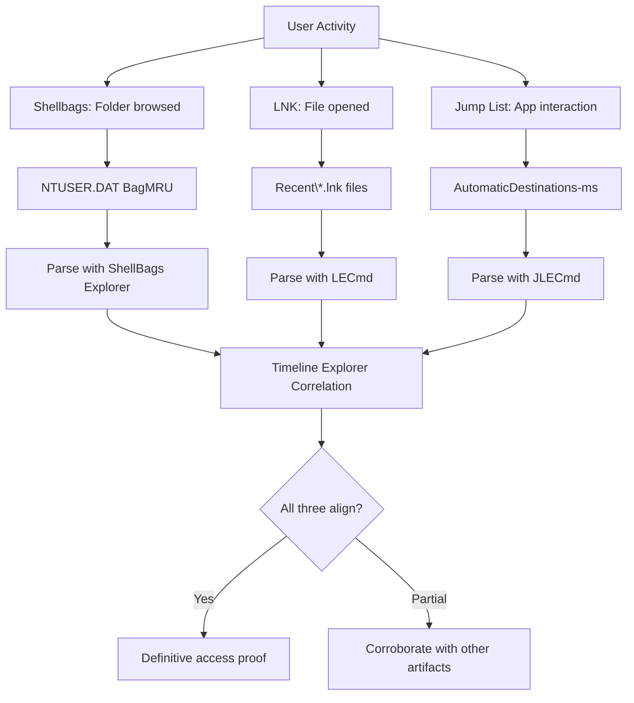
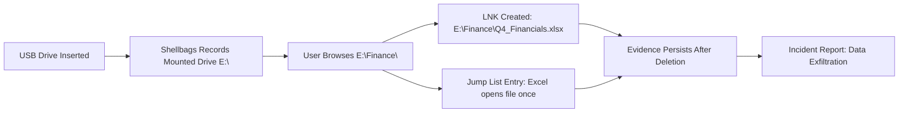
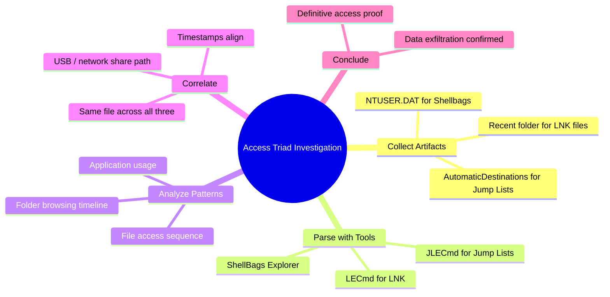

# Shellbags, LNK Files, and Jump Lists

## TCM Exam Objectives

- Parse Shellbags from NTUSER.DAT BagMRU and Bags keys to recover folder browsing history
- Extract LNK file metadata including target path, volume serial, and original timestamps using LECmd
- Analyze Jump Lists via JLECmd to identify per-application file access with interaction counts
- Prove data exfiltration by correlating Shellbags (folder browsed), LNK (file opened), and Jump List (app used)
- Detect USB and network share access via Shellbags drive letter traces and LNK volume information
- Understand that all three artifacts survive file and folder deletion
- Map AppID hex strings to application names for Jump List investigation
- Identify high interaction counts and sensitive file names as exfiltration indicators
- Use Timeline Explorer for chronological reconstruction of user access activity

Shellbags, LNK files, and Jump Lists form the "Access Triad" of Windows forensics. They silently track which folders a user browsed, which files they opened, and which applications they used---persisting even after the original files and folders have been deleted. Shellbags in the NTUSER.DAT registry hive record every folder accessed via Explorer. LNK files in the user's Recent folder record every file opened. Jump Lists record application-specific file access with interaction counts. Together they provide definitive proof of data access for data exfiltration investigations.

- Shellbags: NTUSER.DAT BagMRU and Bags keys for folder browsing history
- LNK files: Recent folder artifacts with target file metadata
- Jump Lists: AutomaticDestinations for per-application file access
- Eric Zimmerman tools: ShellBags Explorer, LECmd, JLECmd
- USB and network share access traces
- Cross-artifact correlation for data exfiltration proof



## Shellbags

### What Shellbags Record

Shellbags are registry keys that track every folder a user has browsed using Windows Explorer. They capture the folder path, window position, size, view mode, and---most critically---they survive deletion of the original folder. If an attacker browses `C:\Finance\Payroll\`, copies the files, and then deletes the entire folder, Shellbags still show that the path was accessed.

> 📌 **Exam Tip:** Shellbags survive folder deletion. If an attacker browses `C:\Finance\Payroll\`, copies files, then deletes the entire folder, Shellbags still show that the path was accessed. This makes them essential for proving data exfiltration when the original files are gone.

### Where Shellbags Live

| Hive | Key Path | Purpose |
|------|----------|---------|
| `NTUSER.DAT` | `Software\Microsoft\Windows\Shell\BagMRU` | Hierarchical folder tree |
| `NTUSER.DAT` | `Software\Microsoft\Windows\Shell\Bags` | View settings for each folder |
| `UsrClass.dat` | `Local Settings\Software\Microsoft\Windows\Shell\BagMRU` | Desktop-related folders |
| `UsrClass.dat` | `Local Settings\Software\Microsoft\Windows\Shell\Bags` | Desktop view settings |

### Reading Shellbags

The BagMRU key is a tree of numbered subkeys (0, 1, 2, ...) where each number represents a slot. The `MRUListEx` value defines the order of most recently accessed folders. To extract the full path, walk the tree:

```
Root → 0 (Desktop) → 1 (This PC) → 2 (C:\) → 3 (Users) → 4 (brolf) → 5 (Documents) → 6 (Sensitive)
```

Each slot records:
- **Slot number** (the key name)
- **MRU position** (from MRUListEx)
- **First/Last interacted timestamps**
- **Node's shell item** (folder name)

Shellbags can also reveal access to network shares and USB drives through the included device name or drive letter.

### Tool: ShellBags Explorer

```cmd
ShellBagsExplorer.exe -h C:\forensic\brolf\NTUSER.DAT -o C:\output\shellbags.csv
```

## LNK Files

### What LNK Files Record

> 📌 **Exam Tip:** LNK files contain the target file's original timestamps at the time of LNK creation. If an attacker later modifies the original file's timestamps using timestamp manipulation tools, the LNK still preserves the original timestamps from when the file was first opened. This makes LNK files a critical source of ground-truth temporal evidence.

Windows automatically creates LNK (shortcut) files whenever a user opens a non-executable file (document, PDF, image) or launches an application. These `.lnk` files contain metadata about the target file and the system that accessed it.

### Where LNK Files Live

| Location | Purpose |
|----------|---------|
| `C:\Users\<user>\AppData\Roaming\Microsoft\Windows\Recent\` | Created when user opens a file |
| `C:\Users\<user>\Desktop\` | User-created shortcuts |
| `C:\Users\<user>\AppData\Roaming\Microsoft\Office\Recent\` | Recent Office documents |
| `C:\ProgramData\Microsoft\Windows\Start Menu\Programs\Startup\` | Startup persistence |

### Data Inside an LNK File

| Field | Description |
|-------|-------------|
| **Target Path** | Full local or UNC path of the original file |
| **File Timestamps** | Creation, modification, last access of the target file at LNK creation time |
| **LNK Timestamps** | When the LNK itself was created, modified, accessed |
| **Volume Information** | Drive serial number, volume label, drive type |
| **Network Info** | UNC path and network provider (if network target) |
| **Machine Info** | NetBIOS name and MAC address of creating host |
| **File Size** | Size of the target file |

Target file timestamps inside an LNK reflect the state **at LNK creation time**. If an attacker later modifies the original file's timestamps, the LNK still contains the original values.

### Tool: LECmd

```cmd
LECmd.exe -d "C:\Users\brolf\AppData\Roaming\Microsoft\Windows\Recent" --csv C:\output\lnk
```

## Jump Lists

### What Jump Lists Record

Jump Lists track recently opened files on a per-application basis. Each application that supports Jump Lists gets its own `.automaticDestinations-ms` file named with a 16-character AppID hex string.

### Where Jump Lists Live

- **Automatic Destinations**: `C:\Users\<user>\AppData\Roaming\Microsoft\Windows\Recent\AutomaticDestinations\*.automaticDestinations-ms`
- **Custom Destinations**: `C:\Users\<user>\AppData\Roaming\Microsoft\Windows\Recent\CustomDestinations\*.customDestinations-ms`

### AppID to Application Mapping

| AppID | Application |
|-------|-------------|
| `1b4dd67f29cb1962` | Notepad.exe |
| `5b4b342b184e2d0d` | Microsoft Word |
| `f01b4d95cf55d32a` | Windows Explorer |

### Data Inside a Jump List

The **DestList** stream contains an MRU list with each entry recording:

- **File path** (full path to opened file)
- **Interaction count** (number of times opened)
- **Last access timestamp** (most recent open)
- **Hostname and MAC address** (for network shares)

The DestList persists even if the original file is deleted.

### Tool: JLECmd

```cmd
JLECmd.exe -d "C:\Users\brolf\AppData\Roaming\Microsoft\Windows\Recent\AutomaticDestinations" --csv C:\output\jumplists
```



## Cross-Artifact Correlation



When all three artifacts align:

1. **Shellbags** shows `E:\Finance\` was browsed at a specific time
2. **LNK** shows `E:\Finance\Q4_Financials.xlsx` was opened
3. **Jump List** for Excel shows the same file with interaction count and timestamp

The access is virtually undeniable.

## Investigation Workflow

### Phase 1: Parse the Artifacts

```cmd
ShellBagsExplorer.exe -h C:\forensic\brolf\NTUSER.DAT -o C:\output\shellbags.csv
LECmd.exe -d "C:\forensic\brolf\Recent" --csv C:\output\lnk
JLECmd.exe -d "C:\forensic\brolf\Recent\AutomaticDestinations" --csv C:\output\jumplists
```

### Phase 2: Filter by Timeframe

Load CSVs into Timeline Explorer or Excel. Filter by timestamps within the incident window.

### Phase 3: Identify Suspicious Activity

- **Unusual folders**: Paths outside normal Documents/Downloads
- **Sensitive file names**: `passwords.txt`, `financials.xlsx`, `customer_data.csv`
- **Removable drive access**: Paths starting with non-system drive letters
- **High interaction counts**: Repeated access to sensitive files
- **Network share paths**: UNC paths indicating remote file access

### Phase 4: Cross-Reference Artifacts

For each suspicious file:
- Does Shellbags show the containing folder was browsed at the same time?
- Does an LNK exist for that file?
- Does the corresponding Jump List confirm access with the right application?

### Phase 5: Document Findings

The report must include a precise timeline with explicit artifact citations:
- Shellbags: folder path, timestamps, hive source
- LNK: target path, creation timestamp, volume serial
- Jump List: application AppID, file path, interaction count

<details>
<summary>Data Exfiltration Scenario</summary>

**Alert**: DLP flagged user `brolf` on HOST01 opening `C:\HR\Salaries.xlsx` at 15:00, then copying to an external drive.

**Shellbags**: `NTUSER.DAT\...\BagMRU` shows:
```
Slot 5: Path C:\HR\, FirstInteracted: 14:58, LastInteracted: 15:02
```
Plus later entry: `E:\` browsed at 15:05 (USB drive).

**LNK**: `LECmd.exe` output shows:
```
TargetPath: C:\HR\Salaries.xlsx
LNK Created: 15:00:01
```

**Jump List**: Excel AppID `5b4b342b184e2d0d`:
```
Path: C:\HR\Salaries.xlsx, InteractionCount: 1, LastAccess: 15:00:01
```

**USB Evidence**: Shellbags `E:\` entry + MountPoints2 in NTUSER.DAT showing volume GUID matching a USB device.

**Conclusion**: Data exfiltration confirmed. User accessed sensitive file at 15:00, browsed to USB at 15:05.
</details>

## Quick Reference

| Artifact | Location | Key Data | Tool |
|----------|----------|----------|------|
| **Shellbags** | `NTUSER.DAT\...\Shell\BagMRU` | Folder paths, timestamps | ShellBags Explorer |
| **Shellbags (alt)** | `UsrClass.dat\...\Shell\BagMRU` | Desktop folders | ShellBags Explorer |
| **LNK Files** | `Recent\*.lnk` | Target path, timestamps, volume info | LECmd |
| **Jump Lists** | `Recent\AutomaticDestinations\*.automaticDestinations-ms` | File path, interaction count, AppID | JLECmd |

### Key Investigative Questions

| Question | Check |
|----------|-------|
| What folders were browsed? | Shellbags |
| What files were opened? | LNK files, Jump Lists |
| Which application opened the file? | Jump Lists (AppID lookup) |
| Was the file on a USB or network share? | LNK volume info / Shellbags drive letter |
| How many times was the file accessed? | Jump List interaction count |
| Did the access survive file deletion? | Yes---all three artifacts persist |



## Recap

Shellbags record folder browsing history and survive folder deletion. LNK files record file-opened events with target path and original timestamps. Jump Lists record per-application file access with interaction counts. Together they form the Access Triad that proves what was accessed, by whom, when, and from where---even after the original files have been deleted. Eric Zimmerman's tools (ShellBags Explorer, LECmd, JLECmd) parse these artifacts, and Timeline Explorer enables chronological reconstruction of user activity for data exfiltration investigations.
