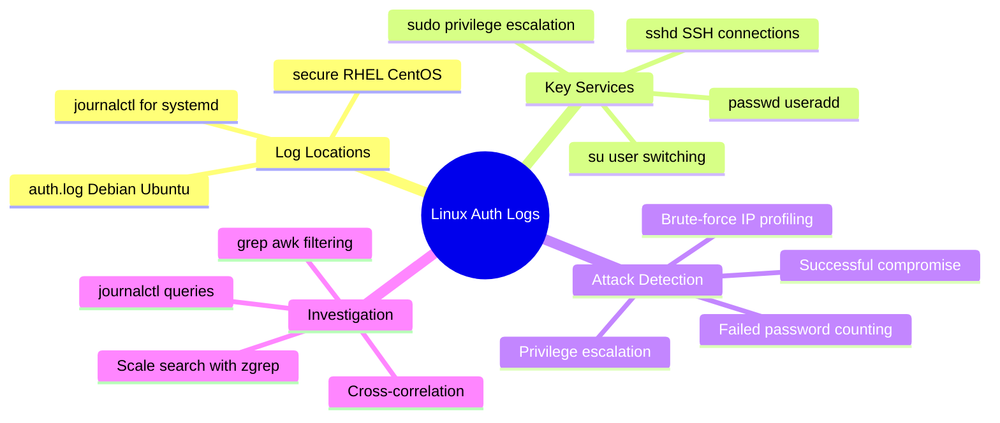
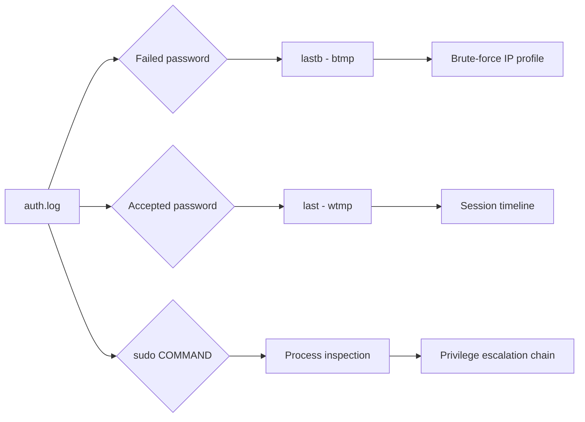
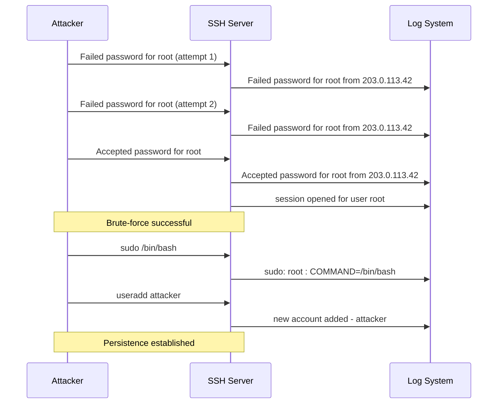
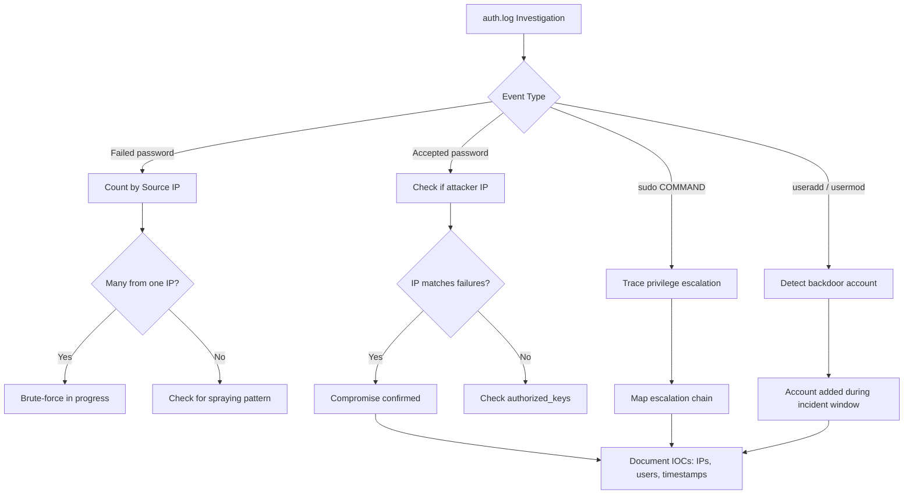
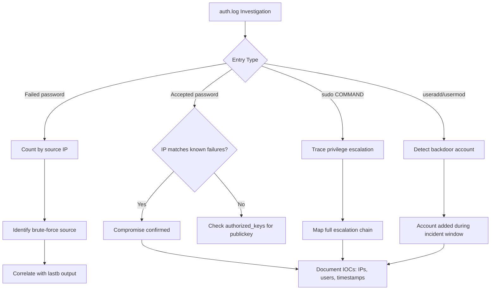

# `/var/log/auth.log` for Authentication Events

## TCM Exam Objectives

- Search `/var/log/auth.log` (Debian/Ubuntu) and `/var/log/secure` (RHEL/CentOS) for authentication events
- Identify SSH brute-force attacks by counting "Failed password" entries grouped by source IP using awk
- Detect successful compromises by correlating "Accepted password" events immediately after failure bursts
- Analyze sudo `COMMAND=` fields to trace privilege escalation chains
- Detect backdoor user creation via "new account added" and "add to group" log entries
- Distinguish between pre-auth disconnects (scanners) and actual credential attempts
- Use `zgrep` to search rotated and compressed log files for historical analysis
- Correlate auth.log with wtmp (last), btmp (lastb), and shell history for complete session analysis
- Understand that PAM redundancy means a pam_unix failure line often accompanies every Failed password line
- Recognize that auth.log timestamps may be in UTC — confirm with the system timezone before correlating

The `/var/log/auth.log` file (Debian/Ubuntu) and `/var/log/secure` (RHEL/CentOS) record every authentication attempt, privilege escalation, and account change on a Linux endpoint. These logs are written by PAM (Pluggable Authentication Modules), `sshd`, `sudo`, `su`, `login`, `passwd`, and `useradd`, making them the definitive source for tracing brute-force attacks, unauthorized logins, and attacker account manipulation.

- Auth.log vs /var/log/secure vs journalctl for different distributions
- Anatomy of SSH, sudo, su, and useradd log entries
- Failed password analysis for brute-force and password spraying
- Successful compromise detection via Accepted password events
- grep, awk, and journalctl queries for rapid triage
- Correlation with wtmp, btmp, last, and lastb



## Log Locations by Distribution

| OS Family | Log File | Primary Contents |
|-----------|----------|------------------|
| Debian / Ubuntu | `/var/log/auth.log` | All PAM-authenticated events |
| RHEL / CentOS / Fedora | `/var/log/secure` | Equivalent to auth.log |
| systemd-journald systems | `journalctl -u sshd` | If rsyslog is not forwarding to files |

Rotated logs are compressed as `auth.log.1.gz`, `auth.log.2.gz`. Always check multiple rotations when investigating past events using `zgrep`.

> 📌 **Exam Tip:** The PSAA exam may specify either Debian/Ubuntu (`/var/log/auth.log`) or RHEL/CentOS (`/var/log/secure`). Answer based on the distribution given. Also, `Accepted password` and `accepted publickey` are distinct event types — public key authentication with no prior failures suggests credential theft or SSH key abuse, not brute-force.

## Anatomy of an Auth Log Entry

```
Jul 14 02:33:11 ubuntu-server sshd[1432]: Failed password for root from 192.168.1.100 port 22 ssh2
```

| Field | Example | Meaning |
|-------|---------|---------|
| Timestamp | `Jul 14 02:33:11` | Date and time (system local time) |
| Hostname | `ubuntu-server` | The machine that generated the event |
| Process[PID] | `sshd[1432]` | Service name and process ID |
| Message | `Failed password for root from 192.168.1.100` | Event details |

The process field identifies the service: `sshd` for SSH, `sudo` for privilege escalation, `su` for user switching, `passwd` for password changes, `useradd` for account creation, and `login` for console logins.

## Key Event Patterns

### SSH Authentication

| Event Type | Log Pattern |
|------------|-------------|
| Failed password | `Failed password for root from 10.0.0.5 port 22 ssh2` |
| Failed public key | `Failed publickey for admin from 10.0.0.5 port 22 ssh2` |
| Pre-auth disconnect | `Connection closed by authenticating user root 10.0.0.5 port 22 [preauth]` |
| Successful password | `Accepted password for jdoe from 10.0.0.5 port 22 ssh2` |
| Successful public key | `Accepted publickey for admin from 10.0.0.5 port 22 ssh2` |
| Session opened | `pam_unix(sshd:session): session opened for user jdoe by (uid=0)` |
| Session closed | `pam_unix(sshd:session): session closed for user jdoe` |

### Sudo Execution

| Event Type | Log Pattern |
|------------|-------------|
| Successful sudo | `sudo: jdoe : TTY=pts/0 ; PWD=/home/jdoe ; USER=root ; COMMAND=/usr/bin/apt update` |
| Failed sudo | `sudo: pam_unix(sudo:auth): authentication failure` |
| Multiple failures | `sudo: jdoe : 3 incorrect password attempts ; TTY=pts/0 ; USER=root ; COMMAND=/usr/bin/id` |

The `COMMAND=` field shows exactly what was executed with elevated privileges.

### Account Manipulation

| Event Type | Log Pattern |
|------------|-------------|
| New user added | `useradd[9999]: new account added - backdoor-user` |
| Password changed | `passwd: pam_unix(passwd:chautokth): password changed for jdoe` |
| Group added | `usermod[9999]: add 'jdoe' to group 'sudo'` |
| Account locked | `pam_tally2(sshd:auth): user root (0) tally 11, deny 5` |

## Investigation Queries

### Basic Filtering

```bash
# All SSH events
grep "sshd" /var/log/auth.log

# Failed password attempts
grep "Failed password" /var/log/auth.log

# Successful password logins
grep "Accepted password" /var/log/auth.log

# All sudo commands
grep "sudo:.*COMMAND=" /var/log/auth.log

# Events from a specific IP
grep "10.0.0.5" /var/log/auth.log

# Events for a specific user
grep "user jdoe" /var/log/auth.log
```

### Counting and Aggregation

```bash
# Count failed attempts by source IP
grep "Failed password" /var/log/auth.log | awk '{print $(NF-3)}' | sort | uniq -c | sort -nr

# Count successful logins by user
grep "Accepted password" /var/log/auth.log | awk '{print $9}' | sort | uniq -c | sort -nr

# All IPs attempting root login
grep "Failed password for root" /var/log/auth.log | awk '{print $(NF-3)}' | sort -u

# All sudo commands executed
grep "sudo:.*COMMAND=" /var/log/auth.log | awk -F'COMMAND=' '{print $2}'
```

> 📌 **Exam Tip:** The IP address in `Failed password for root from 1.2.3.4 port 22` is located at position `$(NF-3)` in awk (the field before "port"). Always verify field indices with a sample line before relying on positional extraction in scripts — different log formats may shift field positions.

### Time-Based Filtering

```bash
# Events from a specific date
grep "^Jul 14" /var/log/auth.log

# Events between 02:00 and 03:00
awk '/^Jul 14 02:/ || /^Jul 14 03:/' /var/log/auth.log
```

### Rotated Log Search

```bash
zgrep "Failed password" /var/log/auth.log.*.gz
```

## Investigation Workflow

### Step 1: Scope the Incident

Determine the attack type based on the suspect activity: brute-force (start with `Failed password`), privilege escalation (start with `sudo:` and `su:`), or unauthorized access (start with `Accepted password`).

### Step 2: Identify the Attack Window

```bash
grep "Failed password" /var/log/auth.log | head -1
grep "Failed password" /var/log/auth.log | tail -1
```

### Step 3: Profile Attacker IPs

```bash
grep "Failed password" /var/log/auth.log | awk '{print $(NF-3)}' | sort | uniq -c | sort -nr
```

A single IP dominating the failure list is likely the brute-force source.

### Step 4: Check for Successful Login from Attacker IP

```bash
grep "Accepted" /var/log/auth.log | grep "<suspicious_ip>"
```

An `Accepted password` entry immediately after failures confirms compromise.

### Step 5: Trace Privilege Escalation

```bash
grep "sudo:.*COMMAND=" /var/log/auth.log | grep "<compromised_user>"
grep "su:.*opened for user root" /var/log/auth.log
```

### Step 6: Verify Account Manipulation

```bash
grep -E "new account added|password changed|add.*to group" /var/log/auth.log
```

### Step 7: Correlate with Other Artifacts



## Attack Pattern Detection



<details>
<summary>Exam Traps</summary>

- **auth.log vs secure**: The PSAA may specify the distribution. Debian/Ubuntu use `/var/log/auth.log`; RHEL/CentOS use `/var/log/secure`. Answer accordingly.
- **Failed password vs Connection closed**: A `Connection closed` before authentication is a scanner that did not attempt credentials. It is not a failed password but still suspicious.
- **IP field extraction**: In `Failed password for root from 1.2.3.4 port 22`, the IP is the field before `port`. Verify field indices with `awk` before relying on position.
- **Public key logins**: Look for `Accepted publickey` instead of `Accepted password` for key-based authentication.
- **UTC vs local time**: Auth log timestamps may be in UTC or local time. Confirm with `date` and the system timezone configuration.
- **PAM redundancy**: A `pam_unix(sshd:auth): authentication failure` line often accompanies a `Failed password` line. These are the same event logged twice.
</details>



## Quick Reference

| Goal | Command |
|------|---------|
| Show all SSH events | `grep "sshd" /var/log/auth.log` |
| Count failed passwords per IP | `grep "Failed password" /var/log/auth.log | awk '{print $(NF-3)}' | sort | uniq -c | sort -nr` |
| Show successful root logins | `grep "Accepted password for root" /var/log/auth.log` |
| Show all sudo commands | `grep "sudo:.*COMMAND=" /var/log/auth.log` |
| Show new user creations | `grep "new account added" /var/log/auth.log` |
| Search rotated logs | `zgrep "Failed password" /var/log/auth.log.*.gz` |
| Check auth.log on RHEL | Use `/var/log/secure` instead |
| Journalctl for SSH | `journalctl -u sshd --since "1 hour ago"` |



> **Cross-reference:** For a broader overview of Linux log architecture including syslog facilities, `journalctl` usage, and `auditd`, see Chapter 4.3 — Linux Syslog and Auth Logs. For session recording analysis with `last`, `lastb`, and `w`, see Chapter 5.2 — Analyzing User Login Records.

## Recap

`/var/log/auth.log` (Debian/Ubuntu) and `/var/log/secure` (RHEL/CentOS) record all authentication attempts via SSH, sudo, su, passwd, and useradd. Failed password entries enable brute-force IP profiling and compromise detection when an `Accepted password` follows a burst of failures. Sudo `COMMAND=` entries reveal privilege escalation chains. Account manipulation events (useradd, usermod) show backdoor creation. Correlating with `last` (wtmp), `lastb` (btmp), and `journalctl` provides the complete authentication timeline.
