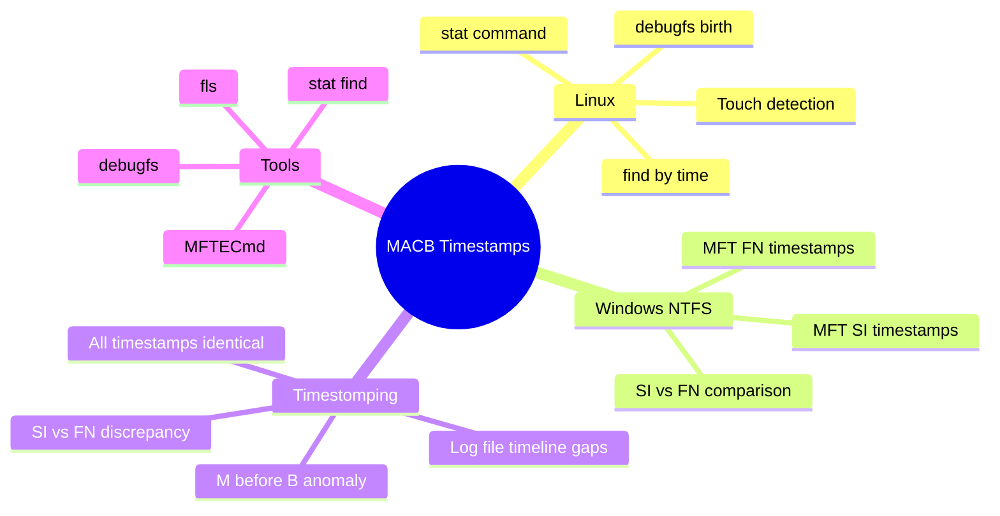
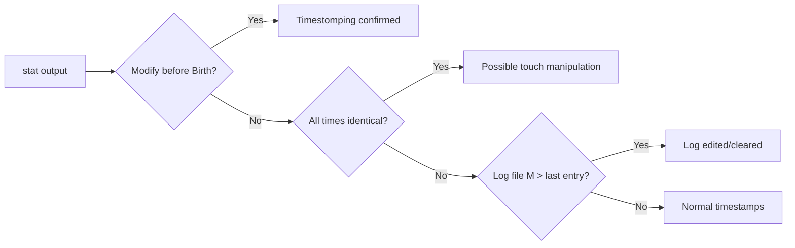
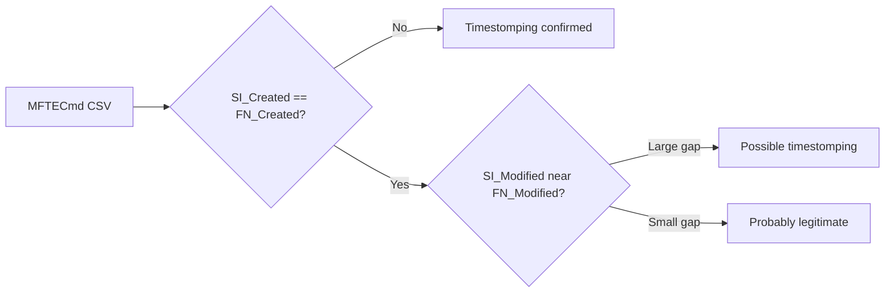
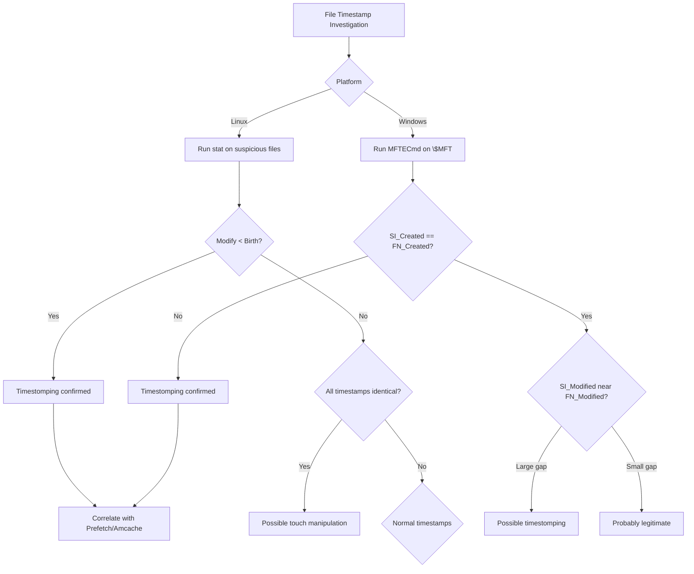
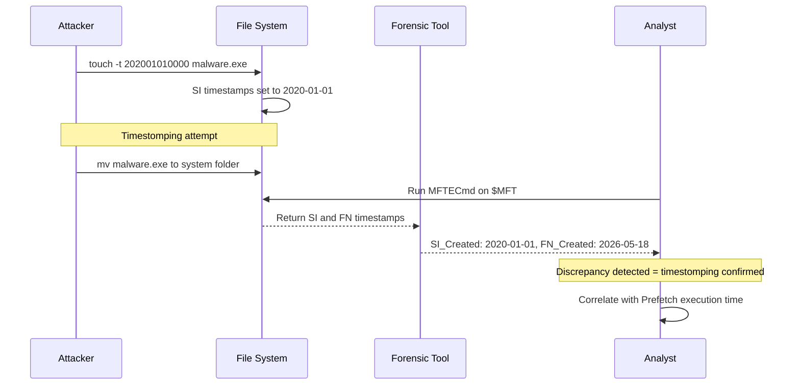

# Identifying Modified Files and Timestamps (MACB Times)

## TCM Exam Objectives

- Use `stat` and `find` on Linux to extract Modified, Accessed, Changed, and Birth timestamps
- Compare `$STANDARD_INFORMATION` (SI) and `$FILE_NAME` (FN) timestamps in the MFT to detect timestomping
- Use MFTECmd to export NTFS timestamps and identify SI/FN discrepancies
- Detect Linux timestomping via Modify-before-Birth anomalies or all-identical timestamps
- Use `debugfs` to extract ext4 birth time (crtime) for ground-truth creation time
- Correlate file timestamps with execution artifacts (Prefetch, Amcache, process creation)
- Identify log tampering by comparing log file Modified time with the last log entry timestamp
- Recognize that `cp` creates new timestamps while `mv` preserves originals — attackers may `mv` timestomped files
- Differentiate between Linux Change time (inode metadata) and Modify time (content change)

Every file and directory stores four critical timestamps: Modified (content changed), Accessed (read or executed), Changed (inode/metadata changed), and Birth (creation time). On Linux, `stat`, `find`, and `debugfs` extract these timestamps. On Windows NTFS, the `$MFT` stores two sets---`$STANDARD_INFORMATION` (easily manipulated) and `$FILE_NAME` (forensically reliable). Comparing these sets detects timestomping, the anti-forensic technique attackers use to backdate malicious files.

- MACB definitions: Modified, Accessed, Changed, Birth
- Linux stat and find commands for timestamp collection
- Windows MFT SI vs FN timestamp comparison for timestomping detection
- debugfs for ext4 birth time extraction
- MFTECmd for NTFS timestamp analysis
- Correlation with execution artifacts (Prefetch, Amcache)



## MACB Timestamp Definitions

| Time | Full Name | What It Records | Forensic Value |
|------|-----------|-----------------|----------------|
| **M** | Modified | Last content write | Shows when malware was dropped or log altered |
| **A** | Accessed | Last read or execute | Reveals when a binary was executed or file was opened |
| **C** | Changed | Last inode/metadata change | Permission or ownership changes; tracks the same time as M when content changes |
| **B** | Birth | File creation on the volume | The first time the file appeared on disk |

> 📌 **Exam Tip:** Linux atime (Access time) is often disabled or lazy-updated with the `relatime` mount option. Do NOT rely on atime as definitive evidence of file access. Instead, use Mftime (Modify) and Ctime (Change) — and for the most reliable creation time, use `debugfs` to read the ext4 crtime (Birth time).

On Linux, `C` is the inode change time (metadata only). On Windows NTFS, `C` is the MFT entry modification time.

## Linux Timestamp Collection

### stat Command

```bash
stat /path/to/file
```

Output:
```
  File: /etc/passwd
  Access: 2024-07-14 02:33:44
  Modify: 2024-07-13 22:15:10
  Change: 2024-07-13 22:15:10
  Birth: 2024-01-01 00:00:00
```

`Access` = last read, `Modify` = last content change, `Change` = last metadata change, `Birth` = creation (ext4/xfs/btrfs).

### find Commands

```bash
# Files modified in the last 24 hours
find / -type f -mtime -1 -ls 2>/dev/null

# Files accessed in the last 60 minutes
find / -type f -amin -60 -ls 2>/dev/null

# Files with metadata changed in the last 2 days
find / -type f -ctime -2 -ls 2>/dev/null
```

### Birth Time via debugfs (ext4)

```bash
debugfs -R "stat <inode>" /dev/sda1
```

Look for `crtime` in the output. This is essential for determining when a file was first created on disk, regardless of whether other timestamps were manipulated.

> 📌 **Exam Tip:** The definitive timestomping indicator on Windows is SI_Created ≠ FN_Created. On Linux, it's Modify time before Birth time (a file cannot be modified before it was created). All four timestamps set to the exact same second is another strong indicator of `touch -t` manipulation on both platforms.

### Suspicious Linux Timestamp Patterns

- **Modify time before Birth time** indicates timestomping (a file cannot be modified before it was created)
- **All four timestamps set to the exact same second** suggests `touch -t` manipulation
- **Change time later than Modify time** with identical timestamps on other fields may indicate selective timestamp manipulation

## Windows NTFS Timestamp Collection

### Two Timestamp Sets

NTFS stores two sets of MACB timestamps for each file:

| Timestamp Set | Stored In | Manipulation Difficulty |
|--------------|-----------|------------------------|
| `$STANDARD_INFORMATION` (SI) | MFT attribute | Easily modified by attackers via timestomping tools |
| `$FILE_NAME` (FN) | Directory index | Requires kernel-level access to modify |

SI is what Windows Explorer and most tools display. FN is the forensic ground truth.

### MFTECmd

```cmd
MFTECmd.exe -f C:\evidence\MFT --csv C:\output
```

The CSV output contains both SI and FN timestamps. Compare `SI_Modified` with `FN_Modified`; a significant discrepancy indicates timestomping.

### Suspicious Windows Timestamp Patterns

- **SI_Created differs from FN_Created** is the definitive timestomping indicator
- **SI timestamps set to a system installation date** while FN shows the actual attack time
- **Prefetch execution time before FN creation time** means timestamps were backdated

## Timestomping Detection

### Linux Detection



### Windows Detection



### Comparison Table

| Anomaly | Platform | Meaning |
|---------|----------|---------|
| Modify < Birth | Linux | Timestomping |
| SI_Created ≠ FN_Created | Windows | Timestomping |
| All four timestamps identical | Both | Likely touch or Set-MacAttribute |
| Log M time > last log entry | Both | Log edited or cleared |
| Prefetch time < FN Created | Windows | Timestamps backdated |
| M differs from C | Linux | Manual timestamp manipulation |

## Investigation Workflow

### Step 1: Define Compromise Window

Use logon events (4624, auth.log) or network alerts to establish a start time.

### Step 2: Find Recently Modified Files (Linux)

```bash
find /var /etc /tmp /home /dev/shm -type f -mtime -1 -ls 2>/dev/null
```

Look for new binaries in `/usr/bin`, modified configs in `/etc`, scripts in home directories, and logs with abnormal modification times.

### Step 3: Find Recently Created Files (Windows)

Use MFTECmd CSV output. Filter `SI_Created` or `FN_Created` within the compromise window. Focus on `C:\Users\Public\`, `C:\Windows\Temp\`, and `C:\Windows\Tasks\`.

### Step 4: Compare SI vs FN for Suspicious Files

For any file with a fresh creation timestamp, compare SI and FN. A gap of more than a few minutes is suspicious.

### Step 5: Correlate with Execution Artifacts

| Artifact | What It Confirms |
|----------|------------------|
| Prefetch | Binary executed; timestamp must be >= FN creation |
| Amcache | SHA1 hash and first-seen timestamp |
| Security 4688 | Process creation event |
| syslog/auth.log | Login timestamps matching file creation |

<details>
<summary>Exam Traps</summary>

- **Linux Access time (atime) is often disabled** or lazy-updated with `relatime`. Do not rely on atime as definitive evidence.
- **Linux Change time is not content change.** It updates when inode metadata changes (chmod, chown, hardlink). Content changes update both Modify and Change.
- **cp creates a new file with current timestamps; mv preserves timestamps.** Attackers may `mv` a timestomped file to hide the manipulation.
- **NTFS timestamps are UTC.** Convert when comparing to local-time event logs.
- **$FILE_NAME can be modified by kernel drivers**, but this is rare. For the PSAA, treat FN as ground truth unless a rootkit is suspected.
- **Log files that "begin" after the incident** indicate clearing. The Birth time of the new log file approximates when it was created.
</details>



## Quick Reference

### Linux

| Task | Command |
|------|---------|
| Full file timestamps | `stat /path/file` |
| Birth time (ext4) | `debugfs -R "stat <inode>" /dev/sdX` |
| Find modified in last 1 day | `find /path -type f -mtime -1 -ls` |
| Find accessed in last 30 min | `find /path -type f -amin -30 -ls` |

### Windows

| Task | Command |
|------|---------|
| Dump MFT with SI and FN | `MFTECmd.exe -f MFT --csv out` |
| Detect timestomping | Compare SI_Modified vs FN_Modified |

### Key Anomalies

- SI_Created ≠ FN_Created → timestomping
- Modify < Birth → impossible time relationship
- All four timestamps equal → likely `touch -t` or `Set-MacAttribute`
- Log M time later than last log entry → log editing



## Recap

MACB timestamps (Modified, Accessed, Changed, Birth) provide the temporal fingerprint of every file operation. Linux `stat` and `find` extract timestamps; Windows MFTECmd extracts both `$STANDARD_INFORMATION` (SI) and `$FILE_NAME` (FN) timestamps. SI vs FN comparison is the definitive timestomping detection method. Linux timestomping is identified by Modify before Birth anomalies or all-identical timestamps. Always correlate with execution artifacts (Prefetch, Amcache, process creation) and logon events to validate the timeline and confirm timestamp anomalies.
