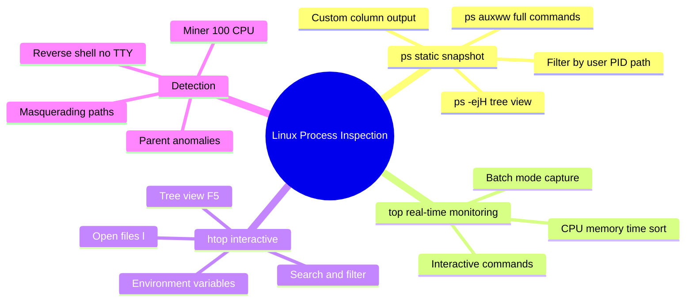
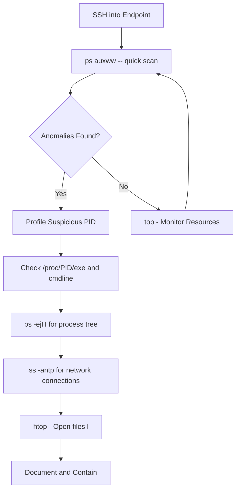
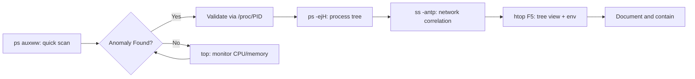

# Using `ps`, `top`, and `htop` for Process Inspection

## TCM Exam Objectives

- Use `ps auxww` for full command line visibility to detect Base64 payloads and hidden paths
- Display process trees with `ps -ejH` to identify anomalous parent-child relationships
- Sort processes in `top` by CPU (P) for crypto miner detection and memory (M) for credential dumpers
- Use `htop` tree view (F5) to instantly spot reverse shells (bash spawned by nc) and webshells (apache2 spawning python)
- Inspect process environment variables via `htop e` for LD_PRELOAD hook detection
- Validate suspicious processes directly through the /proc filesystem (cmdline, exe, environ)
- Detect reverse shells by identifying TTY `?` with shell processes (bash, sh, python)
- Correlate processes with network connections using `ss -antp` and `lsof -i`
- Recognize bracketed process names as masquerading indicators

`ps`, `top`, and `htop` are the first-line tools for inspecting running processes on a Linux endpoint. `ps` provides a static, filterable snapshot of all processes. `top` provides real-time resource monitoring sorted by CPU or memory. `htop` adds interactive tree view, search, and direct access to process environment variables and open files. Together they reveal crypto miners, reverse shells, credential dumpers, and masquerading processes by examining the command line, parent process, user context, and resource consumption.

- ps auxww for full command line visibility
- ps tree view (ps -ejH) for parent-child relationship analysis
- top interactive commands: sort by CPU (P), memory (M), time (T)
- htop tree view (F5) and open files (l) for C2 detection
- /proc filesystem cross-validation of process data
- Suspicious indicators: hidden paths, bracketed names, no TTY shells



## ps -- Static Snapshot

> 📌 **Exam Tip:** Always validate suspicious processes through /proc before taking action. The `ps auxww` output can be manipulated by rootkits that hook system calls, but reading `/proc/<PID>/exe`, `/proc/<PID>/cmdline`, and `/proc/<PID>/status` directly from the proc filesystem bypasses userland tampering. `/proc/<PID>/exe` is a symbolic link to the actual binary — a readlink resolves the true path even if the process name is masqueraded.

### Essential Invocations

| Command | What It Shows |
|---------|---------------|
| `ps aux` | All processes: USER, PID, %CPU, %MEM, VSZ, RSS, TTY, STAT, START, TIME, COMMAND |
| `ps auxww` | Same with unlimited command line width |
| `ps -ef` | Unix style: UID, PID, PPID, C, STIME, TTY, TIME, CMD |
| `ps -ejH` | Process tree with PID, PGID, SID, hierarchy |
| `ps -eo pid,ppid,user,cmd,%cpu,%mem` | Custom columns for SOC analysis |

Always use `ps auxww` in an investigation to see complete command lines. Attackers often truncate visible payloads at 80 characters.

### Key Fields

| Field | Meaning | Suspicious Indicator |
|-------|---------|----------------------|
| USER | Owner of the process | `www-data` running `/bin/bash` |
| %CPU | CPU usage | Single process at 100% = likely miner |
| %MEM | Memory usage | High memory = password dumper |
| STAT | Process state | Z (zombie) with missing parent |
| TTY | Controlling terminal | Shell with `?` = reverse shell |
| COMMAND | Command line | Paths in `/tmp`, Base64 blobs |

### Filtering and Searching

```bash
# Processes owned by a user
ps -u jdoe

# Process by PID with parent
ps -p 1337 -o pid,ppid,user,cmd

# Full command line for a specific PID
cat /proc/1337/cmdline | tr '\0' ' '

# Processes running from /tmp, /dev/shm
ps auxww | grep -E '/tmp|/dev/shm|/var/tmp'

# Shells without a terminal (reverse shells)
ps auxww | grep '?' | grep -E 'bash|sh|python|perl'

# Tree view for a specific PID
ps -ejH | grep -A5 1337

# Custom columns sorted by CPU for incident reports
ps -eo pid,ppid,user,%cpu,%mem,stat,tty,start,time,comm,args --sort=-%cpu | head -20
```

## top -- Real-Time Monitoring

### Launch and Interpret

Run `top`. The screen shows:
- **Summary area**: uptime, load average, total tasks, CPU states, memory usage
- **Task area**: processes sorted by %CPU by default

**Critical CPU states**: `us` (user), `sy` (system), `id` (idle---should be high), `wa` (iowait), `hi`/`si` (interrupts).

**Memory lines**: `total`, `free`, `used`, `buff/cache`. Sudden free memory drop may indicate in-memory scraping.

### Interactive Commands

| Key | Action | SOC Use |
|-----|--------|---------|
| `P` | Sort by CPU | Find crypto miner |
| `M` | Sort by memory | Find password dumper |
| `T` | Sort by run time | Long-running suspicious processes |
| `c` | Toggle full command path | See complete command line |
| `V` | Forest view | Trace process lineage |
| `k` | Kill a process | PID + signal (15 or 9) |
| `u` | Filter by user | Show only suspect user's processes |
| `1` | Show per-CPU stats | Detect single-core saturation |

```bash
# Batch mode for documentation
top -b -n 1 -o %CPU | head -20
```

## htop -- Interactive Power Tool

htop provides color-coded CPU and memory bars, mouse support, and interactive process inspection.

### Key Features

| Key | Feature | SOC Use |
|-----|---------|---------|
| F5 | Tree view | See parent-child relationships instantly |
| / | Search | Find processes by name |
| \ | Filter | Filter list to matching processes |
| F9 | Kill | Send signal to process |
| `e` | Environment | View `LD_PRELOAD` hooks |
| `l` | Open files | See network sockets (C2 detection) |

### Detection Examples

- **Tree view**: Reveals `bash` spawned by `nc` (reverse shell) or `python` spawned by `apache2` (webshell)
- **Open files (l)**: Shows TCP connection to `192.168.1.100:4444` (confirmed C2)
- **Environment (e)**: Shows `LD_PRELOAD=/tmp/malicious.so` (library hijacking)

## Investigating the /proc Filesystem

All three tools read from `/proc`. Cross-validate suspicious processes directly:

```bash
# Full command line
cat /proc/<PID>/cmdline | tr '\0' ' '

# Binary path
ls -l /proc/<PID>/exe

# Process status (UID, threads, memory)
cat /proc/<PID>/status

# Working directory
ls -la /proc/<PID>/cwd

# Environment variables
cat /proc/<PID>/environ | tr '\0' '\n'
```

## Investigation Workflow



### Step 1: Quick Snapshot

```bash
ps auxww | less
```

Scan for: paths in `/tmp`, Base64 strings, `nc`, `python -c`, `perl -e`, processes with TTY `?` running shells.

### Step 2: Profile Suspicious PID

```bash
ps -p <PID> -o pid,ppid,user,stat,tty,cmd
ls -l /proc/<PID>/exe
cat /proc/<PID>/cmdline | tr '\0' ' '
```

### Step 3: Check Parent-Child Relationship

```bash
ps -ejH | grep <PID>
```

Normal: `sshd → bash`. Suspicious: `bash → nc`, `apache2 → python`, `systemd → /tmp/backdoor`.

### Step 4: Network Correlation

```bash
ss -antp | grep <PID>
lsof -i -a -p <PID>
```

Established connections to external IPs on high ports indicate C2.

### Step 5: Check for Persistence

```bash
crontab -l
systemctl list-units --type=service --state=running
ls -la /proc/<PID>/cwd
```

> 📌 **Exam Tip:** TTY ? (no terminal) is one of the strongest indicators of a reverse shell on Linux. Normal shell sessions have a TTY like pts/0, pts/1, or tty1. A bash, sh, python, or perl process with TTY ? indicates the shell was spawned by a network service (web server, Netcat listener) and has no controlling terminal. Combine this with `ss -antp` to confirm the associated outbound connection.

## Attack Pattern Detection

| Attack Pattern | ps/top/htop Indicators |
|----------------|------------------------|
| Reverse shell | `bash -i >& /dev/tcp/...` or `nc -e /bin/bash`. TTY `?`. Parent is `nc` or `python` |
| Crypto miner | Process name like `xmrig`. 100% CPU per core. Running from `/tmp/.xmr/` |
| Credential dumper | High memory process reading `/proc/` or `/usr/lib/` |
| Webshell process | `www-data` running `/bin/bash` or `python`. Parent is `apache2` |
| Masquerading | Bracketed process name but PID outside kernel range; `/proc/PID/exe` points to a file |
| LD_PRELOAD hijack | Environment variable visible via `htop e` or `/proc/PID/environ` |

<details>
<summary>Hands-On: Suspicious Process on Web Server</summary>

**Scenario**: SSH into sluggish web server. `ps auxww` shows:
```
USER       PID %CPU %MEM    VSZ   RSS TTY      STAT START   TIME COMMAND
www-data  1337 99.0  5.0 123456 234567 ?       Sl   02:05 120:00 /tmp/.xmr/xmrig -c config.json
root      1338  0.0  0.0  12345  1234 ?        S    02:05   0:00 bash -i
www-data  1339  0.0  0.1  23456  3456 ?        S    02:06   0:00 python -c import socket,subprocess,os...
```

`ss -antp` shows PID 1337 connected to `pool.minexmr.com:443`. `top` shows CPU idle at 2%.

**Analysis**:
- PID 1337: Crypto miner (`xmrig`) running from `/tmp/.xmr/`, 99% CPU
- PID 1338: Reverse shell (`bash -i` with no TTY)
- PID 1339: Python reverse shell (socket operations)
- All run as `www-data`, indicating web server exploitation

**Action**: Kill PIDs 1337, 1338, 1339. Remove `/tmp/.xmr/`. Investigate web application vulnerability.
</details>

## Quick Reference

```bash
# ps
ps auxww                                     # Full wide listing
ps -eo pid,ppid,user,%cpu,%mem,stat,tty,cmd  # Custom columns
ps -u <user>                                 # By user
ps auxww | grep -E '/tmp|/dev/shm'           # Suspicious paths
ps -ejH | grep <PID>                         # Process tree

# top
# P=CPU sort, M=memory, T=time, c=full command, V=tree, k=kill
top -b -n 1 -o %CPU | head -20              # Batch snapshot

# htop
# F5=tree, /=search, \=filter, F9=kill, e=env, l=open files
htop -u <user>                               # Filter by user

# /proc validation
cat /proc/<PID>/cmdline | tr '\0' ' '
ls -l /proc/<PID>/exe
cat /proc/<PID>/status

# Network correlation
ss -antp | grep <PID>
lsof -i -a -p <PID>
```



## Recap

`ps auxww` provides a static snapshot with full command lines for identifying paths in `/tmp/`, no-TTY shells, and Base64 payloads. `top` provides real-time CPU/memory monitoring with interactive sorting to find crypto miners and resource-abusing processes. `htop` adds tree view (F5) for parent-child analysis, environment variable inspection (e) for LD_PRELOAD detection, and open files (l) for network socket verification. Always validate suspicious processes via `/proc/<PID>/exe` and `/proc/<PID>/cmdline`, and correlate with `ss -antp` for network connections.
