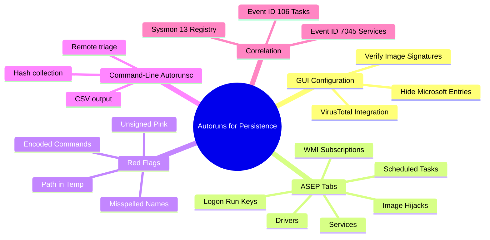
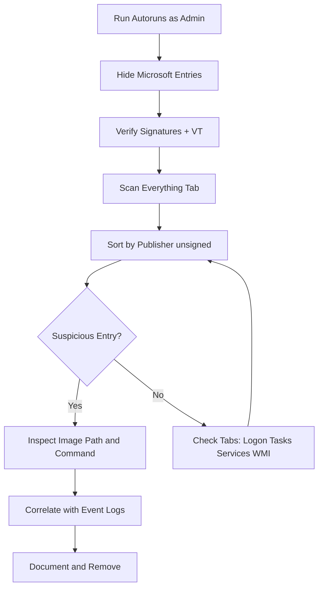
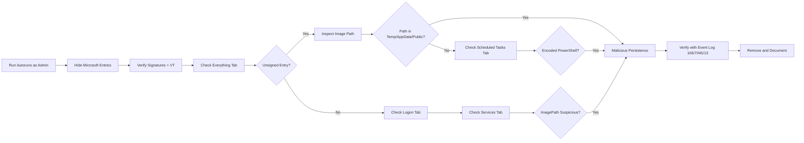

# Autoruns for Persistence Enumeration

## TCM Exam Objectives

- Configure Autoruns with Hide Microsoft Entries, Verify Signatures, and VirusTotal integration for rapid triage
- Navigate all ASEP tabs: Logon, Scheduled Tasks, Services, Drivers, WMI, Image Hijacks, AppInit, Winlogon
- Identify unsigned (pink) entries with suspicious image paths in Temp, AppData, or Public folders
- Use Autorunsc command-line for headless triage and CSV evidence collection
- Correlate Autoruns entries with TaskScheduler Event 106, System Event 7045, and Sysmon Event 13
- Detect WMI fileless persistence via __EventFilter and CommandLineEventConsumer entries
- Recognize common attack patterns: Run key backdoors, scheduled task C2 beacons, fake services, sticky keys hijacks
- Differentiate between user-level and machine-level persistence scopes
- Apply the Autoruns → Event Log → Process Explorer triage pipeline for endpoint investigation

Autoruns is the Sysinternals tool that enumerates every auto-start extensibility point (ASEP) on a Windows system---far beyond what Task Manager or MSConfig reveal. It collects registry Run/RunOnce keys, scheduled tasks, services, drivers, browser helper objects, Office add-ins, WMI event subscriptions, print monitors, LSA providers, AppInit DLLs, and more. For a SOC analyst, Autoruns is the single most efficient tool to answer how malware is surviving reboots.

- GUI configuration: Hide Microsoft Entries, verify signatures, VirusTotal integration
- Every tab and its associated ASEP category
- Column indicators: unsigned (pink), packed, path anomalies
- Autorunsc command-line for headless triage and scripting
- Event log correlation with TaskScheduler 106, System 7045, Sysmon 13
- WMI fileless persistence detection



> 📌 **Exam Tip:** Always check the "Hide Microsoft Entries" and "Verify Image Signatures" options in Autoruns before starting your analysis. This removes the vast majority of legitimate entries and highlights unsigned (pink/purple) binaries. On the PSAA exam, if a question asks how to quickly identify suspicious persistence among hundreds of entries, the answer is: hide Microsoft entries, sort by unsigned, and inspect any binary path that includes Temp, AppData, or Public.

## Launching and Configuring Autoruns

Always run as Administrator. Configure these options in order:

1. **Options -> Hide Microsoft Entries**: Hides items signed by Microsoft Corporation. This removes the vast majority of legitimate entries.
2. **Options -> Hide Windows Entries**: Hides entries in standard Windows locations even if unsigned.
3. **Options -> Verify Image Signatures**: Checks every binary's digital signature. Unsigned files are highlighted pink.
4. **Options -> Scan Options -> Check VirusTotal.com**: Submits unknown file hashes to VirusTotal for multi-engine scanning.

After these filters, only third-party, non-standard, potentially suspicious persistence entries remain visible.

## Autoruns Tabs and ASEP Categories

| Tab | What It Contains | Common Attacker Abuse |
|-----|------------------|----------------------|
| **Logon** | Registry Run keys, Startup folders, user init scripts | HKCU Run keys pointing to user-writable paths |
| **Scheduled Tasks** | Task Scheduler tasks | Tasks running encoded PowerShell, hidden C2 binaries |
| **Services** | Windows services (includes drivers) | Malicious services running as LocalSystem from Temp |
| **Drivers** | Kernel-mode drivers | Rootkits, kernel-mode backdoors |
| **WMI** | WMI event subscriptions | Fileless persistence triggered on events |
| **Image Hijacks** | IFEO debugger settings | Sticky keys backdoor (sethc -> cmd) |
| **AppInit** | AppInit_DLLs loaded into every user process | DLL injection into all processes |
| **Winlogon** | Shell, Userinit, Taskman | Replacing userinit.exe with trojan |
| **Boot Execute** | Items at system boot | Native API hooks |
| **LSA Providers** | LSA security packages | Credential theft at logon |
| **Print Monitors** | Print monitor drivers | Sneaky persistence via printer subsystem |

## Key Columns and Red Flags

| Column | Red Flag |
|--------|----------|
| **Autorun Entry** | Misspelled name mimicking Microsoft service |
| **Publisher** | Empty or `(Not verified)` |
| **Image Path** | `C:\Users\Public\`, `C:\Windows\Temp\`, `%APPDATA%\` |
| **Time Stamp** | Recently created file masquerading as old |
| **VirusTotal** | Any detection at all (1/75) is suspicious |

**Color coding**: Pink/purple = unsigned, White = signed and verified.

### Investigation Workflow



**Step 1**: Run Autoruns as Administrator with filters enabled.

**Step 2**: Click the **Everything** tab. Sort by Publisher to group unsigned items, or by Image Path to see paths outside System32.

**Step 3**: Switch to **Logon**, **Scheduled Tasks**, **Services**, and **WMI** tabs individually. Focus on unsigned entries pointing to user-writable paths.

**Step 4**: For each suspicious entry, double-click to open the registry or file location. Right-click -> Properties for image details. Right-click -> Check VirusTotal for fresh scan.

**Step 5**: Correlate with event logs:

| Autoruns Entry Type | Event Log Correlation |
|---------------------|-----------------------|
| Scheduled Task | TaskScheduler Operational 106 (created), 140 (updated) |
| Service | System 7045, Security 4697 |
| Run key | Sysmon 13, Security 4657 |
| WMI subscription | Sysmon 19, 20, 21 |

> 📌 **Exam Tip:** WMI persistence is fileless — no binary on disk, no Run key, no service — making it one of the hardest-to-detect persistence mechanisms. However, Autoruns displays WMI event subscriptions in its WMI tab. Look for `__EventFilter` objects with `CommandLineEventConsumer` that contain encoded PowerShell or script execution. On the PSAA exam, WMI persistence is a known trick question for "which persistence mechanism leaves no file on disk."

## Autorunsc -- Command-Line Triage

```cmd
autorunsc -a * -c -h -s -m -v -x > autoruns_report.csv
```

- `-a *` : All ASEPs
- `-c` : CSV output
- `-h` : Hash files (MD5, SHA1, SHA256)
- `-s` : Verify digital signatures
- `-m` : Hide Microsoft entries
- `-v` : Check VirusTotal

Quick scan for unsigned persistence:
```cmd
autorunsc -a * -m -s -c > unsigned_persistence.csv
```

## Common Attack Patterns in Autoruns

| Technique | Autoruns Tab | Typical Entry |
|-----------|--------------|---------------|
| Run key backdoor | Logon | `HKCU\...\Run` -> `%TEMP%\payload.exe` |
| Scheduled task C2 | Scheduled Tasks | Task runs `powershell -enc ...` every 30 min |
| Fake service | Services | Service "WinHelp" -> `C:\Windows\Temp\svchost.exe` |
| WMI fileless | WMI | `__EventFilter` triggers on user logon |
| Sticky keys backdoor | Image Hijacks | `sethc.exe` debugger -> `cmd.exe` |
| LSA credential theft | LSA Providers | New security package `evil.dll` |

<details>
<summary>Exam Traps</summary>

- **Hide Microsoft Entries is not enough.** Many legitimate third-party entries are signed but not by Microsoft. Always verify signatures and check paths.
- **A signed entry is not always safe.** Stolen certificates exist. A signed `powershell.exe` with `-enc` is still malicious.
- **Autoruns shows entries from loaded user hives only.** For full coverage of all users, load each NTUSER.DAT manually.
- **WMI persistence is fileless but Autoruns displays the subscription.** If the `CommandLineEventConsumer` contains a script, the script block is visible in Autoruns.
- **Boot Execute entries like PendingFileRenameOperations** can be used by attackers to overwrite system files at reboot.
</details>

## Quick Reference

```cmd
autorunsc -a * -c -h -s -m -v -x > results.csv
```

### Key Tabs

- Everything (first triage)
- Logon (Run keys, Startup)
- Scheduled Tasks (most abused)
- Services (system-level persistence)
- WMI (fileless)
- Image Hijacks (debugger backdoors)

### Red Flags

- Unsigned (pink)
- Path in Temp, AppData, Public, ProgramData
- Command: `powershell -enc`, `cmd /c`, `rundll32`, `mshta`
- VirusTotal: 1+ detections
- Name: Misspelled system binary



## Recap

Autoruns enumerates all ASEPs on a Windows system across Logon, Scheduled Tasks, Services, WMI, Image Hijacks, and more tabs. Always hide Microsoft entries, verify signatures, and check VirusTotal. Unsigned binaries with user-writable paths, encoded PowerShell commands, and misspelled names are immediate red flags. Correlate entries with TaskScheduler Event 106, System Event 7045, and Sysmon Event 13 for temporal confirmation of persistence installation. Autorunsc enables headless triage for remote collection and scripting.
