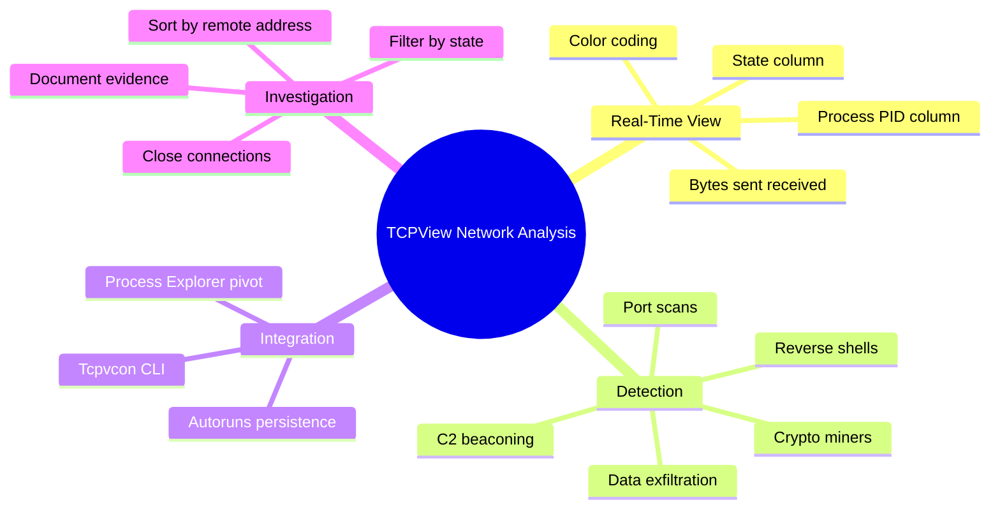
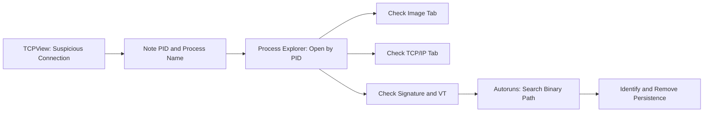
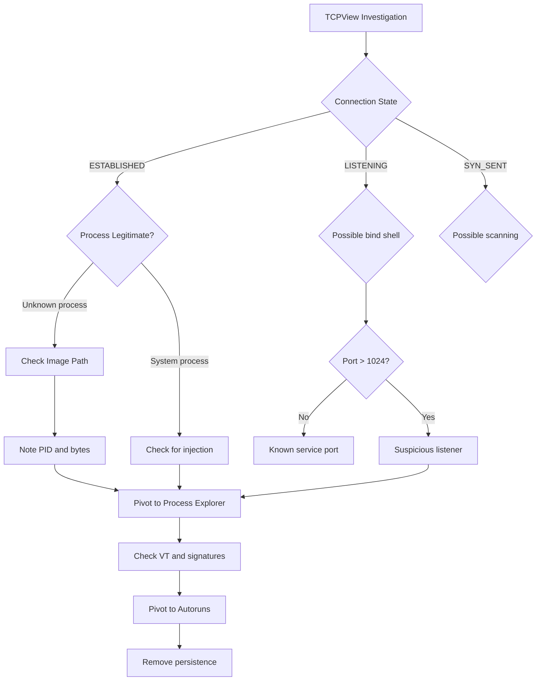
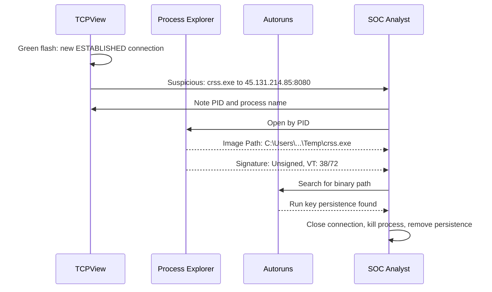

# TCPView for Network Connection Analysis

## TCM Exam Objectives

- Use TCPView to identify process-attributed network connections with real-time color-coded state changes
- Detect C2 beaconing via rhythmic green highlights from the same process to the same external IP
- Identify data exfiltration through asymmetric Sent/Received byte ratios on established connections
- Distinguish reverse shells (ESTABLISHED from cmd.exe on high ports) from bind shells (LISTENING on high ports)
- Use the TCPView → Process Explorer → Autoruns triage pipeline for full endpoint investigation
- Employ Tcpvcon command-line for headless CSV collection and evidence documentation
- Spot typosquatted process names (crss.exe vs csrss.exe) connected to suspicious remote addresses
- Detect port scanning via rapid SYN_SENT connections from a single process to multiple IPs
- Recognize cryptominer connections to domains containing "pool", "mine", or "xmr"

TCPView provides real-time visibility into every TCP and UDP endpoint on a Windows system, attributing each connection to the specific process that owns it. Unlike netstat, TCPView updates continuously with color-coded state changes---green for new connections, red for closed, yellow for state transitions. This process-to-connection mapping is its primary forensic value, enabling analysts to instantly identify which program is communicating with a suspicious remote address.

- Real-time color-coded connection monitoring (green, red, yellow)
- Process-attributed network connections with PID
- C2 beacon, data exfiltration, reverse shell, and port scan detection
- Tcpvcon command-line companion for scripting
- TCPView -> Process Explorer -> Autoruns triage pipeline
- Listening port and bind shell identification



## Interface and Columns

Launch Tcpview.exe as Administrator. Key columns:

| Column | Forensic Value |
|--------|---------------|
| **Process** | Executable name and PID owning the endpoint |
| **Protocol** | TCP or UDP |
| **Local Address** | Local IP and port; 0.0.0.0:4444 is suspicious |
| **Remote Address** | Destination IP/domain and port; primary threat hunting column |
| **State** | LISTENING, ESTABLISHED, SYN_SENT, CLOSE_WAIT |
| **Sent/Received Bytes** | Asymmetric traffic indicates exfiltration |

## Color Coding

| Color | Meaning | What to Watch For |
|-------|---------|-------------------|
| **Green** | New endpoint just appeared | Malware establishing new C2 connection |
| **Red** | Endpoint just closed | Rapid cycling = scanning or failed C2 |
| **Yellow** | State changed | Connection moving through TCP handshake |
| Default | Unchanged endpoint | Stable ongoing connections |

> 📌 **Exam Tip:** The Tcpvcon command-line tool (`tcpvcon -a -c -n > connections.csv`) is essential for headless triage and evidence documentation. The `-n` flag disables DNS resolution, showing raw IP addresses that are much faster to collect and cannot be manipulated by DNS poisoning or local hosts file tampering. Always use the command-line version for scripted evidence collection and reserve the GUI for interactive investigation.

## Detection Patterns

> 📌 **Exam Tip:** Never rely solely on DNS names shown by TCPView — always toggle name resolution off (or use `-n` with Tcpvcon) to see raw IP addresses. DNS resolution can be slow, unreliable, or manipulated. The raw IP is the definitive network indicator for blocking and threat intelligence.

### C2 Beaconing

- Repeated connections from the same process to the same external IP on a regular interval
- Green highlights appearing rhythmically
- SYN_SENT state recurring for the same destination (C2 server down)
- Unknown processes generating outbound connections on unusual ports (4444, 1337, 8080, 8443)

### Data Exfiltration

- Very high Sent Bytes compared to Received Bytes (asymmetric traffic)
- Established connection to unfamiliar external IP
- Long-duration ESTABLISHED state with continuous data flow

### Reverse Shells

- ESTABLISHED connections from unusual processes (`cmd.exe`, `powershell.exe`)
- Remote ports commonly associated with shells (4444, 1337, 443, 8080)
- Process chain from suspicious parent

### Bind Shells

- LISTENING ports on high or unusual port numbers
- Process listening on `0.0.0.0:4444` that is not a known service

### Port Scanning

- Many connections in SYN_SENT state from the same process to different IPs
- Rapid green flashes as new connection attempts initiate
- Process that normally makes few connections suddenly generating dozens

### Cryptominers

- Connections to domains containing "pool", "mine", "xmr"
- Long-lived ESTABLISHED connections on ports 3333, 4444, 8080, 14444
- Consistent stable traffic volume

## TCPView -> Process Explorer -> Autoruns Pipeline



1. **Spot anomaly in TCPView**: Unknown process with ESTABLISHED connection to external IP on high port
2. **Note PID**: Process column shows both process name and PID
3. **Open Process Explorer**: Find the matching PID, check Image tab (path, signature, parent), TCP/IP tab (stack trace), Strings tab (embedded C2 IPs), VirusTotal
4. **Pivot to Autoruns**: Search for the executable path to identify persistence mechanism (Run key, Scheduled Task, Service)

## Tcpvcon -- Command Line Version

```cmd
tcpvcon -a -c -n > C:\evidence\network_connections.csv
tcpvcon -a -n payload.exe
tcpvcon -a -n | findstr LISTENING
```

| Parameter | Description |
|-----------|-------------|
| `-a` | Show all endpoints |
| `-c` | CSV output |
| `-n` | No DNS resolution (faster) |
| `process name or PID` | Filter for specific process |

<details>
<summary>Hands-On: Typosquatted Process Investigation</summary>

**Scenario**: User reports workstation sluggish. TCPView shows process `crss.exe` (typosquatted `csrss.exe`) with ESTABLISHED connection to `45.131.214.85:8080`.

**TCPView findings**:
- Process `crss.exe` (PID 5678) ESTABLISHED to 45.131.214.85:8080
- Sent Bytes >> Received Bytes (asymmetric, exfiltration pattern)
- Multiple SYN_SENT connections to internal IPs on port 445 (lateral movement attempts)

**Process Explorer findings**:
- Image Path: `C:\Users\brolf\AppData\Local\Temp\crss.exe`
- Signature: Unsigned
- VirusTotal: 38/72 detection
- Parent: explorer.exe

**Autoruns**: Run key HKCU\...\Run\Windows Service = `C:\Users\brolf\AppData\Local\Temp\crss.exe`

**Actions**: Close connection, kill process tree, delete Run key, remove binary.
</details>

## Investigation Workflow

### Phase 1: Launch and Configure

Run as Administrator. Enable name resolution. Set 1-second refresh rate for rapid triage.

### Phase 2: Scan for Suspicious Connections

Scan the Process and Remote Address columns for:
- Unfamiliar process names
- Typosquatted system names (crss.exe instead of csrss.exe)
- Connections to unfamiliar IPs on non-standard ports
- System processes networking (notepad.exe, calc.exe showing connections)
- LISTENING ports on high numbers

### Phase 3: Filter and Sort

Sort by Remote Address to group connections to the same external IP. Sort by State to isolate LISTENING ports or ESTABLISHED connections. Toggle name resolution to see raw IPs.

### Phase 4: Investigate Entries

For each suspicious connection, right-click -> Properties to see process path. Note PID and open Process Explorer. Verify signature, check command line, inspect DLLs, submit to VirusTotal.

### Phase 5: Take Action

Close connection (right-click -> Close Connection). Kill process tree. Pivot to Autoruns to remove persistence. Delete malicious executable.



## Quick Reference

### Color Key

| Color | Meaning |
|-------|---------|
| Green | New endpoint |
| Red | Closed endpoint |
| Yellow | State change |

### Critical TCP States

| State | Suspicious When |
|-------|-----------------|
| ESTABLISHED | Process unknown, destination suspicious, traffic asymmetric |
| LISTENING | Port unusual, process unknown, address 0.0.0.0 |
| SYN_SENT | Many from same process (scan or C2 failure) |
| CLOSE_WAIT | Large number of stuck connections |

### Tcpvcon Commands

```cmd
tcpvcon -a -c -n > connections.csv
tcpvcon -n
tcpvcon -a -n payload.exe
tcpvcon -a -n | findstr LISTENING
```



## Recap

TCPView provides real-time, process-attributed network connection visibility with green/red/yellow color coding for state changes. C2 beaconing appears as periodic connections from unknown processes to external IPs on high ports. Data exfiltration manifests as asymmetric sent/received byte ratios. The TCPView -> Process Explorer -> Autoruns pipeline is the standard endpoint triage workflow: identify suspicious connections, verify the process, and remove the persistence mechanism. Tcpvcon enables command-line scripting for remote collection and evidence documentation.
