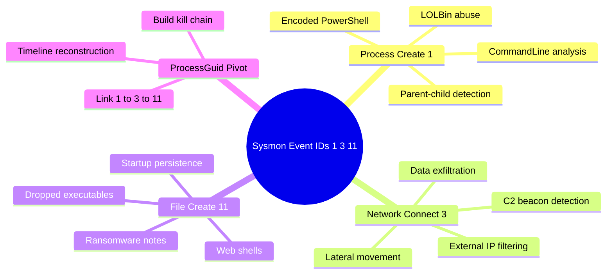
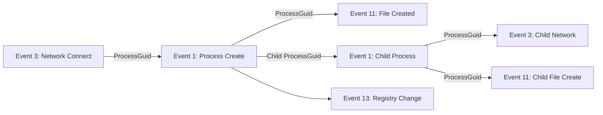
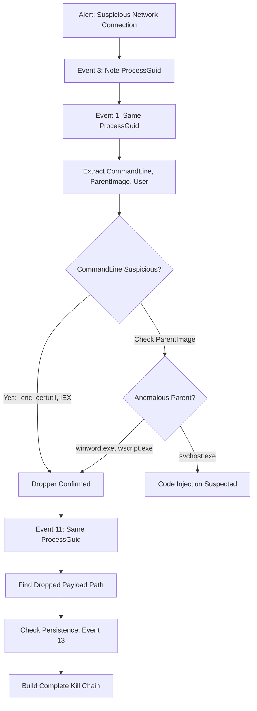

# Key Sysmon Event IDs for SOC Analysis

## TCM Exam Objectives

- Parse Event ID 1 fields: CommandLine, ParentImage, ProcessGuid, Hashes, IntegrityLevel, and User
- Detect C2 beaconing and exfiltration via Event ID 3 fields: DestinationIp, DestinationPort, and Protocol
- Identify dropped payloads and persistence files using Event ID 11 TargetFilename
- Correlate ProcessGuid across Event IDs 1, 3, and 11 for attack chain reconstruction
- Detect encoded PowerShell, LOLBin abuse, and anomalous parent-child patterns in Event ID 1
- Filter external IP connections and detect non-standard port usage from Event ID 3
- Identify executables written to Temp, Startup folders, and web directories via Event ID 11
- Write KQL queries for C2 beacon detection by counting connections per minute
- Apply the ProcessGuid correlation workflow: start with Event 3, pivot to Event 1, find Event 11

Three Sysmon event IDs answer the fundamental questions of any endpoint investigation: Event ID 1 (Process Create) reveals what ran with full command line and parent process. Event ID 3 (Network Connect) shows where it connected. Event ID 11 (File Create) reveals what it dropped. Together they provide the execution-communication-persistence chain that reconstructs the complete attack narrative, linked by the ProcessGuid pivot.

- Event ID 1 fields: CommandLine, ParentImage, ProcessGuid, Hashes, IntegrityLevel
- Event ID 3 fields: DestinationIp, DestinationPort, Protocol, SourceIp
- Event ID 11 fields: TargetFilename, Image, CreationUtcTime
- ProcessGuid correlation across all three events
- Detection patterns: encoded PowerShell, LOLBin abuse, startup persistence, web shells



> 📌 **Exam Tip:** The ProcessGuid field is the master key that links Event ID 1 (process create) to Event ID 3 (network connect) and Event ID 11 (file create). On the PSAA exam, when presented with a suspicious network connection (Event 3), always pivot back to Event 1 using the ProcessGuid to see the command line and parent process that initiated the connection. This single pivot technique reconstructs the entire attack chain.

## Event ID 1 -- Process Create

### Key Fields

| Field | Description | Investigation Use |
|-------|-------------|------------------|
| **UtcTime** | Timestamp in UTC | Timeline correlation |
| **ProcessGuid** | Unique identifier for this process instance | Pivot to Event 3 and 11 |
| **Image** | Full path to the executable | Verify legitimate vs suspicious location |
| **CommandLine** | Full command line | Most valuable field; reveals encoded PowerShell, download cradles |
| **CurrentDirectory** | Working directory | Often Temp or Public for malware |
| **User** | Account that launched the process | Identify compromised account |
| **ParentImage** | Executable path of the parent | Detect unusual spawns |
| **ParentCommandLine** | Command line of the parent | See original exploit or script |
| **IntegrityLevel** | High, Medium, Low, System | Browser with High integrity indicates escalation |
| **Hashes** | MD5, SHA1, SHA256, IMPHASH | Pivot to threat intel |
| **OriginalFileName** | Internal PE header name | Reveals masquerading |

### Detection Patterns

- **Encoded PowerShell**: `CommandLine contains "powershell" AND CommandLine contains "-enc"` -> download cradle or C2
- **Suspicious Parent-Child**: `ParentImage ends with "winword.exe" AND Image ends with "powershell.exe"` -> macro delivery
- **LOLBin Abuse**: `Image ends with "rundll32.exe" AND CommandLine contains "javascript:"` -> code execution
- **Process Masquerading**: `Image ends with "svchost.exe" AND NOT Image contains "System32"` -> fake svchost
- **Credential Dumping**: `Image ends with "rundll32.exe" AND CommandLine contains "comsvcs.dll"` -> LSASS dump

> 📌 **Exam Tip:** When analyzing Event ID 3 (Network Connect), always filter out private IPs first to focus on external C2 traffic. Non-standard ports (4444, 1337, 8080, 8443, 5555) from unusual processes (notepad.exe, svchost.exe from Temp) are high-fidelity C2 indicators. Use `where not(ipv4_is_private(DestinationIp))` in KQL or PowerShell's `[ipaddress]` parsing to exclude RFC 1918 addresses before looking for beacon patterns.

## Event ID 3 -- Network Connect

### Key Fields

| Field | Description | Investigation Use |
|-------|-------------|------------------|
| **UtcTime** | Timestamp | Identify connection time and interval |
| **ProcessGuid** | GUID of the connecting process | Pivot to Event 1 for command line |
| **Image** | Process executable | Quick triage: powershell.exe or svchost.exe |
| **User** | Account context | |
| **SourceIp** / **SourcePort** | Local IP and port | Identify source interface |
| **DestinationIp** / **DestinationPort** | Target IP and port | Most critical: non-standard ports, known-bad IPs |
| **Protocol** | Almost always tcp | |

### Detection Patterns

- **C2 Beaconing**: Frequent connections every 30-60 seconds to same external IP on high port (4444, 8080, 8443)
- **Data Exfiltration**: Persistent connection to external IP on 80/443 with established state
- **Lateral Movement**: Connections to internal hosts on ports 445, 3389, 5985/5986
- **DNS over HTTPS bypass**: Connection to 1.1.1.1 or 8.8.8.8 on 443 from non-browser process
- **Generic C2**: DestinationPort in (4444, 1337, 31337, 8080, 8443, 5555)

```kusto
// Filter external connections to find C2
Sysmon
| where EventID == 3
| where not(ipv4_is_private(DestinationIp))
| project UtcTime, Computer, User, Image, DestinationIp, DestinationPort, ProcessGuid

// Beacon detection by count per minute
Sysmon
| where EventID == 3
| summarize Count = count() by bin(UtcTime, 1m), DestinationIp, ProcessGuid
| where Count > 10
```

## Event ID 11 -- File Create

### Key Fields

| Field | Description | Investigation Use |
|-------|-------------|------------------|
| **UtcTime** | Timestamp | Correlate with other events |
| **ProcessGuid** | GUID of creating process | Link to Event 1 for command line |
| **Image** | Process that created the file | w3wp.exe (web server) or powershell.exe |
| **TargetFilename** | Full path of created file | Most critical: tells what was dropped |
| **CreationUtcTime** | File creation timestamp | |

### Detection Patterns

- **Persistence in Startup**: `TargetFilename contains "Start Menu\Programs\Startup"` -> auto-start
- **Executables in Temp**: `TargetFilename contains "\Temp\" AND endswith ".exe"` -> malware dropper
- **Web Shells**: `TargetFilename contains "inetpub\wwwroot" AND endswith ".aspx"` -> web shell upload
- **Ransomware Notes**: `TargetFilename endswith ".hta" OR "_readme.txt"` -> ransom note
- **DLL Side-Loading**: `TargetFilename endswith ".dll" AND Image endswith "msiexec.exe"` -> malicious DLL
- **Script Files**: `TargetFilename contains "\Users\Public\" AND endswith ".ps1"` -> dropped script

## ProcessGuid Correlation



### Kill Chain Correlation Workflow

1. **Start with Event 3**: Connection to suspicious IP. Note ProcessGuid.
2. **Retrieve Event 1**: Same ProcessGuid shows command line and parent chain.
3. **Find Event 11**: Same ProcessGuid reveals dropped files.
4. **Trace children**: New ProcessGuids for child processes show their network and file activity.

**Example chain:**
- Event 3: `powershell.exe` connects to `198.51.100.50:4444` (ProcessGuid A)
- Event 1: GUID A shows `powershell -enc SQBFAFgA...`, parent `winword.exe`
- Event 11: GUID A writes `C:\Users\jdoe\AppData\Local\Temp\payload.exe`
- Event 1: `payload.exe` spawns `rundll32.exe` (ProcessGuid B)
- Event 3: GUID B connects to same C2 IP on port 5555

<details>
<summary>Hands-On: Svchost Injection Investigation</summary>

**Event 3**: `Image = C:\Windows\System32\svchost.exe`, DestinationIp = `192.168.1.200`, DestinationPort = `4444`, ProcessGuid = `{A1B2...}`

**Event 1** for same GUID: `Image = C:\Windows\System32\svchost.exe`, CommandLine = `C:\Windows\System32\svchost.exe -k netsvcs`, User = `NT AUTHORITY\SYSTEM`

**Analysis**: Svchost.exe should not connect to internal IPs on high ports. The legitimate command line suggests code injection. Check Event 8 (CreateRemoteThread) and Event 10 (ProcessAccess) targeting this GUID to find the injector process.
</details>

## Investigation Workflow

| Step | Event ID | Action |
|------|----------|--------|
| 1 | Event 3 | Filter external connections, sort by time, note ProcessGuid |
| 2 | Event 1 | Pull command line, parent, user for that ProcessGuid |
| 3 | Event 11 | Find dropped files from same ProcessGuid |
| 4 | Event 3 internal | Check for lateral movement on 445, 3389, 5985 |
| 5 | All | Block IPs, add hashes to blacklist, remove persistence |

## Quick Reference

| Event ID | Field | What to Look For |
|----------|-------|------------------|
| 1 | CommandLine | Base64, IEX, DownloadString, -enc |
| 1 | ParentImage | Unexpected parent (winword -> powershell) |
| 1 | Image | Path outside System32, misspelled, unsigned |
| 1 | Hashes | SHA256 for threat intel |
| 3 | DestinationIp:Port | High ports, known-bad IPs, periodic |
| 3 | Image | Should this process have network activity? |
| 11 | TargetFilename | Startup, Temp, web root, .exe/.dll/.ps1/.aspx |
| 11 | Image | Did a web server or downloader write it? |



## Sysmon to MITRE ATT&CK Mapping

| Sysmon Event ID | MITRE Tactic | MITRE Technique | Typical Detection |
|-----------------|--------------|-----------------|-------------------|
| 1 | Execution | T1059.001 (PowerShell) | `CommandLine contains "-enc"` |
| 1 | Execution | T1059.003 (Windows Command Shell) | `cmd.exe /c` with download cradle |
| 1 | Execution | T1204.002 (User Execution: Malicious File) | `winword.exe -> cmd.exe -> powershell.exe` |
| 3 | Command & Control | T1071.001 (Web Protocols) | Periodic HTTPS to known-bad IP |
| 3 | Exfiltration | T1048 (Exfiltration Over Alternative Protocol) | Outbound to non-standard port |
| 3 | Lateral Movement | T1021.001 (RDP) / T1021.006 (WinRM) | Process making RDP/WinRM connections |
| 7 | Defense Evasion | T1574.002 (DLL Side-Loading) | Unsigned DLL loaded by signed binary |
| 8 | Defense Evasion | T1055.001 (Process Injection) | Process A creates thread in Process B |
| 10 | Credential Access | T1003.001 (LSASS Memory) | `lsass.exe` handle opened by non-standard process |
| 11 | Persistence | T1547.001 (Registry Run Keys) | File written to Startup folder |
| 11 | Persistence | T1505.003 (Web Shell) | `.aspx/.php` written to web directory |
| 12/13 | Persistence | T1547.001 (Registry Run Keys) | Run key modification by untrusted process |
| 15 | Defense Evasion | T1564.004 (NTFS ADS) | File created with alternate data stream |
| 19/20/21 | Persistence | T1546.003 (WMI Event Subscription) | WMI consumer bound to filter |
| 22 | Command & Control | T1572 (DNS Tunneling) | High volume of unique subdomain queries |
| 22 | Command & Control | T1568.002 (DGA) | Algorithmically generated domain names |
| 25 | Defense Evasion | T1055.012 (Process Hollowing) | Image base changes after creation |

> **Cross-reference:** For writing SIEM detection rules based on these MITRE mappings, see Chapter 5.4 — Writing Detection and Response (D&R) Rules. For process tree analysis using Event ID 1 parent-child relationships, see Chapter 5.1 — Identifying Malicious Processes and Parent-Child Relationships.

## Recap

Sysmon Event ID 1 provides full process execution details including command line, parent, and hashes. Event ID 3 attributes network connections to specific processes for C2 detection. Event ID 11 reveals files dropped to disk by malicious processes. The ProcessGuid field is the universal key that links execution to network to file activity, enabling reconstruction of the complete attack chain from initial execution through network communication to persistence establishment. Query patterns include filtering external IPs for C2, monitoring Temp directory for droppers, and detecting anomalous parent-child process relationships.
