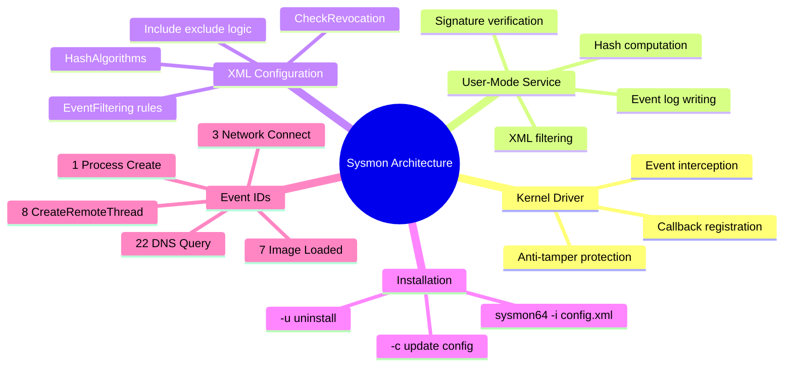
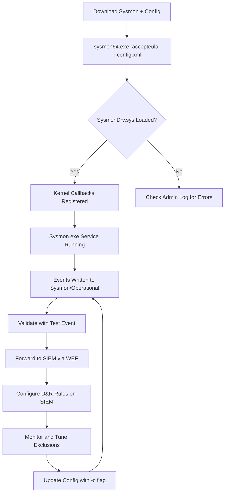

# Sysmon Architecture, Installation, and Configuration

## TCM Exam Objectives

- Install Sysmon using sysmon64.exe with custom XML configuration files
- Differentiate between kernel-mode driver and user-mode service components
- Apply XML filtering with onmatch="include" and onmatch="exclude" conditions
- Configure HashAlgorithms, CheckRevocation, and ArchiveDirectory global settings
- Use filtering conditions: is, contains, begins with, ends with, image, and image file
- Deploy community configurations such as SwiftOnSecurity and Sysmon-Modular
- Validate Sysmon installation and troubleshoot via Admin and Operational logs
- Understand critical Event IDs: 1, 3, 7, 8, 10, 11, 13, 22, 25
- Forward Sysmon events to SIEM via Windows Event Forwarding

Sysmon consists of a kernel-mode driver (SysmonDrv.sys) that registers callbacks with the Windows kernel to intercept system events, and a user-mode service (Sysmon.exe) that receives events from the driver, applies XML configuration filtering rules, enriches event data with hashes and signatures, and writes to the Microsoft-Windows-Sysmon/Operational event log. Installation uses `sysmon64.exe -accepteula -i config.xml`, and configuration is controlled through XML include/exclude filtering that determines which events are logged.

- Kernel driver + user-mode service architecture
- Installation commands: install, update config, uninstall
- XML configuration structure with include/exclude filtering
- Filtering conditions: is, contains, begin with, end with, image
- Event ID reference: 1 (Process Create), 3 (Network Connect), 7 (Image Loaded), 8 (CreateRemoteThread), 22 (DNS Query)
- SwiftOnSecurity and Sysmon-Modular community configurations



## Architecture

Sysmon is a passive sensor that does not analyze, alert, or block. It writes events to `Applications and Services Logs / Microsoft / Windows / Sysmon / Operational`.

| Component | Description |
|-----------|-------------|
| **Sysmon Driver (SysmonDrv.sys)** | Kernel-mode driver that registers callbacks (e.g., `PsSetCreateProcessNotifyRoutine`) to intercept system events as they occur. Extremely difficult for user-mode malware to bypass. |
| **Sysmon Service (Sysmon.exe)** | User-mode service that receives events from the driver, applies XML configuration filtering, enriches data (hashing, signature verification, DNS resolution), and writes to Windows Event Log. |

The kernel driver captures events; the user-mode service filters and enriches them. If the service crashes or the XML configuration is invalid, the driver still runs but no events are logged.

## Installation

### Standalone Installation (All Windows Versions)

```cmd
sysmon64.exe -accepteula -i                          # Default config (process creation only)
sysmon64.exe -accepteula -i sysmonconfig-export.xml   # Custom config
```

| Command | Action |
|---------|--------|
| `sysmon64.exe -accepteula -i config.xml` | Install with custom XML config |
| `sysmon64.exe -c config.xml` | Update configuration of running Sysmon |
| `sysmon64.exe -c` | Print current configuration |
| `sysmon64.exe -s` | Show schema version |
| `sysmon64.exe -u` | Uninstall (add `force` to bypass safety checks) |

### Built-in Sysmon (Windows 11+)

```powershell
Enable-WindowsOptionalFeature -Online -FeatureName Sysmon
sysmon -i
sysmon -i C:\path\to\config.xml
```

Built-in Sysmon cannot coexist with standalone Sysmon. Uninstall standalone first.

## XML Configuration

### Basic Structure

```xml
<Sysmon schemaversion="4.90">
    <HashAlgorithms>*</HashAlgorithms>
    <CheckRevocation>true</CheckRevocation>
    <EventFiltering>
        <ProcessCreate onmatch="include">
            <!-- rules -->
        </ProcessCreate>
    </EventFiltering>
</Sysmon>
```

> 📌 **Exam Tip:** The behavior of `onmatch="include"` vs `onmatch="exclude"` is frequently tested. With `onmatch="include"`, only events that match the internal rules are logged — matching events that are not listed inside the block are silently dropped. With `onmatch="exclude"`, all events are logged EXCEPT those matching the internal rules. If a new Sysmon config has no events at all, the filter is likely `onmatch="include"` with no matching rules.

### Include vs Exclude Filtering

- **`onmatch="include"`**: Whitelist mode. Only events matching the filters inside are logged. All others are dropped. Use for surgical targeting.
- **`onmatch="exclude"`**: Blacklist mode. Events matching the filters are dropped. Everything else is logged. Start with broad exclude rules for known benign activity.

### Filtering Conditions

| Condition | Meaning |
|-----------|---------|
| `is` | Exact match |
| `is not` | Does not equal |
| `contains` | Substring match |
| `begin with` | Prefix match |
| `end with` | Suffix match |
| `image` | Match image file path |
| `image file` | Match image file name only |

### Example Configuration Sections

```xml
<!-- Persistence directories -->
<FileCreate onmatch="include">
    <TargetFilename condition="contains">\AppData\Roaming\Microsoft\Windows\Start Menu\Programs\Startup\</TargetFilename>
    <TargetFilename condition="end with">.exe</TargetFilename>
    <TargetFilename condition="contains">\Users\Public\</TargetFilename>
</FileCreate>

<!-- Credential dumping detection -->
<ProcessAccess onmatch="include">
    <TargetImage condition="end with">\lsass.exe</TargetImage>
    <GrantedAccess condition="contains">0x1fffff</GrantedAccess>
</ProcessAccess>

<!-- Code injection detection -->
<CreateRemoteThread onmatch="include">
    <TargetImage condition="end with">\lsass.exe</TargetImage>
    <SourceImage condition="exclude">c:\windows\system32\werfault.exe</SourceImage>
</CreateRemoteThread>
```

### Global Settings

| Setting | Default | Description |
|---------|---------|-------------|
| `HashAlgorithms` | `*` | All hashes: MD5, SHA1, SHA256, IMPHASH |
| `CheckRevocation` | `true` | Check certificate revocation for signature verification |
| `ArchiveDirectory` | (varies) | Where to store archived deleted files |
| `CopyOnDeletePE` | `false` | Archive deleted portable executables |

> 📌 **Exam Tip:** Windows 11 and Server 2022 include a built-in Sysmon as an optional feature. It can be enabled via `Enable-WindowsOptionalFeature -Online -FeatureName Sysmon` and uses the same `sysmon -i config.xml` syntax. However, it cannot coexist with standalone Sysmon — uninstall the standalone version first. On the PSAA exam, be aware that newer Windows versions have this native capability.

## Critical Event IDs for SOC

| Event ID | Name | Primary Detection |
|----------|------|-------------------|
| **1** | Process Create | Cradle downloads, obfuscated PowerShell, LOLBin abuse |
| **3** | Network Connect | C2 beacons, lateral movement, data exfiltration |
| **7** | Image Loaded | DLL hijacking, process injection |
| **8** | Create Remote Thread | Process injection into LSASS |
| **10** | Process Access | Credential theft (accessing LSASS) |
| **11** | File Create | Persistence detection, malware droppers |
| **12/13/14** | Registry Events | Run keys, services, malware config |
| **22** | DNS Query | DNS tunneling, DGA beacons |
| **25** | Process Tampering | Process hollowing, image tampering |

## Community Configurations

- **SwiftOnSecurity Sysmon Config**: Default high-quality event tracing with extensive exclude rules. Ideal starting point.
- **Olaf Hartong's Sysmon-Modular**: MITRE ATT&CK coverage with separate config files per technique.

```cmd
sysmon64.exe -accepteula -i sysmonconfig-export.xml
```

## Validation and Troubleshooting

```cmd
# Validate XML syntax
sysmon64.exe -c config.xml

# Check operational log for events
Applications and Services Logs -> Microsoft -> Windows -> Sysmon -> Operational

# Check admin log for errors
Applications and Services Logs -> Microsoft -> Windows -> Sysmon -> Admin
```

### Common Issues

- **No events generated**: Verify filter matches. `onmatch="include"` with no matching filters logs nothing.
- **Performance problems**: Too many events from Event ID 7 without exclusions. Use exclude rules for trusted signed binaries.
- **Certificate revocation slow**: Set `CheckRevocation` to `false` in restricted environments.

## SIEM Integration

Sysmon events are written locally and must be forwarded to a SIEM for correlation and alerting:

- Windows Event Forwarding (WEF)
- Microsoft Monitoring Agent (Sentinel)
- Elastic Agent with Windows integration
- Any syslog-forwarding agent

Once in the SIEM, alerts are built on Sysmon event IDs: e.g., `EventID=1 AND CommandLine contains " -enc "` triggers encoded PowerShell alert.

## Quick Reference

### Installation Commands

```cmd
sysmon64.exe -accepteula -i config.xml
sysmon64.exe -c config.xml
sysmon64.exe -u
```

### Complete Sysmon Event ID Reference

| ID | Event Name | Description | Detection Value |
|----|------------|-------------|-----------------|
| 1 | Process Create | Process creation with full command line | Primary — captures every executed binary |
| 2 | File Creation Time Changed | File timestamp manipulation | Timestomping detection |
| 3 | Network Connect | TCP/UDP outbound connection | C2 beaconing, exfiltration, lateral movement |
| 4 | Sysmon Service State Changed | Service started/stopped | Service tampering detection |
| 5 | Process Terminated | Process exit | Process kill chain tracking |
| 6 | Driver Loaded | Kernel driver loaded | Rootkit/kernel exploit detection |
| 7 | Image Loaded | DLL loaded by a process | DLL side-loading, process injection |
| 8 | CreateRemoteThread | Thread created in remote process | Classic process injection indicator |
| 9 | RawAccessRead | Direct disk read (raw access) | Volume shadow copy access for credential theft |
| 10 | ProcessAccess | Process handle opened | lsass.exe handle access (credential dumping) |
| 11 | FileCreate | File created on disk | Payload drop, ransomware file creation |
| 12 | RegistryEvent (Key/Value Create/Delete) | Registry key or value created/deleted | Persistence via Run keys |
| 13 | RegistryEvent (Value Set) | Registry value modified | Persistence, configuration tampering |
| 14 | RegistryEvent (Key/Value Rename) | Registry rename operation | Persistence camouflage |
| 15 | FileCreateStreamHash | Alternate Data Stream created | ADS abuse for hidden data |
| 16 | ServiceConfigurationChange | Service configuration modified | Service persistence modification |
| 17 | PipeEvent (Created) | Named pipe created | Inter-process communication evidence |
| 18 | PipeEvent (Connected) | Named pipe connection | Lateral movement via SMB pipes |
| 19 | WmiEventFilter | WMI event filter registered | WMI persistence/subscription detection |
| 20 | WmiEventConsumer | WMI event consumer registered | WMI persistence |
| 21 | WmiEventConsumerToFilter | WMI filter-to-consumer binding | WMI persistence binding |
| 22 | DNSEvent (DNS Query) | DNS resolution query | DNS tunneling, DGA detection |
| 23 | FileDelete (Archived) | File deletion with archive | Deletion evidence for forensic recovery |
| 24 | ClipboardChange | Clipboard content changed | Data exfiltration via clipboard |
| 25 | ProcessTampering | Process image change | Process hollowing/herpaderping detection |
| 26 | FileDeleteDetected | File deletion detected | Logged file deletion events |
| 27 | NetworkConnectDetected | Network connection detected (alternate) | Redundant to Event 3 on modern systems |
| 28 | FileBlockExecutable | File execution blocked | File-based execution prevention |
| 29 | FileBlockShredding | File shredding operation detected | Anti-forensic evidence destruction |

**ProcessGuid** is the key pivot field: Event 1 generates a unique ProcessGuid for each process; Event 3 and Event 11 reference this same ProcessGuid, allowing the analyst to reconstruct the full attack chain (what ran → where it connected → what it created).



## Recap

Sysmon's kernel driver (SysmonDrv.sys) intercepts system events via kernel callbacks, and its user-mode service (Sysmon.exe) applies XML filtering rules, computes hashes, verifies signatures, and writes to the Sysmon event log. Installation uses `sysmon64.exe -accepteula -i config.xml`, with `-c` for config updates and `-u` for uninstall. XML configuration uses `onmatch="include"` (whitelist) or `onmatch="exclude"` (blacklist) filtering with conditions like `contains`, `is`, `begin with`, and `end with`. Community configurations (SwiftOnSecurity, Sysmon-Modular) provide production-ready detection rules. Sysmon is a passive sensor that requires SIEM forwarding for correlation and alerting.
