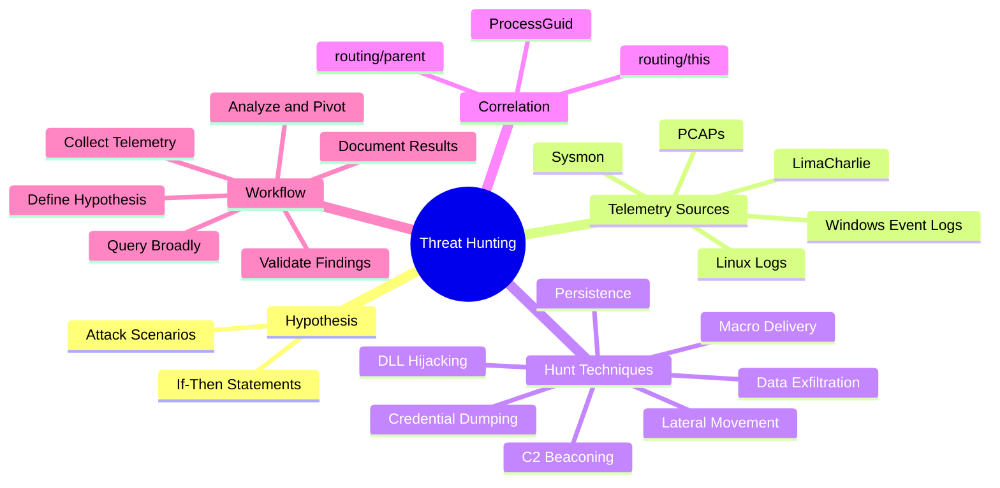
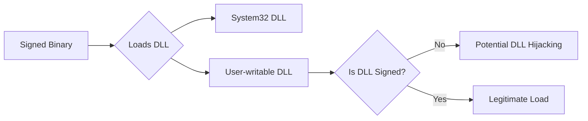
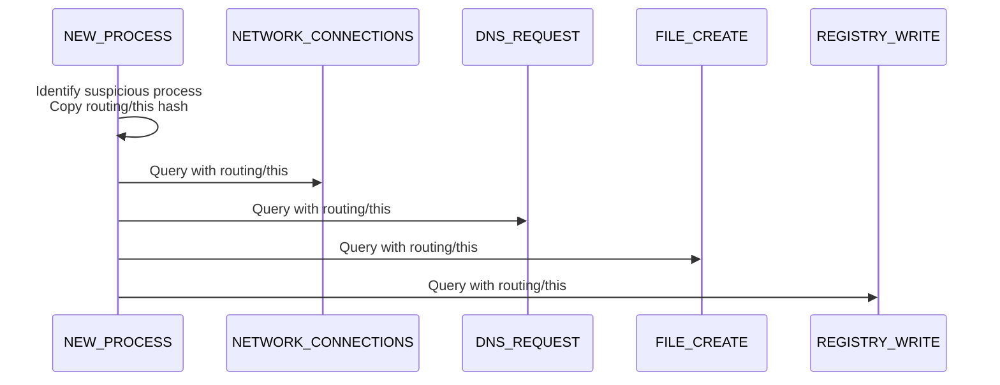
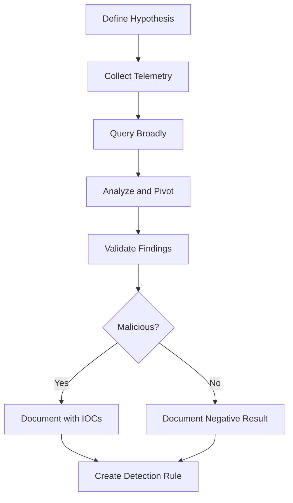
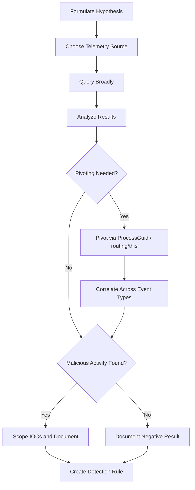

# Hunting for Threats Using Telemetry Data

## TCM Exam Objectives

- Apply the structured threat hunting loop: hypothesis, collect, analyze, respond, update
- Formulate testable hypotheses based on MITRE ATT&CK and common attack scenarios
- Query Sysmon Event IDs, LimaCharlie LCQL, Windows Event Logs, and Linux logs for specific hypotheses
- Hunt for macro-based delivery, C2 beaconing, DLL hijacking, credential dumping, lateral movement, and data exfiltration
- Use routing/this and ProcessGuid for correlation hunting
- Query broadly then pivot and correlate across event types for attack chain reconstruction
- Validate findings by checking signatures, command lines, remote IPs, and behavioral context
- Document both positive and negative hunt results with specific event references
- Create new detection rules based on hunt findings to automate future detection

Threat hunting is the proactive side of a SOC analyst's role -- the art of searching through telemetry data to find malicious activity that automated alerts missed. Endpoint and network telemetry must be queried with hypotheses, evidence identified, and findings documented in professional reports.

- Threat hunting methodology and the structured hunt loop
- Primary telemetry sources: Sysmon, LimaCharlie, Windows Event Logs, Linux logs, PCAPs
- Hunting for macro-based malware delivery, C2 beaconing, DLL hijacking, persistence, credential dumping, lateral movement, and data exfiltration
- Using LimaCharlie's `routing/this` for correlation hunting
- The PSAA hunting workflow from hypothesis to documentation
- Hands-on exercise with Sysmon EVTX files



## 1. Introduction: Threat Hunting in a SOC

### 1.1 What is Threat Hunting?

Threat hunting is a proactive, iterative, analyst-driven process of searching through endpoint, network, and log data to identify threats that have evaded existing security controls. Unlike alert triage (which starts with a known detection), hunting starts with a **hypothesis** -- an educated guess about what an attacker might have done, how they might have done it, and what evidence they might have left behind 【turn0search3】.

### 1.2 Why Threat Hunting Matters in a SOC

SOC analysts receive security alerts, but they are also presented with raw telemetry -- Sysmon event logs, LimaCharlie event streams, Windows Event Logs, Linux auth logs, PCAPs. Threat hunting skills demonstrate the ability to think like an attacker and move beyond the "acknowledge and escalate" mindset 【turn0search10】.

- Find evidence of an attacker's actions that no rule caught
- Correlate seemingly unrelated events across different log sources
- Build a complete attack timeline from scattered artifacts
- Identify Indicators of Compromise (IOCs) that scope the incident

---

## 2. The Threat Hunting Loop

Every hunt follows a structured cycle that serves as the internal workflow when investigating.

| Phase | Description | Example Application |
| :--- | :--- | :--- |
| **1. Hypothesis** | Formulate a specific, testable statement about possible malicious activity | "If a user downloaded a weaponized Word document, I would expect `winword.exe` to spawn `cmd.exe` or `powershell.exe`." |
| **2. Collect and Query** | Gather the relevant telemetry and run queries to test the hypothesis | Query Sysmon Event ID 1 for `ParentImage` = `winword.exe` and `Image` = `cmd.exe` within the timeframe |
| **3. Analyze and Triage** | Examine query results. Separate true positives from false positives | Verify command lines, user context, network connections, and file drops for each hit |
| **4. Respond and Document** | If malicious activity is found, scope the incident, collect IOCs, and write a report | Document the process tree, IOCs, and recommend containment |
| **5. Update and Automate** | Create new detection rules to catch the activity in the future | Write a new D&R rule in LimaCharlie or a Snort rule |

---

## 3. Primary Telemetry Sources for Hunting

The most common telemetry sources provided in investigations. Knowing which events to query to prove or disprove each hypothesis is critical.

| Telemetry Source | Key Logs / Events | Primary Use Cases |
| :--- | :--- | :--- |
| **Sysmon** | EVTX file (Event IDs 1, 3, 7, 8, 10, 11, 12, 13, 22, 23) | Detailed process creation, network, DLL load, injection, file, registry, DNS |
| **LimaCharlie** | `NEW_PROCESS`, `DNS_REQUEST`, `NETWORK_CONNECTIONS`, `FILE_CREATE`, `WEL`, `REGISTRY_WRITE` | Cloud-native telemetry with correlation via `routing/this` |
| **Windows Event Logs** | Security (4688, 4624, 4625, 4697), System (7045), PowerShell (4104) | Alternative to Sysmon for basic process, logon, service, and script block events |
| **Linux Logs** | `auth.log`, `syslog`, `bash_history`, `cron.log`, `journalctl` | User logins, privilege escalation, command history, scheduled tasks |
| **Network PCAPs** | tcpdump, Wireshark captures | C2 beaconing, data exfiltration, protocol anomalies |

---

## 4. Hunting Techniques: Hypothesis to Query

### 4.1 Hunting for Macro-Based Malware Delivery

**Hypothesis:** A user received a malicious Office document that executed VBA macros, leading to a command shell or script execution.

**Sysmon Query (Event ID 1):**
```powershell
Get-WinEvent -Path sysmon.evtx -FilterXPath "*[System[EventID=1]]" |
    Where-Object { $_.Properties[20].Value -like "*WINWORD.EXE" -and $_.Properties[4].Value -like "*cmd.exe" }
```
**LimaCharlie LCQL:**
```
-7d | plat == windows | NEW_PROCESS | event/PARENT/FILE_PATH contains "WINWORD.EXE" and event/FILE_PATH contains "cmd.exe"
```

**What to look for in results:**
- `cmd.exe` / `powershell.exe` / `wscript.exe` as child of Office applications
- Command lines with `certutil -urlcache`, `bitsadmin /transfer`, or encoded PowerShell
- Follow the child process to see dropped payloads and network connections

### 4.2 Hunting for C2 Beaconing via Network Timing

**Hypothesis:** Malware is calling out to C2 at regular intervals.

**Sysmon Query (Event ID 3):**
```powershell
Get-WinEvent -Path sysmon.evtx -FilterXPath "*[System[EventID=3]]" |
    ForEach-Object {
        $props = $_.Properties
        [PSCustomObject]@{
            Time = $_.TimeCreated
            Image = $props[4].Value
            DestIp = $props[9].Value
            DestPort = $props[10].Value
        }
    } | Sort-Object Time | Out-GridView
```

**LimaCharlie LCQL:**
```
-24h | * | NETWORK_CONNECTIONS | event/NETWORK_ACTIVITY/REMOTE_PORT == 8443
```

**What to look for:**
- Regular intervals (every 60 seconds, every 5 minutes)
- Low jitter (exact same second each time)
- Unusual ports (4444, 1337, 8080, 8443) or known-bad IPs

### 4.3 Hunting for DLL Hijacking

**Hypothesis:** An attacker has placed a malicious DLL in a folder where a signed application loads it, achieving persistence and code execution.

**Sysmon Query (Event ID 7):**
```powershell
Get-WinEvent -Path sysmon.evtx -FilterXPath "*[System[EventID=7]]" |
    Where-Object {
        $_.Properties[10].Value -eq "false" -and
        $_.Properties[4].Value -like "*\Users\*"
    }
```

**What to look for:**
- Unsigned DLL loaded from a user-writable folder (`C:\Users\`, `%TEMP%`) by a signed Microsoft binary
- DLLs with suspicious names (`ntdll.dll` in wrong path, randomly named DLLs)



### 4.4 Hunting for Persistence Mechanisms

**Hypothesis:** Malware has established persistence via a Run key, scheduled task, or service.

**Sysmon Query (Event ID 13 for Registry Run Keys):**
```powershell
Get-WinEvent -Path sysmon.evtx -FilterXPath "*[System[EventID=13]]" |
    Where-Object { $_.Properties[8].Value -like "*\CurrentVersion\Run*" }
```

**LimaCharlie LCQL:**
```
-7d | plat == windows | REGISTRY_WRITE | event/KEY_PATH contains "CurrentVersion\Run"
```

**What to look for:**
- Values pointing to executables in `%TEMP%`, `%APPDATA%`, or with random names
- Unusual entries for `cmd.exe` or `powershell.exe` with command-line arguments

<details>
<summary>Additional Persistence Checks</summary>

- **Scheduled Tasks:** Look in `C:\Windows\System32\Tasks\` and registry `HKLM\SOFTWARE\Microsoft\Windows NT\CurrentVersion\Schedule\TaskCache\Tree`
- **Services:** Sysmon Event ID 13 on `HKLM\System\CurrentControlSet\Services` or Windows System Event ID 7045
- **Startup Folders:** Check `%APPDATA%\Microsoft\Windows\Start Menu\Programs\Startup\`
- **WMI Persistence:** Monitor for suspicious WMI event subscriptions
</details>

### 4.5 Hunting for Credential Dumping

**Hypothesis:** An attacker accessed the LSASS process to extract credentials.

**Sysmon Query (Event ID 10 -- ProcessAccess):**
```powershell
Get-WinEvent -Path sysmon.evtx -FilterXPath "*[System[EventID=10]]" |
    Where-Object {
        $_.Properties[8].Value -like "*lsass.exe" -and
        $_.Properties[12].Value -match "0x[0-9A-Fa-f]*"
    }
```

Common malicious granted access masks: `0x1400` (VM read + query), `0x1FFFFF` (PROCESS_ALL_ACCESS), `0x143A` (Mimikatz).

**LimaCharlie:** `SENSITIVE_PROCESS_ACCESS` event is specifically designed for this:
```
-24h | * | SENSITIVE_PROCESS_ACCESS | event/TARGET/FILE_PATH contains "lsass.exe"
```

**What to look for:**
- Non-system processes (e.g., `powershell.exe`, unknown executables) accessing `lsass.exe`
- Access from processes not known to legitimately interact with LSASS
- Correlate with process creation (Event ID 1) to see the parent process (e.g., `cmd.exe` launched by an exploit)

### 4.6 Hunting for Lateral Movement

**Hypothesis:** An attacker moved from one host to another using SMB, PSExec, or WinRM.

**Sysmon Query (Event ID 3 for SMB on port 445):**
```powershell
Get-WinEvent -Path sysmon.evtx -FilterXPath "*[System[EventID=3]]" |
    Where-Object { $_.Properties[10].Value -eq 445 -and $_.Properties[4].Value -notlike "*\System32\*" }
```

**LimaCharlie LCQL:**
```
-24h | * | NETWORK_CONNECTIONS | event/NETWORK_ACTIVITY/REMOTE_PORT == 445 and event/FILE_PATH not contains "System32"
```

| Lateral Movement Method | Port | Artifact | Detection Source |
|:---|:---|:---|:---|
| **SMB/PsExec** | 445 | `PSEXESVC.exe` service creation, `psexec.exe` process | Event ID 1, 7045 |
| **WinRM** | 5985/5986 | `wsmprovhost.exe` process creation, `winrs.exe` | Event ID 1, 3 |
| **RDP** | 3389 | Logon type 10 events | Event ID 4624 |
| **WMI** | 135/RPC | `WMIC.exe` or PowerShell WMI commands | Event ID 1 |
| **SSH** | 22 | `sshd` sessions, `auth.log` entries | Linux auth logs |

### 4.7 Hunting for Data Exfiltration

**Hypothesis:** A compromised host is sending large volumes of data to an external location.

**LimaCharlie LCQL:**
```
-24h | * | NETWORK_CONNECTIONS | event/NETWORK_ACTIVITY/REMOTE_PORT == 443 and event/FILE_PATH contains "cmd.exe"
```

**What to look for:**
- `cmd.exe` or `powershell.exe` making outbound connections to rare external IPs on port 443 or 8080
- `rar.exe`, `7z.exe`, `winzip.exe` process creation just before large outbound traffic
- Sudden spike in DNS TXT queries (DNS exfiltration)
- File archivers (`rar.exe a ...`) or cloud storage CLIs (`aws s3 cp`, `azcopy`, `rclone`) in command lines

<details>
<summary>Exfiltration Detection Patterns</summary>

| Exfiltration Method | Telemetry Signature | Data Source |
|:---|:---|:---|
| **HTTP/HTTPS POST** | `curl`, `powershell Invoke-WebRequest`, `certutil -post` | Event ID 1 command line |
| **DNS Tunneling** | High-entropy subdomains, high frequency TXT queries | Sysmon Event ID 22 |
| **FTP/SFTP** | FTP client process, large outbound data | Event ID 3, file monitoring |
| **Cloud Upload** | Cloud CLI tools (AWS, gcloud, azcopy) | Event ID 1 |
| **Email Exfiltration** | MAPI over HTTP, SMTP from non-mail server | Event ID 3, process |
</details>

---

> 📌 **Exam Tip:** The standard hunting workflow tested on the PSAA is: define a hypothesis → query broadly → analyze and pivot → validate findings → document. Start broad and narrow down. For example, if hunting for macro malware, first query all `winword.exe` → `cmd.exe` pairs, then narrow to those with subsequent network connections. Never start with an overly specific query — you will miss tangential but related malicious activity.

## 5. Using LimaCharlie's `routing/this` for Correlation Hunting

LimaCharlie's real strength is the ability to follow a single process across all event types. Starting with a suspicious process, everything it touched can be explored.



**Workflow:**
1. Identify a suspicious process via `NEW_PROCESS` (e.g., an unknown executable running from `%TEMP%`)
   ```
   -24h | plat == windows | NEW_PROCESS | event/FILE_PATH contains "Temp" and event/FILE_PATH ends with ".exe"
   ```
2. Copy the `routing/this` hash
3. Hunt for everything that hash did:

```lcql
# Network connections made by this process
-24h | * | NETWORK_CONNECTIONS | routing/this == "THE_HASH"

# DNS queries resolved by this process
-24h | * | DNS_REQUEST | routing/this == "THE_HASH"

# Files created by this process
-24h | * | FILE_CREATE | routing/this == "THE_HASH"

# Registry modifications by this process
-24h | * | REGISTRY_WRITE | routing/this == "THE_HASH"

# Child processes spawned
-24h | * | NEW_PROCESS | routing/parent == "THE_HASH"
```

This single hash-based hunting approach can uncover an entire attack chain -- dropped payloads, C2 domains, persistence entries -- all without relying on any pre-written detection rule 【turn0search4】.

---

## 6. Hunting with Windows Event Logs (Without Sysmon)

When only basic Windows logs are available, hunting can still be effective.

| Hunt Objective | Windows Event IDs | Query Example |
| :--- | :--- | :--- |
| Suspicious process creation | Security 4688 | Filter `NewProcessName` contains `Temp` and `Creator Process Name` is `winword.exe` |
| New service installed | System 7045 | Filter for `ImagePath` containing `Temp` or `AppData` |
| Failed logons (brute force) | Security 4625 | Count by source IP |
| Successful logon after many failures | Security 4624 | Same source IP as many 4625 events |
| PowerShell execution | PowerShell Op 4104 | Look for `-EncodedCommand`, `DownloadString`, `Invoke-Expression` |
| Scheduled task creation | Security 4698 | Look for task content pointing to suspicious paths |

**Example PowerShell query for suspicious service installation:**
```powershell
Get-WinEvent -LogName System -FilterXPath "*[System[EventID=7045]]" |
    ForEach-Object { [xml]$xml = $_.ToXml(); $xml.Event.EventData.Data } |
    Where-Object { $_.ImagePath -like "*Temp*" }
```

---

## 7. The PSAA Hunting Workflow



### Phase 1: Define Your Hypothesis

Based on the initial alert, ask: "What else might the attacker have done?"

Example hypotheses:
- If they dropped a payload, they probably set up persistence.
- If they established C2, they probably performed reconnaissance.
- If they escalated privileges, they might have accessed `lsass.exe` or created a new admin account.

### Phase 2: Collect Relevant Telemetry

Identify which logs contain the event types needed to test the hypothesis (Sysmon events, LimaCharlie event types, Windows Event IDs, Linux log files).

### Phase 3: Query Broadly First

Start with a broad query to see the landscape, then narrow:

```lcql
# Broad: all processes from temp folders today
-24h | * | NEW_PROCESS | event/FILE_PATH contains "Temp"
```

### Phase 4: Analyze, Pivot, and Correlate

For each interesting result, pivot to other event types using the correlation key (ProcessGuid in Sysmon, `routing/this` in LimaCharlie, PID in Windows logs).

Build a mini-timeline: process creation to network connections to file drops to registry changes.

### Phase 5: Validate Findings

- Is the binary signed?
- Does the command line look normal?
- Is the remote IP a known-bad address?
- Does the behavior match a known TTP (e.g., LOLBin abuse, reverse shell syntax)?

> 📌 **Exam Tip:** Documenting negative hunt results (finding no malicious activity) is just as important as documenting positive findings. On the PSAA exam, a proper hunt report includes the hypothesis, data source, query used, findings (even if none), and a conclusion. This demonstrates structured analytical rigor and proves that the hunt was actually conducted rather than simply acknowledging there were no alerts.

### Phase 6: Document the Hunt

Even if the hunt yields no threats (negative result), documentation of what was searched for and why is expected. If malicious activity is found, produce a full incident report with the new findings.

<details>
<summary>Hunt Report Template</summary>

> **Hunt: Lateral Movement via SMB After Initial Compromise**
>
> **Hypothesis:** The attacker used the compromised host to scan or connect to other internal systems on port 445.
>
> **Data Source:** Sysmon Event ID 3 on `HOST01` from 2026-05-18 14:00 to 16:00.
>
> **Query:** `Get-WinEvent ... | Where-Object { $_.Properties[10].Value -eq 445 }`
>
> **Findings:** Process `crss.exe` (typosquatted, PID 5678) made connections to `192.168.1.20`, `192.168.1.21`, and `192.168.1.25` on port 445.
>
> **Conclusion:** Lateral movement confirmed.
>
> **IOCs:** Source IP `192.168.1.10`, destination IPs `192.168.1.20/21/25`, process hash of `crss.exe`.
>
> **Recommendation:** Isolate all listed hosts, check for PSExec service artifacts on the targets.
</details>

---

## 8. Hands-On Hunting Exercise

**Scenario:** Sysmon EVTX files from `DESKTOP-XYZ` are provided after a malware alert was triaged. The initial alert was for a macro-based dropper: `winword.exe` spawned `cmd.exe` which downloaded `payload.exe` to `%TEMP%`. The payload was killed, but additional persistence or lateral movement must be found.

### Step 1: Formulate Hypotheses

- The attacker may have set up a Run key, service, or scheduled task
- The payload may have spawned child processes that are still running
- The attacker might have moved to other systems

### Step 2: Query for Persistence

**Sysmon Event ID 13 (Registry Value Set):**
```powershell
Get-WinEvent -Path sysmon.evtx -FilterXPath "*[System[EventID=13]]" |
    Where-Object { $_.Properties[8].Value -like "*\Run*" }
```

A new value is discovered: `HKCU\Software\Microsoft\Windows\CurrentVersion\Run\Service` = `C:\Users\brolf\AppData\Roaming\svc.exe`. This was not part of the original alert -- additional persistence discovered 【turn0search5】.

### Step 3: Check for Child Processes of the Original Malware

The ProcessGuid of the original `payload.exe` is found from Event ID 1. Processes where `ParentProcessGuid` equals that GUID reveal that `payload.exe` spawned `svc.exe`, which matches the Run key persistence.

### Step 4: Hunt for Lateral Movement

```powershell
Get-WinEvent -Path sysmon.evtx -FilterXPath "*[System[EventID=3]]" |
    Where-Object { $_.Properties[4].Value -eq "GUID_OF_SVC" }
```

Connections to internal IP `10.0.0.5` on port 5985 (WinRM) indicate lateral movement.

### Step 5: Document Findings

> **Hunt Report: Uncovering Additional Persistence and Lateral Movement**
>
> **Data Source:** Sysmon EVTX from `DESKTOP-XYZ`.
>
> **Findings:**
> - **Persistence:** Registry Run key `HKCU\...\Run\Service` points to `C:\Users\brolf\AppData\Roaming\svc.exe`. Process tree shows `payload.exe` spawned `svc.exe`.
> - **Lateral Movement:** `svc.exe` made outbound WinRM connections to `10.0.0.5:5985`.
>
> **New IOCs:** File path `C:\Users\brolf\AppData\Roaming\svc.exe`, internal IP `10.0.0.5`, WinRM usage.
>
> **Conclusion:** The attacker established a secondary persistence mechanism and moved laterally to at least one internal server. **Severity: Critical.**

---

## 9. Quick-Reference Cheat Sheet

### Key Telemetry Fields for Hunting

| Data Source | Field | Use for Hunting |
| :--- | :--- | :--- |
| Sysmon Event ID 1 | `ParentImage`, `Image`, `CommandLine` | Suspicious parent-child process relationships |
| Sysmon Event ID 3 | `SourceIp`, `DestIp`, `DestPort`, `Image` | C2 beaconing, port scans, lateral movement |
| Sysmon Event ID 7 | `ImageLoaded`, `Signed`, `Image` (process) | DLL hijacking |
| Sysmon Event ID 8 | `SourceImage`, `TargetImage` | Code injection |
| Sysmon Event ID 10 | `SourceImage`, `TargetImage`, `GrantedAccess` | Credential dumping |
| Sysmon Event ID 11 | `TargetFilename`, `Image` (process) | Dropped payloads |
| Sysmon Event ID 13 | `TargetObject`, `Details`, `Image` (process) | Registry persistence |
| Sysmon Event ID 22 | `QueryName`, `QueryResults`, `Image` (process) | DNS exfiltration, C2 domains |
| LimaCharlie `NEW_PROCESS` | `event/FILE_PATH`, `event/COMMAND_LINE`, `routing/this` | Process chain correlation |
| LimaCharlie `NETWORK_CONNECTIONS` | `event/NETWORK_ACTIVITY[0]/REMOTE_IP` | C2 connectivity |
| LimaCharlie `DNS_REQUEST` | `event/DOMAIN_NAME`, `routing/this` | Malicious domain lookups |
| LimaCharlie `REGISTRY_WRITE` | `event/KEY_PATH`, `event/VALUE_DATA`, `routing/this` | Persistence |

### Common Hunting Hypotheses

| Hypothesis | Query Starting Point |
| :--- | :--- |
| Macro dropper | `ParentImage` = `winword.exe` AND `Image` = `cmd.exe` (Sysmon ID 1) |
| C2 beaconing | Multiple Event ID 3 from same process to same IP:port at regular intervals |
| DLL hijacking | Unsigned DLL loaded from user folder (Sysmon ID 7) |
| Credential dumping | Non-system process accessing `lsass.exe` (Sysmon ID 10) |
| Persistence via Run key | Event ID 13 on `*Run` registry keys |
| Lateral movement via SMB | Event ID 3 on port 445 from unusual processes |
| Data exfiltration | `cmd.exe` with `curl` or `wget` upload, or large outbound bytes |

---



## Recap

Threat hunting is a proactive, hypothesis-driven process of searching through telemetry data to find threats that evaded automated detection. The structured hunting loop (hypothesis, collect, analyze, respond, update) provides a repeatable framework. Sysmon, LimaCharlie, Windows Event Logs, Linux logs, and PCAPs each offer different levels of visibility into attacker behavior. Correlation via ProcessGuid (Sysmon) or `routing/this` (LimaCharlie) is the key technique for reconstructing the full attack chain from process creation through network connections, file drops, and persistence. Querying broadly, then narrowing based on findings, validates analytical rigor. Documenting both positive and negative hunt results with specific event references produces professional incident reports.
