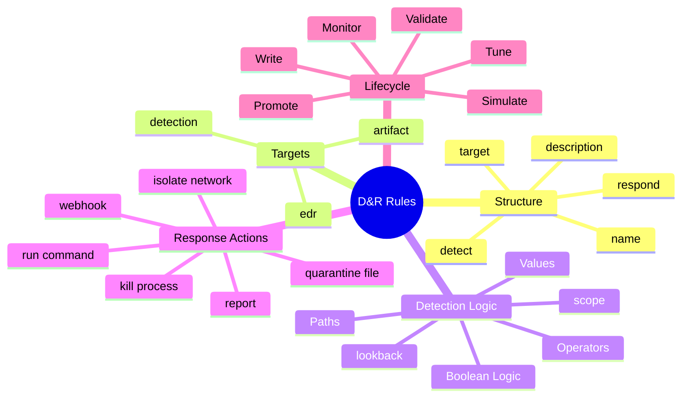
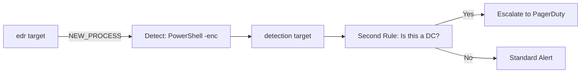
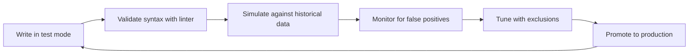
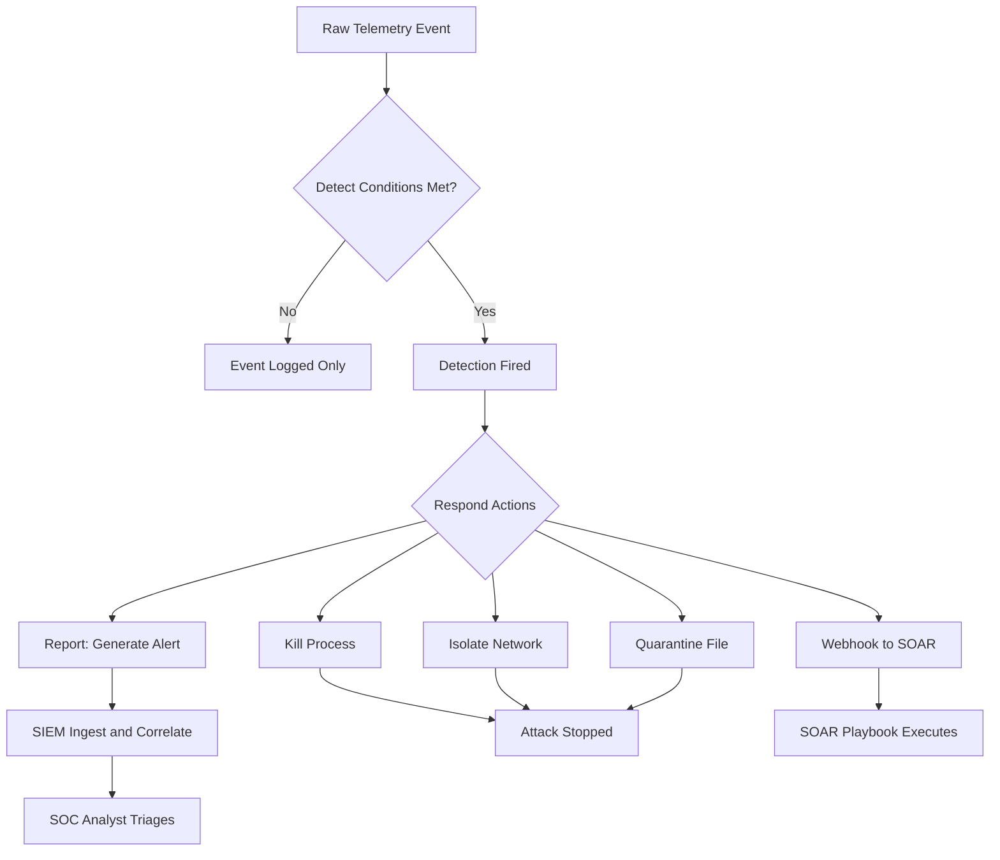

# Writing Detection and Response (D&R) Rules

## TCM Exam Objectives

- Structure a D&R rule with detect and respond sections across edr, detection, and artifact targets
- Write detection logic using paths, operators (is, contains, matches, cidr), and boolean logic
- Define response actions: report, kill process, quarantine file, isolate network, run command, webhook
- Implement stateful detection with lookback and scope operators for multi-step attack patterns
- Write real-world rules for PowerShell download cradles, C2 beaconing, ransomware, credential dumping, and persistence
- Apply suppression parameters to control alert volume
- Test and tune rules by validating against historical data and excluding known-good binaries
- Integrate D&R rules with SIEM and SOAR through alert forwarding and webhook actions
- Follow the detection engineering lifecycle: write, validate, simulate, monitor, tune, promote

Detection and Response (D&R) rules transform raw endpoint telemetry into automated, precise threat identification and containment. Translating attack behaviors into logic, crafting minimal-noise rules, and pairing detection with appropriate response actions separates a SOC alert responder from a detection engineer.

- D&R rule structure: detect and respond sections
- Targets: edr, detection, artifact
- Detection logic: paths, operators, values, boolean logic
- Response actions: report, kill process, quarantine, isolate, webhook
- Real-world rules for PowerShell download cradles, C2 beaconing, ransomware, credential dumping, persistence
- Testing, tuning, and deploying rules
- Integration with SIEM and SOAR



## 1. What Are D&R Rules?

Detection and Response rules are the programmable logic that sits on top of raw endpoint telemetry. While Sysmon or EDR sensors stream millions of events, D&R rules filter that stream down to the small number of events that indicate actual malicious behavior, then automatically execute a response.

A D&R rule consists of exactly two parts: a `detect` section and an (optional) `respond` section.

- **Detect:** The logical condition that identifies a threat in a single event or a pattern across time
- **Respond:** The automated action taken when a detection fires -- containment, evidence collection, notification

---

## 2. Rule Anatomy

Every D&R rule, regardless of platform, shares a common skeleton. A vendor-neutral YAML-like pseudocode mirrors the syntax used by most modern EDR platforms (LimaCharlie, Elastic, SentinelOne).

### 2.1 Basic Structure

```yaml
name: "Name of the rule"
description: "What this rule detects and why"
target: edr
detect:
  # Detection logic...
respond:
  # Response actions...
```

### 2.2 The `detect` Section

The detection engine evaluates a **path** against an **operator** and a **value**. Paths use a slash-separated syntax to drill into the JSON event structure.

```yaml
detect:
  event: NEW_PROCESS
  path: /event/FILE_PATH
  operator: contains
  value: "powershell.exe"
```

> 📌 **Exam Tip:** On the PSAA exam, know that D&R rules target three data sources: `edr` for real-time endpoint telemetry, `detection` for chaining alerts (rules that fire on other rule detections), and `artifact` for log files and forensic data. The detection target enables multi-stage correlation — a broad first rule catches suspicious activity, then a second rule on the detection target escalates based on context like host role or user privileges.

### 2.3 The `respond` Section

Multiple response actions can be chained. Common actions include generating an alert (`report`), isolating the host, killing the process, or running a custom script.

```yaml
respond:
  - action: report
    name: "PowerShell Execution Detected"
  - action: kill process
```

---

## 3. Targets: Choosing Your Data Source

D&R rules are bound to a specific **target** -- the category of telemetry the rule evaluates.

| Target | Data Source | Common Event Types |
|--------|-------------|--------------------|
| `edr` | Real-time endpoint telemetry from the EDR agent | `NEW_PROCESS`, `FILE_CREATE`, `NETWORK_CONNECTIONS`, `DNS_REQUEST` |
| `detection` | Alerts generated by other D&R rules. Enables rule chaining and correlation | Custom detection names (e.g., `powershell-encoded-command`) |
| `artifact` | Parsed log files, PCAP data, or other collected forensic artifacts | `/var/log/auth.log` entries, Zeek logs, Sysmon EVTX fields |

The `detection` target allows rule chaining. A broad first-stage rule detects a suspicious pattern; a second-stage rule, running on the `detection` target, adds context (e.g., "if the suspicious PowerShell also executed on a domain controller, escalate to PagerDuty") 【turn0search0】.



---

## 4. Detection Logic: Paths, Operators, and Values

### 4.1 Paths

A path is a slash-separated selector that extracts a value from the incoming event. For the `edr` target, every event contains a fixed schema.

| Path | What it points to | Example Value |
|------|-------------------|---------------|
| `/event/FILE_PATH` | Full filesystem path of the executable image | `C:\Windows\System32\cmd.exe` |
| `/event/COMMAND_LINE` | Complete command line string | `"C:\Windows\System32\cmd.exe" /c whoami` |
| `/event/PARENT/PROCESS_ID` | PID of the process that spawned this event | `1234` |
| `/event/USER_NAME` | Account that owns the process | `NT AUTHORITY\SYSTEM` |
| `/event/HASH` | SHA256 hash of the executable | `e3b0c44298...` |
| `routing/hostname` | Endpoint on which the event occurred | `DESKTOP-ABC123` |

### 4.2 Operators

| Operator | Meaning | Example |
|----------|---------|---------|
| `is` | Exact match | `value: "C:\\Windows\\System32\\cmd.exe"` |
| `contains` | Sub-string match | `value: "powershell"` |
| `starts with` | Prefix match | `value: "C:\\Windows\\Temp\\"` |
| `ends with` | Suffix match | `value: ".exe"` |
| `is greater than` | Numeric greater-than | `value: 1000` |
| `is lower than` | Numeric less-than | `value: 5` |
| `matches` | Regular expression | `value: ".*\\cmd\\.exe"` |
| `exists` | Checks if a path exists (optionally non-empty) | `truthy: true` |
| `cidr` | IP range match (private, public, or specific CIDR) | `cidr: "10.0.0.0/8"` |
| `string distance` | Levenshtein edit distance for fuzzy matching | `value: "svchost.exe"` |

### 4.3 Boolean Logic: `and`, `or`, `not`

Complex rules are built by nesting multiple conditions under boolean operators:

```yaml
detect:
  operator: and
  rules:
    - path: /event/FILE_PATH
      operator: ends with
      value: "\\cmd.exe"
    - path: /event/COMMAND_LINE
      operator: contains
      value: "/c whoami"
    - operator: or
      rules:
        - path: /event/PARENT/FILE_PATH
          operator: contains
          value: "winword.exe"
        - path: /event/PARENT/FILE_PATH
          operator: contains
          value: "excel.exe"
```

**Negation** is applied with the `not` flag: invert a single condition or an entire sub-tree.

### 4.4 Stateful Detection with `lookback` and `scope`

Modern D&R engines support stateful analysis -- looking back over previous events from the same sensor (or process) to detect multi-step attacks. The `scope` operator resets the root of paths to evaluate individual elements within lists or dicts, while `lookback` enables time-window evaluation 【turn0search4】.

Example: "Alert if `cmd.exe` is followed by a network connection to a public IP within 60 seconds."

---

## 5. Response Actions

When a rule fires, the `respond` section determines what happens next. Multiple actions can be chained; each action receives the full event context for templating.

### 5.1 Common Response Actions

| Action | Purpose | Example Use |
|--------|---------|-------------|
| `report` | Generate a detection alert in the console / SIEM | Every rule should have at least one `report` |
| `kill process` | Terminate the offending process | Stop a C2 reverse shell |
| `quarantine file` | Move the malicious binary to a secure location | Isolate a dropped trojan |
| `isolate network` | Disconnect the endpoint from the network | Stop lateral movement instantly |
| `add var` / `remove var` | Set or clear a sensor variable (e.g., a tag) | Track that a host has been compromised |
| `run command` | Execute a script on the endpoint | Collect memory dumps, retrieve files |
| `webhook` | Send an HTTP POST to an external SOAR or SIEM | Integrate with PagerDuty, Slack, TheHive |

### 5.2 Action Templating

Response actions can reference the triggering event's fields using template syntax:

```
{{ event/COMMAND_LINE }}
{{ routing/hostname }}
{{ .object }}
```

This allows dynamic, context-rich alert titles and automated evidence collection.

### 5.3 Suppression

All response actions accept `suppression` parameters: `max_count`, `min_count`, and `period` (e.g., 5 reports per 10 minutes). Use this aggressively during tuning to prevent alert storms.

---

## 6. Real-World Patterns

### 6.1 Suspicious PowerShell Download Cradle

```yaml
name: "PowerShell download cradle from Office"
target: edr
detect:
  operator: and
  rules:
    - path: /event/FILE_PATH
      operator: ends with
      value: "\\powershell.exe"
    - path: /event/COMMAND_LINE
      operator: contains
      value: "-enc"
    - operator: or
      rules:
        - path: /event/PARENT/FILE_PATH
          operator: contains
          value: "winword.exe"
        - path: /event/PARENT/FILE_PATH
          operator: contains
          value: "excel.exe"
respond:
  - action: report
    name: "PowerShell Office Macro Download"
  - action: kill process
  - action: isolate network
```

### 6.2 Suspicious Outbound Connection

```yaml
name: "Suspicious outbound connection on high port"
target: edr
detect:
  event: NETWORK_CONNECTIONS
  operator: and
  rules:
    - path: /event/NETWORK_ACTIVITY/DESTINATION/PORT
      operator: is greater than
      value: 1024
    - path: /event/NETWORK_ACTIVITY/DESTINATION/IP_ADDRESS
      operator: is public address
    - path: /event/FILE_PATH
      operator: not ends with
      value: "\\chrome.exe"
    - path: /event/FILE_PATH
      operator: not ends with
      value: "\\firefox.exe"
    - path: /event/FILE_PATH
      operator: not ends with
      value: "\\msedge.exe"
respond:
  - action: report
    name: "Possible C2 Beacon on High Port"
```

### 6.3 Ransomware File Write Pattern

```yaml
name: "Ransomware file creation burst"
target: edr
detect:
  event: FILE_CREATE
  operator: and
  rules:
    - path: /event/FILE_PATH
      operator: ends with
      value: ".locked"
    - path: /event/THREAD_ID
      operator: is greater than
      value: 10
respond:
  - action: report
    name: "Ransomware Activity Detected"
  - action: kill process
  - action: isolate network
```

<details>
<summary>Real Ransomware Detection Considerations</summary>

Real ransomware rules use `lookback` to count file creations per process per time window. Common ransomware extensions to watch for: `.lockbit`, `.encrypt`, `.crypt`, `.locked`, `.zepto`, `.dharma`. Behavioral indicators include:
- Mass file rename/modification operations
- Deletion of Volume Shadow Copies (`vssadmin.exe Delete Shadows`)
- Disabling recovery mode (`bcdedit /set {default} recoveryenabled No`)
- Dropping ransom notes (`README.txt`, `HOW_TO_DECRYPT.txt`)
</details>

### 6.4 Credential Dumping (LSASS Access)

```yaml
name: "Potential credential dumping via LSASS access"
target: edr
detect:
  event: PROCESS_ACCESS
  operator: and
  rules:
    - path: /event/TARGET/FILE_PATH
      operator: ends with
      value: "\\lsass.exe"
    - path: /event/ACTOR/FILE_PATH
      operator: not ends with
      value: "\\svchost.exe"
    - path: /event/ACTOR/FILE_PATH
      operator: not ends with
      value: "\\msmpeng.exe"
    - path: /event/GRANTED_ACCESS
      operator: contains
      value: "0x1fffff"
respond:
  - action: report
    name: "LSASS Credential Dumping Attempt"
  - action: kill process
```

### 6.5 Persistence via Registry Run Key

```yaml
name: "Persistence via Registry Run key"
target: edr
detect:
  event: REGISTRY_SET_VALUE
  operator: and
  rules:
    - path: /event/REGISTRY/KEY_PATH
      operator: contains
      value: "\\Software\\Microsoft\\Windows\\CurrentVersion\\Run"
    - path: /event/REGISTRY/VALUE_DATA
      operator: starts with
      value: "C:\\Users\\"
respond:
  - action: report
    name: "User Logon Persistence Set"
```

---

## 7. Testing, Tuning, and Deploying Rules

### 7.1 The Rule Writing Lifecycle



> 📌 **Exam Tip:** Suppression parameters are critical for real-world rule tuning and may appear on the PSAA exam. Use `max_count` and `period` to limit alerts (e.g., 5 reports per 10 minutes). During the tuning phase, always start with broad exclusions for known-good binaries (browsers, Microsoft-signed tools) and narrow the rule scope gradually. A rule that fires on every workstation is worse than no rule at all.

### 7.2 Tuning Levers

- **Exclude known benign binaries:** Add `not ends with` for browsers, MS-signed tools, or approved admin scripts
- **Scope by hostname:** Apply rules only to critical servers or user workstations as needed
- **Use suppression:** Limit alert volume to 1 every 30 minutes for noisy rules
- **Threshold with counts:** Instead of alerting on a single `FILE_CREATE`, alert when 50 files are created in 2 seconds

### 7.3 Platform-Specific Quirks

| Platform | Rule Format | Key Characteristics |
|:---|:---|:---|
| **LimaCharlie** | YAML, `detect`/`respond` top-level keys | Paths begin with `event/` for `edr` target |
| **Sigma** | Vendor-agnostic YAML, `logsource`/`detection` fields | Must be compiled to target SIEM/EDR language |
| **Elastic Security** | ES|QL or Lucene in JSON schema | `false_positives` and `severity` fields |
| **Commercial EDRs** | GUI builder generates JSON | Export/import via API |

---

## 8. Integration with SIEM and SOAR

D&R rules on the endpoint generate alerts that flow into a SIEM for correlation and into a SOAR for automated playbooks.

- **Alert forwarding:** The `report` action sends a structured event to the EDR cloud, which APIs push to the SIEM
- **SIEM correlation:** The SIEM joins the EDR alert with firewall logs, proxy logs, and authentication events to create a full incident timeline
- **SOAR playbooks:** A `webhook` response action can directly trigger a SOAR flow

The detection engineering workflow should always consider the full pipeline: **endpoint to EDR rule to cloud alert to SIEM to SOC analyst** (or automated SOAR response) 【turn0search10】.

---

## 9. Practical Scenario

**Scenario:** A phishing email delivers a Word document; the document's macro spawns `cmd.exe` which then runs `mshta.exe` to download and execute a script from a public IP. A rule must detect the chain and isolate the host immediately.

**Detection Rule (YAML):**
```yaml
name: "Phishing to MSHTA download chain"
description: "Detects macro spawning cmd which then spawns mshta downloading content"
target: edr
detect:
  operator: and
  rules:
    - path: /event/FILE_PATH
      operator: ends with
      value: "\\mshta.exe"
    - path: /event/COMMAND_LINE
      operator: contains
      value: "javascript:"
    - path: /event/PARENT/FILE_PATH
      operator: ends with
      value: "\\cmd.exe"
    - path: /event/PARENT/PARENT/FILE_PATH
      operator: contains
      value: "winword.exe"
respond:
  - action: report
    name: "Phishing to MSHTA Attack Chain Detected"
  - action: kill process
  - action: isolate network
```

**Validation:**
1. Test in lab: send benign macro that launches calc via mshta to ensure the rule fires only when the full chain is present
2. Tune: add suppression `max_count: 1, period: 1h` to prevent duplicate alerts
3. Deploy with `status: production`

---



> **Cross-reference:** For Sysmon-based telemetry rules (Event ID 1, 3, 11) that complement LimaCharlie D&R rules, see Chapter 5.3 — Key Sysmon Event IDs for SOC Analysis and Chapter 5.3 — Leveraging Sysmon for Malware and C2 Detection. For threat hunting workflows using telemetry queries, see Chapter 5.4 — Hunting for Threats Using Telemetry Data.

## Recap

A D&R rule is composed of a `detect` section and an optional `respond` section. The `detect` section uses paths to navigate event JSON, operators to evaluate conditions, and boolean logic to combine them. Targets determine which telemetry the rule processes: `edr` for real-time endpoint events, `detection` for chaining alerts, and `artifact` for log files. The `respond` section automates the first response: reporting, killing processes, isolating hosts, or running custom scripts. Rules are written by modeling the attack chain in logic, testing against historical data, and tuning with exclusions and suppression. Integration with SIEM and SOAR completes the detection-to-response pipeline.